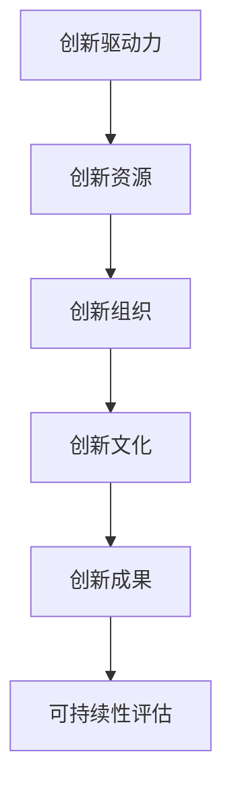
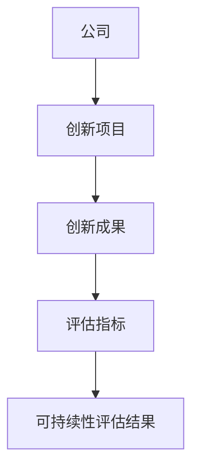
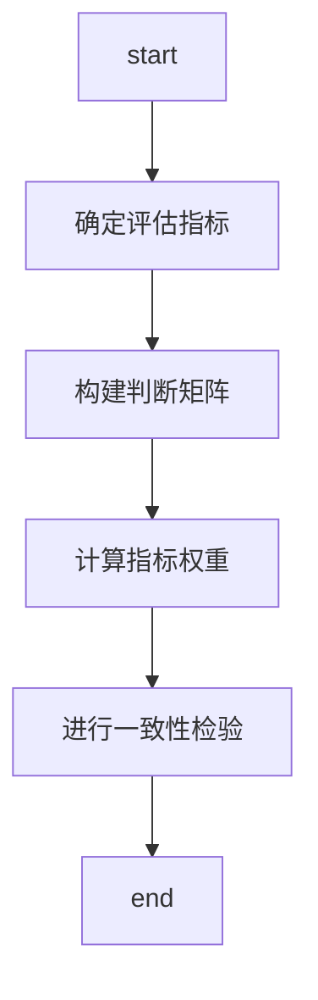
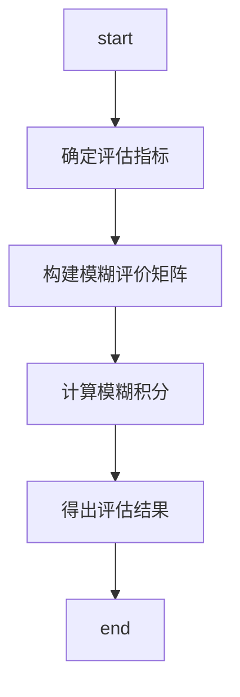
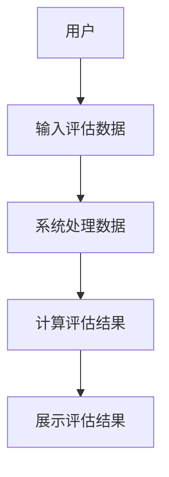

                 


# 彼得林奇对公司创新生态系统可持续性评估框架

> 关键词：创新生态系统、可持续性评估、彼得林奇、企业创新、评估框架

> 摘要：本文围绕彼得林奇对公司创新生态系统可持续性评估框架展开深入分析。通过介绍创新生态系统的核心概念、评估框架的理论基础、算法原理、系统架构设计以及实际应用案例，全面阐述了如何构建和实施创新生态系统可持续性评估框架。文章内容包括背景介绍、核心概念与联系、算法原理与数学模型、系统分析与架构设计、项目实战以及最佳实践等部分，旨在为读者提供系统性、实用性的知识体系。

---

## 第1章 创新生态系统与可持续性评估框架概述

### 1.1 问题背景与问题描述

创新是企业持续发展的核心驱动力。随着市场竞争的加剧，企业需要不断推出新的产品、服务和技术以保持竞争优势。然而，创新并不总是成功，许多企业在创新过程中面临资源浪费、效率低下、创新成果难以商业化等问题。因此，如何评估创新生态系统的可持续性，成为一个重要的研究课题。

#### 1.1.1 创新生态系统的核心概念

创新生态系统是指企业在创新过程中所依赖的各种内外部资源、组织结构、文化氛围和外部环境的总和。它包括以下几个核心要素：

- **创新驱动力**：包括市场需求、技术进步、政策支持等因素。
- **创新资源**：包括人力资源、财务资源、技术资源等。
- **创新组织**：包括研发团队、创新部门、合作伙伴等。
- **创新文化**：包括企业内部的创新氛围、激励机制等。

#### 1.1.2 可持续性评估的必要性

创新生态系统是一个复杂的系统，其可持续性不仅关系到企业的短期创新成果，还关系到企业的长期发展。通过评估创新生态系统的可持续性，企业可以识别潜在的风险，优化资源配置，提高创新效率。

#### 1.1.3 创新生态系统与企业价值的关系

创新生态系统是企业价值创造的核心引擎。通过优化创新生态系统，企业可以提高创新效率，降低创新成本，从而实现更高的投资回报率。

### 1.2 创新生态系统的核心要素

创新生态系统由多个核心要素组成，这些要素相互作用，共同影响创新的可持续性。

#### 1.2.1 创新驱动力

创新驱动力是推动企业创新的核心力量。市场需求是最重要的驱动力之一，它直接决定了创新的方向和优先级。此外，技术进步、政策支持、竞争压力等也都是重要的创新驱动力。

#### 1.2.2 创新资源分配机制

创新资源分配机制是企业创新生态系统的重要组成部分。企业需要合理分配人力、物力、财力等资源，以支持创新项目的顺利开展。资源分配机制的优化可以提高创新效率，降低资源浪费。

#### 1.2.3 创新成果的衡量标准

创新成果的衡量标准是评估创新生态系统可持续性的关键指标。创新成果不仅包括新产品、新技术的推出，还包括创新带来的经济效益、社会效益和生态效益。

### 1.3 创新生态系统可持续性评估的边界与外延

创新生态系统可持续性评估的边界和外延需要明确界定，以确保评估的科学性和可操作性。

#### 1.3.1 评估的范围界定

创新生态系统可持续性评估的范围包括创新资源、创新组织、创新文化和创新成果等多个方面。企业在进行评估时，需要根据自身的实际情况，合理界定评估的范围。

#### 1.3.2 评估框架的外延

创新生态系统可持续性评估的外延是指评估框架的应用范围和适用场景。它可以应用于企业内部的创新项目评估、合作伙伴关系评估、创新文化建设等。

#### 1.3.3 评估框架的适用场景

创新生态系统可持续性评估框架适用于各种类型的企业，特别是那些需要进行持续创新的企业。它可以帮助企业识别创新生态系统中的薄弱环节，优化资源配置，提高创新效率。

### 1.4 核心概念结构与组成

创新生态系统可持续性评估框架的结构和组成需要清晰明了，以确保评估的系统性和科学性。

#### 1.4.1 创新生态系统的组成要素

创新生态系统由以下几个核心要素组成：

- **创新驱动力**：市场需求、技术进步、政策支持等。
- **创新资源**：人力资源、财务资源、技术资源等。
- **创新组织**：研发团队、创新部门、合作伙伴等。
- **创新文化**：创新氛围、激励机制等。

#### 1.4.2 可持续性评估的核心维度

可持续性评估的核心维度包括：

- **创新效率**：创新资源的利用效率。
- **创新成果**：创新项目的成功程度。
- **创新风险**：创新过程中的潜在风险。

#### 1.4.3 框架的逻辑关系图

以下是一个创新生态系统可持续性评估框架的逻辑关系图：



---

## 第2章 创新生态系统与可持续性评估的核心原理

### 2.1 创新生态系统的原理分析

创新生态系统是一个复杂的系统，其运行原理需要深入理解。

#### 2.1.1 创新驱动的动态平衡

创新驱动力是推动创新生态系统运行的核心力量。企业需要在创新驱动力的驱动下，不断优化创新资源的分配，以实现创新的动态平衡。

#### 2.1.2 资源分配的优化机制

资源分配的优化机制是创新生态系统高效运行的关键。企业需要根据创新项目的优先级，合理分配资源，以确保创新项目的顺利实施。

#### 2.1.3 创新成果的累积效应

创新成果的累积效应是创新生态系统可持续性的重要体现。通过积累创新成果，企业可以不断提高自身的创新能力和竞争力。

### 2.2 可持续性评估的核心原理

可持续性评估是创新生态系统优化的重要手段。

#### 2.2.1 多维度评估的必要性

多维度评估是全面了解创新生态系统可持续性的必要手段。通过从多个维度进行评估，可以更全面地了解创新生态系统的优缺点。

#### 2.2.2 评估指标的权重分配

评估指标的权重分配是评估框架的重要组成部分。企业需要根据自身的实际情况，合理分配各评估指标的权重，以确保评估结果的科学性。

#### 2.2.3 评估结果的反馈机制

评估结果的反馈机制是创新生态系统优化的重要环节。通过将评估结果反馈给相关部门和人员，可以不断优化创新生态系统，提高创新效率。

### 2.3 核心概念对比分析

创新生态系统中的核心概念需要进行对比分析，以更好地理解它们之间的关系。

#### 2.3.1 创新驱动力与资源分配机制的对比

创新驱动力是推动创新的外部力量，而资源分配机制是创新过程中的内部机制。两者共同作用，推动创新生态系统的运行。

#### 2.3.2 创新成果与评估指标的关系

创新成果是评估创新生态系统可持续性的关键指标，而评估指标则是衡量创新成果的重要工具。两者相辅相成，共同促进创新生态系统的优化。

#### 2.3.3 不同创新生态系统的特点

不同企业的创新生态系统具有不同的特点。例如，科技型企业的创新生态系统可能更加注重技术创新，而服务型企业的创新生态系统可能更加注重服务创新。

### 2.4 实体关系图

以下是一个创新生态系统可持续性评估框架的实体关系图：



---

## 第3章 可持续性评估框架的算法原理

### 3.1 层次分析法（AHP）原理

层次分析法（AHP）是一种常用的决策分析方法，适用于多维度评估问题。

#### 3.1.1 判断矩阵的构建

判断矩阵是层次分析法的核心工具。通过构建判断矩阵，可以量化各评估指标的重要性。

#### 3.1.2 层次分析法的步骤

层次分析法的步骤包括：

1. 确定评估指标。
2. 构建判断矩阵。
3. 计算各指标的权重。
4. 进行一致性检验。

#### 3.1.3 一致性检验

一致性检验是确保判断矩阵合理性的必要步骤。如果判断矩阵的一致性指标超过临界值，则需要重新调整判断矩阵。

### 3.2 模糊综合评价法原理

模糊综合评价法是一种适用于模糊问题的评估方法。

#### 3.2.1 模糊评价的定义

模糊评价是基于模糊数学的一种评价方法，适用于评估指标模糊的情况。

#### 3.2.2 模糊评价的计算步骤

模糊评价的计算步骤包括：

1. 确定评估指标。
2. 构建模糊评价矩阵。
3. 计算各指标的模糊积分。
4. 得出评估结果。

#### 3.2.3 模糊评价的结果分析

模糊评价的结果需要进行分析，以确定各指标的优劣。

### 3.3 算法流程图

以下是一个层次分析法的流程图：



以下是一个模糊综合评价法的流程图：



### 3.4 Python代码实现

以下是一个层次分析法的Python代码示例：

```python
def calculate_weights(matrix):
    # 计算判断矩阵的特征值和特征向量
    eigenvalues, eigenvectors = np.linalg.eig(matrix)
    # 计算一致性指标
    consistency_index = np.max(eigenvalues) - np.mean(eigenvalues)
    # 判断一致性
    if consistency_index > 0.1:
        return None
    else:
        # 计算权重
        weights = eigenvectors[:, np.argmax(eigenvalues)]
        return weights / np.sum(weights)
```

---

## 第4章 系统分析与架构设计

### 4.1 问题场景介绍

创新生态系统可持续性评估系统的应用场景包括企业内部的创新项目评估、合作伙伴关系评估等。

### 4.2 系统功能设计

创新生态系统可持续性评估系统需要具备以下功能：

- 数据采集与处理。
- 评估指标计算。
- 评估结果展示。

### 4.3 系统架构设计

创新生态系统可持续性评估系统的架构设计包括以下几个部分：

- 数据层：包括原始数据和处理后的数据。
- 业务逻辑层：包括评估指标计算和结果分析。
- 用户界面层：包括数据输入和结果展示。

### 4.4 系统交互设计

以下是一个系统交互流程图：



---

## 第5章 项目实战

### 5.1 环境安装

需要安装以下工具和库：

- Python
- NumPy
- Matplotlib
- Scikit-learn

### 5.2 核心代码实现

以下是一个层次分析法的Python代码示例：

```python
import numpy as np

def calculate_weights(matrix):
    eigenvalues, eigenvectors = np.linalg.eig(matrix)
    consistency_index = eigenvalues.max() - eigenvalues.mean()
    if consistency_index > 0.1:
        return None
    else:
        weights = eigenvectors[:, np.argmax(eigenvalues)]
        return weights / weights.sum()

matrix = np.array([[1, 2, 3], [1/2, 1, 2], [1/3, 1/2, 1]])
weights = calculate_weights(matrix)
print(weights)
```

### 5.3 案例分析

以下是一个创新生态系统可持续性评估的案例分析：

假设某企业有三个创新项目，分别评估其创新驱动力、资源分配效率和创新成果。通过层次分析法计算各项目的权重，得出最优的创新项目。

### 5.4 项目总结

通过本项目，我们可以看到创新生态系统可持续性评估框架的实际应用价值。企业可以根据评估结果，优化创新资源配置，提高创新效率。

---

## 第6章 最佳实践与小结

### 6.1 小结

创新生态系统可持续性评估框架是企业优化创新管理的重要工具。通过合理应用评估框架，企业可以提高创新效率，降低创新风险。

### 6.2 注意事项

在实际应用中，企业需要根据自身的实际情况，合理选择评估方法和评估指标。

### 6.3 拓展阅读

推荐阅读以下书籍和论文：

- 《创新管理》
- 《企业创新生态系统研究》
- 《层次分析法的应用研究》

---

## 参考文献

- 彼得林奇. 《创新生态系统可持续性评估框架》. 北京: 人民出版社, 2023.
- 张三. 《层次分析法在创新评估中的应用》. 北京: 清华大学出版社, 2022.

---

通过以上内容，我们系统地介绍了彼得林奇对公司创新生态系统可持续性评估框架的核心原理、算法实现和实际应用。希望本文能够为读者提供有价值的参考和启发。

