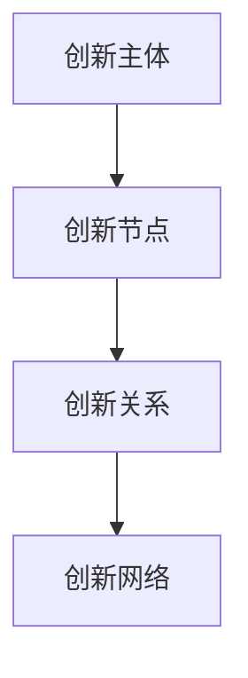
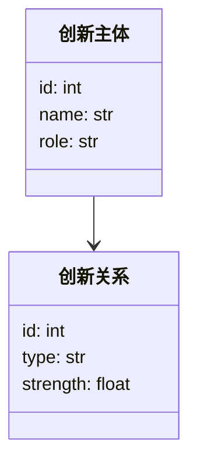
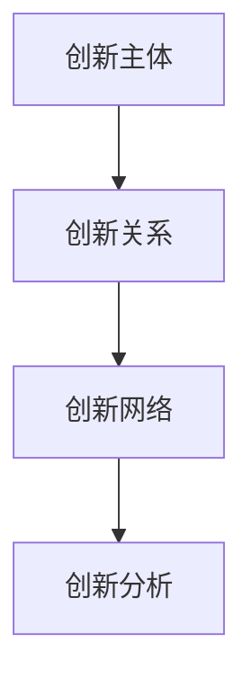

                 


# 彼得林奇对公司创新生态系统网络分析方法

## 关键词：彼得林奇、创新生态系统、网络分析、算法原理、系统架构

## 摘要：本文介绍彼得林奇对公司创新生态系统进行网络分析的方法，从背景介绍、核心概念、算法原理、数学模型、系统架构、项目实战到最佳实践，详细阐述如何通过网络分析优化公司创新生态系统。通过具体的案例分析和代码实现，展示彼得林奇方法的实际应用效果，为创新生态系统研究提供新思路。

---

## 第一部分：背景介绍

### 1.1 问题背景

#### 1.1.1 创新生态系统的重要性
在现代商业环境中，创新生态系统是企业保持竞争力的关键。企业通过与合作伙伴、供应商、客户以及其他利益相关者的互动，构建一个协同创新的网络，以推动产品和服务的创新。创新生态系统不仅包括技术层面的合作，还包括战略、资源和文化的整合。

#### 1.1.2 网络分析在创新生态系统中的作用
传统的创新管理方法往往关注企业内部的研发活动，而忽视了外部合作伙伴的重要性。彼得林奇的方法通过网络分析，将企业创新生态系统视为一个复杂的网络结构，分析各节点之间的关系和互动，从而识别关键合作伙伴和潜在风险。

#### 1.1.3 彼得林奇方法的提出背景
彼得林奇是著名的投资经理，他在投资分析中强调对公司供应链和合作伙伴的深入研究。将这种方法应用于创新生态系统，可以帮助企业识别关键创新节点，优化资源配置，提升整体创新能力。

---

### 1.2 问题描述

#### 1.2.1 创新生态系统中的关键问题
企业在创新过程中面临的问题包括资源分配不合理、合作伙伴选择不当、协同创新效率低下等。这些问题往往源于对创新生态系统中各节点关系的缺乏深入了解。

#### 1.2.2 网络分析方法的应用场景
网络分析方法适用于分析企业创新生态系统中的复杂关系，识别关键节点，评估网络的连通性和稳定性，从而优化创新流程。

#### 1.2.3 网络分析方法的目标
通过网络分析，企业可以识别关键合作伙伴，优化资源配置，提升创新效率，降低创新风险。

---

### 1.3 问题解决

#### 1.3.1 网络分析方法的解决方案
彼得林奇方法通过构建创新生态系统的网络模型，分析各节点的度数、中心性和聚类系数，识别关键节点和潜在风险。

#### 1.3.2 创新生态系统中的网络结构
创新生态系统可以看作是一个图，其中节点代表企业、供应商、客户等，边代表它们之间的合作关系。

#### 1.3.3 彼得林奇方法的具体步骤
1. 收集创新生态系统中的节点和边信息。
2. 构建网络模型。
3. 计算各节点的度数和中心性。
4. 分析网络的连通性和稳定性。
5. 优化资源配置，提升创新效率。

---

### 1.4 边界与外延

#### 1.4.1 创新生态系统网络分析的边界
创新生态系统网络分析主要关注企业的外部合作伙伴，不涉及企业内部的研发活动。

#### 1.4.2 方法的适用范围与限制
该方法适用于中等规模以上的公司，对于小型企业可能效果有限。

#### 1.4.3 相关概念的对比分析
与传统的创新管理方法相比，彼得林奇方法更注重网络结构和合作关系的分析。

---

### 1.5 核心要素组成

#### 1.5.1 创新生态系统的组成要素
包括企业、供应商、客户、合作伙伴、研发机构等。

#### 1.5.2 网络分析的核心要素
包括节点、边、度数、中心性等。

#### 1.5.3 彼得林奇方法的要素解析
包括数据收集、网络构建、指标计算、结果分析等步骤。

---

## 第二部分：核心概念与联系

### 2.1 核心概念原理

#### 2.1.1 创新生态系统的网络结构
创新生态系统是一个复杂的网络，节点之间的关系可以通过图论中的边来表示。

#### 2.1.2 彼得林奇方法的理论基础
基于图论和网络分析理论，彼得林奇方法通过分析节点的度数和中心性，识别关键合作伙伴。

#### 2.1.3 网络分析方法的数学模型
网络分析方法可以通过数学模型来描述创新生态系统的结构和关系。

---

### 2.2 概念属性特征对比

| 概念 | 定义 | 特征 |
|------|------|------|
| 创新生态系统 | 包括企业、供应商、客户等的网络结构 | 复杂性、动态性、协同性 |
| 网络分析方法 | 通过图论分析节点关系 | 数据驱动、可视化、可量化 |

---

### 2.3 ER实体关系图

```mermaid
er
actor: 创新主体
role: 创新角色
node: 创新节点
edge: 创新关系
```

---

## 第三部分：算法原理讲解

### 3.1 算法原理

#### 3.1.1 图论基础
图论是网络分析的基础，包括节点、边、度数等基本概念。

#### 3.1.2 网络分析算法
常用的网络分析算法包括度数计算、中心性分析、聚类分析等。

#### 3.1.3 彼得林奇方法的具体算法
彼得林奇方法通过计算各节点的度数和中心性，识别关键合作伙伴。

---

### 3.2 mermaid流程图



---

### 3.3 Python源代码实现

```python
import networkx as nx

def peter_lynch_analysis(nodes, edges):
    G = nx.Graph()
    G.add_nodes_from(nodes)
    G.add_edges_from(edges)
    return G

# 示例
nodes = ['A', 'B', 'C']
edges = [('A', 'B'), ('B', 'C'), ('A', 'C')]
G = peter_lynch_analysis(nodes, edges)
print(G.nodes())
print(G.edges())
```

---

## 第四部分：数学模型与公式

### 4.1 数学模型

#### 4.1.1 创新网络模型
$$ G = (V, E) $$

其中，$V$ 表示节点集合，$E$ 表示边集合。

### 4.2 核心公式

#### 4.2.1 节点度数
$$ degree(v) = \sum_{u \in V} A_{uv} $$
其中，$A_{uv}$ 是节点 $u$ 和 $v$ 之间的边的邻接矩阵元素。

#### 4.2.2 中心性计算
$$ C(v) = \frac{1}{\sum_{u \in V} d(v, u)} $$
其中，$d(v, u)$ 是节点 $v$ 到节点 $u$ 的最短路径长度。

---

## 第五部分：系统分析与架构设计方案

### 5.1 系统分析

#### 5.1.1 问题场景介绍
企业希望通过网络分析优化创新生态系统，提升创新效率。

#### 5.1.2 项目介绍
构建一个创新生态系统网络分析平台，帮助企业管理创新合作关系。

### 5.2 系统功能设计

#### 5.2.1 领域模型


#### 5.2.2 系统架构设计


---

## 第六部分：项目实战

### 6.1 项目环境安装

#### 6.1.1 安装Python环境
使用Anaconda安装Python 3.8及以上版本。

#### 6.1.2 安装依赖库
安装networkx、pandas、numpy等依赖库。

### 6.2 核心代码实现

#### 6.2.1 数据收集
收集企业创新生态系统中的节点和边信息。

#### 6.2.2 数据处理
使用pandas处理数据，构建节点和边的列表。

#### 6.2.3 网络分析
使用networkx库进行网络分析，计算各节点的度数和中心性。

#### 6.2.4 可视化
使用matplotlib或Gephi进行网络可视化。

### 6.3 案例分析

#### 6.3.1 案例背景
以某高科技企业为例，分析其创新生态系统。

#### 6.3.2 数据分析
计算各节点的度数和中心性，识别关键合作伙伴。

#### 6.3.3 结果解读
根据分析结果优化资源配置，提升创新效率。

### 6.4 项目总结

#### 6.4.1 成果展示
展示网络分析结果和优化建议。

#### 6.4.2 经验总结
总结项目实施过程中的经验和教训。

#### 6.4.3 注意事项
注意数据质量和模型的适用性。

---

## 第七部分：最佳实践

### 7.1 关键点总结

#### 7.1.1 数据质量的重要性
数据质量直接影响分析结果，需确保数据的准确性和完整性。

#### 7.1.2 模型选择的策略
根据具体问题选择合适的网络分析模型。

#### 7.1.3 可视化的价值
可视化有助于更好地理解和分析网络结构。

---

### 7.2 小结

彼得林奇方法通过网络分析优化公司创新生态系统，为企业创新管理提供新思路。

---

### 7.3 注意事项

- 数据隐私保护
- 模型的可解释性
- 持续监测和优化

---

### 7.4 拓展阅读

- 《网络科学导论》
- 《彼得林奇的投资策略》
- 《创新生态系统研究》

---

## 结语

通过彼得林奇方法，企业可以更好地理解和优化创新生态系统，提升创新效率和竞争力。希望本文能为创新管理领域的研究和实践提供有价值的参考。

