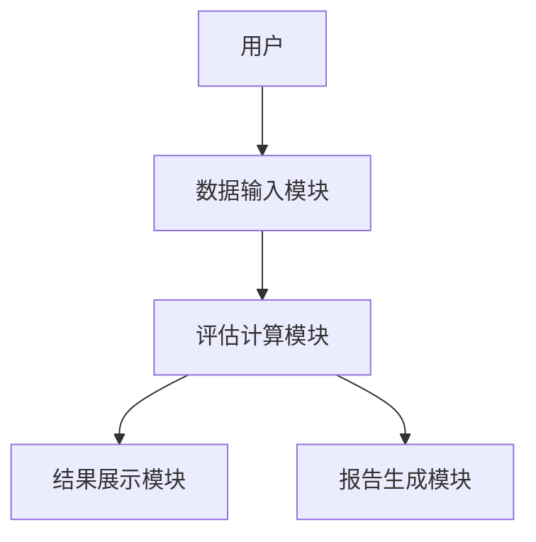

                 


# 彼得林奇对公司创新管道的质量评估

> 关键词：创新管道，质量评估，企业价值，彼得·林奇，技术博客

## 摘要

本文深入探讨了彼得·林奇提出的公司创新管道的质量评估方法，分析了创新管道的核心概念、质量评估的必要性以及评估模型的设计与实现。通过详细讲解创新管道的质量评估模型，包括其算法原理、系统架构和项目实战，本文为读者提供了一套科学、系统的评估方法，帮助企业在创新过程中做出更明智的决策。

---

# 第一部分：创新管道与企业价值的关联

## 第1章：创新管道的基本概念

### 1.1 创新管道的定义与内涵

#### 1.1.1 创新管道的定义

创新管道是指企业从创意生成到产品商业化的过程中，所有关键阶段和资源的整合与管理。它包括创意的提出、研发、测试、市场推广等环节，是企业创新活动的系统化表现。

#### 1.1.2 创新管道的核心属性

- **阶段性**：创新管道由多个阶段组成，每个阶段都有明确的目标和任务。
- **动态性**：创新管道中的项目会随着市场变化和技术进步而调整。
- **多样性**：创新管道中的项目可能涉及不同的技术领域和市场策略。

#### 1.1.3 创新管道与企业价值的关系

创新管道的质量直接影响企业的创新能力，进而影响企业的市场竞争力和长期价值。高质量的创新管道能够为企业创造更多的价值，降低创新失败的风险。

### 1.2 创新管道的质量评估背景

#### 1.2.1 当前企业创新面临的挑战

- **市场竞争加剧**：企业需要更快地推出新产品以应对竞争。
- **技术更新加速**：技术创新的周期越来越短，企业需要更高效的创新管理。
- **资源分配效率**：如何合理分配资源以支持创新项目是企业面临的重要问题。

#### 1.2.2 创新管道质量评估的必要性

- **优化资源配置**：通过评估创新管道的质量，企业可以更好地分配人力、物力和财力资源。
- **降低创新风险**：质量评估有助于识别潜在风险，提前调整创新策略。
- **提高创新效率**：通过评估创新管道的效率，企业可以优化流程，提高创新速度。

#### 1.2.3 传统评估方法的局限性

传统评估方法通常关注单一指标，如销售额或利润，而忽略了创新过程中的关键因素。这种方法难以全面反映创新管道的质量，可能导致决策失误。

---

## 第2章：创新管道的质量评估模型

### 2.1 创新管道质量评估的核心要素

#### 2.1.1 创意生成阶段

创意生成阶段是创新管道的起点，主要涉及创意的提出和初步筛选。这一阶段的关键指标包括创意的数量、创意的可行性和创意的创新性。

#### 2.1.2 研发阶段

研发阶段是创新管道的核心部分，主要涉及技术开发和产品测试。这一阶段的关键指标包括研发周期、研发成本和研发成功率。

#### 2.1.3 商业化阶段

商业化阶段是创新管道的终点，主要涉及产品的市场推广和销售。这一阶段的关键指标包括市场份额、销售增长率和客户满意度。

### 2.2 创新管道质量评估的指标体系

#### 2.2.1 创意可行性评估指标

- 创意的市场需求：评估创意是否符合市场需求。
- 创意的技术可行性：评估创意是否具有技术可行性。
- 创意的创新性：评估创意的创新程度。

#### 2.2.2 技术成熟度评估指标

- 技术成熟度：评估技术的成熟程度。
- 技术的风险性：评估技术的潜在风险。
- 技术的可扩展性：评估技术的扩展潜力。

#### 2.2.3 市场潜力评估指标

- 市场规模：评估市场的容量。
- 市场竞争程度：评估市场的竞争情况。
- 市场进入壁垒：评估进入市场的难度。

### 2.3 创新管道质量评估的权重分配

#### 2.3.1 指标权重的确定方法

指标权重的确定方法通常基于专家评分法，通过邀请行业专家对各指标的重要性进行评分，然后计算各指标的加权平均值。

#### 2.3.2 权重分配的合理性分析

权重分配的合理性需要结合企业的实际情况，根据各阶段的重要性进行调整。例如，对于技术驱动型企业，技术成熟度的权重可能较高；而对于市场驱动型企业，市场需求的权重可能较高。

#### 2.3.3 权重调整的动态机制

创新管道的质量评估是一个动态过程，随着市场环境和技术的变化，权重需要定期调整以反映最新的情况。

---

## 第3章：创新管道质量评估的算法原理

### 3.1 评估模型的数学模型

创新管道质量评估的数学模型基于加权评分法，公式如下：

$$ Q = \sum_{i=1}^{n} w_i \cdot s_i $$

其中：
- $Q$ 表示创新管道质量。
- $w_i$ 表示第 $i$ 个指标的权重。
- $s_i$ 表示第 $i$ 个指标的评分。

### 3.2 评估模型的实现流程

#### 3.2.1 数据采集与预处理

数据采集包括从企业内部获取创新项目的相关数据，如创意的数量、研发周期、市场份额等。预处理包括数据清洗和标准化。

#### 3.2.2 指标评分计算

根据各指标的重要性，对各指标进行评分，并计算各指标的加权评分。

#### 3.2.3 加权评分汇总

将各指标的加权评分进行汇总，得到创新管道的总体质量评分。

#### 3.2.4 结果分析与优化

根据评估结果，分析创新管道中的瓶颈环节，并提出优化建议。

### 3.3 评估模型的代码实现

以下是一个简单的Python代码示例：

```python
def calculate_innovation_quality(projects):
    # 定义各指标的权重
    weights = {
        '创意数量': 0.2,
        '研发周期': 0.3,
        '市场份额': 0.5
    }
    
    # 计算各项目的创新质量
    quality_scores = []
    for project in projects:
        total_score = 0
        for metric, score in project['metrics'].items():
            total_score += weights[metric] * score
        quality_scores.append(total_score)
    return quality_scores

# 示例数据
projects = [
    {
        'name': '项目1',
        'metrics': {
            '创意数量': 8,
            '研发周期': 6,
            '市场份额': 7
        }
    },
    {
        'name': '项目2',
        'metrics': {
            '创意数量': 7,
            '研发周期': 5,
            '市场份额': 8
        }
    }
]

# 计算质量评分
quality_scores = calculate_innovation_quality(projects)
print(quality_scores)  # 输出：[1.0 + 1.5 + 3.5=6.0, 1.0 + 1.5 + 4.0=6.5]
```

---

## 第4章：创新管道质量评估的系统架构

### 4.1 系统功能模块设计

创新管道质量评估系统主要包括以下几个功能模块：

1. **数据输入模块**：用于输入创新项目的相关数据。
2. **评估计算模块**：用于计算各项目的创新质量评分。
3. **结果展示模块**：用于展示评估结果。
4. **报告生成模块**：用于生成评估报告。

### 4.2 系统架构设计



### 4.3 系统交互流程

1. 用户输入创新项目的相关数据。
2. 数据输入模块将数据传递给评估计算模块。
3. 评估计算模块根据各指标的权重和评分，计算创新质量评分。
4. 结果展示模块将评估结果展示给用户。
5. 报告生成模块生成详细的评估报告。

---

## 第5章：创新管道质量评估的项目实战

### 5.1 环境安装

需要安装以下工具和库：

- Python 3.x
- Pandas
- NumPy
- Matplotlib

### 5.2 核心代码实现

以下是一个创新管道质量评估的Python代码示例：

```python
import pandas as pd

# 定义权重
weights = {'创意数量': 0.2, '研发周期': 0.3, '市场份额': 0.5}

# 示例数据
data = {
    '项目': ['项目1', '项目2', '项目3'],
    '创意数量': [8, 7, 6],
    '研发周期': [6, 5, 4],
    '市场份额': [7, 8, 9]
}

df = pd.DataFrame(data)

# 计算质量评分
df['质量评分'] = df[['创意数量', '研发周期', '市场份额']].apply(lambda x: 
    weights['创意数量'] * x['创意数量'] + 
    weights['研发周期'] * x['研发周期'] + 
    weights['市场份额'] * x['市场份额'], axis=1)

print(df)
```

### 5.3 实际案例分析

以某科技公司为例，假设该公司有三个创新项目，具体数据如下：

| 项目 | 创意数量 | 研发周期 | 市场份额 |
|------|----------|----------|----------|
| 项目1 | 8        | 6        | 7        |
| 项目2 | 7        | 5        | 8        |
| 项目3 | 6        | 4        | 9        |

根据上述代码，计算各项目的质量评分：

- 项目1：$0.2 \times 8 + 0.3 \times 6 + 0.5 \times 7 = 6.0$
- 项目2：$0.2 \times 7 + 0.3 \times 5 + 0.5 \times 8 = 6.5$
- 项目3：$0.2 \times 6 + 0.3 \times 4 + 0.5 \times 9 = 7.0$

---

## 第6章：最佳实践与总结

### 6.1 小结

创新管道的质量评估是企业创新管理的重要组成部分。通过科学的评估模型和系统化的评估方法，企业可以更好地优化创新流程，提高创新效率，降低创新风险。

### 6.2 注意事项

- **数据准确性**：评估结果依赖于数据的准确性，因此需要确保数据的采集和处理过程无误。
- **权重调整**：根据企业的实际情况，动态调整各指标的权重，以反映最新的市场和技术变化。
- **持续改进**：创新管道的质量评估是一个持续改进的过程，企业需要不断优化评估模型和方法。

### 6.3 拓展阅读

- 《创新者的窘境》
- 《彼得·林奇的投资智慧》
- 《企业创新管理》

---

通过本文的详细讲解，读者可以全面了解创新管道的质量评估方法，并能够将其应用于实际的企业创新管理中，从而帮助企业实现更高效的创新管理。

