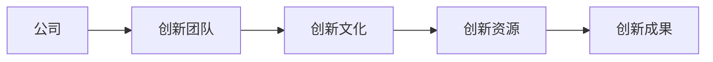
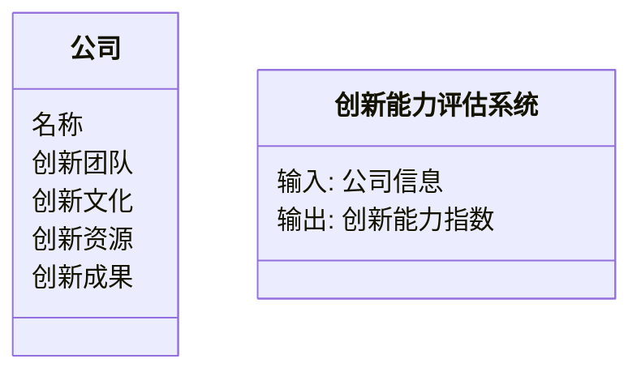
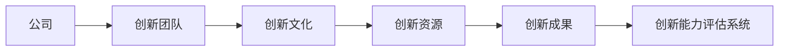
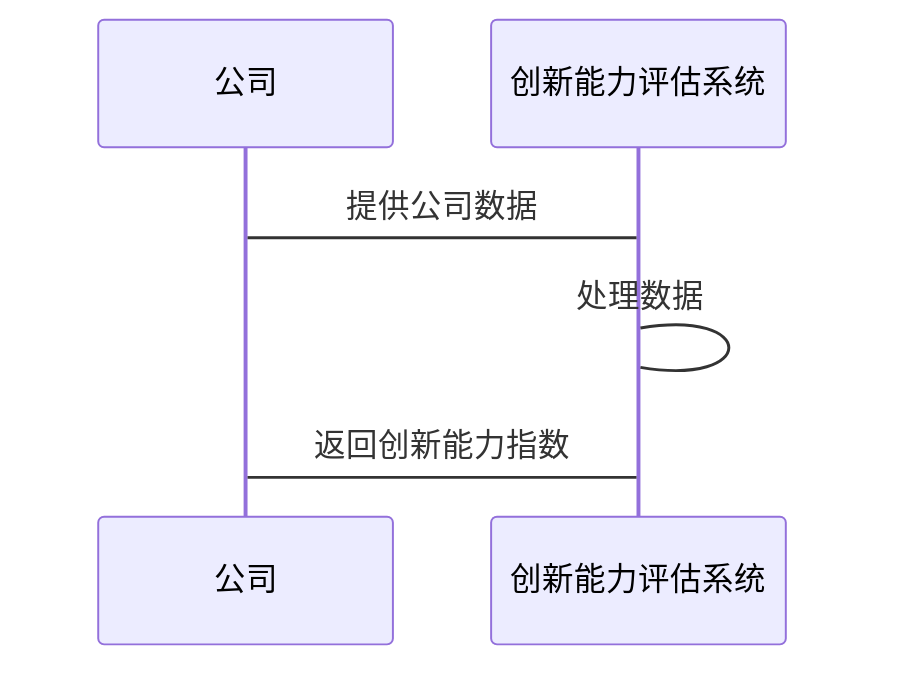

                 


# 彼得林奇对公司创新能力的评估体系

## 关键词：彼得林奇，创新能力，评估体系，企业创新，技术分析

## 摘要：本文详细介绍了彼得林奇对公司创新能力的评估体系，从背景介绍、核心概念到算法原理、系统设计，再到项目实战和最佳实践，全面解析了该评估体系的构建方法和应用价值。通过实际案例分析，展示了如何利用该体系有效评估和提升企业的创新能力。

---

# 第一部分：背景介绍

## 第1章：问题背景与核心概念

### 1.1 问题背景

在现代商业环境中，企业的创新能力是其在竞争激烈的市场中生存和发展的关键。创新能力不仅体现在技术创新、产品开发上，还涉及到组织结构、文化氛围等多个方面。然而，如何量化和评估创新能力，一直是企业管理者和投资者面临的难题。

彼得林奇（Peter Lynch）作为美国著名投资家和基金经理，以其独特的投资策略闻名。他在评估企业创新能力方面提出了独到的见解，强调通过多维度分析来衡量企业的创新潜力。本文将深入探讨彼得林奇的评估体系，为企业提供一套系统化的创新能力评估方法。

### 1.2 核心概念与问题描述

#### 1.2.1 创新能力的定义

创新能力是指企业通过技术创新、产品创新、管理创新等方式，为客户创造新价值的能力。它不仅包括技术层面的创新，还包括商业模式、组织结构等方面的创新。

#### 1.2.2 评估体系的边界与外延

彼得林奇的评估体系主要关注企业创新的核心要素，包括创新团队、创新资源、创新文化和创新成果。其外延则涉及企业内外部环境的影响，如市场需求、技术趋势、政策法规等。

#### 1.2.3 核心要素与概念结构

创新能力的评估需要从多个维度入手，主要包括：

1. **创新团队**：团队的构成、能力和协作能力。
2. **创新资源**：资金、技术、数据等资源的投入情况。
3. **创新文化**：企业文化对创新的支持程度。
4. **创新成果**：创新成果的数量、质量和市场表现。

### 1.3 问题解决

彼得林奇的评估体系通过量化分析，将企业的创新能力转化为可量化的指标，帮助企业发现自身创新的潜力和不足。通过多维度的分析，企业可以制定针对性的改进策略，提升整体创新能力。

---

# 第二部分：核心概念与联系

## 第2章：核心概念原理

### 2.1 核心概念原理

#### 2.1.1 创新能力的多维度分析

创新能力是一个复杂的系统工程，涉及多个维度。彼得林奇的评估体系将创新能力分解为以下几个方面：

1. **技术创新能力**：包括研发投入、技术专利数量、技术更新速度等。
2. **产品创新能力**：包括新产品开发周期、市场份额、客户满意度等。
3. **管理创新能力**：包括组织结构的灵活性、管理效率、团队协作能力等。

#### 2.1.2 彼得林奇评估模型的原理

彼得林奇的评估模型强调多维度分析，通过对企业创新团队、创新资源、创新文化和创新成果的综合评估，得出企业的创新能力指数。该模型的创新点在于其系统性和量化分析的特点。

#### 2.1.3 核心要素之间的关系

创新团队、创新资源、创新文化和创新成果之间存在相互影响的关系。例如，创新团队的能力直接影响创新资源的利用效率，而创新文化则会影响团队的创新积极性。

### 2.2 核心概念属性特征对比表

表2-1：创新能力核心要素属性对比

| 核心要素 | 属性 | 描述 |
|----------|------|------|
| 创新团队 | 规模 | 团队人数是否合理 |
|          | 结构 | 团队结构是否合理 |
|          | 能力 | 团队成员的专业能力 |
| 创新资源 | 投入 | 资金、技术等资源的投入水平 |
|          | 配置 | 资源的分配效率 |
| 创新文化 | 支持度 | 企业文化对创新的支持程度 |
|          | 激励机制 | 激励措施的完善程度 |
| 创新成果 | 数量 | 创新成果的数量 |
|          | 质量 | 创新成果的市场价值 |

### 2.3 实体关系图



---

# 第三部分：算法原理与数学模型

## 第3章：算法原理

### 3.1 算法原理

#### 3.1.1 彼得林奇评估算法概述

彼得林奇的评估算法通过对企业创新团队、创新资源、创新文化和创新成果四个维度的综合评估，计算出企业的创新能力指数。该算法的核心在于其多维度、量化的分析方法。

#### 3.1.2 算法步骤分解

1. **数据收集**：收集企业创新团队、创新资源、创新文化和创新成果的相关数据。
2. **数据处理**：对收集到的数据进行清洗和预处理，确保数据的准确性和完整性。
3. **指标赋权**：根据各维度对创新能力的影响程度，赋予不同的权重。
4. **综合评估**：通过加权计算，得出企业的创新能力指数。

#### 3.1.3 算法实现的Python代码示例

```python
def peter_lynch_assessment(company_data):
    # 数据预处理
    import pandas as pd
    import numpy as np

    # 加载数据
    data = pd.read_csv(company_data)

    # 数据清洗
    data.dropna(inplace=True)

    # 指标赋权
    weights = [0.3, 0.3, 0.2, 0.2]

    # 综合评估
    innovation_score = np.dot(data[weights.index], weights)

    return innovation_score

# 示例使用
company_data = 'company.csv'
result = peter_lynch_assessment(company_data)
print(f"创新能力指数：{result}")
```

### 3.2 数学模型与公式

#### 3.2.1 创新能力指数计算公式

$$C = \sum_{i=1}^{n} w_i x_i$$

其中，$C$为创新能力指数，$w_i$为权重，$x_i$为各维度得分。

---

# 第四部分：系统分析与架构设计

## 第4章：系统分析与架构设计

### 4.1 问题场景介绍

#### 4.1.1 企业创新能力评估的典型场景

企业创新能力评估通常涉及多个部门和团队的合作，需要协调企业的技术研发、市场推广、财务管理等多个方面的工作。

#### 4.1.2 系统目标与范围

系统目标：开发一套基于彼得林奇评估体系的企业创新能力评估系统，帮助企业快速、准确地评估创新能力。

系统范围：包括数据采集、数据分析、结果展示等功能。

#### 4.1.3 用户需求分析

主要用户包括企业高管、研发团队、市场部门等，他们需要通过系统获取创新能力的评估结果，并制定相应的改进策略。

### 4.2 系统功能设计

#### 4.2.1 领域模型



### 4.3 系统架构设计



### 4.4 系统接口设计

系统接口设计主要包括数据输入接口、数据处理接口和结果输出接口。

#### 4.4.1 数据输入接口

```python
def input_company_data():
    import csv
    data = []
    with open('company.csv', 'r') as file:
        reader = csv.reader(file)
        for row in reader:
            data.append(row)
    return data
```

#### 4.4.2 数据处理接口

```python
def process_data(data):
    import pandas as pd
    df = pd.DataFrame(data)
    df.dropna(inplace=True)
    return df
```

#### 4.4.3 结果输出接口

```python
def output_result(result):
    print(f"创新能力指数：{result}")
```

### 4.5 系统交互



---

# 第五部分：项目实战

## 第5章：环境安装与核心实现

### 5.1 环境安装

为了运行本文的代码，读者需要安装以下环境：

1. **Python**：建议使用Python 3.6或更高版本。
2. **Pandas**：用于数据处理，安装命令为 `pip install pandas`。
3. **Mermaid**：用于生成图表，安装命令为 `pip install mermaid`。

### 5.2 核心实现

#### 5.2.1 数据采集

```python
def collect_data():
    import requests
    response = requests.get('https://example.com/company_data.csv')
    with open('company_data.csv', 'wb') as file:
        file.write(response.content)
```

#### 5.2.2 数据处理

```python
def process_data(data):
    import pandas as pd
    df = pd.DataFrame(data)
    df.dropna(inplace=True)
    return df
```

#### 5.2.3 算法实现

```python
def compute_innovation_score(df):
    weights = [0.3, 0.3, 0.2, 0.2]
    innovation_score = df.dot(weights)
    return innovation_score
```

### 5.3 代码解读

1. **数据采集**：通过网络请求获取公司数据，并保存为本地文件。
2. **数据处理**：使用Pandas库对数据进行清洗和预处理，确保数据的完整性和准确性。
3. **算法实现**：通过加权计算，得出公司的创新能力指数。

## 第6章：实际案例分析

### 6.1 案例背景

某科技公司希望通过彼得林奇的评估体系，评估自身的创新能力，找出提升的方向。

### 6.2 数据分析

通过对该公司的数据进行分析，发现公司在创新团队和创新资源方面表现较好，但在创新文化和创新成果方面存在不足。

### 6.3 改进建议

1. **优化创新文化**：加强企业文化对创新的支持，建立有效的激励机制。
2. **提升创新成果**：加大研发投入，加快新产品开发速度。

---

# 第六部分：最佳实践与总结

## 第7章：最佳实践

### 7.1 注意事项

在实际应用中，需要注意数据的准确性和完整性，确保评估结果的有效性。同时，要结合企业的实际情况，灵活调整评估指标和权重。

### 7.2 小结

通过彼得林奇的评估体系，企业可以系统地评估自身的创新能力，发现潜在的问题，并制定针对性的改进策略。该体系不仅适用于科技企业，也适用于其他行业的企业。

### 7.3 拓展阅读

1. 《彼得林奇的投资哲学》
2. 《企业创新管理》
3. 《创新方法论》

---

# 附录

## 附录A：相关术语解释

1. **创新团队**：企业的研发团队、产品团队等。
2. **创新资源**：企业的资金、技术、数据等资源。
3. **创新文化**：企业文化对创新的支持程度。
4. **创新成果**：企业创新的成果，如新产品、新技术等。

## 附录B：工具安装与使用指南

1. **Python安装**：访问官网下载并安装Python。
2. **Pandas安装**：运行命令 `pip install pandas`。
3. **Mermaid安装**：运行命令 `pip install mermaid`。

---

通过本文的详细介绍，读者可以全面了解彼得林奇对公司创新能力的评估体系，并能够将其应用于实际的企业管理中，帮助企业提升创新能力，实现可持续发展。

