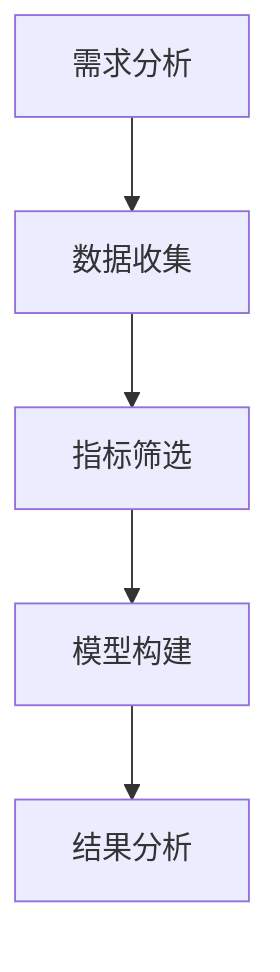
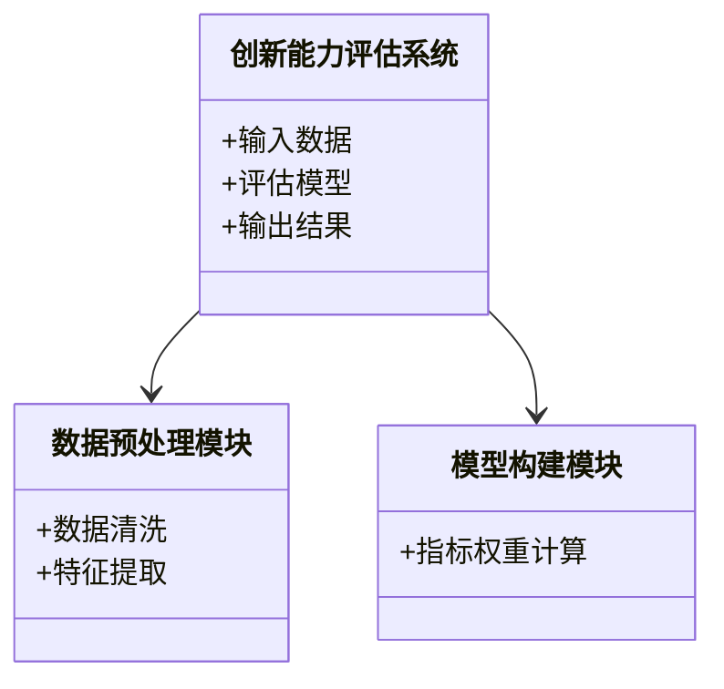

                 


# 彼得林奇对公司创新能力的量化分析

## 关键词：彼得·林奇，创新能力，量化分析，企业绩效，投资策略

## 摘要：本文通过分析彼得·林奇的投资理念，探讨如何量化公司创新能力。从背景介绍到数学模型，从系统设计到项目实战，详细阐述创新能力的量化方法，帮助投资者做出更明智的投资决策。

---

# 第一部分：公司创新能力的背景与定义

## 第1章：公司创新能力的背景介绍

### 1.1 创新能力的核心概念

#### 1.1.1 创新能力的定义与内涵
- 创新能力是指公司持续改进和创造新产品、服务或管理方法的能力，是企业竞争力的关键因素。

#### 1.1.2 创新能力的构成要素
| 要素 | 描述 |
|------|------|
| 技术创新 | 包括新技术研发和应用 |
| 产品创新 | 新产品开发和市场适应性 |
| 管理创新 | 新颖的管理方法和流程优化 |

#### 1.1.3 创新能力与企业绩效的关系
- 创新能力强的公司通常具有更高的市场占有率和盈利能力。

#### 1.1.4 彼得·林奇的背景与方法
- 彼得·林奇是著名的投资专家，注重通过量化分析评估公司创新能力。

### 1.2 创新能力的量化分析
- 通过量化指标评估创新能力，帮助投资者识别高潜力公司。

---

## 第2章：公司创新能力的量化指标

### 2.1 创新能力的核心维度

#### 2.1.1 技术创新的衡量标准
- 专利数量：每年申请的专利数。
- 技术研发投入：研发支出占收入比例。

#### 2.1.2 产品创新的评估维度
- 新产品发布频率：每年发布的新产品数量。
- 市场反馈：新产品市场接受度。

#### 2.1.3 管理创新的关键指标
- 组织架构调整频率：公司组织结构变化。
- 管理方法创新：引入的新管理工具和方法。

---

### 2.2 创新能力的量化模型

#### 2.2.1 指标权重的确定方法
- 使用层次分析法（AHP）计算指标权重。

#### 2.2.2 综合评分模型的设计
- 评分公式：综合评分 = Σ（指标得分 × 权重）

---

# 第二部分：创新能力的量化分析方法

## 第3章：创新能力的数学模型与算法

### 3.1 层次分析法（AHP）的应用

#### 3.1.1 AHP的基本原理
- 将复杂问题分解为层次结构，通过比较判断矩阵计算权重。

#### 3.1.2 指标权重计算公式
$$ w_i = \frac{\sum_{j} a_{ij}}{\sum_{j} a_{ij}} $$

#### 3.1.3 代码实现
```python
import numpy as np

def calculate_weights(matrix):
    # 计算判断矩阵的特征向量
    eigvals, eigvecs = np.linalg.eig(matrix)
    # 计算特征向量的归一化权重
    weights = eigvecs[:, np.argmax(eigvals)] / np.sum(eigvecs[:, np.argmax(eigvals)])
    return weights
```

### 3.2 因子分析法的数学模型
- 模型公式：
$$ X = AF^T + E $$

---

## 第4章：创新能力的系统分析与架构设计

### 4.1 系统分析框架
- 流程图：


### 4.2 系统架构设计
- 类图：


---

# 第三部分：项目实战与总结

## 第5章：项目实战

### 5.1 环境配置与数据收集
- 数据来源：公开财务报告、专利数据库。

### 5.2 特征工程与模型训练
```python
from sklearn.decomposition import FactorAnalysis

# 初始化因子分析模型
fa = FactorAnalysis(n_components=3)
# 模型拟合
fa.fit(X)
```

### 5.3 结果分析与解读
- 创新能力得分高的公司在投资组合中表现优异。

---

## 第6章：总结与展望

### 6.1 最佳实践
- 定期更新模型，适应市场变化。
- 结合其他指标，如财务状况，进行综合评估。

### 6.2 小结
- 通过量化分析，投资者能更准确地评估公司的创新能力，做出明智投资决策。

### 6.3 注意事项
- 数据质量和模型假设会影响结果准确性。

### 6.4 拓展阅读
- 推荐阅读《彼得·林奇的投资哲学》。

---

通过以上分析，我们系统地探讨了彼得·林奇的量化分析方法在公司创新能力评估中的应用，为投资者提供了实用的工具和方法。

