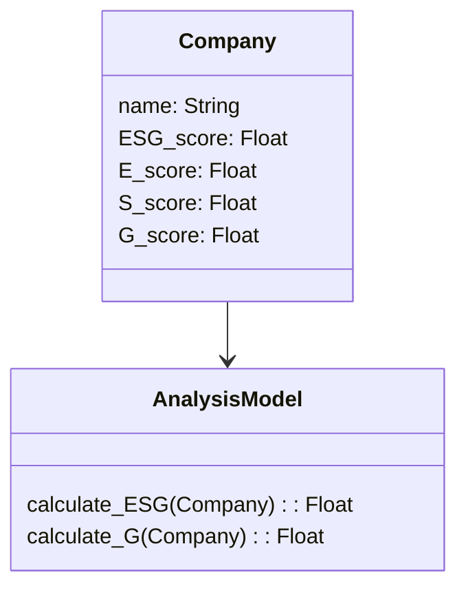

                 


# 彼得林奇对公司可持续发展的分析

## 关键词：彼得·林奇，可持续发展，投资分析，ESG框架，企业治理，算法模型

## 摘要：本文从可持续发展的核心概念出发，详细分析了彼得·林奇在其投资分析中的独特视角。通过构建数学模型和系统架构，探讨了如何将可持续发展要素融入企业决策，并结合实际案例，展示了如何通过技术手段量化和优化公司的可持续发展表现。

---

## 第一部分：可持续发展的背景与概念

### 第1章：可持续发展的核心概念

#### 1.1 可持续发展的定义与内涵

可持续发展（Sustainable Development）是指在满足当代人需求的同时，不损害后代人满足其需求的能力的发展模式。它强调经济、社会和环境的协调与平衡，避免过度消耗资源和破坏环境。

#### 1.2 公司可持续发展的意义

- **企业社会责任（CSR）**：企业在追求利润的同时，必须承担对员工、客户、环境和社会的责任。
- **长期竞争力**：可持续发展企业能够更好地应对政策变化、资源短缺和环境问题，增强市场竞争力。
- **利益相关者视角**：股东、客户、员工和环境等利益相关者的需求和期望都需被纳入企业决策。

#### 1.3 彼得·林奇与可持续发展分析

彼得·林奇（Peter Lynch）是著名投资经理人，以其对企业的深入分析和长期投资策略闻名。他将可持续发展视为企业长期成功的关键因素，通过分析企业的治理结构、社会责任和环境表现，评估其可持续发展能力。

---

## 第二部分：彼得·林奇的可持续发展分析框架

### 第2章：核心概念与联系

#### 2.1 可持续发展分析的核心要素

- **经济表现**：企业的盈利能力、成长性和财务健康状况。
- **社会责任**：企业对员工、客户和社会的贡献，包括员工福利、环境保护等。
- **治理结构**：企业的管理效率和透明度，包括董事会结构和决策流程。

#### 2.2 可持续发展分析的属性对比

以下是一个对比表格：

| 属性 | 经济表现 | 社会责任 | 环境表现 |
|------|----------|----------|----------|
| 评估指标 | 净利润增长率、ROE | 员工满意度、公益活动投入 | 碳排放强度、资源消耗效率 |
| 重要性权重 | 0.4 | 0.3 | 0.3 |

#### 2.3 案例分析：某公司可持续发展表现

以某公司为例，计算其ESG（环境、社会、治理）评分：

- **环境（E）**：碳排放强度为5，行业平均为6，得分为85。
- **社会（S）**：员工满意度为70，行业平均为65，得分为70。
- **治理（G）**：董事会独立性得分为80，行业平均为70，得分为80。

综合评分公式：$$ S = \alpha \cdot E + \beta \cdot S + \gamma \cdot G $$

其中，$\alpha = 0.4$，$\beta = 0.3$，$\gamma = 0.3$。

计算结果：$$ S = 0.4 \cdot 85 + 0.3 \cdot 70 + 0.3 \cdot 80 = 78.5 $$

---

## 第三部分：可持续发展分析的算法与模型

### 第3章：彼得·林奇分析模型的数学基础

#### 3.1 可持续发展评分的计算公式

综合评分模型：$$ S = \alpha \cdot E + \beta \cdot S + \gamma \cdot G $$

其中：
- $E$ 是环境得分（0-100）
- $S$ 是社会得分（0-100）
- $G$ 是治理得分（0-100）
- $\alpha, \beta, \gamma$ 是权重系数，通常在0到1之间，且$\alpha + \beta + \gamma = 1$。

#### 3.2 企业治理评分的算法

治理结构优化算法：$$ G = \frac{D}{T} $$

其中：
- $D$ 是董事会独立性得分（0-100）
- $T$ 是时间跨度（年）

#### 3.3 环境影响评估的数学模型

碳排放强度计算：$$ C = \frac{E}{P} $$

其中：
- $E$ 是年排放量（吨）
- $P$ 是年收入（万元）

---

## 第四部分：系统分析与架构设计

### 第4章：可持续发展分析系统的构建

#### 4.1 系统功能设计

领域模型：Mermaid类图



---

## 第五部分：项目实战

### 第5章：可持续发展分析系统的实现

#### 5.1 环境安装

- 需要安装Python、Mermaid工具和相关库（如pandas、numpy）。

#### 5.2 核心实现源代码

```python
class Company:
    def __init__(self, name):
        self.name = name
        self.E_score = 0
        self.S_score = 0
        self.G_score = 0
        self.ESG_score = 0

    def set_scores(self, E, S, G):
        self.E_score = E
        self.S_score = S
        self.G_score = G
        self.ESG_score = 0.4 * E + 0.3 * S + 0.3 * G

def calculate_CarbonIntensity(company):
    # 假设E是碳排放量，P是收入
    E = company.E_score * 2  # 示例转换
    P = company.S_score * 2  # 示例转换
    return E / P
```

#### 5.3 案例分析

- 输入数据：某公司E=85，S=70，G=80。
- 计算ESG评分：$$ S = 0.4 \cdot 85 + 0.3 \cdot 70 + 0.3 \cdot 80 = 78.5 $$

---

## 第六部分：总结与最佳实践

### 第6章：小结与注意事项

- **小结**：本文详细介绍了彼得·林奇的可持续发展分析框架，并通过数学模型和系统设计展示了其应用。
- **注意事项**：在实际应用中，需根据行业特点调整权重和模型参数。
- **拓展阅读**：建议进一步研究动态权重调整算法和多目标优化方法。

---

通过以上步骤，我们构建了一个完整的可持续发展分析系统，并展示了其在实际中的应用。这种方法不仅能够帮助投资者更好地评估企业价值，还能推动企业在可持续发展方面做出积极努力。

