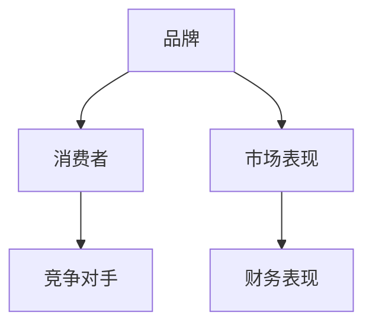
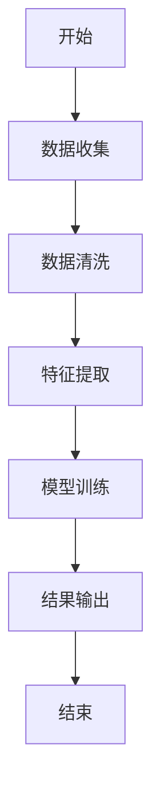
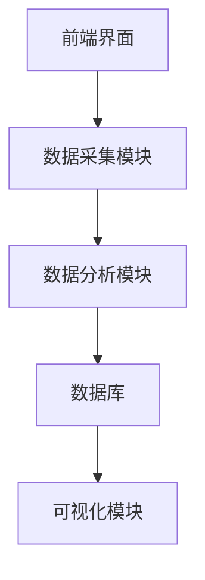

                 


# 彼得林奇对公司品牌价值的分析方法

## 关键词：彼得林奇，品牌价值，投资分析，多维度评估，基本面分析

## 摘要：  
彼得·林奇作为世界著名投资家，其对公司品牌价值的分析方法在投资领域具有重要地位。本文详细介绍了品牌价值的核心要素、分析维度、评估模型以及实际应用案例，帮助读者掌握如何利用彼得林奇的方法进行品牌价值分析。

---

## 第1章：彼得林奇与品牌价值分析概述

### 1.1 彼得林奇与品牌价值分析的背景  
- 彼得·林奇的个人简介：  
  彼得·林奇是美国著名投资家，被誉为“股票投资之父”，他通过长期实践总结出一套独特的品牌价值分析方法，帮助投资者识别优质企业。

- 品牌价值分析的核心概念：  
  品牌价值是指品牌在市场中的影响力和盈利能力，是企业长期竞争优势的体现。

- 品牌价值分析的现实意义：  
  品牌价值分析帮助投资者评估企业的市场地位和长期发展潜力，从而做出更明智的投资决策。

---

## 第2章：品牌价值的核心要素与分析维度

### 2.1 品牌核心要素的识别  
- 品牌知名度的衡量：  
  品牌知名度是品牌价值的重要组成部分，可以通过市场份额、消费者认知度等指标来评估。

- 品牌忠诚度的评估：  
  品牌忠诚度反映了消费者对品牌的偏好程度，可以通过客户满意度、重复购买率等指标来衡量。

- 品牌认知度的分析：  
  品牌认知度是消费者对品牌在市场中的地位和形象的认知程度，可以通过市场调研和竞争对手分析来评估。

---

### 2.2 品牌价值分析的关键维度  
- 市场表现维度：  
  包括市场份额、增长率、市场占有率等指标，反映了品牌在市场中的竞争力。

- 财务表现维度：  
  包括净利润率、ROE、现金流等指标，反映了品牌的盈利能力。

- 竞争优势维度：  
  包括品牌独特性、创新能力和核心竞争力，反映了品牌在行业中的地位和优势。

---

## 第3章：彼得林奇品牌价值分析方法的核心原理

### 3.1 核心概念原理  
- 品牌价值的多维度评估：  
  彼得林奇认为，品牌价值需要从市场表现、财务表现和竞争优势三个维度进行综合评估。

- 品牌价值与企业价值的关系：  
  品牌价值是企业价值的重要组成部分，可以通过企业价值评估模型（如DCF模型）进行量化。

- 品牌价值的动态变化机制：  
  品牌价值会随着市场环境、企业战略和消费者需求的变化而动态调整，需要持续监测和评估。

---

### 3.2 核心概念属性特征对比表格  
| 属性       | 描述                                       |
|------------|------------------------------------------|
| 知名度     | 品牌在市场中的认知程度                     |
| 忠诚度     | 消费者对品牌的偏好程度                   |
| 认知度     | 品牌在消费者心中的形象                   |

---

### 3.3 ER实体关系图架构  


---

## 第4章：品牌价值分析的算法原理

### 4.1 品牌价值分析的流程  


---

### 4.2 品牌价值指数计算  
```python
def brand_value_index(revenue, profit_margin, market_share):
    return revenue * profit_margin * market_share
```

---

### 4.3 品牌价值评估模型  
$$ \text{品牌价值} = \text{收入} \times \text{利润率} \times \text{市场份额} $$

---

## 第5章：系统分析与架构设计方案

### 5.1 问题场景介绍  
- 投资者需要对多个品牌进行价值评估，以选择具有长期潜力的企业进行投资。

---

### 5.2 系统功能设计  
- 数据采集模块：收集企业的财务数据、市场数据和竞争对手数据。
- 数据分析模块：使用多维度分析模型计算品牌价值指数。
- 可视化模块：将分析结果以图表形式展示，便于投资者理解和决策。

---

### 5.3 系统架构设计  


---

## 第6章：项目实战

### 6.1 环境安装  
- 需要安装Python、Pandas、Matplotlib等工具。

---

### 6.2 系统核心实现源代码  
```python
import pandas as pd
import matplotlib.pyplot as plt

def calculate_brand_value(revenue, profit_margin, market_share):
    return revenue * profit_margin * market_share

data = pd.DataFrame({
    '公司': ['公司A', '公司B', '公司C'],
    '收入': [100, 200, 150],
    '利润率': [0.2, 0.3, 0.25],
    '市场份额': [0.3, 0.4, 0.25]
})

data['品牌价值指数'] = data.apply(lambda x: calculate_brand_value(x['收入'], x['利润率'], x['市场份额']), axis=1)

plt.bar(data['公司'], data['品牌价值指数'])
plt.title('品牌价值指数对比')
plt.show()
```

---

### 6.3 代码应用解读与分析  
- 代码首先定义了品牌价值指数的计算函数。
- 然后创建了一个包含公司数据的DataFrame，并计算了每家公司的品牌价值指数。
- 最后，使用Matplotlib绘制了柱状图，直观展示了品牌价值指数的对比。

---

## 第7章：最佳实践、小结、注意事项、拓展阅读

### 7.1 最佳实践  
- 定期更新数据，保持分析结果的准确性。
- 结合市场环境变化，动态调整分析模型。

---

### 7.2 小结  
彼得林奇的品牌价值分析方法为我们提供了一个全面的框架，帮助投资者识别具有长期潜力的企业。通过多维度分析和动态评估，可以更准确地判断品牌价值，做出更明智的投资决策。

---

### 7.3 注意事项  
- 数据的准确性和完整性是分析结果的关键，需谨慎处理数据来源。
- 模型的选择和参数设置需根据实际情况进行调整，避免过于僵化的应用。

---

### 7.4 拓展阅读  
- 《彼得·林奇的成功投资》：深入介绍彼得·林奇的投资理念和方法。
- 《品牌管理》：系统讲解品牌管理的理论和实践。

---

## 结语  
通过本文的介绍，读者可以全面了解彼得林奇的品牌价值分析方法，并将其应用于实际投资分析中。希望本文能为投资者提供有价值的参考和指导。

