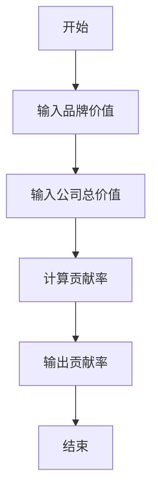
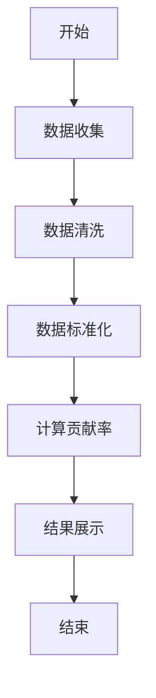
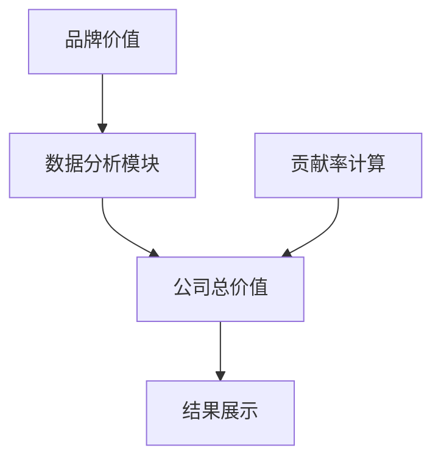

                 


# 彼得林奇对公司品牌价值贡献率的分析

## 关键词：品牌价值，贡献率，彼得林奇，投资分析，公司价值

## 摘要：本文详细分析了彼得林奇如何评估公司品牌价值，并计算其对整体公司价值的贡献率。通过理论和实际案例的结合，探讨了品牌价值对投资决策的重要性。

---

# 第一部分: 品牌价值与公司价值的关联

## 第1章: 品牌价值的基本概念

### 1.1 品牌价值的定义

品牌价值是品牌在市场上的经济价值，反映了消费者对品牌的认知和忠诚度。一个强大的品牌可以为企业带来更高的市场份额和盈利能力。

### 1.2 品牌与公司价值的关系

品牌是公司的重要资产，直接影响公司的市场地位和盈利能力。品牌价值的增长通常会带动公司整体价值的提升。

### 1.3 品牌价值贡献率的定义

品牌价值贡献率是品牌价值对整体公司价值的贡献程度，是评估品牌对公司整体价值影响的重要指标。

---

## 第2章: 彼得林奇的品牌价值分析方法

### 2.1 彼得林奇的投资理念

彼得林奇强调基本面分析，认为品牌价值是公司价值的重要组成部分。他通过分析公司的财务数据和市场地位来评估品牌价值。

### 2.2 彼得林奇的经典投资案例

以可口可乐为例，彼得林奇通过分析其品牌价值和市场地位，成功预测了其股价的上涨。

---

## 第3章: 品牌价值贡献率的计算方法

### 3.1 数据收集与处理

#### 3.1.1 数据来源

品牌价值可以从市场调研、品牌评估机构或公司财报中获取。公司总价值可以通过股票市值或企业价值来衡量。

#### 3.1.2 数据清洗

对收集到的数据进行清洗，去除无效数据，确保数据的准确性和一致性。

#### 3.1.3 数据标准化

将数据标准化处理，以便于后续分析和计算。

### 3.2 贡献率的算法实现

#### 3.2.1 算法原理

通过品牌价值和公司总价值的比率来计算贡献率，公式如下：

$$
\text{品牌价值贡献率} = \left( \frac{\text{品牌价值}}{\text{公司总价值}} \right) \times 100\%
$$

#### 3.2.2 算法流程图



#### 3.2.3 算法实现代码

```python
def calculate_brand_contribution(brand_value, company_value):
    contribution_rate = (brand_value / company_value) * 100
    return contribution_rate

# 示例数据
brand_value = 50  # 假设品牌价值为50亿元
company_value = 200  # 假设公司总价值为200亿元
contribution_rate = calculate_brand_contribution(brand_value, company_value)
print(f"品牌价值贡献率为：{contribution_rate}%")
```

### 3.3 数学模型与公式

品牌价值贡献率的公式可以表示为：

$$
\text{贡献率} = \frac{\text{品牌价值}}{\text{公司总价值}} \times 100\%
$$

---

## 第4章: 系统架构与实现方案

### 4.1 系统功能设计

#### 4.1.1 功能模块划分

- 数据收集模块：负责收集品牌价值和公司总价值。
- 数据分析模块：进行数据清洗、标准化和计算贡献率。
- 结果展示模块：以图表形式展示贡献率结果。

#### 4.1.2 功能流程图



### 4.2 系统架构设计

#### 4.2.1 系统架构图



### 4.3 系统接口设计

- 输入接口：接受品牌价值和公司总价值。
- 输出接口：返回品牌价值贡献率。

---

## 第5章: 项目实战与案例分析

### 5.1 实际案例分析

以苹果公司为例，假设品牌价值为1000亿美元，公司总价值为2500亿美元，计算贡献率为：

$$
\text{贡献率} = \left( \frac{1000}{2500} \right) \times 100\% = 40\%
$$

这表明品牌价值对苹果公司总价值的贡献率为40%。

### 5.2 代码实现与解读

```python
brand_value = 1000  # 假设品牌价值为1000亿美元
company_value = 2500  # 假设公司总价值为2500亿美元
contribution_rate = (brand_value / company_value) * 100
print(f"品牌价值贡献率为：{contribution_rate}%")
```

---

## 第6章: 最佳实践与小结

### 6.1 关键点总结

- 数据的准确性和完整性是计算贡献率的关键。
- 选择合适的模型和方法，提高计算的准确性。

### 6.2 小结

通过本文的分析，我们可以系统地计算品牌价值贡献率，帮助投资者更好地评估公司的整体价值。

---

## 总结

品牌价值是公司的重要资产，其贡献率是评估品牌对公司整体价值影响的重要指标。通过彼得林奇的投资理念和方法，结合具体的计算模型和系统架构，我们可以更准确地评估品牌价值，为投资决策提供有力支持。

