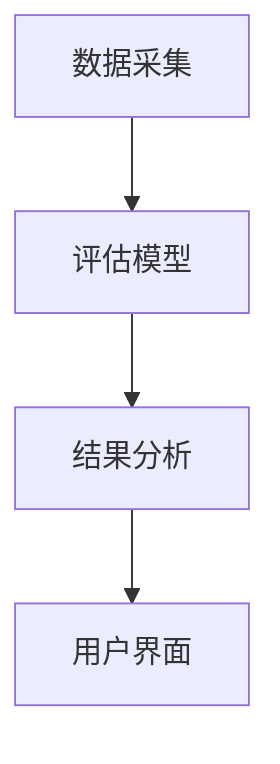

                 


# 彼得林奇对公司品牌资产价值贡献的量化分析

> 关键词：彼得·林奇，品牌资产，量化分析，投资策略，财务模型

> 摘要：本文深入探讨了彼得·林奇在公司品牌资产价值贡献方面的量化分析方法。通过分析品牌资产的核心概念、量化方法和数学模型，结合实际案例，详细阐述了如何将品牌资产转化为企业价值的提升。文章从背景介绍、核心概念、算法原理、系统设计到项目实战，层层递进，为读者提供了全面的理论与实践指导。

---

# 第一部分：品牌资产的背景与概念

## 第1章：品牌资产的基本概念

### 1.1 品牌资产的定义

品牌资产是指企业在市场中通过品牌建设所积累的无形资产，包括品牌知名度、品牌忠诚度、品牌认知度等。这些因素能够为企业带来持续的经济价值和竞争优势。

- **品牌资产的核心特征**：
  - **无形性**：品牌资产是通过品牌影响力产生的，无法直接用实物衡量。
  - **长期性**：品牌资产的积累需要长期的市场推广和客户维护。
  - **波动性**：品牌资产会受到市场环境和企业行为的影响，具有一定的波动性。

### 1.2 品牌资产的构成要素

品牌资产的构成要素是影响其价值的关键因素，主要包括以下几个方面：

| **要素**      | **定义**                                                                 |
|---------------|--------------------------------------------------------------------------|
| 品牌知名度     | 品牌在市场中的认知程度，高知名度意味着品牌更容易被消费者接受。                     |
| 品牌忠诚度     | 消费者对品牌的偏好程度，高忠诚度意味着消费者更倾向于选择该品牌产品。               |
| 品牌认知度     | 消费者对品牌及其产品的理解和记忆程度，高认知度有助于品牌在市场中的推广。             |
| 品牌形象与声誉 | 品牌在市场中的整体形象和信誉度，良好的形象有助于提升品牌价值。                     |

### 1.3 品牌资产对公司的战略意义

品牌资产不仅是企业的一项重要资产，也是企业长期发展的关键因素。以下是品牌资产对公司的战略意义：

- **提升市场竞争力**：强大的品牌资产能够帮助企业在市场竞争中占据优势地位。
- **增加客户忠诚度**：高品牌忠诚度意味着客户更愿意选择该品牌，从而为企业带来稳定的收益。
- **提高企业估值**：品牌资产是企业整体价值的重要组成部分，能够显著提高企业的市场估值。

---

## 第2章：彼得·林奇投资理念与品牌资产分析

### 2.1 彼得·林奇的投资哲学

彼得·林奇是美国著名的投资经理，以其独特的投资策略和对品牌资产的重视而闻名。他的投资哲学主要包括以下几点：

1. **长期投资**：林奇主张长期持有优质股票，避免频繁交易。
2. **基本面分析**：他注重对公司的基本面进行深入分析，包括财务状况、市场地位等。
3. **品牌资产的重要性**：林奇认为品牌资产是企业长期价值的重要组成部分，能够为公司带来持续的收益。

### 2.2 品牌资产分析方法

林奇在品牌资产分析中采用了一系列方法，包括：

- **财务指标分析**：通过分析公司的财务报表，评估品牌资产对财务状况的影响。
- **市场表现分析**：通过研究品牌的市场表现，评估品牌资产的市场价值。
- **风险评估**：评估品牌资产的风险因素，包括市场风险、声誉风险等。

### 2.3 品牌资产量化分析的核心要素

林奇的品牌资产量化分析模型主要包括以下几个核心要素：

| **要素**          | **定义**                                                                 |
|--------------------|--------------------------------------------------------------------------|
| 品牌价值           | 品牌在市场中的整体价值，包括品牌知名度、品牌忠诚度等。                          |
| 品牌贡献度         | 品牌资产对企业收益的贡献程度，通常以百分比形式表示。                            |
| 品牌风险           | 品牌资产可能面临的风险，如市场风险、声誉风险等。                                |

---

## 第3章：品牌资产价值贡献的量化方法

### 3.1 品牌资产价值的量化指标

量化品牌资产价值需要选择合适的指标，以下是常用的指标：

- **品牌价值**：通过品牌评估机构（如BrandZ）进行评估。
- **品牌忠诚度指数（LCI）**：通过消费者调查得出的品牌忠诚度指标。
- **品牌认知度**：通过市场调研得出的品牌在目标市场中的认知程度。

### 3.2 品牌资产价值贡献的计算模型

林奇提出的品牌资产价值贡献计算模型如下：

$$ \text{品牌价值贡献} = \text{品牌知名度} \times \text{品牌忠诚度} \times \text{品牌认知度} $$

其中：
- 品牌知名度：反映品牌在市场中的普及程度。
- 品牌忠诚度：反映消费者对品牌的偏好程度。
- 品牌认知度：反映消费者对品牌的理解和记忆程度。

### 3.3 品牌资产价值贡献的评估方法

林奇采用以下几种方法进行品牌资产价值贡献的评估：

- **市场法**：通过市场交易数据进行评估。
- **成本法**：通过品牌建设成本进行评估。
- **收益法**：通过品牌对收益的贡献进行评估。

---

## 第4章：彼得·林奇品牌资产量化分析的数学模型

### 4.1 品牌资产价值贡献的数学公式

林奇提出的品牌资产价值贡献的数学公式如下：

$$ \text{品牌资产价值贡献} = \alpha \times \text{品牌知名度} + \beta \times \text{品牌忠诚度} + \gamma \times \text{品牌认知度} $$

其中：
- α、β、γ为权重系数，表示各要素对品牌价值贡献的影响程度。

### 4.2 算法原理

林奇采用层次分析法（AHP）和模糊综合评价法进行品牌资产价值贡献的评估。

#### 层次分析法（AHP）

层次分析法是一种用于评估复杂问题的层次结构的方法。其步骤如下：

1. **构建层次结构**：将品牌资产的各个要素分为不同的层次，如目标层、准则层、方案层。
2. **构造判断矩阵**：根据专家意见，构造判断矩阵。
3. **计算权重**：通过计算判断矩阵的最大特征值和特征向量，得到各要素的权重。

#### 模糊综合评价法

模糊综合评价法是一种用于处理模糊性问题的评价方法。其步骤如下：

1. **确定评价指标**：如品牌知名度、品牌忠诚度等。
2. **构建模糊关系矩阵**：根据专家意见，构建模糊关系矩阵。
3. **计算综合评价结果**：通过模糊运算，得到综合评价结果。

### 4.3 系统架构设计

#### 系统功能设计

- **数据采集模块**：采集品牌相关的数据，如品牌知名度、品牌忠诚度等。
- **评估模型模块**：构建品牌资产价值贡献的评估模型，如层次分析法和模糊综合评价法。
- **结果分析模块**：对评估结果进行分析，得出品牌资产价值贡献的结论。

#### 系统架构图



### 4.4 项目实战

#### 环境安装

需要安装以下工具和库：
- Python 3.x
- NumPy
- Pandas
- Scipy
- Mermaid

#### 核心代码实现

```python
import numpy as np
import pandas as pd

# 假设我们已经收集了品牌相关数据
data = {
    '品牌': ['A', 'B', 'C'],
    '品牌知名度': [0.8, 0.7, 0.9],
    '品牌忠诚度': [0.9, 0.8, 0.7],
    '品牌认知度': [0.7, 0.6, 0.8]
}

df = pd.DataFrame(data)

# 计算品牌价值贡献
def calculate_brand_contribution(row):
    return row['品牌知名度'] * row['品牌忠诚度'] * row['品牌认知度']

df['品牌价值贡献'] = df.apply(calculate_brand_contribution, axis=1)
print(df)
```

#### 实际案例分析

以某品牌为例，假设其品牌知名度为0.8，品牌忠诚度为0.9，品牌认知度为0.7。则其品牌价值贡献为：

$$ 0.8 \times 0.9 \times 0.7 = 0.504 $$

---

## 第5章：小结与注意事项

### 5.1 本章小结

本文详细介绍了彼得·林奇对公司品牌资产价值贡献的量化分析方法，包括品牌资产的定义、量化方法、数学模型以及实际案例分析。通过这些方法，可以帮助企业更好地评估品牌资产的价值，从而制定更有效的品牌战略。

### 5.2 注意事项

- **数据质量**：品牌资产的量化分析需要高质量的数据支持，确保数据的准确性和完整性。
- **模型适用性**：不同的品牌可能需要不同的量化模型，需根据实际情况选择合适的模型。
- **动态调整**：品牌资产的价值会随着市场环境的变化而变化，需定期进行评估和调整。

### 5.3 最佳实践 tips

- 定期进行品牌资产评估，及时发现问题并进行调整。
- 结合定量分析和定性分析，全面评估品牌资产的价值。
- 建立品牌资产的动态监控机制，及时捕捉市场变化。

---

通过本文的分析，读者可以全面理解彼得·林奇的品牌资产量化分析方法，并能够在实际工作中加以应用，为企业品牌价值的提升提供有力支持。

