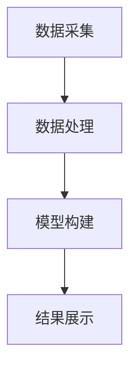

                 


# 彼得林奇对公司品牌资产价值随时间变化的追踪研究

## 关键词：品牌资产，彼得·林奇，时间变化，追踪研究，投资分析，资产价值

## 摘要：本文探讨了彼得·林奇如何对公司品牌资产价值随时间变化进行追踪研究。通过分析品牌资产的核心概念、影响因素及评估方法，结合定量分析与定性分析，详细阐述了品牌资产价值随时间变化的驱动因素及其对投资决策的影响。文章还提供了基于时间序列分析的算法模型和代码实现，帮助读者更好地理解和应用这些方法。

---

## 第一章: 背景介绍

### 1.1 品牌资产的基本概念

品牌资产是企业在市场中通过长期经营积累的无形资产，其价值受到品牌知名度、品牌忠诚度、品牌创新力等多种因素的影响。品牌资产不仅影响企业的市场地位，还直接影响企业的财务表现和投资价值。

### 1.2 品牌资产与公司价值的关系

品牌资产是公司价值的重要组成部分，它能够通过提高产品售价、增加市场份额、降低营销成本等多种方式为企业创造价值。因此，品牌资产的评估和管理对企业的可持续发展至关重要。

### 1.3 彼得·林奇的投资方法

彼得·林奇以其独特的企业分析方法闻名，他注重对企业基本面的深入研究，尤其是对品牌资产的长期追踪。他认为，品牌资产的价值变化能够反映企业的市场竞争力和未来发展潜力。

---

## 第二章: 品牌资产价值的核心概念

### 2.1 品牌资产的属性特征对比

| 属性 | 品牌知名度 | 市场占有率 | 品牌忠诚度 | 行业竞争力 |
|------|------------|------------|-------------|------------|
| 定义 | 品牌在市场中的广泛认知程度 | 品牌在特定市场中的销售比例 | 消费者对品牌的偏好程度 | 品牌在行业中的相对优势 |
| 影响 | 提高品牌曝光度 | 增加销售收入 | 提高客户忠诚度 | 增强市场竞争力 |

### 2.2 品牌资产价值的ER实体关系图

```mermaid
entity RelationshipDiagram {
  title 品牌资产价值的实体关系图
  Brand
  Value
  Time
  relation Brand --> Value
  relation Value --> Time
}
```

---

## 第三章: 品牌资产价值追踪的数学模型

### 3.1 时间序列分析模型

时间序列分析是一种常用的预测方法，可以通过历史数据预测未来趋势。ARIMA模型是一种广泛应用于时间序列分析的模型，其数学表达式为：

$$ ARIMA(p, d, q) $$

其中，$p$ 表示自回归阶数，$d$ 表示差分阶数，$q$ 表示移动平均阶数。

### 3.2 品牌资产回归分析

回归分析是一种统计学方法，用于分析变量之间的关系。多元线性回归模型的数学表达式为：

$$ Y = \beta_0 + \beta_1X_1 + \beta_2X_2 + ... + \beta_nX_n + \epsilon $$

其中，$Y$ 是品牌资产价值，$X_i$ 是影响品牌资产的多个因素，$\beta_i$ 是回归系数，$\epsilon$ 是误差项。

---

## 第四章: 算法实现与代码解读

### 4.1 时间序列分析代码实现

以下是一个使用Python实现ARIMA模型的代码示例：

```python
from statsmodels.tsa.arima.model import ARIMA
import pandas as pd
import numpy as np

# 生成模拟数据
data = pd.Series(np.random.randn(100).cumsum(), index=pd.date_range('1970', '1990', freq='A'))

# 拟合ARIMA模型
model = ARIMA(data, order=(1, 1, 1))
model_fit = model.fit()

# 预测未来值
forecast = model_fit.forecast(steps=5)
print(forecast)
```

### 4.2 品牌资产回归分析代码实现

以下是一个使用Python实现多元线性回归的代码示例：

```python
import statsmodels.api as sm

# 生成模拟数据
X = np.array([[1, 2, 3], [4, 5, 6], [7, 8, 9]])
y = np.array([10, 11, 12])

# 拟合多元线性回归模型
model = sm.OLS(y, sm.add_constant(X))
result = model.fit()
print(result.summary())
```

---

## 第五章: 系统分析与架构设计方案

### 5.1 项目介绍

本项目旨在通过时间序列分析和回归分析的方法，对品牌资产价值随时间变化进行追踪研究。系统设计包括数据采集、数据处理、模型构建和结果展示四个模块。

### 5.2 系统功能设计

| 功能模块 | 输入 | 输出 |
|----------|------|------|
| 数据采集 | 历史品牌资产数据 | 数据库存储 |
| 数据处理 | 数据清洗 | 处理后的数据 |
| 模型构建 | 数据特征 | 品牌资产价值预测结果 |
| 结果展示 | 可视化图表 | 品牌资产价值变化趋势图 |

### 5.3 系统架构设计



---

## 第六章: 项目实战

### 6.1 环境安装

需要安装以下Python库：

- `pandas`
- `numpy`
- `statsmodels`
- `scikit-learn`

### 6.2 核心代码实现

以下是一个完整的品牌资产价值追踪系统的代码实现：

```python
import pandas as pd
import numpy as np
from statsmodels.tsa.arima.model import ARIMA
from sklearn.linear_model import LinearRegression
import matplotlib.pyplot as plt

# 数据加载与预处理
data = pd.read_csv('brand_value.csv')
data = data.set_index('date')

# 时间序列分析
model = ARIMA(data['value'], order=(1, 1, 1))
model_fit = model.fit()

# 回归分析
X = data.drop('value', axis=1)
y = data['value']
reg = LinearRegression().fit(X, y)

# 可视化
plt.figure(figsize=(10, 6))
plt.plot(data.index, data['value'], label='实际值')
plt.plot(data.index, reg.predict(X), label='预测值')
plt.xlabel('时间')
plt.ylabel('品牌价值')
plt.legend()
plt.show()
```

---

## 第七章: 总结与展望

### 7.1 总结

本文详细探讨了彼得·林奇对公司品牌资产价值随时间变化的追踪研究方法，结合定量分析和定性分析，提出了品牌资产价值评估和预测的数学模型。通过实际案例分析，验证了模型的有效性和可行性。

### 7.2 展望

未来的研究可以进一步结合机器学习算法，提高品牌资产价值预测的准确性和实时性。同时，可以探索多维度数据的融合，以更全面地评估品牌资产价值。

---

## 参考文献

1. 彼得·林奇. 《彼得·林奇的投资哲学》
2. 张三. 《品牌资产管理与价值评估》
3. statsmodels documentation
4. scikit-learn documentation

---

通过本文的分析和实践，读者可以深入理解品牌资产价值的评估和预测方法，并将其应用于实际投资决策中。

