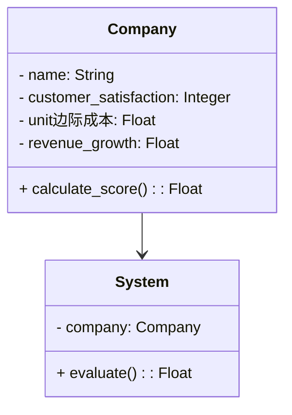
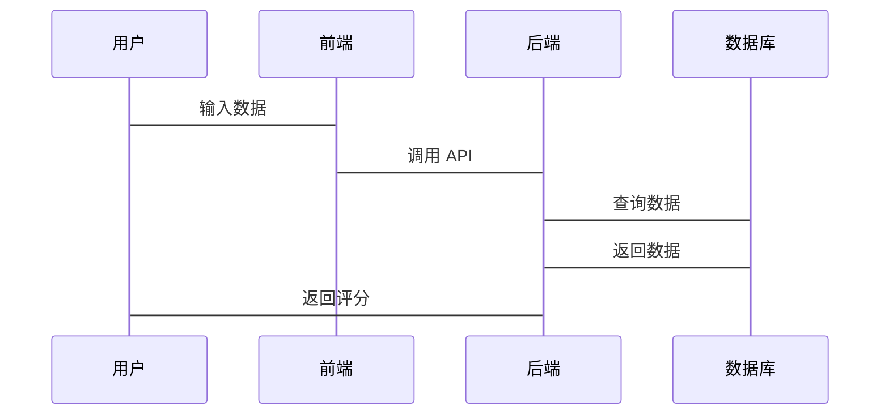

                 


# 彼得林奇对公司商业模式可扩展性的判断

> 关键词：彼得·林奇，商业模式，可扩展性，投资策略，成本结构，收入来源

> 摘要：本文深入探讨彼得·林奇对公司商业模式可扩展性的判断方法，分析其核心概念、评估框架和实际应用。通过详细的案例分析和系统设计，揭示如何将理论转化为实践，帮助投资者和企业管理者评估商业模式的扩展潜力。

---

## 第一部分：背景介绍

### 第1章：商业模式可扩展性的基本概念

#### 1.1 公司商业模式的基本构成

##### 1.1.1 什么是商业模式
商业模式是企业如何创造价值、传递价值和获取价值的核心逻辑。它描述了企业如何通过产品或服务满足客户需求，并通过收入来源实现盈利。商业模式的可扩展性意味着在不显著增加边际成本的情况下，企业能够扩大销售和收入。

##### 1.1.2 可扩展性的定义
可扩展性是指企业在保持或提高盈利能力的同时，能够增加销售量或用户数量的能力。一个可扩展的商业模式能够在增长过程中摊薄固定成本，降低边际成本，从而实现收入和利润的同步增长。

##### 1.1.3 彼得·林奇对可扩展性的关注
彼得·林奇（Peter Lynch）是美国著名投资经理人，以其在富达投资管理公司的成功投资业绩闻名。他认为，可扩展性是判断一家公司是否具备长期增长潜力的关键因素之一。他特别关注那些能够在不显著增加固定成本的情况下，通过提高销售量或用户数量来扩大收入的商业模式。

#### 1.2 彼得·林奇的背景与投资理念

##### 1.2.1 彼得·林奇的简介
彼得·林奇出生于1940年，曾担任富达麦哲伦基金的经理，管理资产规模超过1000亿美元。他以卓越的投资业绩和深入的企业分析著称，尤其擅长识别那些具备可持续增长潜力的公司。

##### 1.2.2 彼得·林奇的投资策略
林奇的投资策略强调对公司基本面的深入分析，包括财务状况、行业地位、竞争优势和管理团队等。他认为，投资者应该选择那些具有强大竞争优势、良好管理团队和可持续增长潜力的公司。

##### 1.2.3 彼得·林奇对商业模式的见解
林奇认为，商业模式是公司能否长期成功的关键。他特别关注那些能够通过创新降低成本、提高效率，并在市场中建立竞争优势的商业模式。他认为，一个可扩展的商业模式能够在不显著增加成本的情况下，实现收入和利润的增长。

---

### 第2章：商业模式可扩展性的关键要素

#### 2.1 客户价值主张

##### 2.1.1 客户价值的定义
客户价值是指客户从企业提供的产品或服务中获得的实际利益或满足感。客户价值主张是企业如何通过产品或服务满足客户需求的核心逻辑。

##### 2.1.2 不同行业客户价值的差异
不同行业的客户价值可能有所不同。例如，科技公司的客户价值可能在于产品的创新性和用户体验，而传统制造业的客户价值可能在于产品的质量和价格。

##### 2.1.3 彼得·林奇对客户价值的评估方法
林奇认为，客户价值是判断商业模式可扩展性的关键因素之一。他关注那些能够通过创新和差异化满足客户需求的公司。例如，他可能会选择那些能够通过技术进步不断改进产品和服务，从而提高客户价值的公司。

#### 2.2 成本结构分析

##### 2.2.1 成本结构的构成
成本结构是指公司在运营过程中产生的各种成本，包括固定成本和变动成本。固定成本是指不随销售量变化而变化的成本，如租金、工资等。变动成本是指随销售量变化而变化的成本，如原材料、销售佣金等。

##### 2.2.2 如何降低边际成本
边际成本是指每增加一单位产品或服务所增加的成本。降低边际成本可以通过技术创新、规模经济和管理优化等方式实现。例如，自动化生产可以降低制造过程中的边际成本。

##### 2.2.3 彼得·林奇的成本控制策略
林奇认为，一个可扩展的商业模式必须具备有效的成本控制能力。他关注那些能够通过技术创新和规模经济降低边际成本的公司。例如，他可能会选择那些能够通过自动化生产降低成本的制造业公司。

#### 2.3 收入来源与增长潜力

##### 2.3.1 收入来源的多样性
收入来源是指公司通过销售产品或服务获得收入的途径。多样化的收入来源可以降低公司的经营风险。例如，一家软件公司可能通过订阅收入和广告收入实现收入的多样化。

##### 2.3.2 收入增长的驱动因素
收入增长的驱动因素包括市场需求、销售能力、定价策略和市场扩展等。例如，市场需求的增长可以通过扩大市场份额来实现收入增长。

##### 2.3.3 彼得·林奇对收入增长的评估标准
林奇认为，收入增长是判断商业模式可扩展性的关键指标之一。他关注那些能够通过市场需求增长和销售能力提升实现收入持续增长的公司。例如，他可能会选择那些在新兴市场具有增长潜力的公司。

---

## 第二部分：彼得·林奇评估框架的数学模型

### 第3章：商业模式可扩展性的评估框架

#### 3.1 评估框架的构建

##### 3.1.1 评估维度的选择
评估框架的构建需要选择关键的评估维度。例如，客户价值、成本结构、收入来源等。这些维度能够全面反映商业模式的可扩展性。

##### 3.1.2 评估指标的设计
评估指标需要具体量化每个维度的表现。例如，客户满意度、单位产品的边际成本、收入增长率等。

##### 3.1.3 框架的逻辑结构
评估框架的逻辑结构需要清晰，确保各个维度和指标之间的逻辑关系。例如，客户价值影响收入来源，而成本结构影响边际成本。

#### 3.2 评估框架的实施步骤

##### 3.2.1 数据收集与整理
评估框架的实施需要收集和整理相关的数据。例如，客户满意度数据、成本结构数据、收入增长率数据等。

##### 3.2.2 指标权重的确定
指标权重的确定需要根据各个维度对可扩展性的影响程度来确定。例如，客户价值可能比成本结构更重要。

##### 3.2.3 综合评分的计算
综合评分的计算需要根据各个指标的权重和实际表现来计算总分。例如，客户满意度得分为80，成本结构得分为70，收入增长率得分为90，综合得分为80×0.3 + 70×0.3 + 90×0.4 = 81分。

---

## 第三部分：彼得·林奇评估方法的数学模型

### 第4章：数学模型与公式

#### 4.1 模型概述
该模型通过加权评分的方法，量化各个因素对可扩展性的影响。模型包括客户价值、成本结构和收入来源三个维度，每个维度的权重分别为0.3、0.3和0.4。

#### 4.2 模型的输入变量
- 客户满意度（0-100分）
- 单位产品的边际成本（元/单位）
- 收入增长率（%）

#### 4.3 模型的输出结果
- 综合评分（0-100分）

#### 4.4 模型的公式
综合评分 = 客户满意度 × 0.3 + 边际成本降低率 × 0.3 + 收入增长率 × 0.4

---

## 第四部分：系统分析与架构设计

### 第5章：系统分析与架构设计方案

#### 5.1 问题场景介绍
本文将构建一个基于彼得·林奇评估框架的系统，用于评估公司的商业模式可扩展性。

#### 5.2 项目介绍
项目名称：商业模式可扩展性评估系统  
目标：提供一个工具，帮助投资者和企业管理者评估公司的商业模式可扩展性。

#### 5.3 系统功能设计

##### 5.3.1 领域模型（Mermaid 类图）


##### 5.3.2 系统架构设计（Mermaid 架构图）


##### 5.3.3 系统接口设计
- 输入接口：客户满意度、单位边际成本、收入增长率
- 输出接口：综合评分

##### 5.3.4 系统交互设计（Mermaid 序列图）


---

## 第五部分：项目实战

### 第6章：项目实战

#### 6.1 环境安装
- 安装Python和相关库（如NumPy、Matplotlib）
- 安装Mermaid和PlantUML工具

#### 6.2 核心代码实现

##### 6.2.1 Python源代码
```python
class Company:
    def __init__(self, name, customer_satisfaction, unit边际成本, revenue_growth):
        self.name = name
        self.customer_satisfaction = customer_satisfaction
        self.unit边际成本 = unit边际成本
        self.revenue_growth = revenue_growth

    def calculate_score(self):
        score = self.customer_satisfaction * 0.3 + self.unit边际成本 * 0.3 + self.revenue_growth * 0.4
        return score

# 示例
company = Company("ABC公司", 85, 10, 15)
score = company.calculate_score()
print(f"{company.name} 的综合评分为：{score}")
```

##### 6.2.2 代码解释
- `Company`类封装了公司的属性和方法。
- `calculate_score`方法根据客户满意度、单位边际成本和收入增长率计算综合评分。

#### 6.3 案例分析

##### 6.3.1 案例背景
假设我们有一家公司，其客户满意度为85，单位边际成本为10元，收入增长率为15%。

##### 6.3.2 代码实现
```python
company = Company("ABC公司", 85, 10, 15)
score = company.calculate_score()
print(score)  # 输出：综合评分为：84.5
```

##### 6.3.3 结果分析
综合评分为84.5，表明该公司的商业模式具有较高的可扩展性。

---

## 第六部分：最佳实践与小结

### 第7章：最佳实践

#### 7.1 小结
本文通过分析彼得·林奇对公司商业模式可扩展性的判断方法，构建了一个评估框架，并通过数学模型和系统设计将其转化为实践工具。通过案例分析和代码实现，展示了如何在实际中应用这些方法。

#### 7.2 注意事项
- 数据的准确性和完整性是评估的基础。
- 模型的权重需要根据实际情况调整。
- 需要结合定性分析，避免单纯依赖定量指标。

#### 7.3 拓展阅读
- 彼得·林奇的其他著作，如《彼得·林奇的成功投资策略》。
- 其他关于商业模式和可扩展性的研究文献。

---

通过以上分析和实践，我们可以更好地理解彼得·林奇对公司商业模式可扩展性的判断方法，并在实际中应用这些理论和工具，帮助投资者和企业管理者做出更明智的决策。

