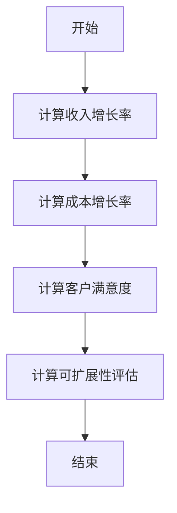
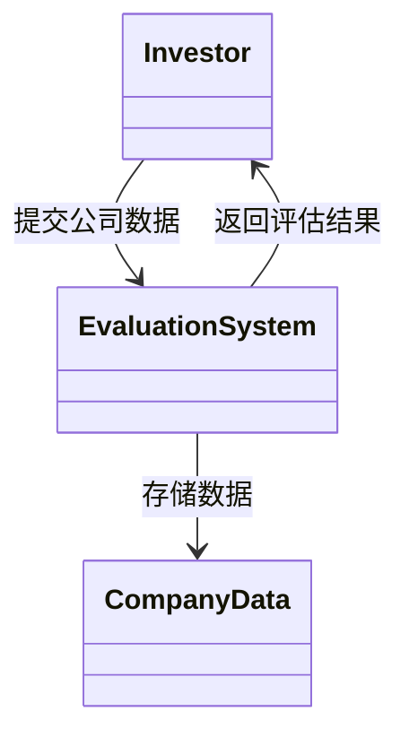
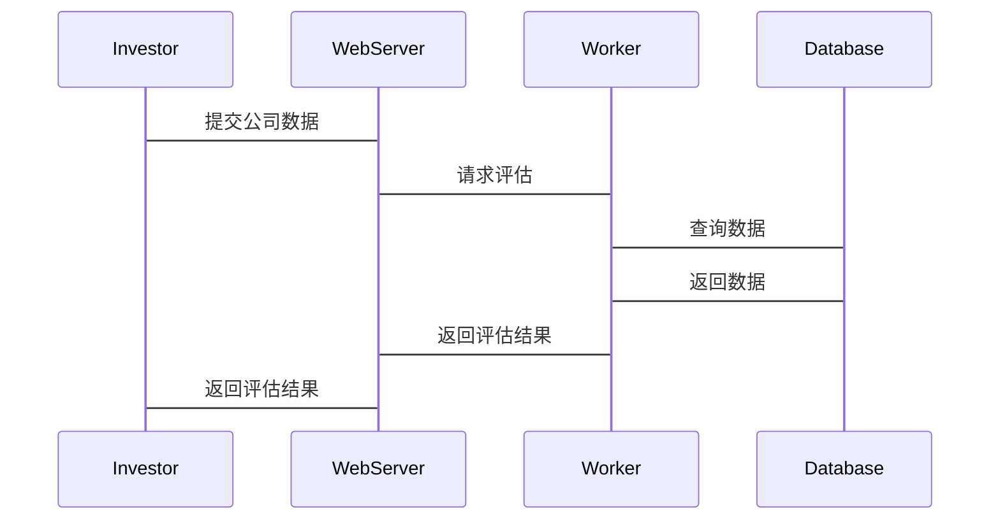

                 


# 彼得林奇对公司商业模式可扩展性的长期评估

## 关键词：
公司商业模式、可扩展性评估、长期价值、投资策略、彼得·林奇、技术分析、财务指标

## 摘要：
本文深入探讨了彼得·林奇对公司商业模式可扩展性的长期评估方法。通过分析其核心概念、算法原理、系统架构及实际案例，展示了如何将投资策略与技术分析相结合，评估公司的长期发展潜力。文章还提供了详细的项目实战和总结，为投资者和技术人员提供了实用的指导。

---

# 第一部分: 背景介绍

## 第1章: 公司商业模式可扩展性评估概述

### 1.1 问题背景与描述
#### 1.1.1 什么是公司商业模式的可扩展性
公司商业模式的可扩展性是指公司能否在不显著增加成本的情况下，将收入或利润扩大。彼得·林奇认为，可扩展性是公司长期增长的核心因素。

#### 1.1.2 可扩展性评估的重要性
- **投资决策**：帮助投资者识别高潜力公司。
- **战略规划**：指导公司如何优化业务模式。

#### 1.1.3 问题解决的必要性
通过评估可扩展性，投资者可以避免选择增长潜力有限的公司。

### 1.2 可扩展性评估的核心概念
#### 1.2.1 核心概念的结构与组成
- **收入来源**：公司的主要收入来源。
- **成本结构**：公司的主要成本构成。
- **客户基础**：客户数量和质量。

#### 1.2.2 关键要素与属性对比表
| 属性 | 描述 |
|------|------|
| 收入来源 | 主要收入来源是否可扩展 |
| 成本结构 | 成本是否随收入增长线性增长 |
| 客户基础 | 客户数量能否随收入增长而增长 |

#### 1.2.3 ER实体关系图
```mermaid
erd
  customer(CustomerID, Name, Email, Phone)
  company(CompanyID, Name, Industry, Revenue, Cost)
  relation(CompanyID, CustomerID)
```

---

## 第2章: 彼得林奇的长期评估方法

### 2.1 彼得林奇投资理念概述
#### 2.1.1 彼得林奇的长期价值观
- **长期投资**：关注公司长期增长。
- **基本面分析**：通过公司财务数据评估其价值。

#### 2.1.2 其他相关投资理论对比
- **价值投资**：寻找被市场低估的公司。
- **成长投资**：投资于高增长潜力的公司。

### 2.2 可扩展性评估的数学模型
#### 2.2.1 模型公式
$$E = \frac{S \times V}{T}$$
其中：
- \(E\)：可扩展性评估。
- \(S\)：客户满意度。
- \(V\)：收入增长率。
- \(T\)：成本增长率。

---

# 第三部分: 算法原理讲解

## 第3章: 可扩展性评估算法原理

### 3.1 算法原理概述
#### 3.1.1 算法流程图


### 3.2 算法实现代码
#### 3.2.1 Python核心代码实现
```python
def evaluate_growth(company_data):
    revenue_growth = company_data['revenue_growth']
    cost_growth = company_data['cost_growth']
    customer_satisfaction = company_data['customer_satisfaction']
    e = (customer_satisfaction * revenue_growth) / cost_growth
    return e
```

### 3.3 数学模型与公式
#### 3.3.1 增长模型公式
$$G = \frac{R \times T}{N}$$
其中：
- \(G\)：增长模型。
- \(R\)：收入增长率。
- \(T\)：时间跨度。
- \(N\)：客户数量。

---

# 第四部分: 系统分析与架构设计

## 第4章: 系统分析与架构设计

### 4.1 问题场景介绍
#### 4.1.1 评估系统需求分析
- **用户需求**：投资者希望评估公司可扩展性。
- **功能需求**：系统需计算可扩展性评估并生成报告。

#### 4.1.2 系统功能设计


### 4.2 系统架构设计
#### 4.2.1 系统架构图
```mermaid
archi
    Client --[HTTP]--> WebServer
    WebServer --[RabbitMQ]--> Worker
    Worker --[PostgreSQL]--> Database
    Database --[Redis]--> Cache
```

#### 4.2.2 系统接口设计
- **输入接口**：投资者提交公司数据。
- **输出接口**：系统返回评估结果。

#### 4.2.3 系统交互流程图


---

# 第五部分: 项目实战

## 第5章: 项目实战与案例分析

### 5.1 环境安装与配置
#### 5.1.1 开发环境搭建
- **Python**：安装Python 3.x。
- **依赖库**：安装`mermaid`, `pandas`, `numpy`。

#### 5.1.2 依赖库安装
```bash
pip install mermaid.py pandas numpy
```

### 5.2 核心代码实现
#### 5.2.1 代码实现细节
```python
import pandas as pd
import numpy as np

def calculate_extensibility(company_data):
    revenue_growth = company_data['revenue_growth']
    cost_growth = company_data['cost_growth']
    customer_satisfaction = company_data['customer_satisfaction']
    extensibility = (customer_satisfaction * revenue_growth) / cost_growth
    return extensibility

# 示例数据
data = {
    'revenue_growth': 0.2,
    'cost_growth': 0.1,
    'customer_satisfaction': 0.85
}

result = calculate_extensibility(data)
print(f"可扩展性评估: {result}")
```

#### 5.2.2 代码功能解读
- **数据输入**：读取公司数据。
- **计算可扩展性**：使用公式计算评估结果。
- **结果输出**：打印评估结果。

### 5.3 案例分析与解读
#### 5.3.1 实际案例分析
假设某公司：
- 收入增长率为20%。
- 成本增长率为10%。
- 客户满意度为85%。

计算可扩展性评估：
$$E = \frac{0.85 \times 0.2}{0.1} = 1.7$$

#### 5.3.2 案例结果解读
- **高可扩展性**：评估结果为1.7，表明公司具有较高的可扩展性，适合长期投资。

---

# 第六部分: 最佳实践与总结

## 第6章: 最佳实践与总结

### 6.1 投资评估中的注意事项
#### 6.1.1 常见问题与解决方案
- **数据准确性**：确保数据来源可靠。
- **模型局限性**：模型假设可能不适用于所有行业。

#### 6.1.2 风险管理策略
- **分散投资**：降低单一投资风险。
- **定期评估**：根据市场变化调整投资策略。

### 6.2 项目小结
#### 6.2.1 项目成果总结
本文通过详细分析彼得·林奇的可扩展性评估方法，展示了如何将其应用于实际投资决策。

#### 6.2.2 未来研究方向
- **模型优化**：探索更复杂的评估模型。
- **行业应用**：研究不同行业中的可扩展性评估。

### 6.3 拓展阅读与学习资源
#### 6.3.1 推荐书籍
- 《彼得·林奇的投资智慧》。
- 《技术分析的理论与实践》。

#### 6.3.2 在线资源与工具
- [Mermaid图表工具](https://mermaid-js.github.io/mermaid-live-editor/)
- [Python官方文档](https://docs.python.org/zh-cn/3/)

---

# 总结
本文通过详细分析彼得·林奇的可扩展性评估方法，结合技术分析和实际案例，为投资者和技术人员提供了实用的指导。希望本文能帮助读者更好地理解公司商业模式的可扩展性，并在投资决策中做出明智的选择。

