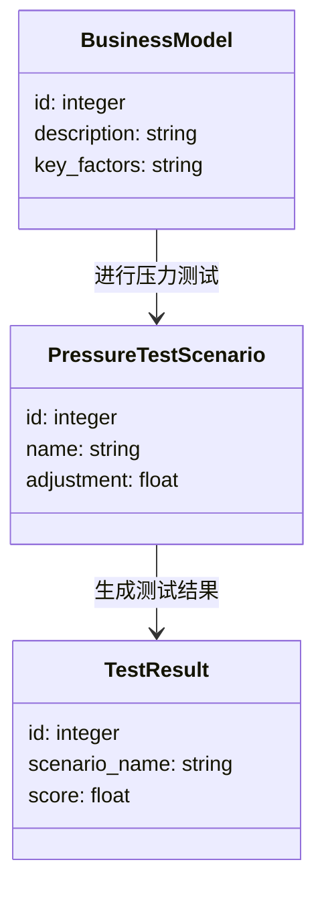
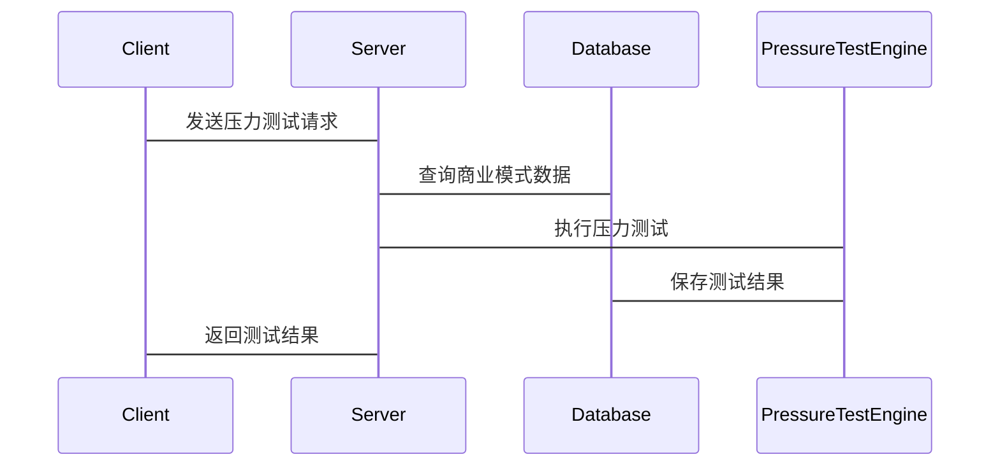

                 


# 彼得林奇对公司商业模式适应性的压力测试方法

## 关键词：彼得林奇，商业模式适应性，压力测试，算法原理，系统架构

## 摘要：本文详细介绍了彼得林奇对公司商业模式适应性的压力测试方法，从理论基础到实际应用进行了全面解析。通过系统化的分析框架和具体的案例研究，探讨了如何将压力测试应用于商业模式的适应性评估中。文章结合了算法原理、数学模型和系统架构设计，提供了完整的解决方案和实现方法。

---

# 第一部分: 彼得林奇对公司商业模式适应性的压力测试方法概述

## 第1章: 公司商业模式适应性压力测试的背景与意义

### 1.1 压力测试的定义与作用

压力测试是一种通过模拟极端条件下的情况，来评估系统或模型在面对重大变化或冲击时的稳健性。在商业模式中，压力测试可以帮助企业识别潜在的风险点，并评估其商业模式在不同环境下的适应能力。

- **压力测试的定义**：压力测试是一种通过模拟极端条件下的情况，来评估系统或模型在面对重大变化或冲击时的稳健性。
- **压力测试在商业模式中的作用**：帮助识别潜在风险点，评估商业模式的稳健性和适应性，为企业制定应对策略提供依据。

### 1.2 商业模式适应性的概念

商业模式适应性是指企业在面对外部环境变化时，能够灵活调整其商业模式以保持竞争力和盈利能力的能力。

- **商业模式的基本构成**：包括价值主张、客户关系、资源分配、核心流程和收益模式等。
- **适应性的定义与特征**：企业能够根据市场变化调整商业模式的能力，具有灵活性、创新性和稳健性。
- **彼得林奇方法的核心理念**：通过压力测试识别商业模式中的弱点，并通过调整优化其适应性。

### 1.3 彼得林奇方法的核心要素

彼得林奇的投资哲学强调长期价值和风险管理，其压力测试方法的核心要素包括：

- **投资哲学与商业模式分析**：关注企业的长期盈利能力、竞争优势和管理能力。
- **风险管理与压力测试的关系**：通过压力测试识别潜在风险，并制定应对策略。
- **彼得林奇方法的创新点**：结合定量分析和定性分析，注重数据驱动的决策。

## 第2章: 彼得林奇方法的核心概念与联系

### 2.1 核心概念原理

彼得林奇压力测试方法的核心概念包括商业模式的核心要素分析、压力测试的数学模型和逻辑框架。

- **商业模式的核心要素分析**：分析企业的价值主张、客户关系、资源分配、核心流程和收益模式。
- **压力测试的数学模型**：通过评分模型量化商业模式的适应性。
- **逻辑框架**：将压力测试应用于商业模式适应性评估，通过定性和定量分析结合的方法进行评估。

### 2.2 核心概念属性对比表格

| **属性**        | **商业模式适应性**                | **压力测试**                  |
|------------------|----------------------------------|-----------------------------|
| **定义**         | 企业在变化环境中的调整能力       | 模拟极端条件下的系统表现      |
| **目的**         | 提高商业模式的灵活性和竞争力       | 识别潜在风险，评估系统稳健性  |
| **方法论**       | 通过调整和优化提高适应性         | 通过模拟极端条件进行测试      |
| **应用领域**     | 企业战略规划、运营管理          | 金融、IT、企业风险管理        |

### 2.3 ER实体关系图架构

```mermaid
erDiagram
    customer[客户] {
        +id: integer
        +name: string
        +preferences: string
    }
    business_model[商业模式] {
        +id: integer
        +description: string
        +key_factors: string
    }
    pressure_test[压力测试] {
        +id: integer
        +test_scenario: string
        +result: string
    }
    customer --> business_model: 采用的商业模式
    business_model --> pressure_test: 进行压力测试
    pressure_test --> customer: 提供测试结果
```

## 第3章: 彼得林奇方法的算法原理讲解

### 3.1 算法原理概述

彼得林奇压力测试方法的算法原理包括以下几个步骤：

- **输入数据**：包括企业的商业模式要素、市场环境数据等。
- **构建评分模型**：根据权重和评分因子，计算商业模式适应性评分。
- **模拟极端场景**：设计极端市场条件，进行压力测试。
- **评估结果**：根据评分模型和测试结果，评估商业模式的适应性。

### 3.2 算法实现代码

```python
def peter_lynch_test(business_model, scenarios):
    # 定义评分因子和权重
    factors = ['value_proposition', 'customer_relationship', 'resource_allocation', 'core_process', 'revenue_model']
    weights = [0.3, 0.2, 0.2, 0.2, 0.1]
    
    # 计算适应性评分
    def calculate_score(factors, weights, business_model):
        score = 0
        for i in range(len(factors)):
            score += weights[i] * business_model.get(factors[i], 0)
        return score
    
    # 进行压力测试
    results = []
    for scenario in scenarios:
        current_score = calculate_score(factors, weights, business_model)
        # 根据情景调整评分
        adjusted_score = current_score * (1 + scenario['adjustment'])
        results.append({'scenario': scenario['name'], 'score': adjusted_score})
    return results

# 示例用法
business_model = {
    'value_proposition': 0.8,
    'customer_relationship': 0.7,
    'resource_allocation': 0.6,
    'core_process': 0.9,
    'revenue_model': 0.8
}
scenarios = [
    {'name': '经济衰退', 'adjustment': -0.2},
    {'name': '市场竞争加剧', 'adjustment': -0.15},
    {'name': '技术创新', 'adjustment': 0.1}
]
results = peter_l Lynch_test(business_model, scenarios)
for result in results:
    print(f"在{result['scenario']}下，商业模式适应性评分为{result['score']}")
```

### 3.3 数学模型与公式

商业模式适应性评分公式：

$$ \text{适应性评分} = \sum_{i=1}^{n} w_i \cdot f_i $$

其中，$w_i$ 为评分因子 $f_i$ 的权重，$f_i$ 为评分因子的值。

### 3.4 举例说明

假设我们有一个商业模式，其价值主张得分为0.8，客户关系得分为0.7，资源分配得分为0.6，核心流程得分为0.9，收益模式得分为0.8。在经济衰退的情景下，评分调整系数为-0.2。根据公式计算，适应性评分为：

$$ 0.3 \times 0.8 + 0.2 \times 0.7 + 0.2 \times 0.6 + 0.2 \times 0.9 + 0.1 \times 0.8 = 0.24 + 0.14 + 0.12 + 0.18 + 0.08 = 0.76 $$

在经济衰退的情景下，适应性评分为：

$$ 0.76 \times (1 - 0.2) = 0.76 \times 0.8 = 0.608 $$

## 第4章: 商业模式适应性压力测试的系统分析与架构设计

### 4.1 系统分析

- **问题场景**：企业在面对市场变化时，需要快速评估其商业模式的适应性，以确保在极端情况下仍能保持竞争力。
- **项目介绍**：构建一个基于彼得林奇方法的商业模式适应性压力测试系统，帮助企业进行风险评估和优化。

### 4.2 系统功能设计



### 4.3 系统架构设计


### 4.4 系统交互设计



## 第5章: 项目实战——彼得林奇方法的应用

### 5.1 环境安装与配置

- **开发环境**：Python 3.8+
- **依赖库**：numpy, pandas, matplotlib

### 5.2 核心算法实现

```python
def main():
    import numpy as np
    import pandas as pd
    # 示例数据
    business_models = pd.DataFrame({
        'id': [1, 2, 3],
        'value_proposition': [0.8, 0.7, 0.6],
        'customer_relationship': [0.7, 0.6, 0.8],
        'resource Allocation': [0.6, 0.5, 0.7],
        'core_process': [0.9, 0.8, 0.7],
        'revenue_model': [0.8, 0.6, 0.9]
    })
    scenarios = [
        {'name': '经济衰退', 'adjustment': -0.2},
        {'name': '市场竞争加剧', 'adjustment': -0.15},
        {'name': '技术创新', 'adjustment': 0.1}
    ]
    # 进行压力测试
    results = []
    for bm in business_models.itertuples():
        current_score = sum([0.3*bm.value_proposition + 0.2*bm.customer_relationship + 0.2*bm.resource_Allocation + 0.2*bm.core_process + 0.1*bm.revenue_model])
        for scenario in scenarios:
            adjusted_score = current_score * (1 + scenario['adjustment'])
            results.append({
                'id': bm.id,
                'scenario': scenario['name'],
                'score': adjusted_score
            })
    # 输出结果
    pd.DataFrame(results).to_csv('test_results.csv', index=False)

if __name__ == "__main__":
    main()
```

### 5.3 代码应用解读

- **代码功能模块分析**：读取商业模式数据，定义压力测试情景，计算适应性评分，保存测试结果。
- **代码实现细节说明**：使用Pandas进行数据处理，定义评分公式，通过循环实现压力测试，保存结果为CSV文件。

### 5.4 实际案例分析

- **案例分析**：假设我们有三个不同的商业模式，分别在经济衰退、市场竞争加剧和技术创新的情景下进行压力测试，计算每个情景下的适应性评分。

### 5.5 项目小结

- 通过代码实现，我们可以快速评估多个商业模式在不同情景下的适应性，为企业的风险管理提供数据支持。

## 第6章: 最佳实践与小结

### 6.1 最佳实践 tips

- **数据选择与处理**：确保数据的准确性和完整性，合理选择评分因子和权重。
- **算法调优**：根据具体业务需求调整评分模型和压力测试情景。
- **系统设计**：确保系统架构的可扩展性和可维护性，方便后续优化和功能扩展。

### 6.2 小结与展望

- **本书核心**：通过系统化的分析框架和具体的案例研究，探讨了如何将压力测试应用于商业模式的适应性评估中。
- **未来展望**：结合人工智能和大数据技术，进一步优化压力测试方法，提高评估的准确性和效率。

---

# 附录: 参考文献

- 彼得林奇著《彼得林奇选股艺术》
- 其他相关学术论文和研究报告

---

通过本文的详细讲解，读者可以全面理解彼得林奇对公司商业模式适应性的压力测试方法，并将其应用于实际的商业实践中。

