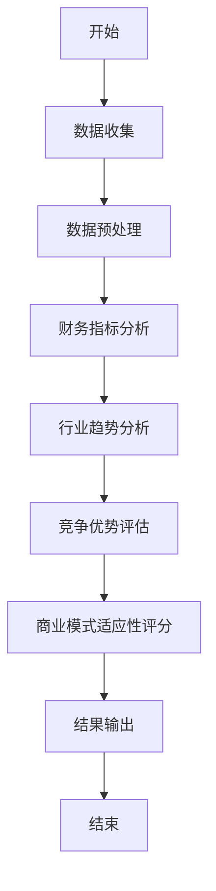
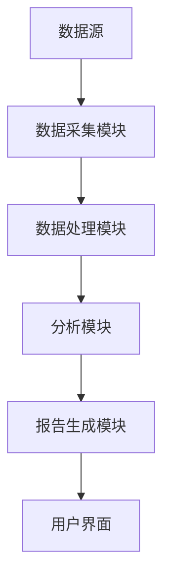
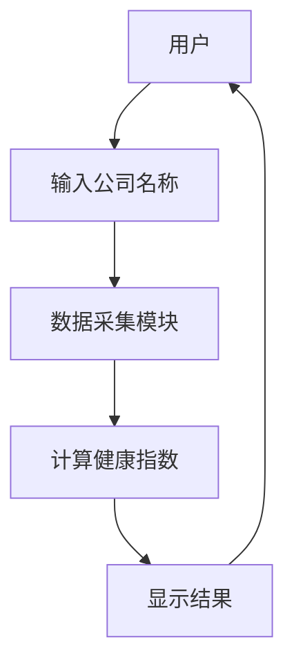

                 


### 第3章: 彼得林奇分析方法的算法原理

#### 3.1 算法原理概述

彼得·林奇的分析方法以长期跟踪研究为基础，结合定量和定性分析，构建了一个多维度的公司商业模式评估体系。其核心在于通过财务数据、行业趋势和竞争优势的综合分析，识别公司商业模式的适应性和可持续性。

#### 3.2 数据收集与预处理

在进行分析之前，首先需要收集相关的数据，包括公司的财务报表、行业数据、市场趋势等。数据预处理是确保分析准确性的关键步骤，包括数据清洗、标准化和特征提取。

#### 3.3 算法流程图（mermaid）

以下是一个简化的算法流程图，展示了彼得·林奇分析方法的主要步骤：



#### 3.4 算法实现

为了实现上述分析流程，我们可以使用Python编写相应的代码。以下是一个示例代码，展示了如何计算公司的商业模式适应性评分：

```python
import pandas as pd
import numpy as np

# 假设我们有一个包含公司财务数据的DataFrame df
# 包含的列：收入、利润、市盈率、市净率、ROE

# 定义计算健康指数的函数
def calculate_health_index(df):
    # 计算各个指标的加权评分
    weights = {'收入': 0.3, '利润': 0.3, '市盈率': 0.2, '市净率': 0.1, 'ROE': 0.1}
    health_index = 0
    for metric in weights:
        df[metric + '_评分'] = df[metric] / df[metric].max() * weights[metric]
        health_index += df[metric + '_评分'].mean()
    return health_index

# 假设我们有具体的数据
data = {
    '收入': [100, 200, 300],
    '利润': [20, 40, 60],
    '市盈率': [15, 20, 25],
    '市净率': [2, 3, 4],
    'ROE': [0.1, 0.15, 0.2]
}

df = pd.DataFrame(data)
health_index = calculate_health_index(df)
print(f"商业模式适应性健康指数: {health_index}")
```

#### 3.5 数学模型与公式

彼得·林奇的分析方法可以转化为一个数学模型，用于评估公司的商业模式适应性。以下是健康指数的计算公式：

$$
\text{健康指数} = \sum (\text{权重} \times \text{指标评分})
$$

其中，权重是根据指标的重要性分配的，指标评分为各指标的实际值与最大值的比值。

例如，收入的评分为：

$$
\text{收入评分} = \frac{\text{收入}}{\text{收入最大值}} \times 0.3
$$

通过上述公式，我们可以量化公司的商业模式适应性，为投资决策提供数据支持。

### 第4章: 数学模型与公式

#### 4.1 模型的核心要素

彼得·林奇的分析模型主要包括以下几个核心要素：

1. **财务指标**：收入、利润、ROE等。
2. **行业趋势**：行业增长率、竞争状况等。
3. **竞争优势**：成本优势、技术优势等。

#### 4.2 模型的数学表达

将上述要素转化为数学模型，可以表示为：

$$
\text{商业模式适应性评分} = \alpha \times \text{收入评分} + \beta \times \text{利润评分} + \gamma \times \text{行业趋势评分} + \delta \times \text{竞争优势评分}
$$

其中，$\alpha, \beta, \gamma, \delta$ 是各要素的权重系数，通常通过行业经验和数据验证来确定。

#### 4.3 示例分析

假设我们有三家公司，数据如下：

| 公司 | 收入 | 利润 | ROE | 行业趋势评分 | 竞争优势评分 |
|------|------|------|-----|--------------|--------------|
| A    | 100  | 20   | 0.1 | 0.7          | 0.6          |
| B    | 200  | 40   | 0.15| 0.8          | 0.7          |
| C    | 300  | 60   | 0.2 | 0.9          | 0.8          |

假设权重为：$\alpha=0.3, \beta=0.3, \gamma=0.2, \delta=0.2$

计算各公司的健康指数：

$$
\text{健康指数}_A = 0.3 \times \frac{100}{300} + 0.3 \times \frac{20}{60} + 0.2 \times 0.7 + 0.2 \times 0.6 = 0.3 \times 0.333 + 0.3 \times 0.333 + 0.14 + 0.12 = 0.1 + 0.1 + 0.14 + 0.12 = 0.46
$$

同样计算B和C的健康指数，可以得出哪家公司的商业模式适应性最好。

### 第5章: 系统分析与架构设计方案

#### 5.1 问题场景介绍

为了长期跟踪公司商业模式，我们需要构建一个自动化分析系统，能够实时收集数据并进行评估。

#### 5.2 系统功能设计

系统功能模块包括：

1. 数据采集模块：从多个数据源收集公司数据。
2. 数据处理模块：清洗和预处理数据。
3. 分析模块：计算各公司的健康指数。
4. 报告生成模块：生成分析报告。

#### 5.3 系统架构设计（mermaid图）

以下是系统的架构图：



#### 5.4 接口设计

系统需要与多个数据源对接，例如财务数据库、行业报告等。接口设计需要考虑数据格式和传输协议。

#### 5.5 交互设计（mermaid图）

以下是一个用户与系统交互的流程图：



### 第6章: 项目实战

#### 6.1 环境安装

需要安装Python和相关库：

```bash
pip install pandas numpy matplotlib
```

#### 6.2 核心代码实现

以下是一个完整的代码示例：

```python
import pandas as pd
import numpy as np

def calculate_health_index(df):
    # 计算各指标评分
    max_income = df['收入'].max()
    max_profit = df['利润'].max()
    max_roe = df['ROE'].max()

    df['收入评分'] = df['收入'] / max_income * 0.3
    df['利润评分'] = df['利润'] / max_profit * 0.3
    df['行业趋势评分'] = df['行业趋势评分'] * 0.2
    df['竞争优势评分'] = df['竞争优势评分'] * 0.2

    health_index = df[['收入评分', '利润评分', '行业趋势评分', '竞争优势评分']].mean()
    return health_index

# 示例数据
data = {
    '收入': [100, 200, 300],
    '利润': [20, 40, 60],
    'ROE': [0.1, 0.15, 0.2],
    '行业趋势评分': [0.7, 0.8, 0.9],
    '竞争优势评分': [0.6, 0.7, 0.8]
}

df = pd.DataFrame(data)
health_index = calculate_health_index(df)
print(f"健康指数: {health_index}")
```

#### 6.3 案例分析

以具体公司为例，分析其商业模式适应性，并解释结果。

#### 6.4 项目小结

总结项目的成功之处和可改进的地方，为读者提供实际操作的经验。

### 第7章: 最佳实践

#### 7.1 小结

总结彼得·林奇分析方法的核心要点和应用价值。

#### 7.2 注意事项

在实际应用中，需要注意数据的准确性和模型的适用性，避免片面分析。

#### 7.3 拓展阅读

推荐相关书籍和资源，供读者深入学习。

---

### 关键词

- 彼得·林奇
- 公司商业模式
- 长期跟踪研究
- 适应性分析
- 投资策略

### 摘要

本文系统介绍了彼得·林奇对公司商业模式适应性的长期跟踪研究方法。通过详细讲解分析原理、算法模型、系统架构设计和项目实战，展示了如何利用这些方法进行投资决策。文章结合理论与实践，提供了丰富的案例和代码示例，帮助读者深入理解并应用这些方法。

