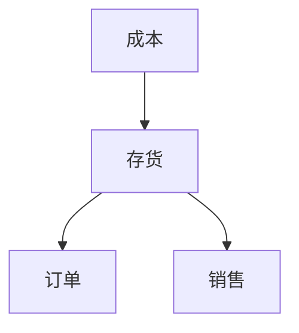
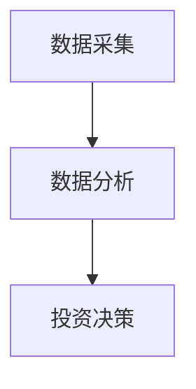
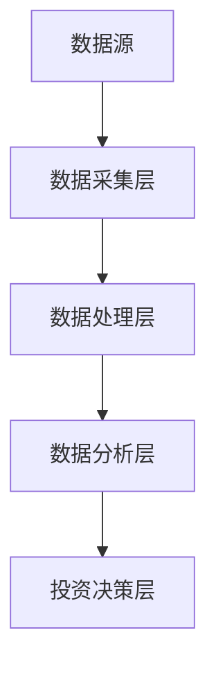

                 


# 彼得林奇对公司存货周转率变化的深度分析

## 关键词：存货周转率，彼得林奇，投资分析，财务指标，库存管理

## 摘要：本文深入分析了彼得林奇对公司存货周转率变化的关注及其在投资决策中的重要性。通过存货周转率的核心概念、数学模型、行业对比和实际案例分析，揭示了该指标在评估企业财务健康和投资价值中的关键作用。文章还结合了系统分析和项目实战，为投资者提供了实用的分析框架和最佳实践。

---

# 第1章: 存货周转率的背景与重要性

## 1.1 存货周转率的定义与核心概念

### 1.1.1 存货周转率的定义
存货周转率是衡量企业库存管理效率和资金使用效率的关键财务指标，表示企业在一定时期内将存货转化为销售收入的能力。其公式为：
$$ \text{存货周转率} = \frac{\text{营业成本}}{\text{平均存货}} $$

### 1.1.2 存货周转率的核心要素
存货周转率涉及的核心要素包括：
1. **营业成本**：企业在销售过程中发生的直接成本。
2. **平均存货**：企业在一定时期内的平均库存价值。
3. **库存管理策略**：影响存货周转率的关键因素，包括库存控制、订单管理和销售策略。

### 1.1.3 存货周转率的行业背景
存货周转率在不同行业中的表现差异显著，例如零售业和制造业的存货周转率标准不同。行业背景分析是理解存货周转率的重要基础。

## 1.2 存货周转率的重要性

### 1.2.1 存货周转率对企业财务健康的影响
- 高存货周转率表明企业库存管理效率高，资金占用少，财务健康。
- 低存货周转率可能导致库存积压，资金占用多，影响企业流动性。

### 1.2.2 存货周转率与企业盈利能力的关系
存货周转率与企业盈利能力密切相关。高周转率通常意味着企业能够更快地将库存转化为现金，提升净利润率。

### 1.2.3 存货周转率在投资分析中的作用
存货周转率是投资者评估企业运营效率和投资价值的重要指标，常用于筛选潜在投资目标。

## 1.3 彼得林奇与存货周转率的关联

### 1.3.1 彼得林奇的投资理念概述
彼得林奇以基本面分析和长期投资著称，注重企业财务健康和管理层能力。

### 1.3.2 存货周转率在彼得林奇选股中的地位
存货周转率是彼得林奇选股的重要指标之一，用于评估企业的运营效率和财务健康。

### 1.3.3 彼得林奇对存货周转率变化的关注点
彼得林奇关注存货周转率的变化趋势，认为持续改善的存货周转率是企业运营改善的信号。

---

# 第2章: 存货周转率的核心概念与联系

## 2.1 存货周转率的数学模型与公式

### 2.1.1 存货周转率的计算公式
$$ \text{存货周转率} = \frac{\text{营业成本}}{\text{平均存货}} $$

### 2.1.2 存货周转率的其他相关公式
- 存货周转天数：$$ \text{存货周转天数} = \frac{365 \text{天}}{\text{存货周转率}} $$
- 存货持有成本：$$ \text{持有成本} = \text{平均存货} \times \text{持有成本率} $$

### 2.1.3 存货周转率与库存管理的关系
存货周转率是库存管理效率的直接体现，高周转率表明库存管理良好，资金利用效率高。

## 2.2 存货周转率的核心要素对比

### 2.2.1 存货周转率与库存周转天数的对比
- 存货周转率反映库存周转速度，周转天数则是时间维度的体现。

### 2.2.2 存货周转率与销售成本的对比
- 存货周转率与销售成本相关，但后者是成本的具体体现，存货周转率是效率指标。

### 2.2.3 存货周转率与库存持有成本的对比
- 存货周转率影响持有成本，高周转率通常降低持有成本。

## 2.3 实体关系图（ER图）与存货周转率的关系

### 2.3.1 存货周转率的ER图架构


---

# 第3章: 彼得林奇分析存货周转率的理论框架

## 3.1 彼得林奇的存货周转率分析方法

### 3.1.1 彼得林奇的存货周转率分析框架
- 通过存货周转率评估企业库存管理效率。
- 结合行业标准和企业历史数据，分析存货周转率的变化趋势。

### 3.1.2 彼得林奇的存货周转率选股标准
- 选择存货周转率持续改善的企业。
- 避免存货周转率持续下降的企业。

### 3.1.3 存货周转率与其他财务指标的结合
- 结合净利润率、毛利率等指标，全面评估企业财务健康。

## 3.2 存货周转率变化的行业对比分析

### 3.2.1 不同行业存货周转率的对比
- 制造业：较高周转率，库存管理严格。
- 零售业：较高周转率，依赖销售策略。

### 3.2.2 行业标准存货周转率的确定
- 根据行业特点和竞争环境，确定存货周转率的合理范围。

## 3.3 存货周转率变化对投资决策的影响

### 3.3.1 存货周转率变化的信号意义
- 持续增长：企业运营效率提升。
- 持续下降：库存积压，资金占用增加。

### 3.3.2 存货周转率变化的投资策略
- 买入低估值高增长企业：关注存货周转率持续改善的企业。
- 卖出高估值低增长企业：避免存货周转率持续下降的企业。

---

# 第4章: 存货周转率变化的数学模型与算法原理

## 4.1 存货周转率变化的数学模型

### 4.1.1 存货周转率变化的计算公式
$$ \Delta \text{存货周转率} = \text{当前存货周转率} - \text{前期存货周转率} $$

### 4.1.2 存货周转率变化的驱动因素
- 营业成本变化。
- 平均存货变化。

## 4.2 存货周转率变化的算法原理

### 4.2.1 算法流程
1. 收集企业历史存货数据。
2. 计算存货周转率。
3. 分析存货周转率的变化趋势。
4. 结合行业标准和企业基本面，评估存货周转率变化的影响。

### 4.2.2 算法实现
```python
def calculate_inventory_turnover(cost_of_goods_sold, average_inventory):
    return cost_of_goods_sold / average_inventory

def analyze_turnover_trend(turnover_history):
    trends = []
    for i in range(1, len(turnover_history)):
        trends.append(turnover_history[i] - turnover_history[i-1])
    return trends
```

---

# 第5章: 系统分析与架构设计

## 5.1 系统功能设计

### 5.1.1 系统功能模块
- 数据采集模块：收集企业财务数据。
- 数据分析模块：计算存货周转率，分析趋势。
- 投资决策模块：基于分析结果，生成投资建议。

### 5.1.2 功能流程图


## 5.2 系统架构设计

### 5.2.1 系统架构图


---

# 第6章: 项目实战与案例分析

## 6.1 项目环境安装

### 6.1.1 环境要求
- Python 3.8+
- 数据分析库（Pandas, NumPy）

## 6.2 核心代码实现

### 6.2.1 存货周转率计算代码
```python
import pandas as pd

def calculate_inventory_turnover(df):
    cost_of_goods_sold = df['营业成本'].sum()
    average_inventory = (df['存货'].iloc[0] + df['存货'].iloc[-1]) / 2
    return cost_of_goods_sold / average_inventory
```

## 6.3 案例分析

### 6.3.1 案例背景
分析某制造企业的存货周转率变化，评估其财务健康。

### 6.3.2 数据分析与结果解读
- 计算存货周转率。
- 分析周转率变化趋势。

---

# 第7章: 总结与最佳实践

## 7.1 总结

### 7.1.1 彼得林奇分析框架的总结
存货周转率是评估企业运营效率的重要指标，彼得林奇通过分析存货周转率变化，筛选出具有投资价值的企业。

## 7.2 最佳实践

### 7.2.1 投资策略建议
- 定期跟踪企业存货周转率变化。
- 结合其他财务指标，全面评估企业投资价值。

### 7.2.2 数据分析建议
- 使用系统工具，自动化分析存货周转率。
- 结合行业标准，制定合理的分析框架。

## 7.3 注意事项

### 7.3.1 分析存货周转率时的注意事项
- 考虑行业差异。
- 结合企业基本面分析。

### 7.3.2 投资决策中的注意事项
- 避免单一指标决策。
- 考虑宏观经济环境影响。

---

# 附录

## 附录A: 数据来源与工具推荐

### A.1 数据来源
- 公司财务报表。
- 行业研究报告。

### A.2 工具推荐
- Python：数据分析。
- Excel：基础分析。

## 附录B: 进一步阅读与学习

### B.1 推荐书籍
- 《彼得林奇选股术》。
- 《财务报表分析》。

### B.2 在线资源
- 彼得林奇投资理念的在线课程。
- 财务分析的在线资源。

---

通过以上结构，文章详细分析了存货周转率的核心概念、彼得林奇的分析方法、数学模型和系统设计，并结合实际案例进行分析，为投资者提供了实用的分析框架和最佳实践。

