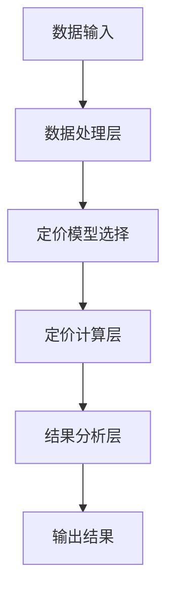
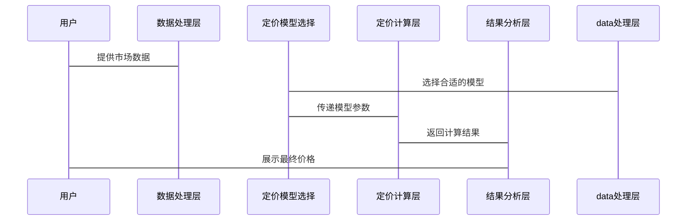

                 


# 彼得林奇对公司定价能力的评估标准

## 关键词：定价能力，彼得林奇，定价模型，市场定位，定价策略，投资评估

## 摘要：彼得·林奇是全球著名投资家，他提出的定价能力评估标准为公司估值提供了重要参考。本文从定价能力的定义、核心要素、评估标准、数学模型、系统设计和实际案例等方面，详细分析了彼得林奇的定价能力评估方法，并通过实际案例展示了其应用，最后总结了定价能力在投资决策中的重要性。

---

## 第一部分：背景介绍

### 第1章：定价能力的基本概念

#### 1.1 定价能力的定义

- **定价能力的内涵**：定价能力是指公司根据市场需求、成本结构和竞争环境，制定合理价格以实现利润最大化的技能。
- **定价能力的外延**：包括定价策略的选择、定价模型的设计和市场反应的分析。
- **定价能力的核心要素**：成本、市场需求、竞争环境、定价目标。

#### 1.2 彼得林奇的定价能力评估方法

- **评估定价能力的重要性**：定价能力直接影响公司的盈利能力，是投资评估的重要指标。
- **彼得林奇的评估标准**：包括成本加成、市场定位和竞争分析。
- **评估定价能力的边界与外延**：考虑公司规模、行业特点和市场环境。

### 第2章：定价能力的核心要素

#### 2.1 定价模型

- **成本加成定价法**：基于成本制定价格，确保合理利润。
- **价值定价法**：基于产品或服务的价值，而非成本。
- **市场导向定价法**：根据市场需求和竞争情况定价。

#### 2.2 市场定位

- **目标市场选择**：明确目标客户群体，制定针对性定价策略。
- **市场定位策略**：通过定价提升品牌形象和市场地位。
- **定价与市场定位的关系**：定价影响市场定位，市场定位影响定价策略。

#### 2.3 竞争分析

- **竞争对手的定价策略**：分析竞争对手的价格，制定差异化策略。
- **市场占有率分析**：通过定价调整市场份额。
- **竞争优势的定价策略**：利用成本优势或差异化优势制定价格。

### 第3章：定价能力的核心概念对比分析

#### 3.1 定价模型对比

| 定价模型 | 定价基础 | 优点 | 缺点 |
|----------|----------|------|------|
| 成本加成 | 成本     | 简单易行 | 忽视市场需求 |
| 价值定价 | 产品价值 | 反映真实价值 | 需准确评估价值 |
| 市场导向 | 市场需求 | 灵活应对市场 | 受竞争影响大 |

#### 3.2 定价策略对比

| 定价策略 | 特点 | 适用场景 | 示例 |
|----------|------|----------|------|
| 市场渗透 | 低价吸引客户 | 新市场进入 | 手机行业 |
| 市场开发 | 高价拓展市场 | 高端市场 | 名牌奢侈品 |

---

## 第二部分：定价能力的评估标准

### 第4章：定价能力的评估标准

#### 4.1 财务指标

- **利润率**：衡量定价是否合理。
- **投资回报率**：评估定价对投资的影响。
- **价格敏感性分析**：确定价格变化对销量的影响。

#### 4.2 非财务指标

- **市场反应**：客户对价格的接受程度。
- **客户满意度**：价格是否合理影响客户满意度。
- **市场份额变化**：定价策略对市场份额的影响。

### 第5章：定价能力的数学模型与公式

#### 5.1 成本加成定价法

- **公式**：$P = C + C \times k$，其中$C$是成本，$k$是加成率。
- **示例**：成本100，加成率20%，则价格为120。

#### 5.2 价值定价法

- **公式**：$P = V - C$，其中$V$是产品价值，$C$是成本。
- **示例**：价值200，成本100，则价格为100。

---

## 第三部分：定价能力的系统分析与架构设计

### 第6章：定价

#### 6.1 问题场景介绍

- **项目介绍**：某公司计划推出新产品，需制定定价策略。
- **系统功能设计**：
  - 数据收集：市场数据、成本数据。
  - 定价模型选择：根据数据选择合适的模型。
  - 模型计算：使用选定模型计算价格。
  - 结果分析：评估价格的合理性和市场反应。

#### 6.2 系统架构设计



#### 6.3 系统接口设计

- **数据接口**：数据处理层与数据源的接口。
- **定价接口**：定价模型选择与计算层的接口。
- **结果接口**：结果分析层与用户的接口。

#### 6.4 系统交互设计



---

## 第四部分：项目实战

### 第7章：定价

#### 7.1 环境安装

- **工具安装**：安装Python、Pandas、Matplotlib。
- **数据准备**：收集成本、市场需求、竞争数据。

#### 7.2 核心实现源代码

```python
import pandas as pd
import matplotlib.pyplot as plt

def cost_based_pricing(cost, markup):
    return cost * (1 + markup)

def value_based_pricing(value, cost):
    return value - cost

# 示例数据
cost = 100
markup = 0.2
value = 200

price_cost = cost_based_pricing(cost, markup)
price_value = value_based_pricing(value, cost)

print(f"成本加成定价：{price_cost}")
print(f"价值定价：{price_value}")

# 可视化
data = {'定价方法': ['成本加成', '价值定价'], '价格': [price_cost, price_value]}
df = pd.DataFrame(data)
df.plot(kind='bar', x='定价方法', y='价格')
plt.show()
```

#### 7.3 案例分析

- **案例背景**：某电子产品公司推出新手机。
- **定价策略**：选择成本加成定价法，成本1000，加成率20%，定价1200。
- **市场反应**：销量稳定，利润增加。
- **案例小结**：定价策略成功，需持续监控市场变化。

#### 7.4 项目小结

- **成功经验**：选择合适的定价模型，定期监控市场反应。
- **失败教训**：忽视市场变化可能导致定价不合理。
- **改进建议**：结合多种定价策略，灵活应对市场变化。

---

## 第五部分：总结与最佳实践

### 第8章：总结

- **定价能力的重要性**：定价能力直接影响公司利润和市场地位。
- **彼得林奇的评估方法**：提供了一套科学的评估标准。
- **实际应用价值**：帮助投资者和公司制定合理的定价策略。

### 第9章：最佳实践 tips

- **定期监控市场**：及时调整定价策略。
- **结合多种方法**：根据市场变化灵活调整。
- **注重成本控制**：降低成本可提高利润率。
- **关注客户反馈**：通过反馈优化定价策略。

---

## 第六部分：扩展阅读

- **相关书籍**：《彼得·林奇的投资智慧》。
- **在线资源**：投资网站、博客和论坛。
- **工具推荐**：数据分析工具如Excel、Python库如Pandas。

---

通过以上步骤，我系统地分析了彼得林奇的定价能力评估标准，从理论到实践，结合实际案例，帮助读者全面理解定价能力的重要性及其应用。

