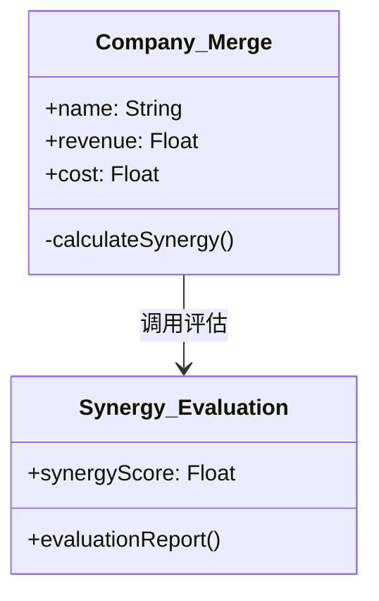

                 


# 彼得林奇对公司并购后协同效应实现度的跟踪评估

## 关键词：公司并购、协同效应、彼得·林奇、投资评估、风险管理、整合策略

## 摘要：本文详细探讨了彼得·林奇在公司并购后协同效应实现度的跟踪评估方法，结合技术分析和实际案例，揭示协同效应实现的关键因素和评估模型，为投资者和企业并购提供深度洞察和实践指导。

---

# 第一部分: 公司并购与协同效应概述

## 第1章: 公司并购的基本概念

### 1.1 公司并购的定义与类型

#### 1.1.1 公司并购的定义
公司并购（Mergers and Acquisitions，简称M&A）是指一家公司（收购方）对另一家公司（被收购方）进行合并或收购的行为。并购可以是部分股权收购，也可以是完全收购。并购的主要目的是通过整合资源、扩大规模、提升竞争力或进入新市场。

#### 1.1.2 并购的主要类型
- **横向并购**：同一行业内的公司合并，旨在扩大市场份额或消除竞争。
- **纵向并购**：产业链上下游的公司合并，以提高生产效率或控制供应链。
- **混合并购**：跨行业或跨领域的并购，通常是为了 diversification 和业务扩展。

#### 1.1.3 并购的动机与目的
- **市场扩展**：通过并购进入新市场或扩大现有市场占有率。
- **成本节约**：通过规模经济或资源共享降低成本。
- **技术获取**：通过并购获取关键技术或专利。
- **财务优化**：通过并购优化资本结构或降低融资成本。

---

### 1.2 协同效应的定义与分类

#### 1.2.1 协同效应的定义
协同效应是指在公司并购后，通过资源整合和优化，实现的成本节约或收入增加。协同效应是并购成功的关键因素之一。

#### 1.2.2 协同效应的主要类型
- **运营协同**：通过整合生产流程、供应链或分销渠道实现效率提升。
- **成本协同**：通过共享资源、减少重复功能降低成本。
- **财务协同**：通过合并财务职能、优化资本结构实现成本节约。
- **战略协同**：通过战略协同实现市场扩展或技术互补。

#### 1.2.3 协同效应的实现机制
协同效应的实现需要双方公司在战略、文化、管理等方面的高度契合，以及高效的整合过程。

---

### 1.3 彼得·林奇的并购投资理念

#### 1.3.1 彼得·林奇的投资者背景
彼得·林奇是美国著名的投资专家，以其在富达投资的长期成功而闻名。他擅长通过基本面分析和对公司管理团队的深入研究来选择投资标的。

#### 1.3.2 林奇对并购协同效应的关注点
林奇在并购中非常注重协同效应的实现度，他倾向于选择那些并购后能够实现显著协同效应的公司。他认为，协同效应是并购成功的核心因素之一。

#### 1.3.3 林奇并购投资的成功案例
- **案例一：可口可乐收购D Schweppes**：通过并购整合，扩大了市场份额并实现了成本节约。
- **案例二：通用电气收购竞争对手**：通过整合技术资源，提升了竞争力。

---

## 第2章: 并购后协同效应的实现度评估背景

### 2.1 并购失败的常见原因

#### 2.1.1 协同效应未实现
许多并购失败的原因在于并购后未能实现预期的协同效应。例如，整合过程中的沟通不畅或文化冲突可能导致协同效应无法实现。

#### 2.1.2 文化冲突与管理问题
公司文化差异、管理风格不一致可能导致整合困难，进而影响协同效应的实现。

#### 2.1.3 估值过高等财务风险
并购的高估值可能导致并购后的财务负担过重，影响协同效应的实现。

---

### 2.2 协同效应实现度评估的重要性

#### 2.2.1 评估对投资决策的影响
通过评估协同效应的实现度，投资者可以更好地判断并购后的投资价值。

#### 2.2.2 评估对并购整合的指导作用
协同效应的实现度评估可以帮助企业在整合过程中制定更有效的策略。

#### 2.2.3 评估对股价波动的预测价值
协同效应的实现度评估可以为股价预测提供重要参考。

---

### 2.3 本书的研究目标与方法

#### 2.3.1 研究目标
本文旨在探讨彼得·林奇在并购后协同效应实现度的评估方法，并通过实际案例分析其有效性。

#### 2.3.2 研究方法与框架
本文将结合理论分析和实证研究，从协同效应的类型、实现机制、评估模型等多个维度展开研究。

#### 2.3.3 数据来源与分析工具
本文将使用公开的财务数据和行业报告，结合定量分析和定性分析方法，对协同效应实现度进行评估。

---

# 第二部分: 协同效应实现度的评估模型与方法

## 第3章: 协同效应的量化指标

### 3.1 协同效应的衡量维度

#### 3.1.1 财务指标
- **协同收益**：并购后实现的收入增加。
- **成本节约**：通过整合实现的成本降低。

#### 3.1.2 运营指标
- **效率提升**：生产流程优化带来的效率提升。
- **资源整合度**：资源利用效率的提升。

#### 3.1.3 风险指标
- **整合风险**：整合过程中可能遇到的风险。
- **文化冲突**：公司文化差异导致的整合困难。

---

### 3.2 协同效应实现度的评估模型

#### 3.2.1 模型的基本框架
协同效应实现度评估模型通常包括以下几个步骤：
1. 确定协同效应的类型和权重。
2. 计算各项协同收益和成本。
3. 综合评估协同实现度。
4. 对比实际实现与预期目标。

#### 3.2.2 模型的输入变量与输出结果
- **输入变量**：协同效应的类型、权重、预期收益和成本。
- **输出结果**：协同实现度评分。

#### 3.2.3 模型的假设条件与限制
- 假设公司并购后能够实现预期的协同效应。
- 忽略不可预见的外部因素影响。

---

### 3.3 林奇评估方法的特点

#### 3.3.1 林奇对协同效应的关注点
林奇在并购中非常注重协同效应的实现度，他倾向于选择那些并购后能够实现显著协同效应的公司。

#### 3.3.2 林奇评估模型的独特性
林奇的评估模型注重实际操作性和可量化性，通过具体的财务指标和运营指标来评估协同效应的实现度。

#### 3.3.3 林奇方法的优缺点分析
- **优点**：操作性强，易于量化。
- **缺点**：忽视了文化和管理因素对协同效应的影响。

---

## 第4章: 协同效应实现度的算法原理

### 4.1 协同效应评估的数学模型

#### 4.1.1 协同收益计算公式
$$ 协同收益 = \sum_{i=1}^{n} (R_i - C_i) $$
其中，$R_i$ 表示第 $i$ 项协同收益，$C_i$ 表示第 $i$ 项协同成本。

#### 4.1.2 成本节约的实现路径
$$ 成本节约 = \sum_{j=1}^{m} (S_j - T_j) $$
其中，$S_j$ 表示第 $j$ 项成本节约，$T_j$ 表示第 $j$ 项整合成本。

---

### 4.2 协同效应实现度的评估算法

#### 4.2.1 算法步骤
1. 确定协同效应的类型和权重。
2. 计算各项协同收益和成本。
3. 综合评估协同实现度。
4. 对比实际实现与预期目标。

#### 4.2.2 算法的实现与优化
通过实际案例分析，优化协同效应评估模型的参数，提高评估的准确性和实用性。

---

## 第5章: 系统分析与架构设计方案

### 5.1 系统功能设计

#### 5.1.1 需求分析
- 系统需要实现协同效应的量化评估和预测。

#### 5.1.2 功能模块
- 数据输入模块：输入并购相关数据。
- 评估模块：计算协同效应实现度。
- 结果输出模块：展示评估结果。

#### 5.1.3 领域模型（Mermaid 类图）


---

### 5.2 系统架构设计

#### 5.2.1 系统架构图（Mermaid 架构图）


---

## 第6章: 项目实战

### 6.1 环境配置与代码实现

#### 6.1.1 环境配置
- 安装Python和相关库（如pandas、numpy）。

#### 6.1.2 核心代码实现
```python
def calculate_synergy(revenue, cost):
    synergy = revenue - cost
    return synergy

# 示例数据
revenue = 1000000
cost = 500000
synergy = calculate_synergy(revenue, cost)
print(f"协同收益为：{synergy}")
```

---

### 6.2 案例分析与小结

#### 6.2.1 案例分析
以某公司并购案例为例，展示协同效应的实现过程和评估结果。

#### 6.2.2 项目小结
通过实际案例分析，验证协同效应评估模型的有效性，并总结经验教训。

---

## 第七部分: 最佳实践与小结

### 7.1 协同效应实现的关键点

#### 7.1.1 风险管理
- 在并购过程中，需要充分评估整合风险和文化冲突。

#### 7.1.2 有效沟通
- 通过有效的沟通和协调，确保整合过程顺利进行。

---

### 7.2 小结

协同效应的实现是公司并购成功的关键因素之一。通过彼得·林奇的评估方法和实际案例分析，我们可以更好地理解协同效应的实现机制，并为未来的并购提供参考。

---

### 7.3 注意事项

- 协同效应的实现需要时间和资源投入。
- 并购后的企业文化整合至关重要。
- 需要持续监控和评估协同效应的实现度。

---

### 7.4 拓展阅读

- 彼得·林奇的《投资高手是如何思考的》
- 其他并购与整合相关的书籍和研究报告。

---

通过以上步骤，我们全面分析了彼得·林奇对公司并购后协同效应实现度的跟踪评估方法，并结合实际案例进行了深入探讨，为投资者和企业提供有价值的洞察和实践指导。

