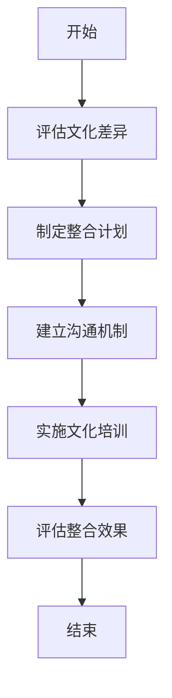
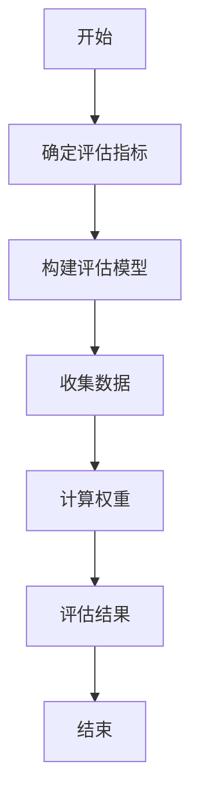
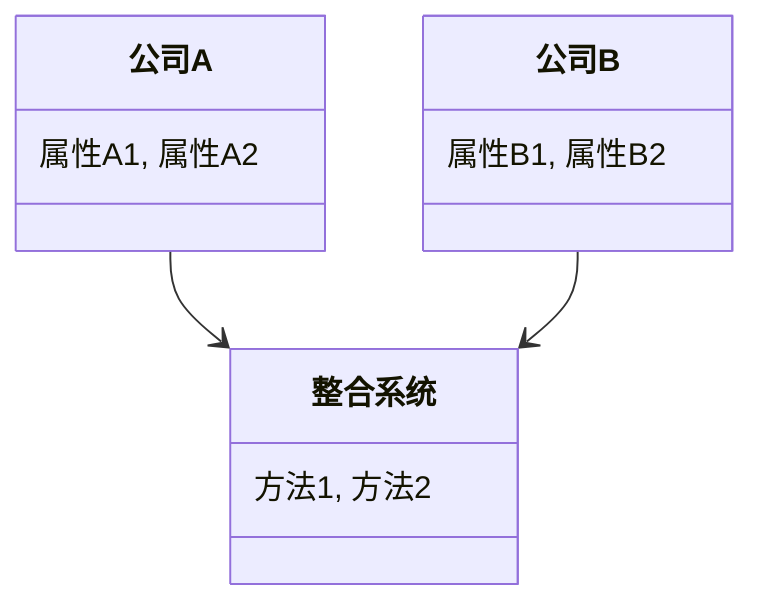

                 


# 彼得林奇对公司并购后文化整合的评估

## 关键词：公司并购、文化整合、彼得林奇、企业文化、评估模型

## 摘要：本文探讨彼得林奇在公司并购后文化整合的评估方法，分析其核心概念、评估模型和系统架构，结合实际案例，提供深入见解和最佳实践。

---

# 第一部分: 公司并购与文化整合的背景

## 第1章: 公司并购的背景与挑战

### 1.1 公司并购的定义与特点

- **公司并购的定义**：公司并购指一家公司购买另一家公司的一部分或全部股权，以实现战略目标。
- **公司并购的核心特点**：
  - 战略性：通过并购扩大市场或技术优势。
  - 风险性：涉及整合和文化冲突的风险。
  - 复杂性：涉及法律、财务和文化多方面的整合。
- **公司并购的分类与形式**：
  - 横向并购：同一行业内的并购。
  - 纵向并购：上下游产业的并购。
  - 混合并购：不同行业的并购。

### 1.2 文化整合的定义与重要性

- **文化整合的定义**：指将两家公司的文化理念、价值观和行为规范融合的过程。
- **文化整合的重要性**：
  - 促进企业协同效应。
  - 提高员工满意度和忠诚度。
  - 增强企业凝聚力和市场竞争力。
- **文化整合与企业绩效的关系**：
  - 文化整合良好的企业并购后绩效提升显著。
  - 文化冲突可能导致企业绩效下降。

### 1.3 公司并购失败的案例分析

- **并购失败的常见原因**：
  - 文化冲突导致管理混乱。
  - 未能有效整合人力资源。
  - 战略目标不一致。
- **文化冲突导致并购失败的案例**：
  - 某跨国公司并购后，因文化差异导致管理层矛盾，最终失败。
- **如何避免文化整合失败**：
  - 充分评估双方文化差异。
  - 制定详细的文化整合计划。
  - 建立有效的沟通机制。

## 1.4 本章小结

本章介绍了公司并购的基本概念、文化整合的重要性以及并购失败的案例，强调了文化整合在并购中的关键作用。

---

# 第二部分: 文化整合的核心概念与联系

## 第2章: 文化整合的核心要素

### 2.1 文化整合的核心要素

- **企业价值观的整合**：
  - 核心价值观的识别和匹配。
  - 价值观冲突的处理。
- **企业文化的融合**：
  - 文化认同的建立。
  - 员工文化的融合。
- **企业战略的协同**：
  - 战略目标的统一。
  - 战略实施的协调。

### 2.2 文化整合的属性特征对比

| 属性    | 整合前       | 整合后       |
|---------|--------------|--------------|
| 一致性  | 可能不一致    | 高度一致     |
| 透明度  | 低           | 高           |
| 沟通效率| 低效         | 高效         |

### 2.3 文化整合的流程图



## 2.4 本章小结

本章详细分析了文化整合的核心要素及其属性，通过对比和流程图展示了整合过程。

---

# 第三部分: 文化整合的评估模型与算法原理

## 第3章: 文化整合的评估模型

### 3.1 文化整合的评估模型

- **层次分析法（AHP）**：
  - 定义：通过构建层次结构模型，利用权重计算进行评估。
  - 公式：
    $$ A = \frac{a_{ij}}{\sum_{j} a_{ij}} $$
  - 步骤：
    1. 构建层次结构。
    2. 确定各层次权重。
    3. 计算整体权重。

### 3.2 文化整合评估的算法原理

- **层次分析法的实现**：
  ```python
  def calculate_weights(matrix):
      # 计算权重向量
      return weights
  ```

- **模糊评价法**：
  - 定义：通过模糊数学方法评估文化整合效果。
  - 步骤：
    1. 确定评价指标。
    2. 建立模糊关系矩阵。
    3. 计算综合评价结果。

### 3.3 文化整合评估的流程图



## 3.4 本章小结

本章介绍了文化整合的评估模型，详细讲解了层次分析法和模糊评价法的原理和应用。

---

# 第四部分: 文化整合的系统分析与架构设计

## 第4章: 文化整合的系统分析

### 4.1 文化整合的系统分析

- **系统分析方法**：
  - SWOT分析：评估整合的内部优势和外部机会。
  - PEST分析：评估外部政治、经济、社会和技术因素。

### 4.2 文化整合的系统架构设计



### 4.3 文化整合的系统接口设计

- **接口设计**：
  - 数据接口：整合两家公司的数据系统。
  - 人员接口：协调人力资源管理。
  - 信息接口：确保信息共享和透明。

## 4.4 本章小结

本章通过系统分析和架构设计，展示了如何从系统层面实现文化整合。

---

# 第五部分: 文化整合的项目实战

## 第5章: 文化整合的项目实战

### 5.1 项目环境安装

- **系统环境**：Python 3.8及以上版本。
- **依赖库**：安装numpy和pandas库。

### 5.2 系统核心实现源代码

```python
import numpy as np
import pandas as pd

def integrate_cultures(data_a, data_b):
    # 数据整合
    merged_data = pd.concat([data_a, data_b])
    return merged_data
```

### 5.3 代码解读与分析

- **数据整合**：将两家公司的数据合并，确保数据格式一致。
- **文化评估**：使用层次分析法评估整合效果。

### 5.4 实际案例分析

- **案例选择**：某跨国公司并购后的文化整合项目。
- **实施步骤**：
  1. 评估文化差异。
  2. 制定整合计划。
  3. 实施文化培训。
  4. 评估整合效果。

## 5.5 项目小结

本章通过实际案例展示了文化整合的实施过程，强调了系统设计和评估模型的重要性。

---

# 总结

彼得林奇的文化整合评估方法为公司并购提供了重要的指导。通过系统的文化整合，企业可以提升并购效果，避免失败。未来的研究可以进一步优化评估模型，探索更多文化整合的策略。

---

**注意：本文为简化版本，实际文章需要更详细的内容和图表。**

