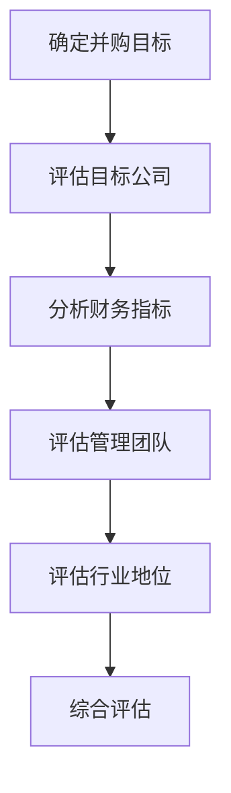
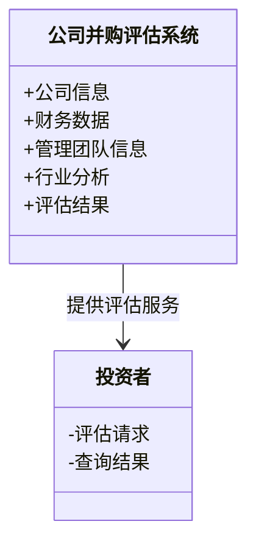

                 


# 彼得林奇对公司并购策略的评估标准

> 关键词：彼得·林奇，并购策略，评估标准，投资评估，企业价值

> 摘要：本文深入探讨了彼得·林奇在公司并购中的评估标准及其背后的逻辑。通过分析财务指标、管理团队、行业地位等关键因素，结合数学模型和实际案例，揭示了林奇并购策略的核心思想和实际应用。

---

## 第一部分：彼得·林奇对公司并购策略的背景介绍

### 第1章：公司并购的基本概念与重要性

#### 1.1 公司并购的定义与类型

- **1.1.1 公司并购的定义**  
  公司并购是指一家公司通过购买另一家公司的股权或资产，以实现战略目标的行为。并购可以是全资收购，也可以是部分收购。

- **1.1.2 并购的类型**  
  - 横向并购：同一行业内的竞争企业合并，旨在扩大市场份额。  
  - 纵向并购：供应链上下游企业合并，以增强垂直整合能力。  
  - 混合并购：不同行业或业务领域的企业合并，寻求多元化发展。

- **1.1.3 并购与企业发展的关系**  
  并购是企业增长的重要手段，能够快速进入新市场、获取技术或管理资源，但同时也伴随着整合风险。

#### 1.2 彼得·林奇与投资策略

- **1.2.1 彼得·林奇的背景介绍**  
  彼得·林奇是美国著名投资经理人，以其在富达投资的麦哲伦基金取得的卓越业绩闻名。他注重基本面分析，擅长挖掘被低估的投资机会。

- **1.2.2 林奇的投资风格与并购策略**  
  林奇的投资风格以价值投资为核心，注重企业的基本面和管理层能力。在并购中，他倾向于选择具有强大管理团队、良好财务状况和竞争优势的企业。

- **1.2.3 林奇并购策略的核心思想**  
  林奇认为，并购的关键在于识别具有可持续竞争优势的企业，并通过合理的估值确保投资的安全性。

### 第2章：并购的重要性和基本流程

#### 2.1 并购的重要性

- **2.1.1 并购对企业增长的推动作用**  
  并购能够快速扩大企业规模，进入新市场，获取新技术和新客户。

- **2.1.2 并购在资源整合中的作用**  
  通过并购，企业可以整合上下游资源，优化供应链，降低成本。

- **2.1.3 并购的风险与机会**  
  并购虽然潜力巨大，但也伴随着市场风险、整合风险和管理风险。

#### 2.2 并购的基本流程

- **2.2.1 确定并购目标**  
  根据企业发展战略，筛选出符合并购条件的目标企业。

- **2.2.2 评估目标公司**  
  通过财务分析、市场分析和管理团队评估，确定目标公司的价值。

- **2.2.3 并购谈判与尽职调查**  
  在谈判过程中，进行详细的尽职调查，确保目标公司的财务状况和法律问题无重大瑕疵。

- **2.2.4 并购后的整合与管理**  
  并购完成后，需进行业务、文化和团队的整合，确保并购效果的最大化。

---

## 第二部分：彼得·林奇的公司并购评估标准

### 第3章：林奇并购评估的核心概念与联系

#### 3.1 林奇并购评估的核心概念

- **3.1.1 企业价值评估的基本原理**  
  企业价值（EV）是衡量企业整体价值的重要指标，计算公式为：  
  $$EV = 市场价值 + 债务 - 现金 $$

- **3.1.2 林奇的估值方法**  
  林奇倾向于使用市盈率（P/E）和市净率（P/B）等指标来评估企业价值。  
  - 市盈率：$$P/E = \frac{股价}{每股收益}$$  
  - 市净率：$$P/B = \frac{股价}{每股净资产}$$

- **3.1.3 林奇对管理层能力的重视**  
  林奇认为，优秀的管理层是企业长期成功的关键，因此在评估中特别关注管理团队的稳定性、能力和战略眼光。

#### 3.2 核心概念对比分析

- **3.2.1 林奇评估标准与其他投资方法的对比**  
  | 方法       | 核心关注点                     |
  |------------|----------------------------|
  | 林奇       | 财务指标、管理团队、行业地位 |
  | 巴菲特      | 企业护城河、管理层诚信、安全边际 |

- **3.2.2 林奇标准与巴菲特投资理念的异同**  
  林奇与巴菲特都重视企业基本面和管理层能力，但林奇更注重短期估值和市场时机，而巴菲特更关注长期安全边际。

- **3.2.3 林奇标准在不同市场环境下的适用性**  
  在牛市中，林奇的标准可能更注重市盈率和市净率，而在熊市中，则更关注企业的基本面和现金流。

### 第4章：林奇并购评估标准的数学模型与公式

#### 4.1 核心评估指标

- **4.1.1 市盈率（P/E）的计算与应用**  
  $$P/E = \frac{股价}{每股收益}$$  
  示例：某公司股价为50元，每股收益为5元，则P/E=10。

- **4.1.2 市净率（P/B）的计算与应用**  
  $$P/B = \frac{股价}{每股净资产}$$  
  示例：某公司股价为30元，每股净资产为10元，则P/B=3。

- **4.1.3 自由现金流（FCF）的计算与应用**  
  自由现金流是衡量企业财务健康的重要指标，计算公式为：  
  $$FCF = 营业现金流入 - 营业现金流出$$

#### 4.2 用mermaid绘制评估流程图



---

## 第三部分：系统分析与架构设计

### 第5章：系统分析与架构设计方案

#### 5.1 问题场景介绍

- 系统目标：构建一个基于林奇评估标准的公司并购评估系统，帮助投资者快速评估目标公司。

#### 5.2 系统功能设计

- **领域模型（mermaid类图）**



#### 5.3 系统架构设计

- **系统架构图**


---

## 第四部分：项目实战

### 第6章：项目实战分析

#### 6.1 环境安装与系统实现

- **环境要求**：Python 3.8以上，安装必要的数据分析库（如Pandas、NumPy）。

#### 6.2 核心代码实现

```python
import pandas as pd

# 示例数据：目标公司财务数据
data = {
    '公司名称': ['公司A', '公司B'],
    '股价': [50, 40],
    '每股收益': [5, 4],
    '每股净资产': [10, 8],
    '自由现金流': [100, 80]
}

df = pd.DataFrame(data)

# 计算市盈率和市净率
df['市盈率'] = df['股价'] / df['每股收益']
df['市净率'] = df['股价'] / df['每股净资产']

print(df)
```

#### 6.3 案例分析与解读

- **案例：分析公司A和公司B的并购潜力**

  - 公司A的市盈率为10，市净率为5，自由现金流为100，表现优于公司B（市盈率10，市净率5，自由现金流80）。因此，公司A更具并购价值。

---

## 第五部分：最佳实践与总结

### 第7章：总结与最佳实践

#### 7.1 小结

- 彼得·林奇的并购评估标准以财务指标和管理层能力为核心，结合市场时机和企业价值，为投资者提供了系统化的评估方法。

#### 7.2 注意事项

- 并购评估需综合考虑市场环境、行业趋势和企业具体情况，避免单一指标的误导。

#### 7.3 拓展阅读

- 建议进一步阅读《彼得·林奇的成功投资》和《巴菲特的选股智慧》，深入了解两位投资大师的策略。

---

通过以上分析，我们可以看到彼得·林奇的并购评估标准不仅注重财务指标，还强调管理层能力和行业地位。结合实际案例和系统设计，投资者可以更好地应用这些标准，做出明智的并购决策。

