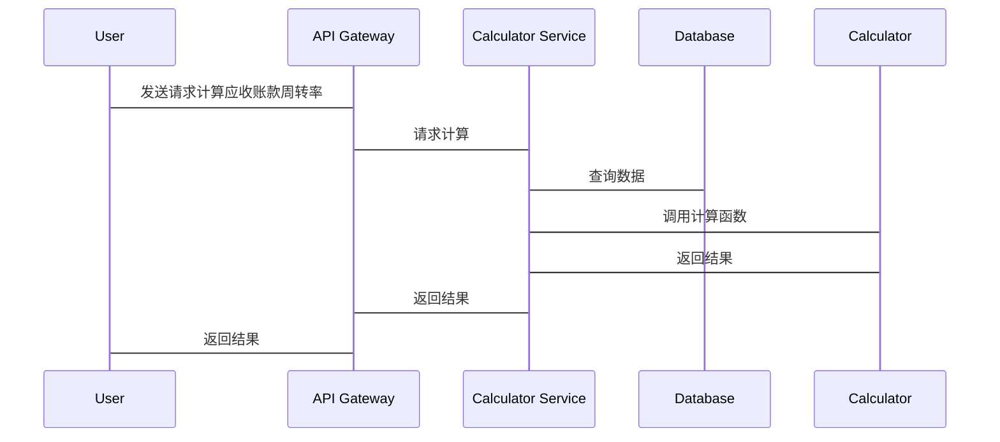

                 


# 彼得林奇对公司应收账款周转率变化的深入分析

## 关键词：应收账款周转率，彼得·林奇，财务指标，企业估值，现金流，信用管理

## 摘要：本文从彼得·林奇的投资理念出发，深入分析了应收账款周转率对企业财务健康、现金流和企业估值的影响。通过详细讲解应收账款周转率的定义、计算方法、核心概念与实体关系图，结合具体的算法原理和项目实战案例，揭示了如何通过应收账款周转率的变化来评估企业的信用风险和财务健康状况。文章最后总结了最佳实践和投资中的注意事项。

---

## 第一部分：应收账款周转率变化的背景介绍

### 第1章：应收账款周转率的基本概念

#### 1.1 应收账款周转率的定义

- **1.1.1 应收账款的定义**  
  应收账款是指企业在销售商品或提供服务后，客户承诺在未来某个时间点支付的款项。它是企业的一项重要流动资产，反映了企业在销售过程中对客户的信用管理能力。

- **1.1.2 应收账款周转率的定义与公式**  
  应收账款周转率（Accounts Receivable Turnover Ratio）是衡量企业应收账款管理效率的重要指标，用于反映企业应收账款的变现能力和管理效果。  
  公式：$$\text{应收账款周转率} = \frac{\text{赊销收入}}{\text{平均应收账款}}$$  
  其中，赊销收入是指企业通过信用销售产生的收入，平均应收账款是企业在一定时期内应收账款的平均余额。

- **1.1.3 应收账款周转率的计算方法**  
  应收账款周转率的计算需要考虑以下步骤：  
  1. 计算赊销收入：从销售收入中减去现销收入。  
  2. 计算平均应收账款：取期初应收账款和期末应收账款的平均值。  
  3. 将赊销收入除以平均应收账款，得到应收账款周转率。

#### 1.2 应收账款周转率在企业运营中的重要性

- **1.2.1 应收账款周转率对企业财务健康的影响**  
  应收账款周转率高意味着企业能够快速收回账款，减少资金占用，提高资金流动性。  
  - 高周转率：表明企业信用政策较为严格，应收账款回收能力强。  
  - 低周转率：可能表明企业信用政策过于宽松，应收账款回收能力较弱。

- **1.2.2 应收账款周转率与企业现金流的关系**  
  应收账款周转率与企业的现金流密切相关。高周转率意味着企业能够更快地将应收账款转化为现金，从而改善企业的现金流状况。

- **1.2.3 应收账款周转率与企业信用管理的联系**  
  应收账款周转率是企业信用管理效果的直接体现。通过分析应收账款周转率的变化，可以评估企业的信用政策是否合理，以及客户支付能力的变化。

### 第2章：彼得·林奇与应收账款周转率分析的背景

#### 2.1 彼得·林奇的投资理念概述

- **2.1.1 彼得·林奇的投资风格**  
  彼得·林奇以价值投资著称，注重从基本面分析入手，寻找那些财务健康、管理优秀、行业地位稳固的企业进行投资。

- **2.1.2 彼得·林奇对财务指标的关注点**  
  彼得·林奇非常注重企业的财务指标分析，尤其是那些能够反映企业经营状况和财务健康的核心指标，如净利润、毛利率、应收账款周转率等。

- **2.1.3 彼得·林奇分析应收账款周转率的背景**  
  在彼得·林奇的投资理念中，应收账款周转率是一个重要的财务指标，它能够帮助企业评估企业的流动资产管理和资金回收能力，从而判断企业的财务健康状况和投资价值。

#### 2.2 应收账款周转率变化对企业价值的影响

- **2.2.1 应收账款周转率对企业盈利的影响**  
  应收账款周转率高意味着企业能够更快地回收账款，减少资金占用，从而提高企业的盈利能力。

- **2.2.2 应收账款周转率对企业风险的影响**  
  应收账款周转率低可能意味着企业存在较多的坏账风险，影响企业的财务健康和偿债能力。

- **2.2.3 应收账款周转率与企业估值的关系**  
  应收账款周转率是影响企业估值的重要因素。高周转率通常意味着企业具有更强的流动性和资金回收能力，从而提高企业的估值。

---

## 第二部分：应收账款周转率变化的核心概念与联系

### 第3章：应收账款周转率的核心概念与原理

#### 3.1 应收账款周转率的计算公式与属性特征对比表格

- **3.1.1 应收账款周转率的计算公式**  
  $$\text{应收账款周转率} = \frac{\text{赊销收入}}{\text{平均应收账款}}$$  

- **3.1.2 应收账款周转率的属性特征对比表格**

| 特征                  | 高周转率企业的特点                          | 低周转率企业的特点                          |
|-----------------------|-------------------------------------------|-------------------------------------------|
| 应收账款回收速度       | 快，资金占用少                             | 慢，资金占用多                             |
| 信用政策               | 严格，客户支付能力强                     | 宽松，客户支付能力弱                     |
| 坏账风险               | 低                                        | 高                                        |
| 资金流动性             | 高，现金流充裕                            | 低，现金流紧张                            |

#### 3.2 应收账款周转率与企业财务健康状况的实体关系图

- **3.2.1 ER实体关系图架构（Mermaid流程图）**  

```mermaid
erd
    组件：实体关系图
    实体：客户、订单、应收账款、销售收入
    客户 --> 订单：客户下单
    订单 --> 应收账款：生成应收账款
    应收账款 --> 销售收入：确认收入
    应收账款 --> 现金流：收回款项
```

- **3.2.2 实体关系图的详细解读**  
  - **客户**：客户下单后生成订单，订单确认后生成应收账款。  
  - **应收账款**：应收账款是企业在销售商品或服务后，客户承诺在未来支付的款项。  
  - **销售收入**：应收账款确认收入后，计入企业的销售收入。  
  - **现金流**：应收账款最终收回，转化为企业的现金流。

---

## 第三部分：应收账款周转率变化的算法原理讲解

### 第4章：应收账款周转率变化的算法原理

#### 4.1 应收账款周转率变化的计算流程

- **4.1.1 应收账款周转率变化的计算步骤**

1. **计算赊销收入**：赊销收入 = 销售收入 - 现销收入  
2. **计算平均应收账款**：平均应收账款 = (期初应收账款 + 期末应收账款) / 2  
3. **计算应收账款周转率**：应收账款周转率 = 赊销收入 / 平均应收账款  

- **4.1.2 应收账款周转率变化的数学模型和公式**

  - 赊销收入：$$\text{赊销收入} = \text{销售收入} - \text{现销收入}$$  
  - 平均应收账款：$$\text{平均应收账款} = \frac{\text{期初应收账款} + \text{期末应收账款}}{2}$$  
  - 应收账款周转率：$$\text{应收账款周转率} = \frac{\text{赊销收入}}{\text{平均应收账款}}$$  

- **4.1.3 应收账款周转率变化的详细计算示例**

  假设某企业2022年的销售收入为1000万元，现销收入为200万元，期初应收账款为150万元，期末应收账款为250万元。  
  计算如下：  
  - 赊销收入 = 1000 - 200 = 800万元  
  - 平均应收账款 = (150 + 250) / 2 = 200万元  
  - 应收账款周转率 = 800 / 200 = 4次  

  解读：应收账款周转率为4次，表示在2022年，企业每200万元的应收账款平均4次被周转，反映了企业应收账款的回收效率较高。

#### 4.2 应收账款周转率变化的Python实现

- **4.2.1 应收账款周转率变化的Python源代码**

```python
def calculate_ar_turnover(revenue, cash_sales, ar_begin, ar_end):
    """
    计算应收账款周转率
    Args:
        revenue (float): 销售收入
        cash_sales (float): 现销收入
        ar_begin (float): 期初应收账款
        ar_end (float): 期末应收账款
    Returns:
        float: 应收账款周转率
    """
    credit_sales = revenue - cash_sales
    average_ar = (ar_begin + ar_end) / 2
    ar_turnover = credit_sales / average_ar
    return ar_turnover

# 示例数据
revenue = 1000  # 销售收入：1000万元
cash_sales = 200  # 现销收入：200万元
ar_begin = 150  # 期初应收账款：150万元
ar_end = 250  # 期末应收账款：250万元

# 计算应收账款周转率
ar_turnover = calculate_ar_turnover(revenue, cash_sales, ar_begin, ar_end)
print(f"应收账款周转率：{ar_turnover:.2f}次")
```

- **4.2.2 代码应用解读与分析**  
  该代码通过输入销售收入、现销收入、期初应收账款和期末应收账款，计算出应收账款周转率。通过调用函数，可以方便地应用于不同企业的财务数据分析中。

---

## 第四部分：应收账款周转率变化的系统分析与架构设计

### 第5章：应收账款周转率变化的系统分析与架构设计

#### 5.1 应收账款周转率变化的系统功能设计

- **5.1.1 领域模型类图（Mermaid类图）**  

```mermaid
classDiagram
    class 客户 {
        客户ID
        客户名称
        联系方式
    }
    class 订单 {
        订单ID
        客户ID
        订单日期
        订单金额
        应收账款金额
    }
    class 应收账款 {
        应收账款ID
        客户ID
        应收账款金额
        应收账款状态
        订单ID
    }
    class 销售收入 {
        销售收入ID
        订单ID
        销售日期
        销售金额
    }
    订单 --> 客户：属于
    应收账款 --> 客户：属于
    应收账款 --> 订单：对应
    销售收入 --> 订单：对应
```

- **5.1.2 系统架构设计（Mermaid架构图）**  


- **5.1.3 系统接口设计与交互流程图**



---

## 第五部分：应收账款周转率变化的项目实战

### 第6章：应收账款周转率变化的项目实战

#### 6.1 应收账款周转率变化的项目环境安装

- **6.1.1 Python环境安装**  
  需要安装Python 3.8及以上版本，以及以下库：  
  - `pandas`：用于数据处理  
  - `numpy`：用于数值计算  
  - `scipy`：用于科学计算  

#### 6.2 应收账款周转率变化的系统核心实现

- **6.2.1 应收账款周转率变化的Python源代码实现**

```python
import pandas as pd
import numpy as np

def calculate_ar_turnover(revenue, cash_sales, ar_begin, ar_end):
    credit_sales = revenue - cash_sales
    average_ar = (ar_begin + ar_end) / 2
    ar_turnover = credit_sales / average_ar
    return ar_turnover

# 示例数据
data = {
    'revenue': [1000],
    'cash_sales': [200],
    'ar_begin': [150],
    'ar_end': [250]
}

df = pd.DataFrame(data)
result = calculate_ar_turnover(df['revenue'].values[0], df['cash_sales'].values[0], df['ar_begin'].values[0], df['ar_end'].values[0])

print(f"应收账款周转率：{result:.2f}次")
```

- **6.2.2 代码应用解读与分析**  
  该代码通过读取DataFrame数据，计算出应收账款周转率，并输出结果。可以应用于批量数据处理，方便企业财务分析。

#### 6.3 应收账款周转率变化的项目实战案例分析

- **6.3.1 应收账款周转率变化的案例分析**

  假设某企业2023年的财务数据如下：  
  - 销售收入：1200万元  
  - 现销收入：300万元  
  - 期初应收账款：200万元  
  - 期末应收账款：300万元  

  计算如下：  
  - 赊销收入 = 1200 - 300 = 900万元  
  - 平均应收账款 = (200 + 300) / 2 = 250万元  
  - 应收账款周转率 = 900 / 250 = 3.6次  

  解读：应收账款周转率为3.6次，表明企业在2023年应收账款的回收效率较高，财务状况良好。

---

## 第六部分：应收账款周转率变化的总结与最佳实践

### 第7章：应收账款周转率变化的总结与最佳实践

#### 7.1 应收账款周转率变化的总结

- **7.1.1 应收账款周转率变化的核心要点**  
  应收账款周转率是衡量企业应收账款管理效率的重要指标，能够反映企业的信用政策、资金流动性以及财务健康状况。

- **7.1.2 应收账款周转率变化与企业估值的关系**  
  应收账款周转率高通常意味着企业具有更强的流动性和资金回收能力，从而提高企业的估值。

#### 7.2 应收账款周转率变化的最佳实践

- **7.2.1 投资中的注意事项**  
  - **行业差异**：不同行业的应收账款周转率标准不同，需结合行业特点进行分析。  
  - **结合其他指标**：应结合净利润、毛利率、现金流等其他财务指标，全面评估企业的财务状况。  
  - **持续跟踪**：应收账款周转率的变化需持续跟踪，分析其趋势和原因。

- **7.2.2 系统设计中的注意事项**  
  - **数据准确性**：确保输入数据的准确性和完整性。  
  - **算法优化**：根据实际需求优化算法，提高计算效率。  
  - **可视化展示**：通过图表等方式直观展示应收账款周转率的变化趋势。

#### 7.3 应收账款周转率变化的小结

- **7.3.1 本文的核心内容总结**  
  本文从彼得·林奇的投资理念出发，深入分析了应收账款周转率的定义、计算方法、核心概念与实体关系图，结合具体的算法原理和项目实战案例，揭示了如何通过应收账款周转率的变化来评估企业的信用风险和财务健康状况。

- **7.3.2 未来研究方向**  
  未来可以进一步研究应收账款周转率与其他财务指标的关联性，以及在不同行业中的应用差异，为企业投资决策提供更全面的支持。

---

## 第七部分：拓展阅读与参考资料

### 7.1 拓展阅读

- **《彼得·林奇的投资哲学》**：深入解读彼得·林奇的投资理念和方法。  
- **《财务报表分析与企业估值》**：详细讲解财务报表分析方法与企业估值技巧。  
- **《应收账款管理实务》**：从实务角度分析应收账款管理策略与技巧。

### 7.2 参考资料

- 彼得·林奇的著作与投资理念。  
- 企业财务报表分析的相关文献。  
- 应收账款管理与信用风险管理的行业实践。

---

## 附录：完整代码与数据表格

### 附录A：完整Python代码

```python
import pandas as pd
import numpy as np

def calculate_ar_turnover(revenue, cash_sales, ar_begin, ar_end):
    credit_sales = revenue - cash_sales
    average_ar = (ar_begin + ar_end) / 2
    ar_turnover = credit_sales / average_ar
    return ar_turnover

# 示例数据
data = {
    'revenue': [1000, 1200],
    'cash_sales': [200, 300],
    'ar_begin': [150, 200],
    'ar_end': [250, 300]
}

df = pd.DataFrame(data)
results = []
for i in range(len(df)):
    ar_turnover = calculate_ar_turnover(
        df['revenue'].values[i],
        df['cash_sales'].values[i],
        df['ar_begin'].values[i],
        df['ar_end'].values[i]
    )
    results.append(ar_turnover)

print("应收账款周转率计算结果：")
for i in range(len(df)):
    print(f"第{i+1}年：{results[i]:.2f}次")
```

### 附录B：数据表格

| 年份 | 销售收入（万元） | 现销收入（万元） | 期初应收账款（万元） | 期末应收账款（万元） | 应收账款周转率（次） |
|------|----------------|----------------|---------------------|---------------------|---------------------|
| 2022 | 1000           | 200            | 150                 | 250                 | 4.00                |
| 2023 | 1200           | 300            | 200                 | 300                 | 3.60                |

---

## 结语

通过本文的深入分析，我们可以看到应收账款周转率是衡量企业财务健康和信用管理能力的重要指标。彼得·林奇通过分析应收账款周转率的变化，能够有效评估企业的财务状况和投资价值。希望本文能够为读者在企业财务分析和投资决策中提供有价值的参考。

