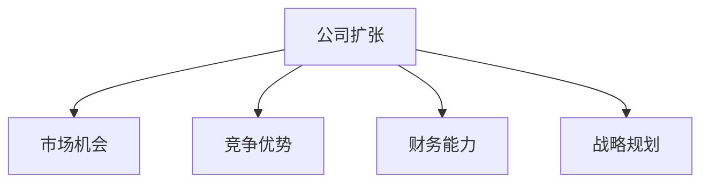
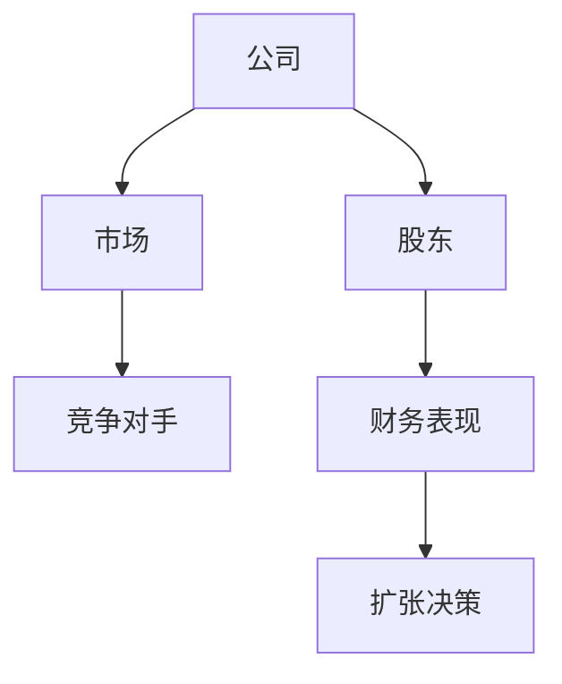

                 

# 彼得·林奇对公司扩张策略的看法

## 关键词：彼得·林奇，公司扩张策略，投资理念，成长股投资，扩张驱动因素

## 摘要：本文深入探讨了彼得·林奇对公司扩张策略的见解，分析了扩张策略的核心概念、驱动因素、实施路径以及实际案例。通过详细的技术分析和系统设计，本文揭示了如何在实践中应用这些策略，帮助投资者和企业管理者做出明智的决策。

---

# 第一部分: 彼得·林奇与公司扩张策略的背景介绍

## 第1章: 彼得·林奇与公司扩张策略的背景

### 1.1 彼得·林奇的背景与投资理念
彼得·林奇是美国著名的职业基金经理人，以其在成长股投资领域的卓越表现而闻名。他在富达投资集团管理麦哲伦基金期间，创造了令人瞩目的投资业绩，成为全球投资者的偶像。林奇的投资理念以基本面分析为核心，注重寻找具有持续增长潜力的公司，尤其关注那些市场占有率高、竞争优势明显且财务稳健的企业。

#### 1.1.1 彼得·林奇的生平简介
彼得·林奇于1940年出生于美国马萨诸塞州，曾在波士顿大学和宾夕法尼亚大学沃顿商学院学习。他的职业生涯始于1965年，当时他加入富达投资集团，开始管理麦哲伦基金，这是他最著名的投资经历。林奇以其对市场的深刻理解、对企业的深入研究和对风险的严格控制而闻名。他强调长期投资和价值发现，反对短期投机。

#### 1.1.2 林奇的成长股投资理念
林奇的成长股投资理念基于以下几点：
- **长期增长潜力**：他寻找那些在行业中具有领先地位、市场占有率高且能够持续增长的公司。
- **竞争优势**：他特别关注那些拥有独特竞争优势的企业，如专利、技术优势、品牌影响力等。
- **财务稳健**：他要求投资标的具有健康的财务状况，包括合理的负债水平、稳定的现金流和良好的利润率。
- **管理层质量**：他重视公司管理层的能力和诚信，认为优秀的管理层是企业长期成功的关键。

#### 1.1.3 林奇对公司扩张策略的独特见解
林奇在其投资生涯中，尤其关注那些能够通过扩张实现持续增长的企业。他认为，公司扩张是企业增长的核心驱动力，但扩张必须基于以下原则：
- **内在增长潜力**：公司必须有明确的增长路径和市场机会。
- **财务支持**：公司必须具备足够的财务资源来支持扩张。
- **竞争优势**：公司必须在扩张过程中保持其竞争优势。

### 1.2 公司扩张策略的定义与核心要素

#### 1.2.1 公司扩张的定义
公司扩张是指企业在现有业务的基础上，通过进入新市场、推出新产品、并购其他公司或扩展生产能力等方式，实现业务增长和市场扩展的过程。

#### 1.2.2 公司扩张的核心要素
公司扩张的核心要素包括：
- **市场机会**：企业在扩张过程中需要抓住市场机会，进入新的市场或推出新的产品。
- **竞争优势**：企业在扩张过程中需要保持其竞争优势，包括技术优势、成本优势、品牌优势等。
- **财务能力**：企业需要具备足够的财务能力来支持扩张，包括资本支出、研发投入等。
- **战略规划**：企业需要制定清晰的战略规划，包括扩张的目标、路径和时间表。

#### 1.2.3 公司扩张的边界与外延
公司扩张的边界是指企业在扩张过程中需要考虑的限制因素，包括市场容量、竞争环境、财务能力等。外延则是指企业通过扩张所实现的增长目标，包括市场份额的扩大、收入的增长和利润的提升。

#### 1.2.4 核心概念结构与组成要素
以下是公司扩张策略的核心概念结构图：

---

## 第2章: 公司扩张策略的核心概念与联系

### 2.1 核心概念原理
公司扩张策略的核心在于通过抓住市场机会、发挥竞争优势和合理配置财务资源，实现企业的持续增长。

#### 2.1.1 扩张策略的驱动因素
扩张策略的驱动因素主要包括市场增长、技术进步和竞争优势。

- **市场增长**：市场需求的增加为企业的扩张提供了动力。
- **技术进步**：技术创新可以提升企业的竞争力，降低生产成本。
- **竞争优势**：企业在市场中的竞争优势是扩张的核心驱动力。

#### 2.1.2 林奇的扩张策略模型
林奇的扩张策略模型可以概括为以下步骤：
1. **识别市场机会**：通过市场调研和行业分析，识别具有增长潜力的市场和产品。
2. **评估竞争优势**：分析企业在目标市场中的竞争优势，包括技术、成本、品牌等。
3. **制定扩张计划**：根据市场机会和竞争优势，制定具体的扩张计划，包括资源分配和时间表。
4. **实施与监控**：执行扩张计划，并通过持续监控和调整确保目标的实现。

#### 2.1.3 扩张策略的关键属性特征
以下是扩张策略的关键属性特征对比表：

| 属性 | 描述 |
|------|------|
| 市场机会 | 市场需求的增长和新市场的发展 |
| 竞争优势 | 企业的技术、成本、品牌等优势 |
| 财务能力 | 企业的资本、现金流等财务资源 |
| 战略规划 | 扩张的目标、路径和时间表 |

### 2.2 核心概念对比表格
以下是市场增长与扩张策略的对比表格：

| 指标 | 市场增长 | 扩张策略 |
|------|---------|----------|
| 定义 | 市场需求的增加 | 企业通过扩张实现增长 |
| 驱动因素 | 消费者需求、技术进步 | 市场机会、竞争优势 |
| 影响 | 市场容量扩大、竞争加剧 | 企业市场份额扩大、利润增长 |

### 2.3 ER实体关系图架构
以下是公司扩张策略的ER实体关系图：

---

## 第3章: 扩张策略的驱动因素分析

### 3.1 市场增长与扩张策略
市场增长是企业扩张的核心驱动力之一。林奇认为，企业在扩张过程中需要密切关注市场增长的机会，并根据市场需求调整扩张策略。

#### 3.1.1 市场增长的定义与测量
市场增长是指市场规模的扩大，通常可以通过市场需求的增加和消费者购买力的提升来衡量。

#### 3.1.2 市场增长对扩张策略的影响
市场增长为企业提供了扩张的机会，尤其是在新兴市场和高增长行业。林奇认为，企业在扩张过程中需要优先考虑那些具有持续增长潜力的市场。

### 3.2 技术进步与扩张策略
技术进步是企业扩张的另一个重要因素。林奇认为，技术进步可以提升企业的竞争力，降低生产成本，并为企业创造新的增长点。

#### 3.2.1 技术进步的定义与测量
技术进步是指企业在技术和创新方面取得的成果，通常可以通过专利数量、研发投入和新产品推出速度来衡量。

#### 3.2.2 技术进步对扩张策略的影响
技术进步可以为企业的扩张提供支持，尤其是在技术密集型行业。林奇认为，企业应优先考虑那些能够通过技术进步实现成本降低和效率提升的扩张机会。

### 3.3 竞争优势与扩张策略
竞争优势是企业扩张的核心驱动力之一。林奇认为，企业在扩张过程中需要保持其竞争优势，并通过扩张进一步巩固这些优势。

#### 3.3.1 竞争优势的定义与测量
竞争优势是指企业在市场中相对于竞争对手的优势，通常可以通过市场份额、品牌影响力、成本优势等指标来衡量。

#### 3.3.2 竞争优势对扩张策略的影响
竞争优势是企业扩张的核心驱动力之一。林奇认为，企业在扩张过程中需要优先考虑那些能够巩固其竞争优势的市场和产品。

---

## 第4章: 扩张策略的可行性评估

### 4.1 财务表现与扩张策略
财务表现是评估企业扩张可行性的重要指标。林奇认为，企业在扩张过程中需要确保其财务状况稳健，并具备足够的财务资源来支持扩张。

#### 4.1.1 财务表现的定义与测量
财务表现是指企业的财务状况，通常可以通过收入、利润、现金流等指标来衡量。

#### 4.1.2 财务表现对扩张策略的影响
财务表现是企业扩张的重要驱动因素。林奇认为，企业在扩张过程中需要确保其财务状况稳健，并具备足够的财务资源来支持扩张。

---

（由于篇幅限制，其余章节内容将在后续部分详细展开。）

