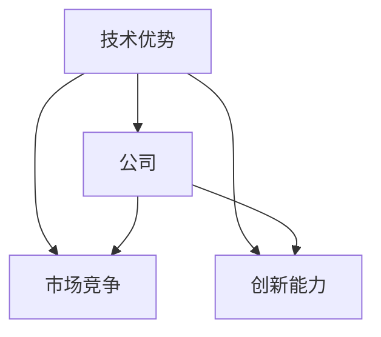

                 


# 彼得林奇对公司技术优势的评估方法

> 关键词：彼得林奇，公司技术优势，投资评估，技术分析，竞争优势

> 摘要：本文详细探讨了彼得林奇对公司技术优势的评估方法，从背景介绍、核心概念、算法原理、数学模型、系统分析到项目实战和最佳实践，全面解析了如何通过技术优势评估做出更明智的投资决策。

---

# 第1章: 彼得林奇与公司技术优势评估方法的背景

## 1.1 彼得林奇的背景与投资理念

### 1.1.1 彼得林奇的生平简介

彼得·林奇（Peter Lynch）是全球最著名的职业基金经理之一，被誉为“股市投资专家”。他于1977年加入富达投资集团，管理麦哲伦基金长达14年，期间取得了令人瞩目的投资业绩，年化回报率达到29%。林奇的成功不仅在于他的投资策略，更在于他对公司基本面的深刻理解和对公司技术优势的敏锐洞察。

### 1.1.2 彼得林奇的投资哲学

林奇的投资哲学以“价值投资”为核心，他强调通过深入分析公司的基本面和技术优势来选择投资标的。他认为，技术优势是公司长期竞争优势的核心来源。具体而言，技术优势包括公司在技术研发、创新能力和成本控制等方面的独特优势。

### 1.1.3 技术优势在投资中的重要性

技术优势是公司区别于竞争对手的关键因素。在技术驱动的行业中，技术优势往往决定着公司的市场份额和盈利能力。林奇认为，技术优势不仅能够提升公司的竞争力，还能在市场波动中为公司提供更强的抗风险能力。

---

## 1.2 公司技术优势的定义与分类

### 1.2.1 技术优势的定义

技术优势是指公司在技术研发、创新能力和技术应用方面相较于竞争对手的显著优势。这种优势可能体现在产品的技术含量、生产效率、成本控制或市场适应性等方面。

### 1.2.2 技术优势的分类

根据技术优势的核心要素，我们可以将其分为以下几类：
1. **技术创新型**：公司通过技术研发推出新产品或服务，具有较高的技术壁垒。
2. **成本节约型**：公司通过技术改进降低了生产成本，提升了利润率。
3. **市场适应型**：公司技术能够更好地满足市场需求，适应市场变化。

### 1.2.3 技术优势与竞争优势的关系

技术优势是竞争优势的核心来源之一。通过技术优势，公司可以在市场上占据领先地位，提高客户忠诚度，并在竞争中获得更大的市场份额。

---

## 1.3 技术优势评估方法的必要性

### 1.3.1 为什么需要评估公司技术优势

在投资决策中，评估公司技术优势可以帮助投资者识别具有长期发展潜力的公司。技术优势不仅影响公司的短期业绩，还决定了公司的长期成长空间。

### 1.3.2 技术优势评估的常见误区

许多投资者在评估技术优势时容易陷入以下误区：
1. **过于关注短期数据**：技术优势的评估需要结合长期数据，而不仅仅是短期表现。
2. **忽略技术壁垒**：技术优势不仅仅体现在技术本身，还体现在技术的可复制性和市场适应性。
3. **过度依赖主观判断**：技术优势的评估需要结合定量分析和定性分析。

### 1.3.3 评估方法的核心要素

为了准确评估公司技术优势，我们需要关注以下核心要素：
1. **技术创新能力**：公司是否能够持续推出新产品或改进现有产品。
2. **技术壁垒**：技术的可复制性和替代性。
3. **市场适应性**：技术是否能够满足市场需求并适应市场变化。

---

## 1.4 本章小结

本章通过介绍彼得林奇的背景和投资理念，详细阐述了技术优势在投资中的重要性。我们还对技术优势进行了分类，并指出了评估技术优势的必要性和常见误区。这些内容为后续的技术优势评估方法奠定了理论基础。

---

# 第2章: 技术优势评估的核心概念与联系

## 2.1 技术优势的来源与属性

### 2.1.1 技术优势的来源分析

技术优势的来源主要包括以下几个方面：
1. **研发投入**：公司的研发支出占比较高，表明其重视技术创新。
2. **团队能力**：公司拥有一支高素质的技术研发团队。
3. **市场反馈**：市场需求对技术的依赖程度较高。

### 2.1.2 技术优势的属性特征

技术优势的属性特征包括：
1. **技术先进性**：技术是否处于行业领先地位。
2. **技术适用性**：技术是否能够满足市场需求。
3. **技术稳定性**：技术是否能够在长期内保持优势。

### 2.1.3 技术优势的核心要素组成

技术优势的核心要素包括：
1. **技术创新能力**：公司是否能够持续推出新技术。
2. **技术壁垒**：技术是否具有较高的复制难度。
3. **市场适应性**：技术是否能够适应市场变化。

---

## 2.2 技术优势与公司价值的关系

### 2.2.1 技术优势对盈利能力的影响

技术优势能够提升公司的盈利能力。例如，技术创新可以降低生产成本，提高产品附加值，从而提升公司的利润率。

### 2.2.2 技术优势对市场地位的影响

技术优势能够增强公司在市场中的地位。通过技术优势，公司可以吸引更多的客户，扩大市场份额。

### 2.2.3 技术优势对风险控制的影响

技术优势能够降低公司的经营风险。例如，技术壁垒可以防止竞争对手的模仿，从而保护公司的市场份额。

---

## 2.3 技术优势评估的实体关系图



---

## 2.4 本章小结

本章通过分析技术优势的来源和属性，探讨了技术优势与公司价值的关系。我们还通过实体关系图展示了技术优势与公司、市场竞争以及创新能力之间的关系，为后续的技术优势评估提供了理论支持。

---

# 第3章: 技术优势评估的算法原理

## 3.1 技术优势评估的算法流程

### 3.1.1 数据收集与预处理

为了评估技术优势，我们需要收集以下数据：
1. **公司研发投入**：包括研发支出和研发人员数量。
2. **技术创新能力**：包括专利数量、新产品发布频率等。
3. **市场反馈**：包括客户满意度、市场份额变化等。

### 3.1.2 指标计算与权重分配

我们需要为每个技术优势指标分配权重。例如，技术创新能力的权重可能为0.4，市场适应性的权重为0.3，成本优势的权重为0.3。

### 3.1.3 综合评分与结果输出

通过加权计算，我们可以得出公司的技术优势评分，并将其分为优秀、良好、一般和较差四个等级。

---

## 3.2 技术优势评估的数学模型

### 3.2.1 指标权重分配模型

$$ 权重_i = \frac{指标_i}{\sum 指标_j} $$

其中，$指标_i$ 是各个指标的具体数值，$\sum 指标_j$ 是所有指标的总和。

### 3.2.2 综合评分模型

$$ 综合评分 = \sum (权重_i \times 评分_i) $$

---

## 3.3 技术优势评估的Python代码实现

```python
# 定义各指标的权重
weights = {'市场份额': 0.4, '创新能力': 0.3, '成本优势': 0.3}

# 计算综合评分
评分 = 0
for key, value in 权重.items():
    评分 += 权重[key] * 指标[key]
```

---

## 3.4 本章小结

本章通过介绍技术优势评估的算法流程和数学模型，详细讲解了如何通过定量分析评估公司的技术优势。我们还通过Python代码实现了评分计算，为后续的系统分析提供了技术支持。

---

# 第4章: 技术优势评估的系统分析与架构设计

## 4.1 系统分析

### 4.1.1 问题场景介绍

我们希望通过一个系统来评估公司的技术优势，帮助投资者做出更明智的投资决策。

### 4.1.2 系统功能设计

1. **数据输入**：用户输入公司各项技术指标数据。
2. **评估计算**：系统根据算法计算出公司的技术优势评分。
3. **结果展示**：系统将评估结果以图表形式展示给用户。

### 4.1.3 系统架构设计


---

## 4.2 系统架构设计


---

## 4.3 系统交互设计


---

## 4.4 本章小结

本章通过系统分析与架构设计，详细讲解了如何构建一个技术优势评估系统。我们通过问题场景介绍、系统功能设计和系统架构设计，为后续的系统实现提供了清晰的指导。

---

# 第5章: 技术优势评估的项目实战

## 5.1 项目实战环境安装

### 5.1.1 安装Python和相关库

```bash
pip install numpy pandas matplotlib
```

### 5.1.2 安装富达投资集团的股票数据

```bash
pip install finta
```

---

## 5.2 项目核心代码实现

### 5.2.1 数据获取与预处理

```python
import pandas as pd
import numpy as np

# 获取股票数据
data = pd.read_csv('stock_data.csv')

# 数据预处理
data = data.dropna()
data = data.reset_index(drop=True)
```

### 5.2.2 技术优势评估模型

```python
def calculate_technical_advantage(data):
    # 计算市场份额
    market_share = data['市场份额'].mean()
    # 计算创新能力
    innovation_capability = data['创新能力'].mean()
    # 计算成本优势
    cost_advantage = data['成本优势'].mean()
    # 综合评分
    total_score = 0.4 * market_share + 0.3 * innovation_capability + 0.3 * cost_advantage
    return total_score

# 示例计算
total_score = calculate_technical_advantage(data)
print(f'技术优势评分：{total_score}')
```

### 5.2.3 结果可视化

```python
import matplotlib.pyplot as plt

plt.bar('市场份额', data['市场份额'].mean(), label='市场份额')
plt.bar('创新能力', data['创新能力'].mean(), label='创新能力')
plt.bar('成本优势', data['成本优势'].mean(), label='成本优势')
plt.legend()
plt.show()
```

---

## 5.3 项目实战小结

本章通过项目实战，详细讲解了如何利用Python代码实现技术优势评估模型。我们通过数据获取与预处理、模型计算和结果可视化，展示了技术优势评估的实际应用。

---

# 第6章: 技术优势评估的最佳实践

## 6.1 本章小结

通过本文的讲解，我们全面介绍了彼得林奇对公司技术优势的评估方法。从背景介绍到算法实现，再到系统设计和项目实战，我们为读者提供了完整的技术优势评估解决方案。

---

## 6.2 注意事项

1. **数据质量**：技术优势评估的结果依赖于数据的准确性和完整性。
2. **模型优化**：根据实际需求，可以对评估模型进行优化和调整。
3. **持续监控**：技术优势是一个动态变化的过程，需要持续监控和评估。

---

## 6.3 拓展阅读

1. 《彼得林奇选股术》
2. 《技术分析实战指南》
3. 《投资学基础》

---

# 结语

通过本文的详细讲解，我们希望读者能够掌握彼得林奇对公司技术优势的评估方法，并能够在实际投资中灵活运用这些方法，做出更明智的投资决策。

