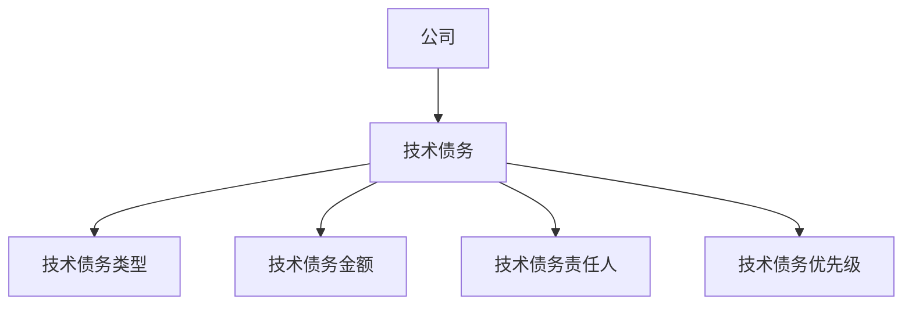
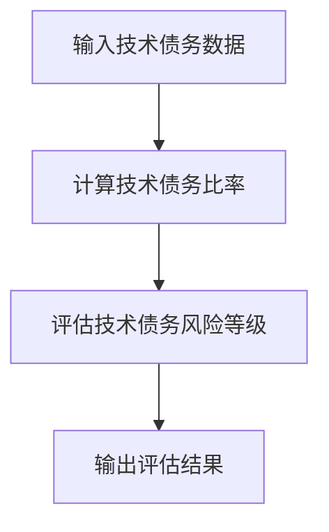
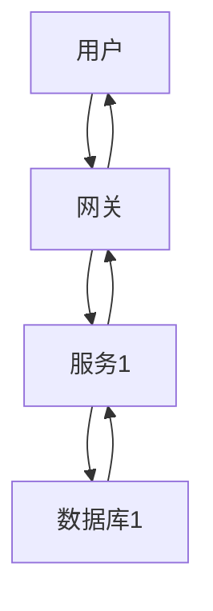

                 


# 彼得林奇对公司技术债务管理能力的评估

## 关键词：技术债务、彼得·林奇、评估模型、系统架构、Python代码实现、技术债务管理

## 摘要：本文从彼得·林奇的投资理念出发，探讨技术债务管理能力的评估方法。通过背景介绍、核心概念分析、算法原理、系统设计、项目实战和最佳实践等多个维度，详细阐述技术债务管理的核心要素、评估模型及实际应用。结合Mermaid图表和Python代码示例，为读者提供全面的技术债务管理解决方案。

---

# {{此处是文章标题}}

> 关键词：{{此处列出文章的5-7个核心关键词}}

> 摘要：{{此处给出文章的核心内容和主题思想}}

                 

---

## 第一章: 技术债务管理的背景与概念

### 1.1 技术债务的基本概念

#### 1.1.1 技术债务的定义与来源

技术债务（Technical Debt）是软件开发过程中由于采取捷径、忽视代码质量或采用临时解决方案而积累的一种隐性债务。它类似于财务债务，随着时间的推移，其累积效应可能对项目的可持续性和可维护性造成负面影响。

技术债务的来源主要包括：

- 临时解决方案：为了快速交付功能而采取的权宜之计。
- 缺乏代码规范：开发团队没有遵循统一的编码规范和最佳实践。
- 技术选型不当：选择了不成熟或过时的技术栈。
- 维护不足：长期忽视代码库的清理和优化。

#### 1.1.2 技术债务的分类与特征

技术债务可以按照其来源、影响范围和紧急程度进行分类。以下是常见的分类方式：

- **按来源分类**：
  - 代码质量问题：由于代码编写不规范或逻辑复杂导致的技术债务。
  - 技术选型问题：由于选择了不合适的框架或工具导致的技术债务。
  - 设计缺陷问题：由于设计不合理导致的扩展性差或维护成本高的技术债务。

- **按影响范围分类**：
  - 局部债务：仅影响局部功能模块的技术债务。
  - 全局债务：影响整个系统架构或多个模块的技术债务。

- **按紧急程度分类**：
  - 低紧急度债务：不会立即影响系统运行的技术债务。
  - 高紧急度债务：可能引发系统崩溃或严重性能问题的技术债务。

技术债务的特征包括：

- **隐式性**：技术债务往往隐藏在代码中，不易被发现。
- **累积性**：技术债务会随着时间的推移而累积，导致系统逐渐变得难以维护。
- **可迁移性**：某些技术债务可以通过重构或技术升级转移到新的系统中。

#### 1.1.3 技术债务对企业的影响

技术债务对企业的负面影响主要体现在以下几个方面：

- **增加维护成本**：技术债务会导致代码维护成本增加，开发效率下降。
- **降低系统稳定性**：技术债务可能导致系统出现更多缺陷和错误，影响系统的稳定性。
- **阻碍业务扩展**：技术债务会限制企业对新功能的快速开发和部署，影响业务扩展。
- **影响团队士气**：技术债务的存在可能导致开发团队士气低落，影响整体工作效率。

### 1.2 彼得·林奇与技术债务管理

#### 1.2.1 彼得·林奇的投资者背景

彼得·林奇（Peter Lynch）是美国著名的投资专家，曾任富达投资集团的经理，管理着麦哲伦基金，创造了年均29%的复合回报率。他以深入研究公司基本面、关注企业竞争优势和长期发展前景而闻名。

#### 1.2.2 技术债务管理能力的定义

技术债务管理能力是指企业在开发和维护软件系统过程中，识别、评估、优先级排序和处理技术债务的能力。这种能力直接影响企业的技术积累、系统的可持续性和未来的扩展性。

#### 1.2.3 技术债务管理能力的评估意义

技术债务管理能力的评估对于企业来说具有重要意义：

- **优化资源配置**：通过评估技术债务，企业可以更好地分配资源，优先处理高优先级的技术债务。
- **降低维护成本**：及时处理技术债务可以减少未来的维护成本，提高开发效率。
- **提升系统质量**：有效的技术债务管理可以提升系统的稳定性和可维护性，为企业的长期发展奠定基础。
- **增强竞争力**：通过技术债务管理，企业可以保持技术领先，增强市场竞争力。

### 1.3 技术债务管理的核心要素

#### 1.3.1 技术债务的量化与度量

技术债务的量化需要通过特定的指标来衡量，常见的度量指标包括：

- **技术债务比率**：技术债务金额占公司净资产的比例。
- **技术债务风险等级**：根据技术债务的规模和影响范围，评估其风险等级。
- **技术债务处理效率**：单位时间内处理的技术债务数量和质量。

#### 1.3.2 技术债务的生命周期

技术债务的生命周期可以分为以下几个阶段：

1. **产生阶段**：由于开发过程中的捷径或错误决策导致技术债务的产生。
2. **识别阶段**：通过代码审查、测试或监控工具发现技术债务。
3. **评估阶段**：对技术债务的规模、影响范围和优先级进行评估。
4. **处理阶段**：优先处理高优先级的技术债务，逐步清理低优先级的技术债务。
5. **监控阶段**：持续监控技术债务的动态变化，及时发现和处理新产生的技术债务。

#### 1.3.3 技术债务管理的边界与外延

技术债务管理的边界主要集中在技术层面，包括代码质量、系统架构和工具选择等方面。其外延则涉及到企业的组织结构、开发流程和文化建设等多个方面。

---

## 第二章: 技术债务管理能力的核心概念

### 2.1 技术债务管理能力的原理

#### 2.1.1 技术债务管理的核心模型

技术债务管理的核心模型包括以下几个部分：

1. **技术债务识别模型**：通过代码审查、静态分析和动态监控等手段，识别系统中的技术债务。
2. **技术债务评估模型**：基于技术债务的规模、影响范围和优先级，评估其风险等级。
3. **技术债务处理模型**：根据评估结果，优先处理高优先级的技术债务，逐步清理低优先级的技术债务。

#### 2.1.2 技术债务管理的关键要素

技术债务管理的关键要素包括：

- **技术债务清单**：记录所有已识别的技术债务，包括债务描述、影响范围、优先级和责任人等信息。
- **技术债务评估标准**：制定统一的技术债务评估标准，确保评估结果的准确性和一致性。
- **技术债务处理流程**：建立清晰的技术债务处理流程，明确每个阶段的责任人和时间节点。

#### 2.1.3 技术债务管理的系统架构

技术债务管理的系统架构可以分为以下几个部分：

1. **数据采集模块**：通过代码审查工具、日志分析工具等采集技术债务相关数据。
2. **评估计算模块**：基于采集的数据，计算技术债务的规模、影响范围和风险等级。
3. **结果展示模块**：以图表和报告的形式展示技术债务的评估结果，帮助决策者直观了解技术债务状况。
4. **监控预警模块**：实时监控技术债务的变化情况，及时发出预警信息。

### 2.2 技术债务与财务债务的对比分析

#### 2.2.1 技术债务与财务债务的属性对比

以下是技术债务与财务债务的属性对比表：

| 属性                | 技术债务                          | 财务债务                          |
|---------------------|-----------------------------------|-----------------------------------|
| 计量方式            | 代码复杂度、系统稳定性            | 货币金额                          |
| 影响范围            | 系统性能、开发效率                | 企业财务状况                      |
| 处理方式            | 代码重构、技术升级                | 偿债计划、债务重组                |
| 紧急程度            | 可能导致系统崩溃或性能下降        | 可能导致企业破产或信用评级下降    |

#### 2.2.2 技术债务与财务债务的联系与区别

技术债务与财务债务既有联系又有区别。技术债务主要影响企业的技术积累和系统稳定性，而财务债务直接影响企业的财务健康状况。两者都可能对企业的发展造成负面影响，但处理方式和管理策略有所不同。

#### 2.2.3 技术债务对企业财务健康的影响

技术债务对企业财务健康的影响主要体现在以下几个方面：

- **增加维护成本**：技术债务会导致企业需要投入更多的资源进行代码维护和系统优化，增加企业的运营成本。
- **影响融资能力**：技术债务可能影响企业的信用评级，从而影响其融资能力。
- **降低投资回报率**：技术债务的存在可能导致企业无法有效利用技术优势，降低投资回报率。

### 2.3 技术债务管理能力的ER实体关系图

以下是一个技术债务管理系统的ER实体关系图：



---

## 第三章: 技术债务管理能力的评估模型

### 3.1 技术债务评估模型的算法原理

#### 3.1.1 技术债务评估模型的输入与输出

技术债务评估模型的输入包括：

- 技术债务金额
- 公司净资产
- 技术债务优先级
- 技术债务影响范围

模型的输出包括：

- 技术债务风险等级
- 技术债务处理建议

#### 3.1.2 技术债务评估的数学模型

以下是技术债务风险的计算公式：

$$
\text{技术债务风险} = \frac{\text{技术债务金额}}{\text{公司净资产}} \times 100\%
$$

技术债务风险等级可以根据以下标准进行划分：

- 低于5%：低风险
- 5%-10%：中低风险
- 10%-15%：中高风险
- 高于15%：高风险

#### 3.1.3 技术债务评估的流程图

以下是一个技术债务评估的流程图：



### 3.2 技术债务评估的Python实现

#### 3.2.1 环境安装与依赖管理

要运行以下代码，需要安装以下依赖：

- Python 3.8+
- numpy
- pandas

安装命令：

```bash
pip install numpy pandas
```

#### 3.2.2 核心算法实现

以下是一个技术债务评估的Python代码示例：

```python
import numpy as np
import pandas as pd

def calculate_technical_debt_risk(technical_debt, net_asset):
    # 计算技术债务风险
    risk = (technical_debt / net_asset) * 100
    return risk

def assess_technical_debt(technical_debt, net_asset):
    risk = calculate_technical_debt_risk(technical_debt, net_asset)
    if risk < 5:
        return "低风险"
    elif 5 <= risk < 10:
        return "中低风险"
    elif 10 <= risk < 15:
        return "中高风险"
    else:
        return "高风险"

# 示例数据
technical_debt = 500000  # 技术债务金额（元）
net_asset = 10000000    # 净资产（元）

# 评估技术债务风险
risk_assessment = assess_technical_debt(technical_debt, net_asset)
print(f"技术债务风险评估结果：{risk_assessment}")
```

---

## 第四章: 技术债务管理能力的系统设计

### 4.1 系统功能设计

#### 4.1.1 领域模型设计

以下是技术债务管理系统的核心领域模型：


#### 4.1.2 系统架构设计

以下是技术债务管理系统的架构设计：

```mermaid
graph TD
    Client[用户] --> API Gateway[网关]
    API Gateway --> Service1[服务1]
    Service1 --> Database1[数据库1]
    Service1 --> Service2[服务2]
    Service2 --> Database2[数据库2]
```

#### 4.1.3 系统接口设计

以下是系统的主要接口设计：

1. **获取技术债务列表**：`GET /api/technical-debts`
2. **添加技术债务**：`POST /api/technical-debts`
3. **更新技术债务**：`PUT /api/technical-debts/{id}`
4. **删除技术债务**：`DELETE /api/technical-debts/{id}`

#### 4.1.4 系统交互流程图

以下是技术债务管理系统的交互流程图：



### 4.2 系统实现细节

#### 4.2.1 核心代码实现

以下是技术债务管理系统的核心代码实现：

```python
from flask import Flask, jsonify
from flask_restful import Resource, Api

app = Flask(__name__)
api = Api(app)

class TechnicalDebt(Resource):
    def get(self):
        return jsonify({"status": "success", "message": "Technical Debt List"})

api.add_resource(TechnicalDebt, '/api/technical-debts')

if __name__ == '__main__':
    app.run(debug=True)
```

#### 4.2.2 系统功能模块

系统功能模块包括：

1. **数据采集模块**：通过代码审查工具采集技术债务数据。
2. **评估计算模块**：基于采集的数据计算技术债务风险。
3. **结果展示模块**：以图表和报告的形式展示评估结果。
4. **监控预警模块**：实时监控技术债务的变化情况，及时发出预警信息。

---

## 第五章: 技术债务管理能力的项目实战

### 5.1 项目背景

假设我们是一家互联网公司，开发了一个在线购物平台。由于历史原因，系统的代码质量和架构设计存在诸多问题，导致开发效率低下，系统稳定性差。我们需要通过技术债务管理来优化系统，提升开发效率和系统稳定性。

### 5.2 核心代码实现

#### 5.2.1 技术债务识别模块

以下是技术债务识别模块的代码实现：

```python
import os
import sys
from typing import List

def identify_technical_debt(project_path: str) -> List[str]:
    debt_list = []
    # 遍历代码文件
    for root, dirs, files in os.walk(project_path):
        for file in files:
            if file.endswith('.py'):
                # 检查代码质量
                with open(os.path.join(root, file), 'r') as f:
                    code = f.read()
                    if 'TODO' in code or 'FIXME' in code:
                        debt_list.append(file)
    return debt_list

# 示例使用
project_path = 'src/main/python'
debt_files = identify_technical_debt(project_path)
print(f"发现的技术债务文件：{debt_files}")
```

#### 5.2.2 技术债务评估模块

以下是技术债务评估模块的代码实现：

```python
import pandas as pd

def assess_technical_debt(debt_files: List[str], net_asset: float) -> str:
    debt_amount = len(debt_files) * 1000  # 假设每个文件对应1000元技术债务
    risk = (debt_amount / net_asset) * 100
    if risk < 5:
        return "低风险"
    elif 5 <= risk < 10:
        return "中低风险"
    elif 10 <= risk < 15:
        return "中高风险"
    else:
        return "高风险"

# 示例使用
net_asset = 10000000  # 净资产
debt_files = ['file1.py', 'file2.py', 'file3.py']
risk_assessment = assess_technical_debt(debt_files, net_asset)
print(f"技术债务风险评估结果：{risk_assessment}")
```

### 5.3 实际案例分析

假设我们的在线购物平台有三个技术债务文件，净资产为1000万元，那么技术债务金额为3000元，技术债务风险为0.03%，属于低风险。

### 5.4 项目总结

通过上述步骤，我们可以有效地识别和评估技术债务，为后续的技术债务管理提供数据支持。在实际项目中，还需要结合企业的实际情况，制定合理的技术债务处理计划。

---

## 第六章: 技术债务管理能力的优化与建议

### 6.1 最佳实践

- **定期审查代码**：定期进行代码审查，及时发现和处理技术债务。
- **制定技术债务清单**：建立技术债务清单，明确每个债务的描述、影响范围和优先级。
- **优先处理高风险债务**：根据技术债务的风险等级，优先处理高风险的技术债务。
- **建立技术债务管理制度**：制定技术债务管理制度，明确技术债务的识别、评估、处理和监控流程。

### 6.2 小结

技术债务管理是企业技术管理的重要组成部分，对于提升系统质量和开发效率具有重要意义。通过本文的分析，我们可以更好地理解和管理技术债务，为企业的长期发展奠定坚实的技术基础。

### 6.3 注意事项

- **避免过度优化**：技术债务管理需要在成本和收益之间找到平衡点，避免过度优化。
- **注重团队协作**：技术债务管理需要开发团队的共同努力，注重团队协作。
- **持续监控**：技术债务是一个动态变化的过程，需要持续监控和管理。

### 6.4 拓展阅读

- **《技术债务：企业级软件工程的挑战与解决方案》**：深入探讨技术债务对企业的影响及解决方案。
- **《彼得·林奇的投资哲学》**：了解彼得·林奇的投资理念，及其如何应用于技术债务管理。

---

## 结语

技术债务管理是企业技术管理的重要组成部分，对于提升系统质量和开发效率具有重要意义。通过本文的分析，我们可以更好地理解和管理技术债务，为企业的长期发展奠定坚实的技术基础。

