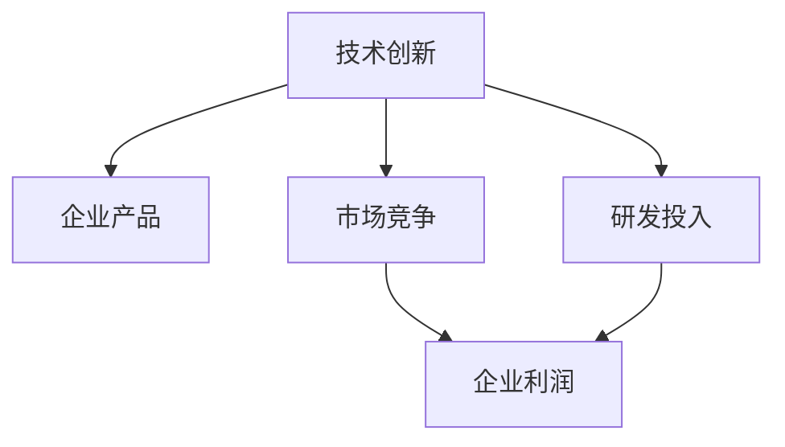
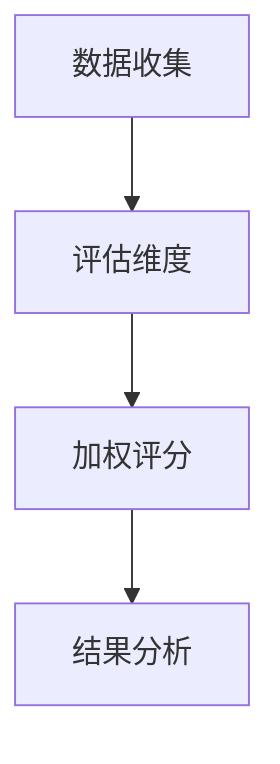
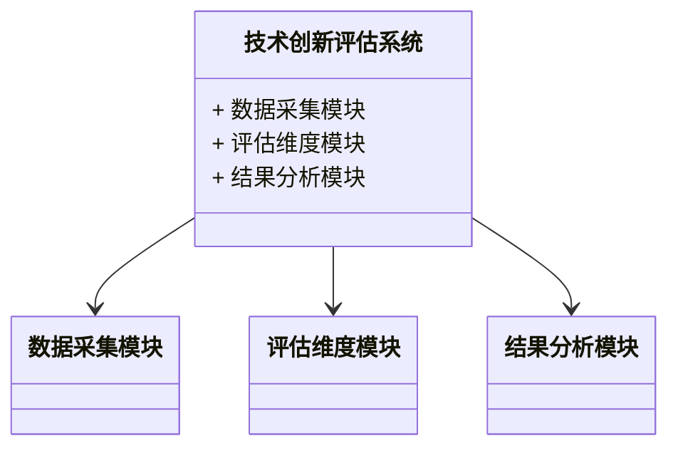
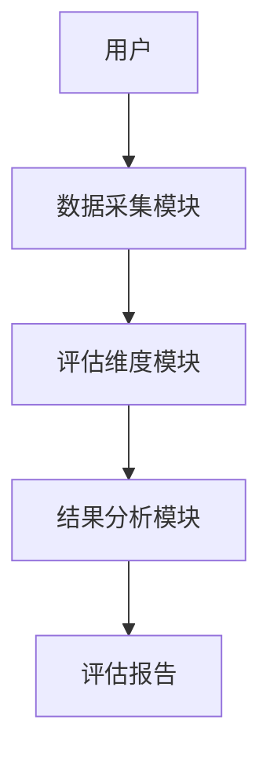

                 

# 彼得林奇对公司技术创新的评估标准

> 关键词：技术创新评估，彼得·林奇，创新标准，企业评估，投资决策

> 摘要：本文深入探讨了彼得·林奇对公司技术创新的评估标准，分析了技术创新评估的核心概念、算法原理、系统架构及实际应用案例。通过详细阐述技术创新评估的流程、数学模型、系统设计和项目实战，本文为读者提供了全面的理论框架和实践指南。

---

## 第一部分：背景介绍

### 第1章：技术创新评估的重要性

#### 1.1 问题背景

技术创新在现代企业的竞争中扮演着至关重要的角色。企业通过技术创新可以提升产品性能、降低成本、提高效率，并在市场中获得竞争优势。然而，如何有效评估技术创新的潜力和价值，一直是企业和投资者面临的难题。

彼得·林奇作为全球知名的投资专家，以其独特的视角和方法论闻名。他的技术创新评估标准不仅帮助企业识别潜在的投资机会，也为企业的技术研发提供了重要指导。

#### 1.2 问题描述

技术创新评估涉及多个维度，包括技术的先进性、实用性、市场适应性等。然而，许多企业在评估技术创新时缺乏系统性，导致评估结果不够准确，甚至可能错过重要的投资机会。

此外，技术创新评估不仅需要考虑技术本身，还需要结合企业的战略目标、市场需求和财务状况。这些因素的综合考量使得技术创新评估成为一个复杂的系统工程。

#### 1.3 问题解决

为了有效评估技术创新，我们需要建立一套系统化的评估标准。这套标准应包括技术可行性、市场潜力、团队能力、财务可行性等多个维度。通过这些维度的综合评估，我们可以更准确地判断技术创新的潜力和价值。

彼得·林奇的方法论为我们提供了一个重要的参考。他强调，技术创新评估不仅仅是技术问题，更是一个综合考虑企业内外部因素的过程。

---

## 第二部分：核心概念与联系

### 第2章：技术创新评估的核心概念

#### 2.1 核心概念原理

技术创新是指通过引入新的技术或改进现有技术，以提高产品或服务的性能、降低成本或满足新的市场需求。技术创新评估的核心在于识别那些具有市场潜力和商业价值的技术。

技术可行性是技术创新评估的重要维度之一。它包括技术的成熟度、可实现性和潜在风险。市场潜力则关注技术在市场中的应用前景，包括市场规模、增长速度和竞争环境。此外，团队能力和财务可行性也是评估的重要因素。

#### 2.2 核心概念属性特征对比

下表对比了技术创新与其他类型创新的核心特征：

| **创新类型** | **核心特征**                |
|--------------|-----------------------------|
| 技术创新     | 技术可行性、市场潜力         |
| 管理创新     | 组织结构、流程优化           |
| 商业模式创新 | 收入来源、客户关系管理       |

通过对比可以看出，技术创新的核心在于技术本身，而其他类型的创新则侧重于管理和商业模式。

#### 2.3 实体关系图

下图展示了技术创新与企业发展的关系：

技术创新不仅影响企业产品，还通过研发投入间接影响企业利润，并在市场竞争中发挥作用。

---

## 第三部分：算法原理讲解

### 第3章：技术创新评估的算法原理

技术创新评估可以通过以下流程进行：

1. 数据收集：收集企业的技术资料、市场数据和财务报表。
2. 评估维度：从技术可行性、市场潜力、团队能力和财务可行性四个维度进行评估。
3. 加权评分：每个维度赋予不同的权重，计算综合评分。
4. 结果分析：根据评分结果，判断技术创新的潜力和价值。

下图展示了评估流程：

数学模型如下：

$$ \text{综合评分} = \sum_{i=1}^{4} w_i \times s_i $$

其中，\( w_i \) 是第 \( i \) 个维度的权重，\( s_i \) 是第 \( i \) 个维度的评分。

---

## 第四部分：系统分析与架构设计

### 第4章：技术创新评估系统的架构设计

#### 4.1 系统功能设计

技术创新评估系统需要具备以下功能模块：

- 数据采集：收集企业的技术资料、市场数据和财务报表。
- 评估维度：实现技术可行性、市场潜力、团队能力和财务可行性评估。
- 结果分析：输出综合评分和评估报告。

下图为系统功能模块的类图：

#### 4.2 系统架构设计

技术创新评估系统的架构设计如下：

---

## 第五部分：项目实战

### 第5章：技术创新评估的实战分析

#### 5.1 案例分析

以某科技公司为例，分析其技术创新评估过程：

1. 技术可行性：该公司的技术处于行业领先水平，具有较高的可行性。
2. 市场潜力：目标市场规模庞大，增长迅速。
3. 团队能力：公司拥有一支经验丰富的研发团队。
4. 财务可行性：公司财务状况良好，有足够的资金支持技术创新。

综合评分计算如下：

$$ \text{综合评分} = 0.3 \times 80 + 0.3 \times 75 + 0.2 \times 85 + 0.2 \times 70 = 74.5 $$

评分结果表明，该公司的技术创新具有较高的市场潜力和商业价值。

---

## 第六部分：最佳实践与总结

### 第6章：技术创新评估的最佳实践

1. **明确评估目标**：在进行技术创新评估之前，明确评估的目标和范围。
2. **数据收集**：确保数据的准确性和完整性。
3. **多维度评估**：综合考虑技术可行性、市场潜力、团队能力和财务可行性。
4. **持续监控**：定期更新评估结果，以适应市场变化和技术进步。

### 小结

技术创新评估是企业投资决策的重要环节。通过彼得·林奇的评估标准，我们可以更系统地识别和评估技术创新的潜力和价值。

### 注意事项

- 技术创新评估需要结合企业的实际情况，避免过于理想化。
- 在评估过程中，要注意数据的准确性和评估方法的科学性。

### 拓展阅读

建议进一步阅读彼得·林奇的其他著作，深入了解他的投资哲学和评估方法。

---

通过以上内容，我们全面介绍了彼得·林奇对公司技术创新的评估标准，从背景介绍、核心概念、算法原理到系统设计和项目实战，为读者提供了系统的理论框架和实践指南。希望这篇文章能为您提供有价值的参考和启发。

