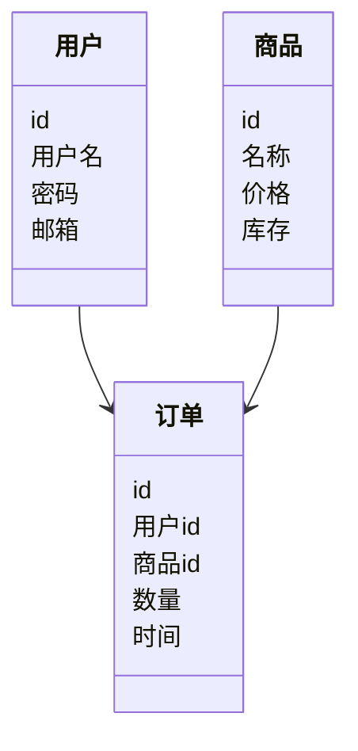
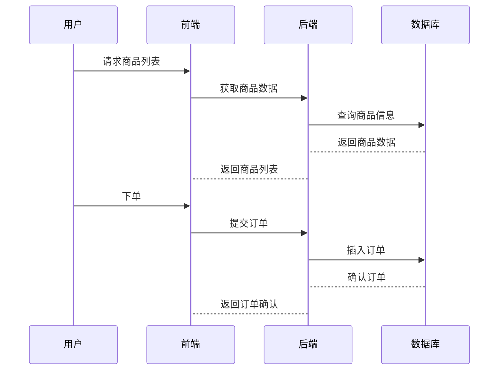

                 


# 彼得林奇对公司技术堆栈的评估方法

## 关键词：
彼得林奇、技术堆栈、评估方法、投资策略、系统架构、算法原理、项目实战

## 摘要：
本文详细探讨了彼得·林奇在评估公司技术堆栈时所采用的方法和策略。通过结合投资学与技术评估，文章分析了技术堆栈的核心概念、评估维度、算法原理，并通过实际案例展示了如何应用这些方法进行系统分析和架构设计。本文旨在为技术人员和投资者提供一种结合技术与商业的评估框架，以做出更明智的决策。

---

## 第一部分：背景介绍

### 第1章：彼得·林奇与投资方法概述

#### 1.1 彼得·林奇的背景介绍
彼得·林奇（Peter Lynch）是美国著名的投资经理人，以其在富达投资管理公司的卓越表现而闻名。他在评估公司时，不仅关注财务数据，还注重公司的技术实力和市场竞争力。这种综合评估方法为本文的技术堆栈评估提供了灵感。

#### 1.2 技术堆栈评估的背景与重要性
技术堆栈是指公司使用的硬件、软件、平台和工具的组合，是企业技术实力的核心。随着数字化转型的加速，技术堆栈的评估变得尤为重要。通过科学的评估方法，可以帮助企业在技术选型和优化中做出更明智的决策。

---

## 第二部分：核心概念与联系

### 第3章：技术堆栈评估的核心概念

#### 3.1 技术堆栈的定义与组成
技术堆栈通常分为前端和后端两部分。前端包括用户界面和客户端技术，后端则涉及服务器、数据库和应用逻辑。以下是技术堆栈的组成要素对比表：

| 组成部分 | 描述                                                                 |
|----------|----------------------------------------------------------------------|
| 前端     | 用户与系统交互的界面，如网页或移动应用。                                 |
| 后端     | 处理业务逻辑、数据存储和服务器管理的部分。                             |
| 数据库   | 存储数据的核心组件，支持结构化和非结构化数据。                         |
| 服务器   | 提供计算资源和网络服务，确保系统的稳定运行。                           |
| 工具与库 | 用于开发、测试和部署的辅助工具，如IDE和测试框架。                     |

#### 3.2 技术堆栈评估的关键维度
评估技术堆栈时，需考虑以下几个关键维度：

- **技术成熟度**：技术的稳定性和成熟度直接影响系统的可靠性。
- **可扩展性**：系统能否在负载增加时保持性能。
- **可维护性**：技术的维护成本和难易程度。
- **兼容性**：与现有系统的兼容性及未来扩展性。

以下是各维度的属性特征对比表：

| 维度       | 描述                                                                 |
|------------|----------------------------------------------------------------------|
| 技术成熟度 | 技术的市场采用率、支持程度和技术稳定性。                              |
| 可扩展性   | 系统在负载增加时的性能表现和扩展能力。                              |
| 可维护性   | 技术的维护成本、文档支持和社区活跃度。                              |
| 兼容性     | 与现有系统和未来技术的兼容性。                                        |

### 第4章：技术堆栈评估的核心概念

#### 4.1 技术堆栈评估的核心概念
技术堆栈评估的核心概念包括：

- **系统架构**：系统的整体结构和模块划分。
- **技术选型**：选择适合业务需求的技术组件。
- **性能优化**：提升系统性能和效率。

以下是技术堆栈的核心要素ER实体关系图（使用mermaid）：

```mermaid
erDiagram
    actor 投资者 {
        <属性>
        id
        投资目标
        评估标准
    }
    actor 开发者 {
        <属性>
        id
        开发技能
        项目需求
    }
    actor 项目经理 {
        <属性>
        id
        项目进度
        资源分配
    }
    component 技术堆栈 {
        <属性>
        id
        技术组件
        评估结果
    }
    relation "评估" {
        投资者 --> 技术堆栈
        开发者 --> 技术堆栈
        项目经理 --> 技术堆栈
    }
```

---

## 第三部分：算法原理讲解

### 第5章：技术堆栈评估的数学模型

#### 5.1 评估模型的建立
评估模型通过加权评分法，将各维度的权重分配给每个技术组件，计算总评分为最终结果。以下是数学模型的公式：

$$
\text{总评分} = \sum (\text{权重}_i \times \text{评分}_i)
$$

其中，$\text{权重}_i$是各维度的权重，$\text{评分}_i$是各维度的评分。

#### 5.2 算法实现
以下是Python代码实现：

```python
def evaluate_technology_stack(components, weights):
    scores = []
    for comp in components:
        score = 0
        for i in range(len(weights)):
            score += weights[i] * comp[i]
        scores.append(score)
    return scores

# 示例
components = [
    [90, 85, 80],
    [85, 80, 75]
]
weights = [0.4, 0.3, 0.3]

result = evaluate_technology_stack(components, weights)
print("评估结果:", result)
```

---

## 第四部分：系统分析与架构设计

### 第6章：系统分析与架构设计

#### 6.1 问题场景介绍
假设我们正在评估一个电子商务平台的技术堆栈，需要确保其在高并发情况下的稳定性和可扩展性。

#### 6.2 系统功能设计

##### 领域模型设计
以下是领域模型设计的mermaid类图：



##### 系统架构设计
以下是系统架构设计的mermaid图：

```mermaid
container 前端 {
    Web 页面
    移动应用
}
container 后端 {
    业务逻辑
    数据访问层
}
container 数据库 {
    用户表
    商品表
    订单表
}
```

##### 接口设计与交互序列图
以下是接口设计的mermaid序列图：



---

## 第五部分：项目实战

### 第7章：项目实战与案例分析

#### 7.1 环境安装与配置
首先安装必要的工具和环境：

- Python 3.x
- pip
- 其他开发工具（如IDE、版本控制工具）

#### 7.2 核心代码实现
以下是核心代码实现：

```python
from flask import Flask
from flask_sqlalchemy import SQLAlchemy

app = Flask(__name__)
app.config['SQLALCHEMY_DATABASE_URI'] = 'sqlite:///test.db'
db = SQLAlchemy(app)

class User(db.Model):
    id = db.Column(db.Integer, primary_key=True)
    username = db.Column(db.String(80), unique=True)
    password = db.Column(db.String(80))

if __name__ == '__main__':
    app.run()
```

#### 7.3 案例分析与详细讲解
以电子商务平台为例，分析技术堆栈的评估过程：

1. **需求分析**：明确系统的功能需求和性能要求。
2. **技术选型**：选择适合的技术组件，如前端框架和后端语言。
3. **评估与优化**：根据评估结果进行优化，确保系统的稳定性和可扩展性。

---

## 第六部分：最佳实践与总结

### 第8章：最佳实践与总结

#### 8.1 评估过程中的注意事项
- **全面性**：确保评估维度全面。
- **实时性**：及时更新评估结果。
- **团队协作**：技术团队与投资团队需紧密合作。

#### 8.2 项目小结与未来展望
通过本文的分析，我们了解了彼得林奇评估方法在技术堆栈中的应用。未来，可以进一步研究动态评估模型和自动化评估工具，以提升评估的效率和准确性。

---

## 附录：拓展阅读与资源

### 附录A：相关文献与工具推荐
- 推荐书籍：《彼得·林奇的投资哲学》
- 推荐工具：Docker、Kubernetes、Jenkins

### 附录B：术语表与概念索引
- **技术堆栈**：公司使用的硬件、软件和工具的集合。
- **评估维度**：评估技术堆栈时需要考虑的关键因素。

---

通过以上目录和内容，我们全面探讨了彼得林奇评估方法在技术堆栈中的应用，为技术人员和投资者提供了有价值的参考。

