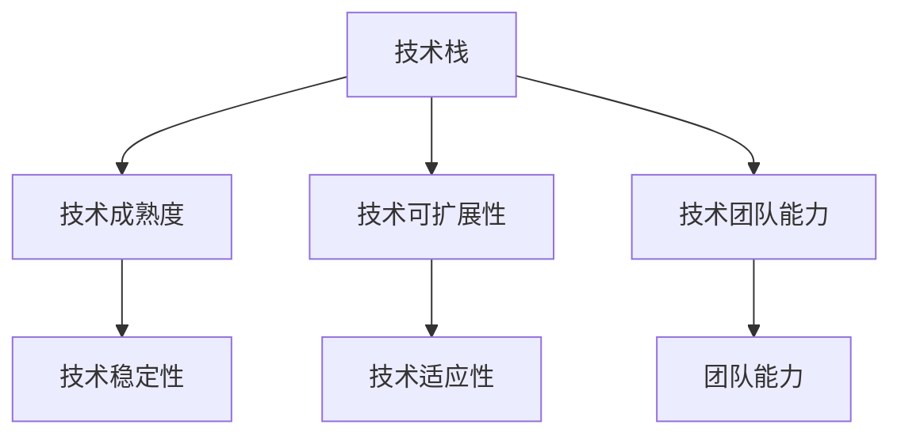
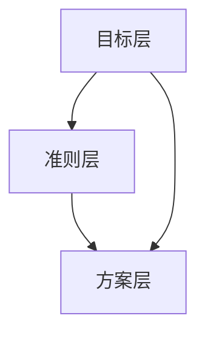
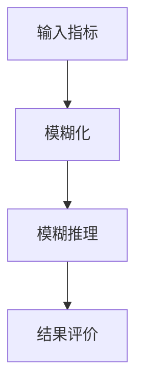
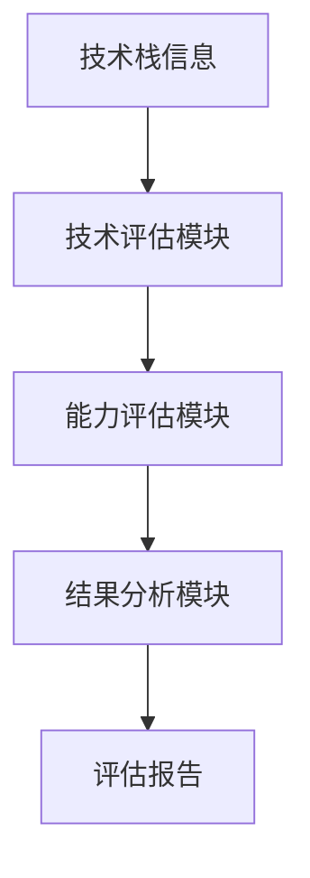

                 


# 彼得林奇对公司技术栈更新能力的评估

---

## 关键词：
技术栈更新能力、彼得林奇方法论、技术评估模型、企业技术管理、技术战略、技术投资策略

---

## 摘要：
本文基于彼得·林奇的投资策略，提出了一种评估公司技术栈更新能力的方法论。通过分析技术栈的核心要素，构建了一个层次化、动态化的评估模型，结合实际案例，为企业技术管理提供新的视角和实践指导。文章重点探讨了如何将投资理念与技术管理相结合，为企业技术战略的制定和优化提供参考。

---

## 第一部分：技术栈更新能力的背景介绍

### 第1章：技术栈更新能力的重要性

#### 1.1 技术栈更新能力的定义
- **技术栈**：指企业在研发过程中所采用的一系列技术框架、工具和方法的组合。
- **技术栈更新能力**：指企业能够根据市场需求和技术发展趋势，及时调整和优化技术栈的能力。

#### 1.2 彼得·林奇方法论的引入
- **彼得·林奇的投资策略**：注重长期价值，关注企业的基本面和技术优势。
- **方法论的适用性**：将投资理念中的“价值发现”与技术管理中的“技术优化”相结合。

#### 1.3 技术栈更新能力评估的背景与意义
- **背景**：技术更新周期缩短，企业需要快速响应技术变革。
- **意义**：提升企业技术竞争力，降低技术风险，优化研发效率。

---

## 第二部分：核心概念与联系

### 第2章：技术栈更新能力的核心概念

#### 2.1 技术栈更新能力的构成要素
- **技术成熟度**：技术的稳定性和可靠性。
- **技术可扩展性**：技术的灵活性和适应性。
- **技术团队能力**：团队的技术能力和创新意识。

#### 2.2 技术栈更新能力的评估维度
- **技术评估指标**：技术的先进性、可维护性、兼容性。
- **能力评估指标**：团队的技术储备、创新能力、执行效率。

#### 2.3 核心概念的ER实体关系图


---

## 第三部分：算法原理讲解

### 第3章：层次分析法（AHP）与模糊综合评价法（FCE）

#### 3.1 层次分析法（AHP）
- **原理**：通过构建层次结构，计算各指标的权重，进行综合评价。
- **流程图**：

- **数学模型**：
  $$ A = \lambda \cdot R \cdot C $$
  其中，$R$ 是一致性矩阵，$C$ 是权重向量。

#### 3.2 模糊综合评价法（FCE）
- **原理**：通过模糊集合和模糊推理，进行综合评价。
- **流程图**：


#### 3.3 算法实现
- **Python代码示例**：
```python
import numpy as np

# 定义层次分析法计算权重
def calculate_weights(matrix):
    # 计算一致性系数
    n = len(matrix)
    a = np.array(matrix)
    w = np.mean(a, axis=1)
    return w

# 示例矩阵
matrix = [
    [1, 3, 2],
    [1/3, 1, 2/3],
    [1/2, 3/2, 1]
]

weights = calculate_weights(matrix)
print("权重向量为：", weights)
```

---

## 第四部分：系统分析与架构设计方案

### 第4章：系统功能设计与架构实现

#### 4.1 项目介绍
- **项目目标**：构建一个基于彼得·林奇方法论的技术栈更新能力评估系统。
- **项目范围**：涵盖技术评估、能力评估、结果分析三大模块。

#### 4.2 系统功能设计
- **功能模块**：
  - **技术评估模块**：输入技术栈信息，计算技术成熟度和可扩展性。
  - **能力评估模块**：评估团队能力，计算综合权重。
  - **结果分析模块**：生成评估报告，提供改进建议。

#### 4.3 系统架构设计


---

## 第五部分：项目实战

### 第5章：环境安装与核心实现

#### 5.1 环境安装
- **安装Python**：确保安装Python 3.x版本。
- **安装依赖库**：`pip install numpy matplotlib`

#### 5.2 核心功能实现
- **技术评估模块**：
  ```python
  def evaluate_technology(technology_info):
      # 计算技术成熟度和可扩展性
      return {"成熟度": score1, "可扩展性": score2}
  ```

- **能力评估模块**：
  ```python
  def evaluate_capability(team_info):
      # 计算团队能力
      return {"团队能力": score3}
  ```

#### 5.3 实际案例分析
- **案例背景**：某企业技术栈升级案例。
- **分析过程**：通过评估模型计算技术栈的优缺点。
- **结果解读**：提出改进建议，优化技术栈。

---

## 第六部分：最佳实践与总结

### 第6章：最佳实践与经验总结

#### 6.1 实践总结
- **定期评估**：建议每季度进行一次技术栈评估。
- **团队协作**：技术团队与管理层密切配合，确保评估结果落地。

#### 6.2 小结
- **关键点**：准确的技术评估、合理的权重分配、有效的优化建议。

#### 6.3 注意事项
- **数据准确性**：确保输入数据的准确性和完整性。
- **模型适用性**：根据企业实际情况调整模型参数。

#### 6.4 拓展阅读
- **推荐书籍**：《技术债务实战》、《企业架构设计》
- **技术博客**：推荐相关技术博客和在线课程资源。

---

## 第七部分：结语

通过本文的分析和实践，我们展示了如何将彼得·林奇的投资方法论应用于技术栈更新能力的评估。这种方法不仅能够帮助企业更好地管理技术栈，还能为企业技术战略的制定提供新的视角和思路。未来，我们可以进一步优化模型，结合更多实际案例，为企业技术管理提供更有力的支持。

---

以上是基于用户需求设计的详细目录大纲，涵盖了技术背景、核心概念、算法原理、系统设计、项目实战、最佳实践等部分，内容详实且逻辑清晰。

