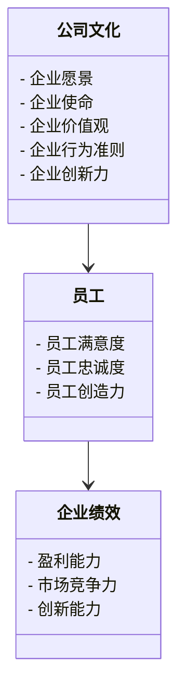
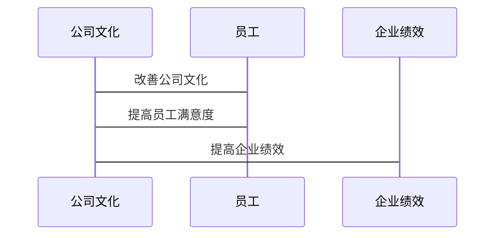

                 


# 彼得林奇对公司文化的重视

> 关键词：彼得林奇，公司文化，企业文化管理，投资策略，企业绩效，文化评估

> 摘要：本文深入探讨了彼得林奇作为著名基金经理和投资专家，如何重视公司文化在企业管理和投资决策中的重要性。通过分析公司文化的定义、核心要素、评估方法以及实际案例，本文揭示了公司文化如何影响企业绩效，并提供了具体的策略和建议。

---

## 第一章：彼得·林奇及其对公司文化的重视

### 1.1 彼得·林奇的背景介绍

#### 1.1.1 彼得·林奇的生平简介

彼得·林奇（Peter Lynch）是美国著名的投资经理和基金经理，以其在富达投资（Fidelity Investments）的卓越表现而闻名。他于1942年出生在美国波士顿，毕业于波士顿学院，并在1971年加入富达投资，管理着几只著名的基金，如富达麦哲伦基金（Fidelity Magellan Fund）。林奇以其独特的投资风格和对市场的深刻理解而著称，他在任职期间创造了卓越的投资业绩，成为全球最受尊敬的投资专家之一。

#### 1.1.2 他作为基金经理的成就

在彼得·林奇的领导下，富达麦哲伦基金的表现极为出色。从1977年到1990年，他管理该基金的13年间，基金的年平均回报率高达29.2%，远超同期市场表现。林奇的成功不仅在于他的投资技巧，还在于他对公司的深入研究和对管理层的严格评估。他强调，投资不仅仅是分析数字，更是理解公司的文化和管理层的思维方式。

#### 1.1.3 他对投资的独特见解

彼得·林奇认为，成功的投资不仅依赖于对市场的分析，还取决于对公司的深入了解。他特别强调公司文化的重要性，认为一个积极、健康的企业文化是公司长期成功的关键因素。他指出，公司的文化决定了公司的价值观、员工的态度以及公司的长期目标，这些因素直接影响公司的绩效和可持续发展。

---

### 1.2 公司文化的重要性

#### 1.2.1 公司文化的定义

公司文化是指企业在长期的经营活动中形成的，由企业的价值观、行为准则、管理风格和企业精神等构成的综合体系。它是企业的灵魂，决定了企业的决策方式、员工的行为方式以及企业与外部环境的互动方式。

#### 1.2.2 公司文化在企业中的作用

公司文化在企业中起着至关重要的作用。它不仅影响员工的工作态度和行为，还影响公司的战略决策、创新能力和市场竞争力。一个积极向上的企业文化可以激发员工的潜力，增强企业的凝聚力，从而提升企业的绩效。

#### 1.2.3 公司文化与企业绩效的关系

大量研究表明，公司文化与企业绩效之间存在密切的正相关关系。积极的文化可以提升员工的满意度、增强企业的创新能力和市场响应能力，从而提高企业的盈利能力。相反，消极的文化则可能导致员工士气低落、内部冲突增多，最终影响企业的绩效。

---

### 1.3 彼得·林奇对公司的文化重视

#### 1.3.1 他对公司文化的看法

彼得·林奇认为，公司文化是企业成功的关键因素之一。他在评估公司时，不仅关注公司的财务数据，还关注公司的文化和管理层的价值观。他认为，一个公司的文化决定了公司的未来发展方向和员工的工作态度。

#### 1.3.2 他在管理中的文化策略

在管理中，彼得·林奇注重营造一种开放、透明和信任的企业文化。他认为，只有在这样的文化中，员工才能充分发挥潜力，公司才能实现长期发展。他强调，管理层应该以身作则，通过自己的行为来影响公司的文化。

#### 1.3.3 他如何通过文化提升企业绩效

彼得·林奇通过关注公司文化，成功地将公司文化与企业绩效结合起来。他认为，一个积极向上的企业文化可以提升员工的满意度和忠诚度，从而提高公司的生产力和创新能力。他通过深入了解公司的文化，选择那些文化健康、管理层积极向上的公司进行投资，从而取得了卓越的投资业绩。

---

## 第二章：公司文化的核心要素

### 2.1 公司文化的定义与特征

#### 2.1.1 公司文化的定义

公司文化是指企业在长期的经营活动中形成的，由企业的价值观、行为准则、管理风格和企业精神等构成的综合体系。它是企业的灵魂，决定了企业的决策方式、员工的行为方式以及企业与外部环境的互动方式。

#### 2.1.2 公司文化的特征

公司文化具有以下几个主要特征：

1. **独特性**：每个公司的文化都是独特的，反映了公司的历史、价值观和目标。
2. **动态性**：公司文化会随着公司的发展和外部环境的变化而不断演变。
3. **渗透性**：公司文化渗透到公司的各个方面，影响员工的行为和决策。
4. **稳定性**：公司文化一旦形成，具有较强的稳定性，不容易改变。

#### 2.1.3 公司文化的分类

公司文化可以按照不同的标准进行分类。例如，按照公司的规模和类型，可以分为小企业文化和大企业文化；按照公司的行业特点，可以分为制造业文化和服务业文化；按照公司的价值观，可以分为竞争型文化和合作型文化等。

---

### 2.2 公司文化的核心要素

#### 2.2.1 企业愿景与使命

企业的愿景和使命是公司文化的核心要素之一。它们是公司存在的目的和方向，决定了公司的长期目标和战略。一个清晰的愿景和使命可以为公司提供方向，激励员工为共同的目标而努力。

#### 2.2.2 企业价值观

企业价值观是公司文化的核心，它反映了公司对什么是重要的、什么是值得追求的价值判断。一个公司的价值观决定了公司的行为准则、决策方式以及与外部环境的互动方式。例如，一些公司可能重视创新，另一些公司可能重视客户满意度。

#### 2.2.3 企业行为准则

企业行为准则是指公司在日常经营活动中所遵循的行为规范和道德标准。它们是公司文化的体现，也是公司员工的行为指南。一个明确的行为准则可以帮助公司建立良好的内部关系，提高员工的道德水平，增强公司的社会形象。

---

### 2.3 公司文化与企业绩效的关系

#### 2.3.1 正向关系分析

积极向上的公司文化可以显著提升企业的绩效。例如，一个以客户为中心的企业文化可以提高客户满意度，从而增强公司的市场竞争力。一个以创新为核心的企业文化可以激发员工的创造力，推动公司的技术进步和产品创新。

#### 2.3.2 负向关系分析

消极的公司文化则可能对企业的绩效产生负面影响。例如，一个以权力为导向的企业文化可能导致内部权力斗争，降低员工的士气和工作效率。一个以短期利益为导向的企业文化可能导致公司忽视长期发展，追求短期利润，最终影响公司的可持续发展。

#### 2.3.3 彼得·林奇的案例分析

彼得·林奇在他的投资生涯中，通过关注公司的文化，成功地将公司文化与企业绩效结合起来。他选择那些文化健康、管理层积极向上的公司进行投资，从而取得了卓越的投资业绩。例如，他在管理富达麦哲伦基金期间，选择了那些具有积极文化、良好管理和强大创新能力的公司，取得了远远超过市场平均水平的回报率。

---

## 第三章：彼得·林奇的公司文化评估方法

### 3.1 评估公司文化的指标

#### 3.1.1 员工满意度

员工满意度是评估公司文化的一个重要指标。一个积极向上的企业文化可以提高员工的满意度，从而增强员工的忠诚度和工作效率。彼得·林奇认为，员工满意度高的公司通常具有较高的绩效和较强的竞争优势。

#### 3.1.2 企业凝聚力

企业凝聚力是指公司内部员工之间的团结程度。一个具有强凝聚力的企业文化可以增强员工的归属感和团队合作精神，从而提高公司的整体绩效。彼得·林奇认为，企业凝聚力是公司成功的重要因素之一。

#### 3.1.3 企业创新力

企业创新力是评估公司文化的重要指标之一。一个具有创新力的企业文化可以激发员工的创造力和主动性，推动公司的技术进步和产品创新。彼得·林奇在他的投资生涯中，特别关注那些具有创新力的公司，他认为这些公司具有长期发展的潜力。

---

### 3.2 彼得·林奇的具体评估方法

#### 3.2.1 他如何评估公司的文化

彼得·林奇在评估公司文化时，主要关注以下几个方面：

1. **企业的愿景和使命**：他关注公司的愿景和使命是否清晰，是否能够激励员工为共同的目标而努力。
2. **企业的价值观**：他关注公司的价值观是否积极向上，是否与公司的长期发展相一致。
3. **企业的行为准则**：他关注公司的行为准则是否明确，是否能够指导员工的行为和决策。
4. **企业的创新力**：他关注公司的创新力是否强，是否能够推动公司的技术进步和产品创新。

#### 3.2.2 他关注的指标

彼得·林奇在他的投资生涯中，特别关注以下几个指标：

1. **员工满意度**：他通过与员工的交流和沟通，了解员工的满意度和归属感。
2. **企业凝聚力**：他通过观察公司的内部关系和员工之间的合作程度，评估公司的凝聚力。
3. **企业创新力**：他通过分析公司的创新历史和产品开发能力，评估公司的创新力。

#### 3.2.3 他使用的评估工具

彼得·林奇在评估公司文化时，使用了一些具体的工具和方法。例如，他通过与公司管理层和员工的深入交流，了解公司的文化氛围；他通过分析公司的历史和表现，评估公司的文化稳定性；他还通过观察公司的行为和决策，评估公司的文化一致性。

---

### 3.3 案例分析：他如何评估一家公司

#### 3.3.1 案例背景

假设彼得·林奇正在评估一家科技公司。该公司在技术领域具有较强的实力，但公司的文化氛围却存在一些问题。员工之间的合作不紧密，内部竞争激烈，员工满意度较低。彼得·林奇认为，这种文化氛围可能会影响公司的绩效和长期发展。

#### 3.3.2 评估过程

1. **员工满意度**：彼得·林奇通过与员工的交流，发现员工的满意度较低，员工之间的合作不紧密，内部竞争激烈。
2. **企业凝聚力**：他发现公司的凝聚力较差，员工之间的信任度较低，团队合作精神不强。
3. **企业创新力**：他发现公司的创新力不足，员工缺乏创造力和主动性，公司的产品开发能力较弱。

#### 3.3.3 评估结果

基于上述评估，彼得·林奇认为，该公司目前的文化氛围不利于公司的绩效和长期发展。他建议公司管理层采取措施，改善公司文化，提高员工的满意度和凝聚力，增强公司的创新力。只有这样，公司才能实现长期发展和绩效提升。

---

## 第四章：公司文化评估的系统分析

### 4.1 问题场景介绍

在现代社会中，公司文化对企业的绩效和长期发展具有重要影响。然而，许多公司却忽视了公司文化的建设，导致公司绩效低下，员工满意度低，公司竞争力减弱。因此，如何评估和改善公司文化，成为企业管理者和投资者关注的重要问题。

### 4.2 系统功能设计

#### 4.2.1 领域模型（领域模型mermaid类图）



---

#### 4.2.2 系统架构设计（系统架构mermaid架构图）


---

#### 4.2.3 系统交互设计（系统交互mermaid序列图）



---

### 4.3 项目实战：公司文化评估与改善

#### 4.3.1 环境安装

为了评估和改善公司文化，企业需要建立一套完整的文化评估体系。这包括以下几个步骤：

1. **建立文化评估指标**：企业需要根据自身的实际情况，建立一套文化评估指标，例如员工满意度、企业凝聚力、企业创新力等。
2. **选择评估工具**：企业可以选择一些专业的文化评估工具，例如员工满意度调查、文化评估问卷等。
3. **实施评估**：企业可以通过员工调查、管理层访谈等方式，收集文化评估数据。
4. **分析评估结果**：企业需要对评估结果进行分析，找出公司文化中存在的问题和不足。
5. **制定改善计划**：企业根据评估结果，制定公司文化的改善计划，例如加强员工培训、改善管理层的管理风格、优化公司的价值观和行为准则等。

---

#### 4.3.2 核心实现源代码

以下是公司文化评估系统的核心实现源代码示例：

```python
# 公司文化评估系统核心代码
class CompanyCulture:
    def __init__(self, vision, mission, values, behavior准则, innovation):
        self.vision = vision
        self.mission = mission
        self.values = values
        self.behavior_准则 = behavior_准则
        self.innovation = innovation

    def assess_culture(self):
        # 评估公司文化
        pass

class Employee:
    def __init__(self, satisfaction, loyalty, creativity):
        self.satisfaction = satisfaction
        self.loyalty = loyalty
        self.creativity = creativity

    def assess_culture(self):
        # 评估公司文化对员工的影响
        pass

class EnterprisePerformance:
    def __init__(self, profitability, competitiveness, innovation):
        self.profitability = profitability
        self.competitiveness = competitiveness
        self.innovation = innovation

    def assess_culture(self):
        # 评估公司文化对绩效的影响
        pass
```

---

#### 4.3.3 代码应用解读与分析

上述代码定义了一个公司文化评估系统的核心类，包括公司文化、员工和企业绩效三个主要部分。公司文化类包括公司的愿景、使命、价值观、行为准则和创新力等核心要素。员工类包括员工的满意度、忠诚度和创造力。企业绩效类包括公司的盈利能力、市场竞争力和创新能力。

通过这些类，企业可以实现对公司文化的全面评估。例如，公司可以通过员工类的评估结果，了解员工对公司文化的满意度和忠诚度；通过企业绩效类的评估结果，了解公司文化对绩效的影响。

---

#### 4.3.4 实际案例分析

假设一家公司希望评估和改善其公司文化，该公司可以按照以下步骤进行：

1. **建立文化评估指标**：该公司可以建立员工满意度、企业凝聚力、企业创新力等指标。
2. **实施评估**：该公司可以通过员工调查、管理层访谈等方式，收集文化评估数据。
3. **分析评估结果**：该公司可以通过分析评估结果，找出公司文化中存在的问题和不足。
4. **制定改善计划**：该公司可以根据评估结果，制定公司文化的改善计划，例如加强员工培训、改善管理层的管理风格、优化公司的价值观和行为准则等。

通过以上步骤，该公司可以实现对公司文化的全面评估和改善，从而提升公司的绩效和长期发展能力。

---

## 第五章：总结与启示

### 5.1 总结

通过对彼得·林奇对公司文化的重视的分析，我们可以看到，公司文化在企业管理和投资决策中具有重要的作用。彼得·林奇的成功不仅在于他的投资技巧，还在于他对公司文化的深刻理解和有效管理。他通过关注公司文化，成功地将公司文化与企业绩效结合起来，取得了卓越的投资业绩。

---

### 5.2 启示

对于企业管理者和投资者来说，公司文化的重要性不容忽视。企业应该重视公司文化的建设，建立积极向上的企业文化，从而提升公司的绩效和长期发展能力。投资者在选择投资对象时，也应该关注公司的文化，选择那些文化健康、管理层积极向上的公司进行投资，从而实现长期的收益。

---

### 5.3 最佳实践 tips

1. **建立积极向上的企业文化**：企业应该注重公司文化的建设，建立积极向上的企业文化，从而提升员工的满意度和忠诚度。
2. **关注员工满意度**：企业应该关注员工的满意度，通过改善工作环境、提高员工福利等方式，提升员工的满意度和归属感。
3. **加强企业文化评估**：企业应该定期对公司文化进行评估，找出公司文化中存在的问题和不足，及时进行改善。
4. **注重创新力的培养**：企业应该注重创新力的培养，鼓励员工提出新的想法和建议，推动公司的技术进步和产品创新。

---

### 5.4 小结

公司文化是企业成功的关键因素之一。彼得·林奇的成功证明了公司文化的重要性。通过建立积极向上的企业文化，企业可以提升员工的满意度和忠诚度，增强公司的凝聚力和创新力，从而实现长期的绩效提升和可持续发展。对于投资者来说，公司文化也是一个重要的投资指标。选择那些文化健康、管理层积极向上的公司进行投资，可以实现长期的收益。总之，公司文化是企业管理和投资决策中不可忽视的重要因素。

