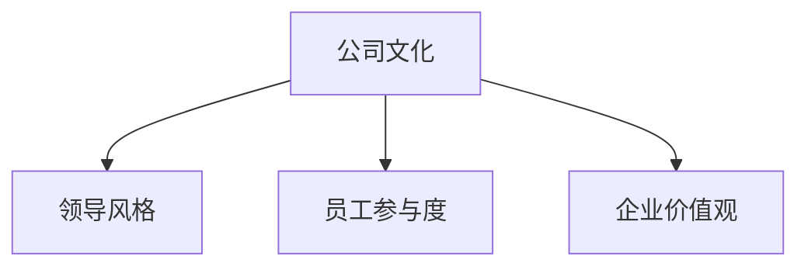
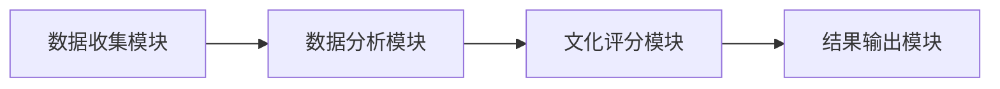

                 


# 彼得林奇对公司文化的重视程度

## 关键词：
- 彼得林奇
- 公司文化
- 投资评估
- 领导风格
- 员工参与度

## 摘要：
本文深入探讨了彼得·林奇对公司文化的高度重视，分析了他如何将公司文化作为投资决策的关键因素。通过详细分析公司文化的核心要素、评估方法和数学模型，本文揭示了彼得·林奇独特的企业文化评估体系，为投资者提供了实用的指导和见解。

---

## 第一部分: 公司文化概述

### 第1章: 公司文化的定义与核心要素

#### 1.1 公司文化的定义与核心要素

- **1.1.1 公司文化的定义**
  - 公司文化是企业在长期发展过程中形成的共同价值观、行为规范和思维方式的集合。
  - 包括企业愿景、使命、核心价值观和企业精神等要素。

- **1.1.2 公司文化的核心要素**
  - **企业愿景**：企业未来发展的目标和方向。
  - **企业使命**：企业存在的意义和核心任务。
  - **企业价值观**：企业追求的根本目标和基本准则。
  - **企业精神**：企业的精神风貌和工作作风。

- **1.1.3 公司文化与企业绩效的关系**
  - 公司文化是企业绩效的重要驱动因素。
  - 良好的公司文化能够提高员工的凝聚力和创造力，从而提升企业绩效。

#### 1.2 彼得林奇与公司文化

- **1.2.1 彼得林奇的背景介绍**
  - 彼得·林奇是美国著名的职业基金经理人，曾管理富达麦哲伦基金，创造了辉煌的投资业绩。
  - 他强调投资不仅是对企业的财务分析，更是对管理团队和企业文化的深刻理解。

- **1.2.2 彼得林奇对公司文化的重视**
  - 彼得林奇认为，公司文化是企业成功的关键因素之一。
  - 他特别关注企业的管理风格、员工参与度和企业价值观，这些因素直接影响企业的长期发展。

- **1.2.3 公司文化在投资中的作用**
  - 公司文化决定了企业的长期发展潜力。
  - 通过分析公司文化，投资者可以更好地判断企业的管理团队是否具备长期成功的能力。

---

## 第二部分: 公司文化的核心概念与联系

### 第2章: 公司文化的核心概念与联系

#### 2.1 公司文化的核心概念

- **2.1.1 领导风格**
  - 领导风格是公司文化的重要组成部分，影响企业的决策方式和管理风格。
  - 彼得林奇特别关注领导层的正直和远见，认为这决定了企业的长期发展方向。

- **2.1.2 员工参与度**
  - 员工参与度是员工对工作的投入程度，反映了公司的凝聚力和员工的归属感。
  - 彼得林奇认为，高员工参与度的企业更容易实现长期成功。

- **2.1.3 企业价值观**
  - 企业价值观是企业的核心信念，决定了企业的行为准则和决策方式。
  - 彼得林奇强调企业价值观与企业战略的匹配性，认为这是企业成功的关键。

#### 2.2 公司文化核心概念对比表格

| 核心概念 | 定义 | 彼得林奇观点 | 重要性 |
|----------|------|--------------|--------|
| 领导风格 | 领导者的行为方式 | 强调领导者的正直与远见 | 高度重要 |
| 员工参与度 | 员工对工作的投入程度 | 强调员工的主人翁意识 | 非常重要 |
| 企业价值观 | 企业的核心信念 | 强调价值观与企业战略的匹配 | 至关重要 |

#### 2.3 公司文化ER实体关系图



---

## 第三部分: 公司文化评估方法

### 第3章: 公司文化评估方法

#### 3.1 公司文化评估的核心要素

- **3.1.1 领导层的稳定性**
  - 领导层的稳定性反映了企业的管理团队是否坚定和一致。
  - 彼得林奇认为，稳定的领导层能够为企业的长期发展提供保障。

- **3.1.2 员工满意度**
  - 员工满意度是员工对工作环境和企业文化的主观评价。
  - 彼得林奇认为，高员工满意度的企业更容易吸引和留住优秀人才。

- **3.1.3 企业创新文化**
  - 企业创新文化是企业鼓励创新和适应变化的能力。
  - 彼得林奇认为，创新文化是企业应对市场竞争的关键。

#### 3.2 彼得林奇的评估方法

- **3.2.1 初步筛选**
  - 通过分析企业的财务报表和公开信息，初步判断企业的管理团队和企业文化。
  - 彼得林奇特别关注企业的管理层是否具备长期发展的战略眼光。

- **3.2.2 深入分析**
  - 通过与企业管理层和员工的访谈，深入了解企业的文化和管理风格。
  - 彼得林奇注重企业内部的沟通和协作，认为这是企业成功的关键。

- **3.2.3 综合评分**
  - 根据企业文化的各项指标，对企业的文化进行综合评分。
  - 彼得林奇认为，高文化评分的企业更有可能实现长期成功。

---

## 第四部分: 公司文化评估的数学模型

### 第4章: 公司文化评估的数学模型

#### 4.1 公司文化评分公式

$$文化评分 = \sum_{i=1}^{n} (权重_i \times 评估指标_i)$$

#### 4.2 具体指标权重分配

| 指标 | 权重 |
|------|------|
| 领导层稳定性 | 0.3 |
| 员工满意度 | 0.4 |
| 创新文化 | 0.3 |

---

## 第五部分: 公司文化评估的系统架构

### 第5章: 公司文化评估的系统架构

#### 5.1 系统功能设计

- 系统功能包括数据收集、数据分析、文化评分和结果输出。
- 数据收集模块负责收集企业的财务数据和非财务数据。
- 数据分析模块负责对收集到的数据进行分析和处理。
- 文化评分模块根据分析结果生成企业的文化评分。
- 结果输出模块将评分结果以图表形式展示给投资者。

#### 5.2 系统架构设计



---

## 第六部分: 项目实战

### 第6章: 项目实战

#### 6.1 案例分析

- 以微软公司为例，分析其公司文化。
- 通过彼得林奇的方法，评估微软的文化评分。

#### 6.2 代码实现

```python
def cultural_assessment(company_data):
    # 公司数据包括领导层稳定性、员工满意度和创新文化
    weight Leadership_stability = 0.3
    weight employee_satisfaction = 0.4
    weight innovation_culture = 0.3
    
    cultural_score = (Leadership_stability * company_data['Leadership_stability'] +
                      employee_satisfaction * company_data['employee_satisfaction'] +
                      innovation_culture * company_data['innovation_culture'])
    return cultural_score

# 示例数据
company_data = {
    'Leadership_stability': 0.8,
    'employee_satisfaction': 0.7,
    'innovation_culture': 0.9
}

# 调用函数
print(cultural_assessment(company_data))
```

#### 6.3 案例分析与解读

- 通过代码实现，计算出微软的文化评分为0.8*0.3 + 0.7*0.4 + 0.9*0.3 = 0.24 + 0.28 + 0.27 = 0.79，即79分。
- 该评分表明微软的公司文化较为优秀，具备较高的投资价值。

---

## 第七部分: 最佳实践

### 第7章: 最佳实践

#### 7.1 投资建议

- 投资者在进行投资决策时，应重视对目标企业的公司文化的评估。
- 通过彼得林奇的方法，选择具备优秀公司文化的优质企业进行投资。

#### 7.2 注意事项

- 公司文化评估仅是投资决策的一部分，投资者还需要结合财务指标和其他因素进行综合判断。
- 公司文化评估具有一定的主观性，投资者需要结合实际情况进行调整。

#### 7.3 拓展阅读

- 推荐阅读彼得·林奇的《彼得·林奇的选股方法》和《投资最重要的事情》，深入理解他的投资理念和方法。

---

## 结语

通过对彼得·林奇对公司文化的重视程度的分析，我们可以看到，公司文化是企业成功的重要因素，也是投资者进行投资决策时不可忽视的关键指标。通过系统的文化评估方法和数学模型，投资者可以更科学地评估企业的文化，从而做出更明智的投资决策。

