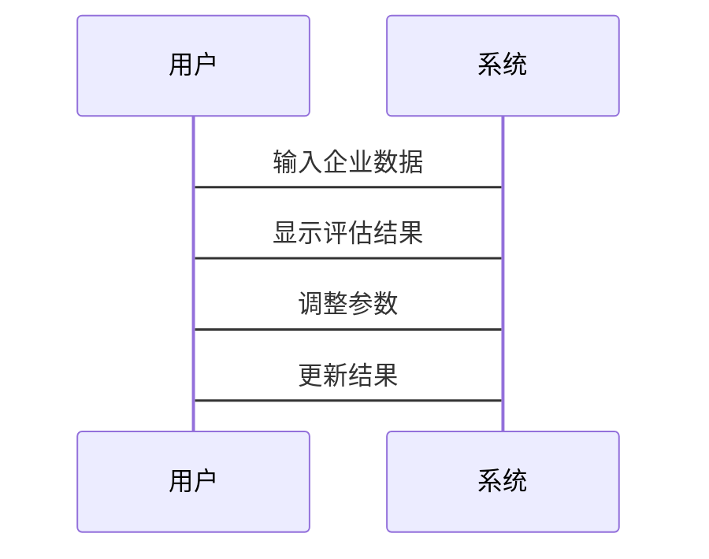

                 


# 彼得林奇对公司无形资产价值的量化分析方法

## 关键词：彼得·林奇，无形资产，价值量化，净现值，贴现现金流，投资评估

## 摘要：本文详细探讨了彼得·林奇对公司无形资产价值进行量化分析的方法，结合具体案例和系统架构设计，深入分析了无形资产的核心概念、量化方法和实际应用，帮助读者理解如何在投资决策中准确评估无形资产的价值。

---

# 第一部分：无形资产价值量化分析的背景与基础

## 第1章：无形资产的基本概念与重要性

### 1.1 无形资产的定义与特点

#### 1.1.1 无形资产的定义
- 无形资产是企业拥有的非实物资产，包括专利权、商标权、版权、商誉等。
- 无形资产的特征：不可见性、长期性、价值波动性。

#### 1.1.2 无形资产的核心特点
- 独占性：如专利权具有排他性。
- 时间性：无形资产的价值会随着时间推移而变化。
- 变化性：受市场和技术的影响较大。

#### 1.1.3 无形资产在企业中的重要性
- 无形资产是企业核心竞争力的体现。
- 在企业整体价值中占据重要比重，尤其是在高科技企业。

### 1.2 彼得·林奇与价值投资概述

#### 1.2.1 彼得·林奇的背景介绍
- 美国著名投资家，曾管理富达麦哲伦基金，创造了卓越的投资业绩。
- 以价值投资闻名，注重分析企业的基本面。

#### 1.2.2 价值投资的核心理念
- 投资的本质是寻找被市场低估的企业。
- 重点关注企业的财务健康、管理层能力和行业地位。

#### 1.2.3 无形资产在价值投资中的地位
- 无形资产是企业长期竞争优势的体现。
- 在评估企业价值时，无形资产的量化分析至关重要。

### 1.3 无形资产价值量化分析的必要性

#### 1.3.1 无形资产对企业价值的影响
- 无形资产直接影响企业的盈利能力。
- 在企业估值中，无形资产占比越来越高。

#### 1.3.2 无形资产量化分析的意义
- 为投资决策提供准确依据。
- 帮助企业合理分配资源，提升竞争力。

#### 1.3.3 无形资产量化分析的挑战与机遇
- 挑战：无形资产难以量化，价值易受主观因素影响。
- 机遇：通过科学方法可以提高评估准确性。

---

## 第2章：无形资产价值量化分析的核心概念

### 2.1 无形资产的分类与属性

#### 2.1.1 无形资产的主要分类
- 知识产权类：专利权、商标权、版权。
- 商誉类：企业整体价值中的非实体部分。
- 其他无形资产：如特许经营权、客户关系等。

#### 2.1.2 不同类型无形资产的特征对比
| 资产类型 | 生命周期 | 价值波动 | 影响因素 |
|----------|-----------|-----------|----------|
| 专利权   | 中长期    | 显著      | 技术进步 |
| 商标权   | 长期      | 中等      | 市场竞争 |
| 版权     | 长期      | 高        | 创意价值 |

#### 2.1.3 无形资产的生命周期与价值波动
- 专利权的价值可能随技术进步而快速变化。
- 商誉类资产的价值受企业业绩和市场环境影响。

### 2.2 无形资产价值评估的理论基础

#### 2.2.1 资产评估的基本原理
- 资产评估基于市场、收益、成本三重角度。
- 无形资产的评估需要考虑其未来盈利能力。

#### 2.2.2 无形资产评估的独特性
- 无形资产缺乏实物形态，难以直接观察。
- 评估依赖于市场数据和企业内部信息。

#### 2.2.3 财务报表中无形资产的处理方式
- 财务报表中无形资产的确认和计量。
- 商誉的会计处理及其影响。

### 2.3 无形资产价值量化的核心要素

#### 2.3.1 无形资产的经济寿命
- 无形资产的使用寿命对企业价值的影响。
- 不同类型无形资产的经济寿命差异。

#### 2.3.2 无形资产的市场价值
- 市场供需关系对无形资产价值的影响。
- 行业基准和可比交易的参考作用。

#### 2.3.3 无形资产的风险与收益分析
- 无形资产的收益预测方法。
- 风险因素对无形资产价值的调整。

---

## 第3章：彼得·林奇的无形资产价值量化方法

### 3.1 彼得·林奇分析方法的概述

#### 3.1.1 林奇分析法的基本框架
- 从企业基本面分析入手。
- 重点关注企业的财务状况和竞争优势。

#### 3.1.2 林奇分析法的核心步骤
1. 识别企业核心竞争力。
2. 评估无形资产的价值。
3. 结合财务指标进行综合判断。

#### 3.1.3 林奇分析法的适用场景
- 适用于高科技企业和创新型行业。
- 在企业估值和投资决策中提供参考。

### 3.2 无形资产价值量化的主要步骤

#### 3.2.1 确定无形资产的种类与范围
- 明确企业拥有的无形资产类型。
- 界定无形资产的评估范围。

#### 3.2.2 评估无形资产的市场价值
- 使用市场法、收益法等评估方法。
- 参考可比交易和行业基准。

#### 3.2.3 计算无形资产的折现率与净现值
- 确定合适的折现率。
- 计算无形资产的净现值（NPV）。

### 3.3 林奇分析法的数学模型与公式

#### 3.3.1 无形资产价值的计算公式
$$ 价值 = \frac{未来收益}{折现率} $$

#### 3.3.2 净现值（NPV）的计算方法
$$ NPV = \sum_{t=1}^{n} \frac{CF_t}{(1 + r)^t} $$

其中，\( CF_t \) 是第 \( t \) 年的现金流，\( r \) 是折现率。

#### 3.3.3 内部收益率（IRR）的计算方法
$$ IRR = \text{使 NPV = 0 的折现率} $$

---

## 第4章：无形资产价值量化分析的系统架构

### 4.1 系统分析与需求定义

#### 4.1.1 问题场景的描述
- 企业需要准确评估无形资产价值，支持投资决策。
- 无形资产的量化分析需要系统化的方法。

#### 4.1.2 系统目标与范围
- 开发一个基于林奇分析法的无形资产量化分析系统。
- 支持多种评估方法和数据输入。

#### 4.1.3 系统功能需求
- 无形资产分类与管理。
- 评估方法选择与应用。
- 结果分析与可视化。

### 4.2 系统架构设计

#### 4.2.1 系统模块划分
- 数据输入模块：接收企业财务数据和市场信息。
- 评估计算模块：执行无形资产价值评估。
- 结果展示模块：可视化分析结果。

#### 4.2.2 系统架构的 Mermaid 图


### 4.3 系统接口设计与交互流程

#### 4.3.1 系统接口设计
- 输入接口：支持多种数据格式。
- 输出接口：提供可视化报告和数据导出功能。

#### 4.3.2 系统交互的 Mermaid 图



---

## 第5章：项目实战与案例分析

### 5.1 环境安装与数据准备

#### 5.1.1 环境安装
- 安装 Python 和相关库（如 NumPy、Pandas）。
- 配置开发环境（如 Jupyter Notebook）。

#### 5.1.2 数据准备
- 收集企业的财务数据和市场信息。
- 确定无形资产的种类和范围。

### 5.2 核心实现与代码示例

#### 5.2.1 无形资产价值计算代码

```python
import numpy as np
import pandas as pd

def calculate_npv(cash_flows, discount_rate):
    npv = 0
    for t in range(len(cash_flows)):
        npv += cash_flows[t] / (1 + discount_rate)**t
    return npv

# 示例数据
cash_flows = [100, 200, 300]
discount_rate = 0.1

result = calculate_npv(cash_flows, discount_rate)
print(f"净现值为：{result}")
```

#### 5.2.2 内部收益率计算代码

```python
def calculate_irr(cash_flows):
    try:
        return np.irr(cash_flows)
    except:
        return None

cash_flows = [-500, 200, 200, 200]
print(f"内部收益率为：{calculate_irr(cash_flows)}")
```

### 5.3 案例分析与结果解读

#### 5.3.1 案例分析
- 某科技公司专利权的评估。
- 使用林奇分析法计算其净现值和内部收益率。

#### 5.3.2 结果解读
- 净现值为正，说明项目具有投资价值。
- 内部收益率高于行业基准，进一步确认其可行性。

### 5.4 项目小结

#### 5.4.1 项目总结
- 成功开发了基于林奇分析法的无形资产量化分析系统。
- 通过案例验证了系统的有效性和准确性。

#### 5.4.2 经验与教训
- 数据质量对评估结果影响重大。
- 系统设计需要充分考虑用户需求和实际应用场景。

---

## 第6章：最佳实践与总结

### 6.1 最佳实践

#### 6.1.1 无形资产评估的注意事项
- 确保数据的准确性和完整性。
- 综合考虑多种评估方法。

#### 6.1.2 系统应用的优化建议
- 定期更新模型和数据。
- 提供多维度的分析结果。

### 6.2 小结

#### 6.2.1 核心内容回顾
- 彼得·林奇的分析方法在无形资产量化中的应用。
- 系统化的方法和工具支持投资决策。

#### 6.2.2 未来展望
- 结合人工智能技术提升评估效率和准确性。
- 推动无形资产量化分析的标准化和普及化。

### 6.3 注意事项

#### 6.3.1 数据采集风险
- 数据不完整可能导致评估结果偏差。
- 数据偏差影响决策的准确性。

#### 6.3.2 模型局限性
- 模型假设可能与实际情况不符。
- 需结合行业特点进行调整。

### 6.4 拓展阅读

#### 6.4.1 推荐书籍
- 《彼得·林奇的投资哲学》。
- 《企业价值评估方法论》。

#### 6.4.2 相关研究
- 无形资产在并购中的价值评估。
- 数字经济时代无形资产的管理与优化。

---

通过以上目录，我们可以系统地学习和理解彼得·林奇的无形资产价值量化分析方法，并将其应用于实际投资决策中，提升企业的价值评估能力和投资决策的科学性。

