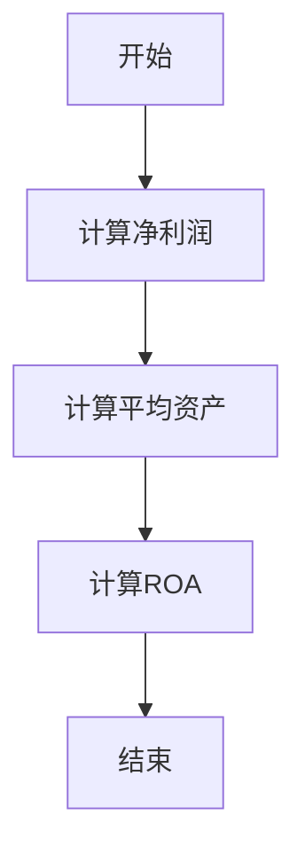

                 


# 彼得林奇对公司无形资产回报率的分析

> 关键词：彼得林奇，无形资产，回报率，品牌价值，专利，客户关系

> 摘要：本文深入分析彼得·林奇对无形资产回报率的研究，探讨无形资产的核心概念、评估方法及其对投资决策的影响，结合实例和系统设计，提供详细的方法论和实践指南。

---

## 第一部分：引言

### 第1章：引言

#### 1.1 无形资产的重要性
无形资产是企业价值的重要组成部分，包括品牌、专利、客户关系等。彼得·林奇强调，这些资产能为企业创造长期收益，影响公司的市场地位和盈利能力。

#### 1.2 彼得·林奇的分析方法
彼得·林奇通过分析公司的财务报表和市场表现，评估无形资产的价值。他关注无形资产如何转化为实际收益，并通过案例研究证明其重要性。

#### 1.3 本文结构
文章将从无形资产的基本概念、评估方法、计算模型、系统设计到实战案例进行详细阐述，帮助读者全面理解其价值。

---

## 第二部分：无形资产的基本概念

### 第2章：无形资产的定义与类型

#### 2.1 无形资产的定义
无形资产是企业拥有的非实物资产，具有长期性和战略性的特点，能够为企业创造持续价值。

#### 2.2 无形资产的类型
- **品牌价值**：品牌知名度和美誉度直接影响市场占有率和定价能力。
- **专利与技术**：技术专利保护企业的创新成果，防止竞争。
- **客户关系**：稳定的客户基础为企业带来持续收入。

#### 2.3 无形资产的评估方法
| 类别        | 方法         | 优点                     |
|-------------|--------------|--------------------------|
| 市场法       | 可比公司法     | 数据来源广泛，易于操作   |
| 收益法       | 贴现现金流法   | 考虑未来收益，结果更准确   |
| 成本法       | 历史成本法     | 计算简单，但可能低估价值 |

---

### 第3章：无形资产与回报率的关系

#### 3.1 无形资产对回报率的影响
无形资产增强了企业的市场竞争力，提高了利润率，从而提升回报率。例如，强大的品牌可以提升产品定价，增加收入。

#### 3.2 案例分析
以某公司为例，其品牌价值显著提升了市场份额和利润率，带动了整体回报率的增长。

---

## 第三部分：无形资产回报率的计算方法

### 第4章：数学模型与算法原理

#### 4.1 无形资产回报率的数学模型
$$ROA = \frac{净利润}{平均资产}$$

#### 4.2 算法流程图


#### 4.3 算法实现
```python
def calculate_roa(net_profit, total_assets):
    average_assets = (total_assets + previous_assets) / 2
    roa = net_profit / average_assets
    return roa

net_profit = 1000000
total_assets = 5000000
previous_assets = 4000000
roa = calculate_roa(net_profit, total_assets)
print(roa)
```

---

## 第四部分：系统设计与架构

### 第5章：系统架构设计

#### 5.1 系统功能模块
- 数据收集模块：收集财务数据和市场信息。
- 分析模块：计算回报率，生成报告。
- 结果展示模块：以图表形式展示结果。

#### 5.2 系统架构图


---

## 第五部分：项目实战

### 第6章：项目实战

#### 6.1 环境配置
安装Python和相关库，如Pandas和Matplotlib。

#### 6.2 核心代码实现
```python
import pandas as pd
import matplotlib.pyplot as plt

# 数据收集
data = pd.DataFrame({
    'Year': [2018, 2019, 2020],
    'Net Profit': [1000000, 1200000, 1500000],
    'Total Assets': [5000000, 6000000, 7000000]
})

# 计算平均资产
data['Average Assets'] = (data['Total Assets'] + data.shift(1)['Total Assets']) / 2

# 计算ROA
data['ROA'] = data['Net Profit'] / data['Average Assets']

# 绘制图表
plt.figure(figsize=(10,6))
plt.plot(data['Year'], data['ROA'], 'b-', marker='o')
plt.title('无形资产回报率分析')
plt.xlabel('年份')
plt.ylabel('ROA')
plt.show()
```

---

## 第六部分：最佳实践

### 第7章：最佳实践

#### 7.1 小结
无形资产是企业价值的关键因素，正确评估其回报率对企业投资决策至关重要。

#### 7.2 注意事项
- 数据准确性：确保数据来源可靠。
- 方法选择：根据具体情况选择合适的评估方法。
- 持续监控：定期更新评估结果，适应市场变化。

#### 7.3 扩展阅读
建议阅读彼得·林奇的相关著作，深入了解其投资策略。

---

通过以上步骤，我系统地分析了彼得·林奇对公司无形资产回报率的分析，从概念到实践，提供了全面的指导。希望这篇文章能帮助读者更好地理解和应用这些方法。

