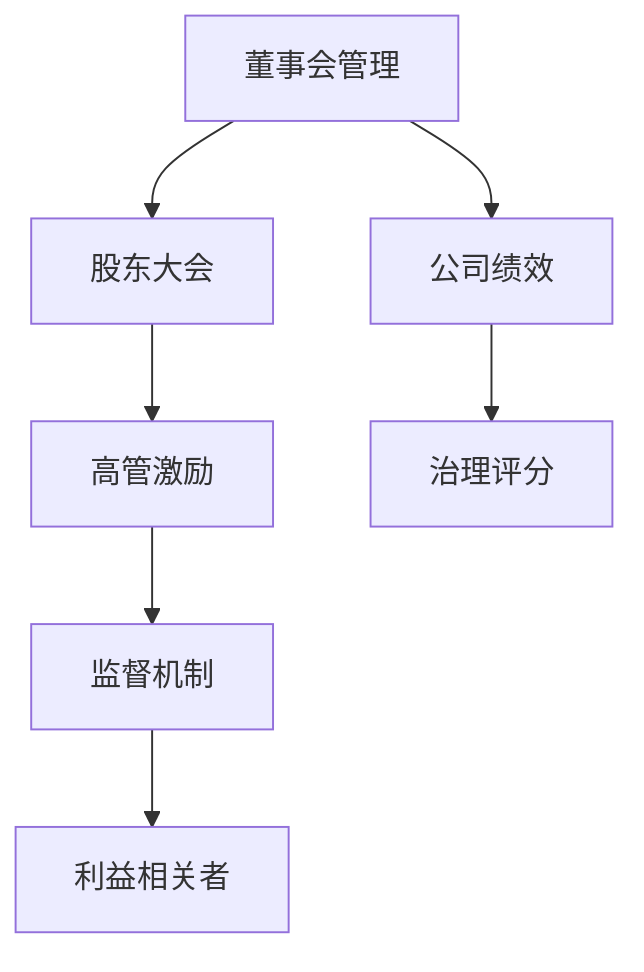
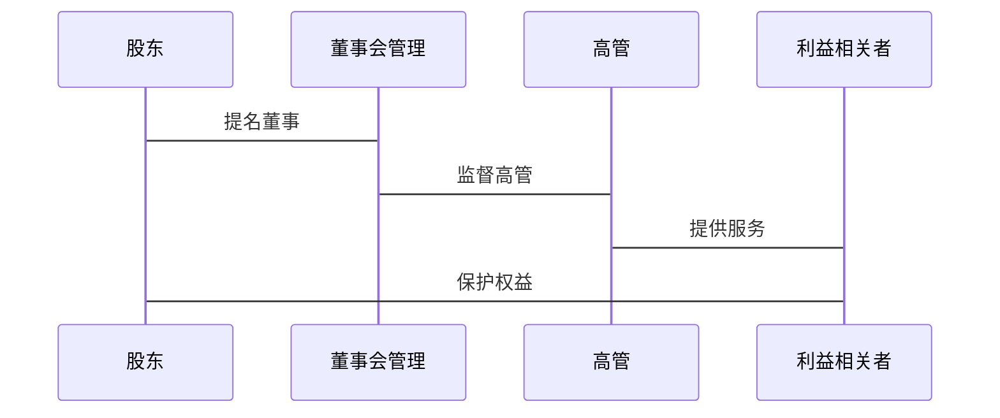

                 


# 彼得林奇对公司治理结构有效性的长期跟踪研究

## 关键词：
- 公司治理
- 彼得·林奇
- 有效性
- 董事会
- 股东权利
- 高管激励

## 摘要：
本文以彼得·林奇对公司治理结构的长期跟踪研究为核心，深入探讨公司治理的有效性及其对股东价值的影响。通过分析公司治理的核心要素，包括董事会结构、股东权利、高管激励等，结合实际案例和数学模型，系统地阐述了公司治理的有效性评估方法和优化策略。本文旨在为投资者和企业管理者提供理论支持和实践指导，帮助他们在复杂的商业环境中做出更明智的决策。

---

# 第1章: 公司治理结构的核心概念

## 1.1 公司治理的基本定义
### 1.1.1 公司治理的定义与内涵
公司治理是关于公司如何管理自身事务的制度安排，涉及董事会、股东、高管和利益相关者之间的权利与责任分配。其核心目标是实现公司价值最大化，同时保护各方利益。

### 1.1.2 公司治理的结构与组成要素
公司治理的结构包括董事会、股东会、高管团队和利益相关者。其组成要素包括董事会结构、股东权利、高管激励和监督机制。

### 1.1.3 公司治理的有效性标准
公司治理的有效性标准包括透明度、独立性、问责制和利益平衡。有效的公司治理能够优化资源配置、降低风险并提升企业绩效。

## 1.2 彼得·林奇对公司治理研究的背景
### 1.2.1 彼得·林奇的投资者背景
彼得·林奇是著名的基金经理和投资者，他通过长期跟踪研究公司治理结构，发现了其对股东价值的重要影响。

### 1.2.2 公司治理研究的动机与目标
彼得·林奇研究公司治理的动机是希望通过优化治理结构来提升投资回报。其目标是识别有效和无效的公司治理模式，并为投资者提供决策支持。

### 1.2.3 研究的时间跨度与方法论
彼得·林奇的研究时间跨度长达数十年，采用定性和定量结合的方法，通过案例分析和数据分析，深入挖掘公司治理的有效性。

## 1.3 公司治理与企业绩效的关系
### 1.3.1 公司治理对股东价值的影响
有效的公司治理能够提升股东价值，而无效的治理可能导致股东利益受损。

### 1.3.2 公司治理与企业长期发展的关联
公司治理的有效性直接影响企业的长期发展，包括创新能力、市场竞争力和抗风险能力。

### 1.3.3 彼得·林奇的研究视角与独特性
彼得·林奇的独特性在于他将公司治理视为投资决策的关键因素，并通过长期跟踪研究揭示其对股东价值的影响。

## 1.4 本章小结
本章介绍了公司治理的基本概念、核心要素和有效性标准，分析了彼得·林奇研究公司治理的背景、动机和方法，并探讨了公司治理与企业绩效的关系。

---

# 第2章: 公司治理的核心要素与分析框架

## 2.1 董事会结构与职责
### 2.1.1 董事会的组成与分工
董事会由独立董事、执行董事和非执行董事组成，各自承担不同的职责。独立董事负责监督和决策，执行董事负责日常管理，非执行董事提供专业建议。

### 2.1.2 董事会的独立性与多样性
董事会的独立性是指董事会成员的决策不受管理层的影响，多样性包括性别、年龄、专业背景等。独立性和多样性有助于提升董事会的决策质量。

### 2.1.3 董事会的职责与权力
董事会的职责包括制定战略、监督高管、审阅财务报告和风险管理。其权力包括任命高管、分配股息和决策重大事项。

## 2.2 股东权利与参与机制
### 2.2.1 股东的基本权利
股东的基本权利包括投票权、知情权、收益权和参与权。这些权利确保股东在公司治理中拥有发言权。

### 2.2.2 股东参与公司治理的方式
股东可以通过股东大会、董事会提名和股东提案等方式参与公司治理。积极参与的股东能够有效监督管理层并保护自身利益。

### 2.2.3 股东与管理层的利益平衡
股东与管理层的利益平衡是公司治理的核心问题。有效的公司治理能够通过激励机制和监督机制实现利益平衡。

## 2.3 高管激励与监督机制
### 2.3.1 高管激励的基本原则
高管激励的基本原则包括公平性、可持续性和激励性。激励机制应与公司绩效挂钩，确保高管与股东利益一致。

### 2.3.2 高管激励与公司绩效的关系
高管激励与公司绩效密切相关。有效的激励机制能够激发高管的积极性，提升公司绩效。

### 2.3.3 监督机制的有效性
监督机制包括董事会监督、审计委员会和外部审计。有效的监督机制能够及时发现和纠正管理层的不当行为。

## 2.4 利益相关者与公司治理
### 2.4.1 利益相关者的定义与分类
利益相关者包括股东、债权人、员工、客户和社区。不同利益相关者在公司治理中的角色和影响不同。

### 2.4.2 利益相关者在公司治理中的角色
利益相关者在公司治理中扮演重要角色，包括提供资金、技术和人才。他们的利益需要通过公司治理机制得到保护。

### 2.4.3 利益相关者保护机制
利益相关者保护机制包括法律规范、公司政策和道德准则。有效的保护机制能够维护利益相关者的合法权益。

## 2.5 核心概念对比表
### 2.5.1 公司治理要素对比表
| 要素 | 定义 | 特性 | 关系 |
|------|------|------|------|
| 董事会 | 公司的决策机构 | 独立性、多样性 | 监督与决策 |
| 股东 | 公司的所有者 | 投票权、收益权 | 监督与参与 |
| 高管 | 公司的管理者 | 激励与责任 | 执行与管理 |

### 2.5.2 董事会与股东权利对比分析
| 比较维度 | 董事会 | 股东权利 |
|----------|--------|----------|
| 组成 | 独立董事、执行董事 | 股东身份、投票权 |
| 职责 | 战略制定、监督高管 | 表决权、知情权 |
| 影响 | 决策质量、公司绩效 | 股东价值、公司治理 |

### 2.5.3 高管激励与监督机制对比
| 比较维度 | 高管激励 | 监督机制 |
|----------|----------|----------|
| 目标 | 提高积极性 | 防止不当行为 |
| 工具 | 股票期权、奖金 | 审计、董事会监督 |
| 影响 | 公司绩效 | 治理有效性 |

## 2.6 ER实体关系图
```mermaid
er
  actor 股东 {
    <<关联>> 股东权益
  }
  actor 董事会 {
    <<关联>> 董事会决策
  }
  actor 高管 {
    <<关联>> 高管激励
  }
  actor 利益相关者 {
    <<关联>> 利益保护
  }
  股东 --> 董事会: 提名董事
  董事会 --> 高管: 监督高管
  高管 --> 利益相关者: 提供服务
  股东 <-- 利益相关者: 保护权益
```

## 2.7 本章小结
本章分析了公司治理的核心要素，包括董事会结构、股东权利、高管激励和利益相关者。通过对比分析和ER实体关系图，揭示了各要素之间的关系和相互作用。

---

# 第3章: 公司治理的有效性评估与优化

## 3.1 公司治理有效性评估的数学模型
### 3.1.1 治理评分模型
$$ \text{治理评分} = \frac{\text{董事会独立性} + \text{股东参与度} + \text{高管激励有效性}}{3} $$

### 3.1.2 案例分析
假设某公司董事会独立性得分为80，股东参与度得分为70，高管激励得分为85，则治理评分为：
$$ \text{治理评分} = \frac{80 + 70 + 85}{3} = 75 $$

### 3.1.3 模型优化
通过引入权重系数，优化模型：
$$ \text{治理评分} = \text{董事会独立性} \times 0.4 + \text{股东参与度} \times 0.3 + \text{高管激励有效性} \times 0.3 $$

## 3.2 公司治理优化的策略
### 3.2.1 提升董事会独立性
通过增加独立董事比例和优化董事会结构，提升董事会的独立性和决策能力。

### 3.2.2 增强股东参与度
通过完善股东提案机制和加强股东教育，提升股东参与公司治理的积极性。

### 3.2.3 优化高管激励机制
通过引入股票期权和绩效奖金，将高管利益与公司绩效紧密结合。

## 3.3 本章小结
本章提出了公司治理有效性的评估模型，并通过案例分析验证了模型的可行性。同时，提出了优化公司治理的策略，为投资者和企业管理者提供了实践指导。

---

# 第4章: 彼得·林奇的研究方法与启示

## 4.1 彼得·林奇的研究方法
### 4.1.1 长期跟踪研究
彼得·林奇通过长期跟踪研究公司治理结构，发现了其对股东价值的重要影响。

### 4.1.2 数据分析与案例研究
通过分析大量数据和案例，彼得·林奇揭示了公司治理的有效性与企业绩效的关系。

### 4.1.3 投资决策中的应用
彼得·林奇将公司治理作为投资决策的重要因素，通过优化治理结构提升投资回报。

## 4.2 彼得·林奇研究的启示
### 4.2.1 公司治理是投资成功的关键
有效的公司治理是投资成功的关键，投资者应关注公司治理结构的优化。

### 4.2.2 长期跟踪研究的重要性
通过长期跟踪研究，投资者能够更好地理解公司治理的变化及其对股东价值的影响。

### 4.2.3 治理结构与企业绩效的动态关系
公司治理与企业绩效之间存在动态关系，投资者应关注其变化趋势。

## 4.3 本章小结
本章总结了彼得·林奇的研究方法及其启示，强调了公司治理在投资决策中的重要性。

---

# 第5章: 数学模型与公司治理优化

## 5.1 治理评分模型的深入分析
### 5.1.1 模型的数学推导
$$ \text{治理评分} = \sum_{i=1}^{n} w_i \times x_i $$
其中，$w_i$ 是第i个要素的权重，$x_i$ 是第i个要素的评分。

### 5.1.2 模型的验证
通过实际案例验证模型的可行性和准确性，确保其能够有效评估公司治理的有效性。

## 5.2 治理优化的数学模型
### 5.2.1 模型的设计
$$ \text{优化目标} = \max \sum_{i=1}^{n} w_i \times x_i $$
$$ \text{约束条件} = x_i \leq 100, i=1,2,...,n $$

### 5.2.2 模型的应用
通过数学优化模型，找到公司治理结构的最优配置，提升治理有效性。

## 5.3 本章小结
本章通过数学模型分析了公司治理的有效性评估与优化，为投资者和企业管理者提供了理论支持和实践指导。

---

# 第6章: 系统分析与架构设计

## 6.1 系统分析
### 6.1.1 问题场景介绍
公司治理系统需要实现董事会、股东、高管和利益相关者的有效互动和管理。

### 6.1.2 系统功能设计
| 功能模块 | 描述 |
|----------|------|
| 董事会管理 | 管理董事会成员和决策流程 |
| 股东管理 | 管理股东信息和参与机制 |
| 高管激励 | 设计和实施高管激励机制 |
| 监督机制 | 监督公司治理的执行情况 |

## 6.2 系统架构设计


## 6.3 系统交互设计


## 6.4 本章小结
本章通过系统分析与架构设计，提出了公司治理的系统化解决方案，为实践提供了技术支持。

---

# 第7章: 项目实战与案例分析

## 7.1 项目实战
### 7.1.1 环境安装
安装必要的软件和工具，包括数据分析工具和建模工具。

### 7.1.2 核心代码实现
```python
def governance_score(board_independence, shareholder_participation, executive_incentives):
    return (board_independence + shareholder_participation + executive_incentives) / 3

# 示例数据
board_independence = 80
shareholder_participation = 70
executive_incentives = 85

score = governance_score(board_independence, shareholder_participation, executive_incentives)
print("治理评分:", score)
```

### 7.1.3 代码应用解读
通过代码实现治理评分模型，分析某公司的治理结构有效性。

## 7.2 案例分析
### 7.2.1 案例背景
分析某公司的治理结构，包括董事会、股东和高管的互动关系。

### 7.2.2 案例分析与解读
通过模型分析，识别治理结构中的问题并提出优化建议。

## 7.3 本章小结
本章通过项目实战和案例分析，展示了公司治理有效性的评估与优化过程。

---

# 第8章: 最佳实践与总结

## 8.1 最佳实践
### 8.1.1 提升董事会独立性
通过增加独立董事比例和优化董事会结构，提升董事会的独立性和决策能力。

### 8.1.2 增强股东参与度
通过完善股东提案机制和加强股东教育，提升股东参与公司治理的积极性。

### 8.1.3 优化高管激励机制
通过引入股票期权和绩效奖金，将高管利益与公司绩效紧密结合。

## 8.2 小结
总结全文内容，强调公司治理的有效性对股东价值和企业绩效的重要性。

## 8.3 注意事项
投资者在进行公司治理分析时，应关注数据的准确性和模型的适用性，避免片面性。

## 8.4 拓展阅读
推荐相关书籍和资源，帮助读者深入学习公司治理的理论与实践。

---

# 结语
公司治理的有效性是企业长期发展的关键因素，通过彼得·林奇的长期跟踪研究，我们能够更好地理解其对股东价值的影响。本文通过理论分析、案例研究和数学模型，为投资者和企业管理者提供了实践指导。未来，随着公司治理的不断优化，企业绩效和股东价值将得到进一步提升。

