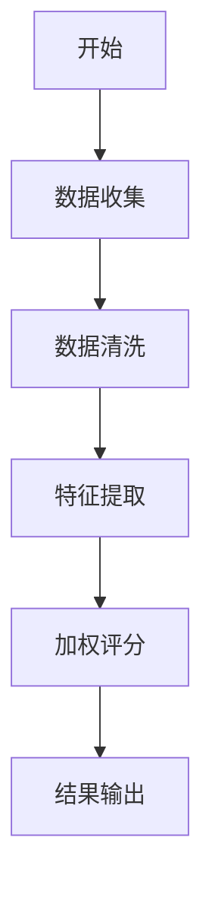
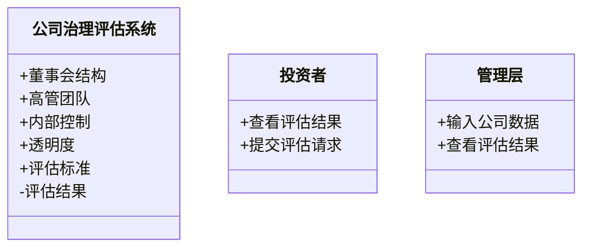
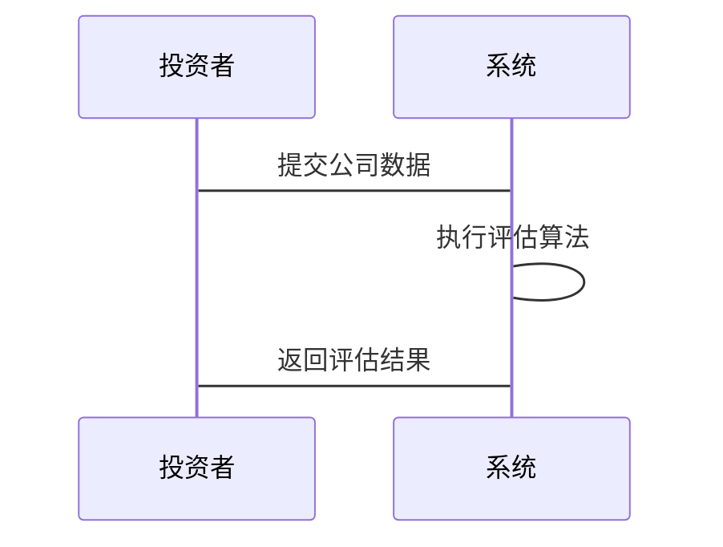

                 


# 《彼得林奇对公司治理结构的评估标准》

---

## 关键词：公司治理结构，彼得林奇，股东权益，董事会，高管团队，内部控制

---

## 摘要：彼得·林奇作为投资大师，提出了对公司治理结构的系统性评估标准。本文从公司治理的核心要素出发，分析其对投资决策的影响，探讨评估标准的数学模型和系统实现，结合实例进行深入剖析，为投资者和企业管理者提供实践指导。

---

# 第一部分: 公司治理结构的背景与重要性

## 第1章: 公司治理结构的概述

### 1.1 公司治理的基本概念

#### 1.1.1 公司治理的定义

公司治理是确保公司有效运作和股东权益保护的一套规则和机制。它涉及董事会、高管团队、股东和其他利益相关者之间的关系。

#### 1.1.2 公司治理的核心要素

- 股东结构
- 董事会结构
- 高管团队
- 内部控制
- 透明度与信息披露

#### 1.1.3 公司治理与企业绩效的关系

良好的公司治理是企业长期成功的关键因素。通过提高透明度和责任感，企业能够吸引更多的投资者，增强市场信任，从而提升绩效。

### 1.2 公司治理结构的发展历程

#### 1.2.1 早期公司治理的形态

早期公司治理较为简单，主要依赖于创始人或家族管理，缺乏独立的董事会和外部监管。

#### 1.2.2 现代公司治理的演变

随着企业规模扩大和股份制的发展，公司治理逐渐专业化，引入独立董事和审计机构，加强内部控制和合规性。

#### 1.2.3 不同国家和地区的治理模式对比

不同地区的公司治理存在差异，例如美国强调股东权益保护，而日本则注重内部治理和长期利益。

### 1.3 公司治理结构的重要性

#### 1.3.1 保护股东权益的作用

通过明确的董事会职责和高管激励机制，确保管理层以股东利益为重。

#### 1.3.2 促进企业长期发展的意义

良好的治理结构能够平衡短期利益与长期战略，确保企业稳定发展。

#### 1.3.3 提升企业透明度和信任度的价值

透明的治理结构有助于建立企业与投资者之间的信任，增强市场声誉。

### 1.4 彼得林奇与公司治理

#### 1.4.1 彼得林奇的投资理念

彼得林奇以价值投资闻名，注重企业的基本面分析和管理层质量，认为良好的公司治理是企业成功的关键。

#### 1.4.2 彼得林奇对公司治理的关注点

他特别关注董事会的独立性、高管团队的稳定性和内部控制的有效性，这些因素直接影响企业的长期绩效。

#### 1.4.3 彼得林奇的治理标准在投资中的应用

在投资决策中，彼得林奇会评估公司的治理结构，确保管理层有能力且诚信，董事会结构合理，能够保护股东利益。

### 1.5 本章小结

本章介绍了公司治理的基本概念、发展历程及其重要性，重点分析了彼得林奇的治理评估标准，为后续的深入探讨奠定了基础。

---

## 第2章: 公司治理结构的核心要素

### 2.1 股东结构

#### 2.1.1 股权分散与集中

股权分散可能导致公司控制权分散，增加治理难度；而股权集中则可能面临控制权过度集中的风险。

#### 2.1.2 主要股东的责任

主要股东应积极履行职责，维护公司利益，避免短期行为。

#### 2.1.3 股东权利的保护机制

包括投票权、知情权、收益权等，确保股东在公司重大决策中有发言权。

### 2.2 董事会结构

#### 2.2.1 董事会的组成

董事会应由独立董事和执行董事组成，独立董事的比例应足够，确保决策的独立性和客观性。

#### 2.2.2 董事会的职责

包括制定战略、监督高管、风险管理等，确保公司治理的有效性。

#### 2.2.3 独立董事的作用

独立董事能够提供独立的决策意见，避免董事会决策的偏向性。

### 2.3 高管团队

#### 2.3.1 高管的职责与权限

高管团队负责日常经营，确保战略执行和目标达成。

#### 2.3.2 高管的激励机制

通过股权激励、奖金等方式，确保高管与公司利益一致。

#### 2.3.3 高管的诚信与能力

彼得林奇特别关注高管的诚信和能力，认为这是企业成功的关键因素。

### 2.4 内部控制

#### 2.4.1 内部控制体系

包括风险管理、内部审计、合规性检查等，确保公司运营的合规性和高效性。

#### 2.4.2 风险管理机制

通过识别和评估风险，制定相应的应对策略，降低风险对公司的影响。

#### 2.4.3 审计与合规

内部审计能够发现和纠正问题，确保公司治理的有效性和合规性。

### 2.5 透明度与信息披露

#### 2.5.1 信息披露的重要性

及时准确的信息披露有助于投资者做出明智决策，增强市场信任。

#### 2.5.2 透明度的衡量标准

包括披露的完整性、及时性和准确性，以及管理层的沟通透明度。

#### 2.5.3 透明度与企业声誉

高透明度能够提升企业声誉，吸引更多投资者和合作伙伴。

### 2.6 本章小结

本章详细分析了公司治理的核心要素，强调了各部分之间的相互作用，为后续的评估标准奠定了基础。

---

## 第3章: 彼得林奇的公司治理评估标准

### 3.1 评估标准的核心要素

#### 3.1.1 股东权利的保护

确保股东在公司治理中有足够的发言权和利益保障。

#### 3.1.2 董事会的独立性

独立董事的比例和职责是评估董事会独立性的关键指标。

#### 3.1.3 高管团队的稳定性

高管团队的稳定性和能力直接影响公司的长期发展。

#### 3.1.4 内部控制的有效性

内部控制体系的完善性和执行力度是评估公司治理的重要标准。

### 3.2 评估标准的具体指标

#### 3.2.1 董事会独立性指标

- 独立董事比例
- 独立董事的背景和经验
- 独立董事的决策独立性

#### 3.2.2 高管团队稳定性指标

- 高管任期长短
- 高管变动频率
- 高管的业绩表现

#### 3.2.3 内部控制有效性指标

- 内部审计覆盖率
- 风险管理覆盖范围
- 内部控制的合规性

### 3.3 评估标准的实施步骤

#### 3.3.1 数据收集

收集公司治理相关的数据，包括董事会结构、高管信息、内部控制报告等。

#### 3.3.2 数据分析

通过定性和定量分析，评估各核心要素的优劣，得出综合评分。

#### 3.3.3 结果应用

将评估结果应用于投资决策和企业管理优化中，持续改进公司治理结构。

### 3.4 本章小结

本章详细阐述了彼得林奇的评估标准，并提供了具体的实施步骤，为实际应用提供了指导。

---

## 第4章: 公司治理评估标准的数学模型和算法

### 4.1 评估标准的数学模型

#### 4.1.1 模型设计

使用加权评分法，将各核心要素赋予不同的权重，计算综合得分。

#### 4.1.2 权重分配

根据要素的重要性分配权重，例如董事会独立性占30%，高管团队占25%，内部控制占20%，股东权益占15%，透明度占10%。

### 4.2 算法实现

#### 4.2.1 算法流程图

使用mermaid绘制算法流程图，展示从数据收集到最终评分的步骤。



#### 4.2.2 Python代码实现

```python
def governance_score(company_data):
    weights = {'董事会独立性': 0.3, '高管团队': 0.25, '内部控制': 0.2, '股东权益': 0.15, '透明度': 0.1}
    score = 0
    for factor, weight in weights.items():
        score += company_data[factor] * weight
    return score

# 示例数据
company_data = {
    '董事会独立性': 0.8,
    '高管团队': 0.7,
    '内部控制': 0.6,
    '股东权益': 0.5,
    '透明度': 0.4
}

print(governance_score(company_data))  # 输出综合得分
```

### 4.3 算法原理的数学模型

综合得分公式：

$$ \text{综合得分} = \sum (\text{各要素得分} \times \text{权重}) $$

---

## 第5章: 系统设计与实现

### 5.1 系统功能设计

#### 5.1.1 领域模型

使用mermaid类图展示系统各角色及其关系。



#### 5.1.2 系统架构设计

使用分层架构，包括数据层、业务逻辑层和用户界面层。


#### 5.1.3 接口设计

定义RESTful API接口，如：

- POST /api/submit-company
- GET /api/governance-score
- PUT /api/update-company-data

#### 5.1.4 交互流程

使用mermaid序列图展示用户与系统的交互过程。



### 5.2 项目实战

#### 5.2.1 环境安装

安装Python、Flask框架、数据库（如MySQL）和相关库（如pandas、numpy）。

#### 5.2.2 核心实现

实现公司治理评估的API接口和评估逻辑。

```python
from flask import Flask
from flask_restful import Resource, Api

app = Flask(__name__)
api = Api(app)

class GovernanceScore(Resource):
    def post(self):
        data = request.json
        score = calculate_governance_score(data)
        return {'score': score}, 200

api.add_resource(GovernanceScore, '/api/evaluate')

if __name__ == '__main__':
    app.run(debug=True)
```

#### 5.2.3 案例分析

以实际公司为例，展示如何使用评估系统进行分析，并解读结果。

---

## 第6章: 总结与展望

### 6.1 本章总结

本文详细探讨了彼得林奇的公司治理评估标准，并通过数学模型和系统实现，展示了其在投资决策中的实际应用。

### 6.2 最佳实践 tips

- 定期评估公司治理结构，及时发现问题并改进。
- 结合企业实际情况，灵活调整评估标准。
- 注重长期利益，避免短期行为。

### 6.3 未来展望

随着企业环境的变化，公司治理结构也需要不断创新和优化，未来将更加注重数字化和智能化的评估方法。

---

## 结语

彼得林奇的公司治理评估标准为投资者和企业管理者提供了重要的指导。通过本文的分析和实践，读者可以更好地理解和应用这些标准，提升投资决策的质量和企业治理的效果。

---

