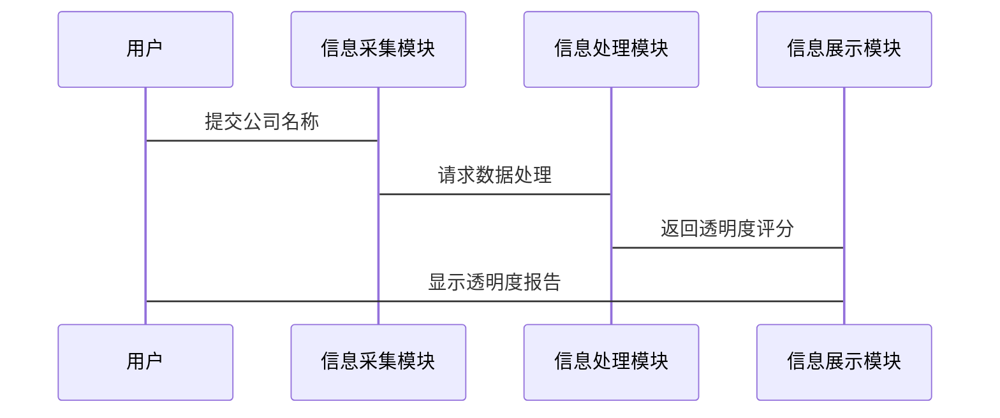

                 


# 彼得林奇对公司治理透明度的要求

## 关键词：公司治理，透明度，彼得林奇，投资，企业治理

## 摘要：本文深入探讨了彼得林奇对公司治理透明度的要求，分析了透明度对投资决策的重要性，以及如何通过系统化的方法提升公司治理的透明度。文章结合理论与实践，提供了详细的透明度评估模型和数学公式，帮助读者理解如何在实际中应用这些原则。

---

# 第一部分：公司治理透明度的背景与重要性

## 第1章：公司治理透明度的基本概念

### 1.1 公司治理的定义与核心要素

#### 1.1.1 公司治理的定义
公司治理是指公司董事会和管理层如何管理公司，确保公司利益相关者的权益得到保护，包括股东、员工、客户和债权人等。

#### 1.1.2 公司治理的核心要素
公司治理的核心要素包括董事会结构、高管责任、股东权利、利益相关者保护和透明披露。

#### 1.1.3 公司治理与透明度的关系
透明度是公司治理的基石，确保所有利益相关者能够获得公司运营的关键信息，从而做出明智的决策。

### 1.2 透明度在公司治理中的重要性

#### 1.2.1 透明度的定义与属性
透明度是指公司向内外部利益相关者公开、及时、准确和完整披露信息的程度。

#### 1.2.2 透明度对投资者的影响
透明度高的公司更容易获得投资者的信任，从而提高公司的市场价值和融资能力。

#### 1.2.3 透明度对公司的长期价值
透明度不仅影响公司的声誉，还直接影响公司的长期发展和抗风险能力。

## 第2章：彼得林奇与公司治理透明度

### 2.1 彼得林奇的投资理念
彼得林奇强调长期投资和基本面分析，认为透明的公司治理是投资成功的关键。

### 2.2 透明度在彼得林奇投资决策中的作用
彼得林奇通过分析公司的财务报表、管理层披露信息和行业口碑，评估公司的治理透明度。

### 2.3 彼得林奇对公司的期望与要求
彼得林奇要求公司保持高度透明，确保投资者能够获得足够的信息来评估公司的价值。

---

# 第二部分：公司治理透明度的核心要素与挑战

## 第3章：透明度的核心概念与属性

### 3.1 透明度的核心概念

#### 3.1.1 透明度的层次划分
透明度可以分为战略透明度、财务透明度、管理透明度和决策透明度。

#### 3.1.2 透明度的关键属性对比
| 属性       | 描述                                   |
|------------|----------------------------------------|
| 公开性     | 信息的公开程度                         |
| 及时性     | 信息披露的及时性                       |
| 准确性     | 信息披露的准确性                       |
| 完整性     | 信息披露的全面性                       |

#### 3.1.3 透明度的实现路径
透明度的实现需要公司内部制度的支持，包括建立信息披露机制、加强内部控制和审计。

### 3.2 公司治理透明度的挑战

#### 3.2.1 信息不对称的问题
信息不对称导致利益相关者难以获取足够的信息，影响决策的准确性。

#### 3.2.2 透明度的边界与外延
透明度并非无限制，公司需要在信息披露和隐私保护之间找到平衡。

#### 3.2.3 透明度与隐私保护的平衡
公司需要在透明披露和保护个人隐私之间找到平衡点，避免信息泄露带来的风险。

---

# 第三部分：公司治理透明度的评估与数学模型

## 第4章：透明度的评估方法

### 4.1 透明度评估的核心原理

#### 4.1.1 透明度评估的指标体系
透明度评估的指标包括信息披露的完整性、及时性和准确性，以及公司治理结构的合理性。

#### 4.1.2 透明度评估的数学模型
透明度评分公式：
$$
\text{透明度评分} = \sum_{i=1}^{n} w_i \times \text{指标}_i
$$
其中，$w_i$ 是指标的权重，$\text{指标}_i$ 是每个指标的评分。

#### 4.1.3 透明度评估的算法流程
1. 收集公司治理相关的数据。
2. 根据权重计算每个指标的评分。
3. 汇总所有指标的评分，得到透明度总评分。

### 4.2 透明度评估的数学模型

#### 4.2.1 透明度指数的计算公式
透明度指数计算公式：
$$
\text{透明度指数} = \frac{\sum_{i=1}^{n} \text{指标}_i \times w_i}{\sum_{i=1}^{n} w_i}
$$

#### 4.2.2 透明度评估的权重分配
权重分配需要考虑每个指标的重要性和对公司价值的影响。

### 4.3 透明度评估的算法实现

#### 4.3.1 透明度评估的步骤分解
1. 确定评估指标。
2. 确定每个指标的权重。
3. 收集并计算每个指标的评分。
4. 计算透明度总评分。

#### 4.3.2 透明度评估的代码实现
```python
def calculate_transparency_score(metrics, weights):
    weighted_scores = [metric * weight for metric, weight in zip(metrics, weights)]
    total_weight = sum(weights)
    transparency_score = sum(weighted_scores) / total_weight
    return transparency_score

# 示例
metrics = [90, 80, 85]  # 假设评分
weights = [0.4, 0.3, 0.3]  # 权重
score = calculate_transparency_score(metrics, weights)
print("透明度评分：", score)
```

#### 4.3.3 透明度评估的案例分析
以苹果公司为例，假设其透明度指标评分为：
- 财务透明度：90
- 管理透明度：85
- 治理结构透明度：88
权重分别为：
- 财务透明度：0.4
- 管理透明度：0.3
- 治理结构透明度：0.3
计算透明度总评分：
$$
\text{透明度总评分} = (90 \times 0.4) + (85 \times 0.3) + (88 \times 0.3) = 36 + 25.5 + 26.4 = 87.9
$$

---

# 第四部分：公司治理透明度的系统分析与架构设计

## 第5章：公司治理透明度的系统分析

### 5.1 问题场景介绍
公司治理透明度的系统需要解决信息不对称和信息获取困难的问题。

### 5.2 系统功能设计

#### 5.2.1 系统功能模块
- 信息采集模块：收集公司治理相关的数据。
- 信息处理模块：对数据进行清洗和计算。
- 信息展示模块：向用户展示透明度评分和相关分析。

### 5.3 系统架构设计
```
+-------------------+       +-------------------+
|  信息采集模块    |       |  信息展示模块    |
|-------------------|       |-------------------|
| 数据采集          |       | 透明度评分展示   |
| 数据清洗          | <---- | 透明度分析报告   |
+-------------------+       +-------------------+
                                      |
                                      |
                                      v
+-------------------+
| 信息处理模块     |
|-------------------|
| 数据计算          |
| 评分生成          |
+-------------------+
```

### 5.4 系统接口设计
- 数据接口：从数据库获取公司治理数据。
- 计算接口：调用透明度评分计算函数。
- 展示接口：将评分和分析结果展示给用户。

### 5.5 系统交互设计
使用Mermaid序列图展示系统交互流程：


---

# 第五部分：项目实战

## 第6章：公司治理透明度的项目实战

### 6.1 环境安装
安装必要的库，如Pandas、NumPy和Matplotlib，用于数据处理和可视化。

### 6.2 透明度评分系统实现

#### 6.2.1 代码实现
```python
import pandas as pd
import numpy as np

def calculate_transparency_score(df, weights):
    weighted_scores = []
    for index, row in df.iterrows():
        score = sum(row[i] * weights[i] for i in range(len(weights)))
        weighted_scores.append(score)
    return pd.Series(weighted_scores)

# 示例数据
data = {
    '公司': ['苹果', '谷歌', '微软'],
    '财务透明度': [90, 85, 88],
    '管理透明度': [85, 87, 82],
    '治理结构透明度': [88, 83, 85]
}
df = pd.DataFrame(data)
weights = [0.4, 0.3, 0.3]

transparency_scores = calculate_transparency_score(df.drop('公司', axis=1), weights)
df['透明度评分'] = transparency_scores
print(df)
```

#### 6.2.2 代码解读与分析
- 使用Pandas读取数据。
- 计算每个公司的透明度评分。
- 将评分结果添加到数据框中。

### 6.3 实际案例分析
以苹果公司为例，分析其透明度评分和相关因素。

### 6.4 项目小结
总结项目实现的关键点和注意事项。

---

# 第六部分：总结与展望

## 第7章：总结与最佳实践

### 7.1 核心要点回顾
- 公司治理透明度的重要性。
- 彼得林奇对透明度的要求。
- 透明度评估的数学模型和系统设计。

### 7.2 最佳实践 tips
- 定期更新透明度评分。
- 加强内部控制和审计。
- 提高利益相关者的透明度意识。

### 7.3 小结
公司治理透明度是投资者决策的关键因素，透明的公司治理能够提升公司的市场价值和长期发展能力。

### 7.4 注意事项
- 透明度的披露需要真实、准确和及时。
- 避免信息泄露和隐私保护的问题。
- 定期评估和优化透明度评分模型。

### 7.5 拓展阅读
推荐阅读彼得林奇的相关著作，深入理解其投资理念和公司治理观点。

---

# 结语

公司治理透明度是企业管理和投资决策中的重要议题。通过本文的系统分析和实践案例，读者可以更好地理解彼得林奇对公司治理透明度的要求，并在实际中应用这些原则，提升公司的治理水平和投资吸引力。

