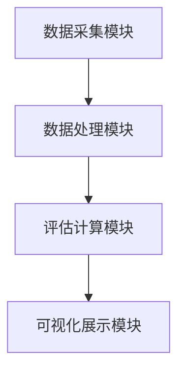
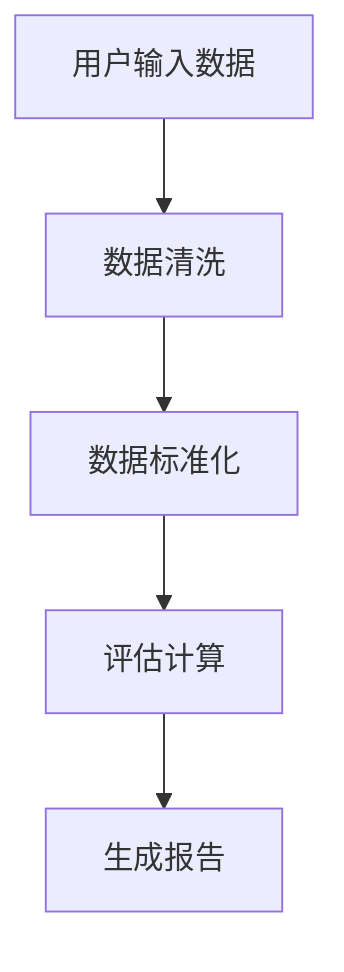
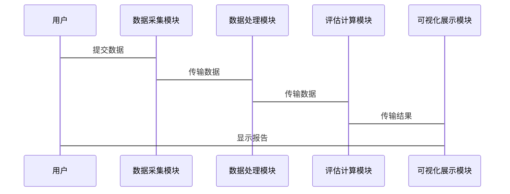

                 


# 彼得·林奇对公司治理透明度的量化评估

> 关键词：公司治理透明度，彼得·林奇，投资决策，量化评估，治理指标

> 摘要：本文探讨了公司治理透明度在投资决策中的重要性，并结合彼得·林奇的投资理念，提出了对公司治理透明度的量化评估方法。通过构建指标体系和评分模型，本文详细阐述了如何将透明度转化为可量化的指标，并通过实际案例分析验证了模型的有效性。

---

# 引言: 公司治理透明度与投资决策的重要性

## 1.1 问题背景与研究意义

### 1.1.1 公司治理透明度的定义与内涵

公司治理透明度是指企业在管理和决策过程中，向股东、投资者以及其他利益相关者公开信息的程度。透明的公司治理能够增强投资者的信任，降低信息不对称带来的风险。

### 1.1.2 投资者视角下的公司治理透明度

对于投资者而言，公司治理透明度是评估企业价值的重要因素。透明的治理结构能够确保投资者了解企业的经营状况，从而做出更明智的投资决策。

### 1.1.3 透明度与企业价值的关系

研究表明，公司治理透明度与企业价值呈正相关。透明的企业更容易吸引投资者，从而获得更低的融资成本和更高的市场估值。

## 1.2 彼得·林奇的投资理念与公司治理

### 1.2.1 彼得·林奇的投资方法论

彼得·林奇以其独特的投资策略闻名，他注重对企业基本面的深入分析，尤其是对管理层的透明度和决策能力的关注。

### 1.2.2 公司治理透明度在投资决策中的作用

对于彼得·林奇而言，公司治理透明度是评估企业投资价值的关键因素之一。透明的治理结构能够降低投资风险，增强投资信心。

### 1.2.3 透明度与投资风险的量化关系

通过量化透明度，投资者可以更好地评估投资风险，从而做出更科学的投资决策。

## 1.3 本书的核心目标与结构安排

### 1.3.1 量化评估的目标

本文旨在建立一套量化评估公司治理透明度的指标体系，为投资者提供科学的决策依据。

### 1.3.2 目录结构与内容概览

本文分为多个部分，包括引言、核心概念、量化方法、系统设计、项目实战和总结等，内容详实，结构清晰。

### 1.3.3 读者对象与学习方法

本文适合投资者、企业管理者以及研究人员阅读，通过理论与实践相结合的方式，帮助读者理解和应用公司治理透明度的量化评估方法。

---

# 第二部分: 公司治理透明度的核心概念与理论框架

## 2.1 公司治理透明度的定义与特征

### 2.1.1 公司治理透明度的定义

公司治理透明度是指企业在管理过程中，向股东、投资者和其他利益相关者公开信息的程度。

### 2.1.2 透明度的三要素：真实性、完整性和及时性

- **真实性**：信息必须真实可靠，避免虚假陈述。
- **完整性**：信息必须全面，涵盖所有重要方面。
- **及时性**：信息必须及时披露，避免信息滞后。

### 2.1.3 透明度与公司治理效率的关系

透明的公司治理能够提高治理效率，降低代理成本，增强企业竞争力。

## 2.2 彼得·林奇视角下的透明度评估维度

### 2.2.1 财务透明度

财务透明度是公司治理透明度的重要组成部分，包括财务报表的准确性和及时性。

### 2.2.2 管理层透明度

管理层透明度涉及管理层的决策过程、管理风格以及与股东的沟通情况。

### 2.2.3 股东透明度

股东透明度关注股东权利的保护和股东参与企业治理的程度。

## 2.3 公司治理透明度的外部影响因素

### 2.3.1 行业特性

不同行业的透明度要求可能有所不同，例如金融行业对透明度的要求较高。

### 2.3.2 法律环境

法律环境对透明度的影响不可忽视，例如《萨班斯-奥克斯利法案》要求企业提高财务透明度。

### 2.3.3 文化差异

不同国家和地区的文化差异可能影响公司治理的透明度，例如西方国家更注重透明度，而一些亚洲国家可能在这方面相对滞后。

## 2.4 公司治理透明度的内部影响因素

### 2.4.1 管理层决策

管理层的决策直接影响透明度的高低，例如管理层是否愿意公开更多的财务信息。

### 2.4.2 内部控制机制

有效的内部控制机制能够提高透明度，降低舞弊风险。

### 2.4.3 企业治理结构

合理的治理结构能够确保透明度的实现，例如董事会的独立性和多样性。

---

# 第三部分: 公司治理透明度的量化评估方法

## 3.1 透明度量化评估的指标体系

### 3.1.1 财务透明度指标

- 财务报表的准确性
- 财务信息披露的及时性
- 财务数据的完整性

### 3.1.2 管理层透明度指标

- 管理层的决策透明度
- 管理层的沟通频率
- 管理层的道德标准

### 3.1.3 股东透明度指标

- 股东的知情权
- 股东的参与权
- 股东的保护机制

## 3.2 数据收集与处理方法

### 3.2.1 数据来源

- 公司年报
- 财务报表
- 新闻报道
- 股东沟通记录

### 3.2.2 数据清洗

- 去除无效数据
- 处理异常值
- 确保数据一致性

### 3.2.3 数据标准化

- 将数据转换为统一的格式
- 标准化处理
- 数据归一化

## 3.3 透明度评分模型的构建

### 3.3.1 指标权重的确定

- 使用层次分析法（AHP）确定各指标的权重
- 根据经验或专家意见调整权重

### 3.3.2 评分算法

- 加权平均法
- 指数加权法
- 模糊综合评价法

### 3.3.3 评分结果的解释

- 评分结果分为优秀、良好、一般和较差四个等级
- 根据评分结果提出改进建议

## 3.4 案例分析: 彼得·林奇的投资决策过程

### 3.4.1 案例背景

选择一家具体公司，分析其公司治理透明度。

### 3.4.2 透明度评估过程

根据指标体系和评分模型，对目标公司进行评估。

### 3.4.3 投资决策结果

基于评估结果，做出投资决策，并分析评估的有效性。

---

# 第四部分: 系统分析与架构设计方案

## 4.1 透明度评估系统的功能需求

### 4.1.1 数据采集模块

- 收集公司治理相关数据
- 数据预处理

### 4.1.2 评估计算模块

- 计算各项指标的得分
- 综合评分

### 4.1.3 可视化展示模块

- 生成透明度报告
- 可视化图表展示

## 4.2 系统架构设计

### 4.2.1 系统架构图



### 4.2.2 数据流图



### 4.2.3 模块交互图



## 4.3 系统接口设计

### 4.3.1 数据接口

- API接口设计
- 数据格式要求

### 4.3.2 评估接口

- 输入接口
- 输出接口

### 4.3.3 可视化接口

- 报告生成接口
- 图表展示接口

---

# 第五部分: 项目实战

## 5.1 环境安装

- 安装Python和相关库
- 安装数据处理工具

## 5.2 系统核心实现源代码

### 5.2.1 数据处理代码

```python
import pandas as pd

# 数据清洗
def data_cleaning(data):
    # 去除缺失值
    data = data.dropna()
    # 去除重复值
    data = data.drop_duplicates()
    return data

# 数据标准化
def data_normalization(data):
    # 标准化处理
    from sklearn.preprocessing import StandardScaler
    scaler = StandardScaler()
    data_scaled = scaler.fit_transform(data)
    return data_scaled
```

### 5.2.2 评估计算代码

```python
import numpy as np

# 加权平均法计算透明度得分
def calculate_transparency_score(scores, weights):
    return np.dot(scores, weights)

# 透明度评分模型
def transparency_model(data, weights):
    scores = data_normalization(data)
    total_score = calculate_transparency_score(scores, weights)
    return total_score
```

### 5.2.3 案例分析

选择一家公司，例如苹果公司，分析其公司治理透明度。

## 5.3 代码应用解读与分析

- 解释代码的功能
- 分析评估结果
- 提出改进建议

## 5.4 实际案例分析和详细讲解剖析

### 5.4.1 案例背景

选择一家公司，分析其公司治理透明度。

### 5.4.2 透明度评估过程

根据指标体系和评分模型，对目标公司进行评估。

### 5.4.3 评估结果分析

- 评估结果
- 改进建议
- 投资决策

## 5.5 项目小结

- 项目总结
- 经验教训
- 挑战与解决方案

---

# 总结与展望

## 6.1 全文总结

- 公司治理透明度的重要性
- 量化评估方法的提出
- 系统设计与项目实战

## 6.2 未来研究方向

- 优化评估指标体系
- 改进评分模型
- 研究不同行业和地区的透明度差异

## 6.3 最佳实践 tips

- 提高透明度的方法
- 选择合适的评估工具
- 定期更新评估结果

## 6.4 注意事项

- 数据来源的可靠性
- 模型的适用性
- 结果的解释性

## 6.5 拓展阅读

- 推荐相关书籍和论文
- 提供在线资源链接

---

通过以上结构，本文详细探讨了公司治理透明度的量化评估方法，并结合彼得·林奇的投资理念，提出了具体的实施步骤和案例分析。希望本文能够为投资者和企业提供有价值的参考，帮助他们更好地理解和应用公司治理透明度的量化评估方法。

