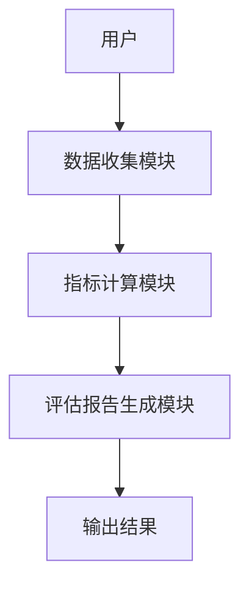

                 

# 彼得·林奇对公司环境社会治理(ESG)报告的质量评估

## 关键词：环境社会治理、ESG报告、彼得·林奇、投资策略、质量评估

## 摘要：本文详细探讨了彼得·林奇在环境社会治理（ESG）报告质量评估中的方法和策略。通过分析ESG的核心概念、评估框架、指标体系以及实际应用，本文展示了如何将ESG因素整合到投资决策中，以实现长期价值最大化。文章还结合具体案例，展示了彼得·林奇的ESG评估方法在实际中的应用效果，并展望了未来的发展趋势。

---

## 第一部分：环境社会治理（ESG）报告质量评估的背景与重要性

### 第1章：环境社会治理（ESG）概述

#### 1.1 ESG的核心概念
- **环境（E）**：关注企业的环境表现，包括温室气体排放、资源使用效率和环境合规性。
- **社会（S）**：关注企业在员工权益、供应链管理和社区责任等方面的表现。
- **治理（G）**：关注公司治理结构、董事会构成和高管薪酬等内部管理因素。

#### 1.2 ESG报告的背景与发展趋势
- **全球ESG发展趋势**：随着气候变化和可持续发展的呼声越来越高，企业和社会对ESG报告的需求日益增长。
- **ESG在投资决策中的作用**：投资者越来越关注企业社会责任和长期可持续性，ESG报告成为评估企业价值的重要依据。
- **ESG报告的法律与合规要求**：许多国家和地区开始要求企业公开ESG相关信息，以满足监管要求和提升透明度。

---

## 第二部分：彼得·林奇与ESG报告质量评估

### 第2章：彼得·林奇的ESG评估方法

#### 2.1 彼得·林奇的投资理念与ESG
- **彼得·林奇的投资策略**：注重基本面分析和长期价值投资，强调企业的财务健康和管理团队的质量。
- **ESG在彼得·林奇投资决策中的地位**：彼得·林奇认为，ESG因素是评估企业长期价值的重要组成部分，尤其是在风险管理和投资决策中具有不可忽视的作用。

#### 2.2 彼得·林奇的ESG评估框架
- **ESG报告的质量评估框架**：
  1. 数据的准确性与完整性：确保ESG数据来源可靠，覆盖范围全面。
  2. 报告的透明度与可比性：企业应公开ESG指标和评估方法，便于投资者进行横向比较。
  3. 评估的客观性与独立性：使用第三方机构进行ESG评估，确保结果的客观性和独立性。

#### 2.3 彼得·林奇的ESG报告分析流程
- **步骤一：数据收集与整理**：收集企业的环境、社会和治理相关数据，包括碳排放、员工满意度、董事会构成等。
- **步骤二：指标体系建立**：根据行业特点和企业实际情况，建立适合的ESG评估指标体系。
- **步骤三：定性与定量分析结合**：通过定性分析评估企业的管理能力和社会责任，通过定量分析评估环境和社会影响。
- **步骤四：综合评估与结果解读**：将定性和定量分析结果相结合，得出ESG报告的质量评估结论。

---

## 第三部分：ESG报告质量评估的核心概念与联系

### 第3章：ESG报告质量评估的关键维度

#### 3.1 数据的准确性与完整性
- **数据准确性**：确保ESG数据真实可靠，避免虚假或误导性信息。
- **数据完整性**：确保数据覆盖所有关键的ESG指标，没有遗漏重要信息。

#### 3.2 报告的透明度与可比性
- **透明度**：企业应明确披露ESG数据的来源、计算方法和评估标准，增加报告的透明度。
- **可比性**：不同企业的ESG报告应具有可比性，便于投资者进行横向比较。

#### 3.3 评估的客观性与独立性
- **客观性**：评估过程应基于事实和数据，避免主观判断。
- **独立性**：使用独立的第三方机构进行评估，确保结果的公正性。

---

## 第四部分：ESG报告质量评估的系统分析与架构设计

### 第4章：系统架构与功能设计

#### 4.1 系统功能设计
- **数据收集模块**：从企业公开报告、第三方数据库等多渠道收集ESG数据。
- **指标计算模块**：根据设定的ESG指标体系，计算企业的环境、社会和治理得分。
- **评估报告生成模块**：生成综合评估报告，展示企业的ESG表现和质量评估结果。

#### 4.2 系统架构设计

---

## 第五部分：ESG报告质量评估的案例分析与实际应用

### 第5章：实际案例分析

#### 5.1 案例背景
- 某跨国企业的ESG报告质量评估，使用彼得·林奇的方法进行分析。

#### 5.2 数据收集与指标计算
- 收集企业的碳排放数据、员工满意度调查结果和董事会构成信息。
- 根据ESG指标体系，计算环境、社会和治理三个维度的得分。

#### 5.3 评估结果与分析
- 环境得分较高，表明企业在减少碳排放方面表现良好。
- 社会得分中等，员工满意度和供应链管理存在改进空间。
- 治理得分较低，董事会构成不够多元化，高管薪酬与绩效挂钩不够紧密。

---

## 第六部分：ESG报告质量评估的未来发展趋势

### 第6章：未来发展趋势

#### 6.1 技术应用
- **人工智能与大数据**：利用AI技术进行ESG数据挖掘和预测分析，提高评估的效率和准确性。
- **区块链技术**：用于ESG数据的溯源和验证，提升数据的可信度。

#### 6.2 监管与行业动态
- **全球监管趋严**：越来越多的国家和地区开始要求企业公开ESG信息，推动ESG报告的标准化。
- **行业标准的制定**：行业组织和国际机构正在制定统一的ESG报告标准，促进ESG评估的规范化。

---

## 第七部分：总结与展望

### 第7章：总结与展望

#### 7.1 总结
- 彼得·林奇的ESG报告质量评估方法为企业和社会提供了重要的参考。
- ESG报告的质量评估不仅是企业社会责任的体现，也是投资者做出明智决策的重要依据。

#### 7.2 展望
- 随着技术的进步和监管的完善，ESG报告的质量评估将更加精准和高效。
- 未来，ESG因素在投资决策中的作用将更加突出，成为企业长期价值创造的核心驱动力。

---

## 参考文献

- 彼得·林奇著述
- 全球ESG报告相关文献
- 相关学术研究与行业报告

---

通过以上结构，我们可以系统地了解彼得·林奇在ESG报告质量评估中的方法和策略，以及如何将这些方法应用于实际投资决策中。

