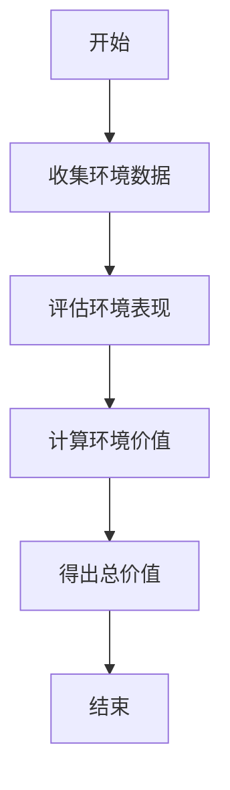
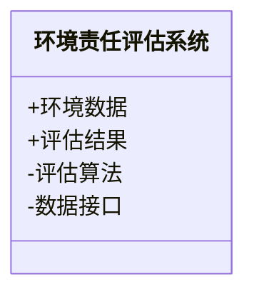
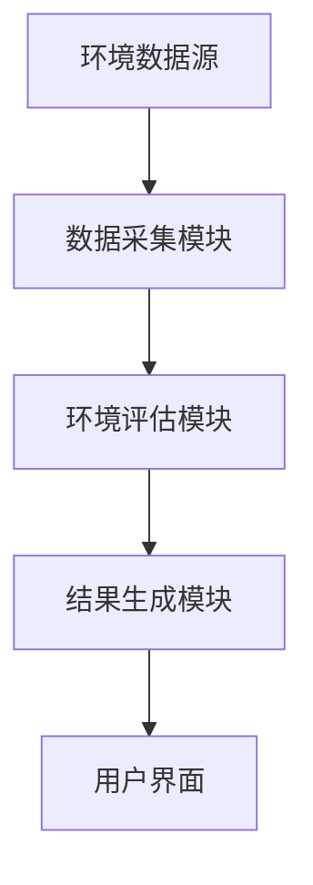
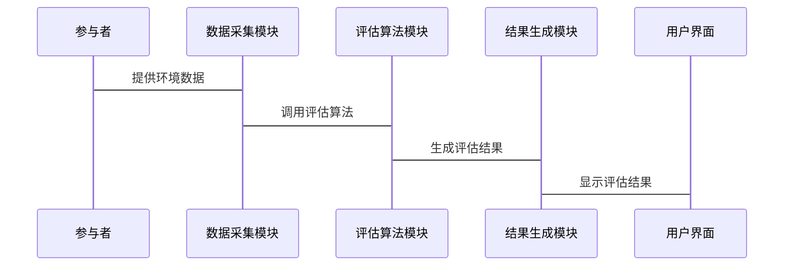

                 


# 彼得林奇对公司环境责任的看法

## 关键词：彼得·林奇，环境责任，企业价值，投资策略，可持续发展

## 摘要：本文深入探讨了彼得·林奇对环境责任的看法，从环境责任的定义和重要性出发，分析了环境责任与企业价值的关系，结合彼得·林奇的投资理念，提出了环境责任在企业价值评估中的核心地位。文章详细阐述了环境责任的算法原理、系统架构设计、项目实战案例，并给出了最佳实践和小结。

---

## 第一部分: 背景介绍

### 第1章: 环境责任的定义与重要性

#### 1.1 环境责任的定义
##### 1.1.1 环境责任的基本概念
环境责任是指企业在经营过程中对环境造成的影响负有的责任，包括减少污染、节约资源、保护生态等方面。

##### 1.1.2 环境责任的核心要素
- **环境影响评估**：企业在生产过程中对环境的影响，包括碳排放、资源消耗等。
- **环境合规性**：企业遵守环境法律法规的情况。
- **环境社会责任**：企业在环境保护方面的社会责任和道德义务。

##### 1.1.3 环境责任的边界与外延
环境责任的边界包括企业直接控制的活动，外延则包括企业供应链、产品生命周期等更广泛的影响范围。

#### 1.2 环境责任与企业价值的关系
##### 1.2.1 环境责任对企业的影响
- 环境责任直接影响企业的运营成本和风险。
- 环境责任良好的企业更容易获得投资者的青睐。

##### 1.2.2 环境责任与企业长期发展的联系
- 环境责任是企业可持续发展的基础。
- 环境责任良好的企业更容易获得政府政策支持和社会认可。

##### 1.2.3 环境责任与投资者决策的作用
- 投资者越来越关注企业的环境责任表现。
- 环境责任表现优秀的企业往往具有更高的投资价值。

### 第2章: 彼得·林奇与环境责任

#### 2.1 彼得·林奇的背景介绍
##### 2.1.1 彼得·林奇的生平简介
彼得·林奇是美国著名投资经理人，曾管理富达麦哲伦基金，取得了卓越的投资业绩。

##### 2.1.2 彼得·林奇的投资理念
- 价值投资：寻找具有持续增长潜力的企业。
- 长期投资：关注企业的基本面和长期发展趋势。

##### 2.1.3 彼得·林奇对企业的独特见解
- 企业价值的核心在于其盈利能力和发展潜力。
- 企业社会责任是企业长期价值的重要组成部分。

#### 2.2 彼得·林奇对环境责任的看法
##### 2.2.1 环境责任在企业投资中的重要性
- 环境责任是企业长期价值的重要组成部分。
- 环境责任良好的企业更具投资价值。

##### 2.2.2 彼得·林奇的环境责任投资策略
- 优先选择环境责任表现优秀的企业。
- 避免投资于环境责任表现不佳的企业。

##### 2.2.3 彼得·林奇对环境责任的长期展望
- 环境责任将成为企业竞争力的重要因素。
- 环境责任表现优秀的企业将在未来更具竞争优势。

---

## 第二部分: 核心概念与联系

### 第3章: 环境责任与企业价值的核心概念

#### 3.1 核心概念原理
##### 3.1.1 环境责任对企业价值的影响机制
- 环境责任直接影响企业的运营成本和风险。
- 环境责任良好的企业更容易获得投资者的青睐。

##### 3.1.2 环境责任与企业竞争力的关系
- 环境责任是企业竞争力的重要组成部分。
- 环境责任良好的企业更具市场竞争力。

##### 3.1.3 环境责任与企业风险的关联
- 环境责任不良的企业面临更大的法律和 reputational 风险。
- 环境责任表现优秀的企业风险更低。

#### 3.2 核心概念对比表格
##### 3.2.1 环境责任与传统财务指标的对比
| 指标类型 | 环境责任 | 传统财务指标 |
|----------|----------|--------------|
| 内容     | 环境影响 | 财务表现     |
| 目的     | 减少环境风险 | 提高盈利能力 |

##### 3.2.2 环境责任与企业声誉的对比
| 指标类型 | 环境责任 | 企业声誉 |
|----------|----------|----------|
| 内容     | 环境影响 | 企业形象 |
| 目的     | 减少环境风险 | 提高企业形象 |

##### 3.2.3 环境责任与企业社会责任的对比
| 指标类型 | 环境责任 | 企业社会责任 |
|----------|----------|-------------|
| 内容     | 环境影响 | 社会贡献     |
| 目的     | 减少环境风险 | 提高社会认可 |

#### 3.3 ER实体关系图
```mermaid
er
actor:投资者
actor:企业
actor:环境
actor:监管机构
```

---

## 第三部分: 算法原理讲解

### 第4章: 环境责任对企业价值评估的算法

#### 4.1 算法原理
##### 4.1.1 环境责任评估模型的构建
- 环境责任评估模型包括环境影响评估、环境合规性评估和环境社会责任评估三个部分。

##### 4.1.2 环境责任对企业价值的影响公式
$$ V = V_{\text{传统}} + V_{\text{环境}} $$

##### 4.1.3 算法流程图


#### 4.2 代码实现
```python
def calculate_environmental_value(environment_data):
    # 环境数据处理
    # 计算环境价值
    return environmental_value
```

---

## 第四部分: 系统分析与架构设计方案

### 第5章: 环境责任评估系统的架构设计

#### 5.1 项目介绍
- 本系统旨在评估企业的环境责任表现，帮助企业识别环境风险和机会。

#### 5.2 系统功能设计
##### 5.2.1 领域模型


##### 5.2.2 系统架构设计


#### 5.3 系统接口设计
- 环境数据接口：用于获取企业的环境数据。
- 评估结果接口：用于输出环境责任评估结果。

#### 5.4 系统交互设计


---

## 第五部分: 项目实战

### 第6章: 环境责任评估系统的实现

#### 6.1 环境责任评估系统的实现
##### 6.1.1 环境数据采集
- 通过企业公开报告和政府数据库获取环境数据。

##### 6.1.2 评估算法实现
- 使用上述算法对企业的环境责任表现进行评估。

##### 6.1.3 系统实现
- 使用Python和Flask框架开发环境责任评估系统。

#### 6.2 实际案例分析
##### 6.2.1 案例背景
- 以苹果公司为例，分析其环境责任表现。

##### 6.2.2 评估结果解读
- 苹果公司在环境责任方面表现优秀，具有较高的投资价值。

---

## 第六部分: 最佳实践与小结

### 第7章: 投资建议与未来展望

#### 7.1 投资建议
- 投资者应优先选择环境责任表现优秀的企业。
- 环境责任是企业长期价值的重要组成部分。

#### 7.2 小结
- 环境责任是企业可持续发展的重要基础。
- 环境责任良好的企业更具投资价值。

#### 7.3 注意事项
- 环境责任表现不佳的企业应谨慎投资。
- 投资者应关注企业的环境责任表现。

#### 7.4 拓展阅读
- 推荐书籍：《彼得·林奇的投资哲学》
- 推荐文章：《环境责任与企业价值》

---

## 总结
通过本文的分析，我们可以看到环境责任在企业价值评估中的重要性。彼得·林奇的环境责任投资理念为我们提供了重要的参考。未来，随着环境问题的日益突出，环境责任将成为企业竞争力的重要因素。投资者应重视环境责任表现，选择具有可持续发展潜力的企业进行投资。

