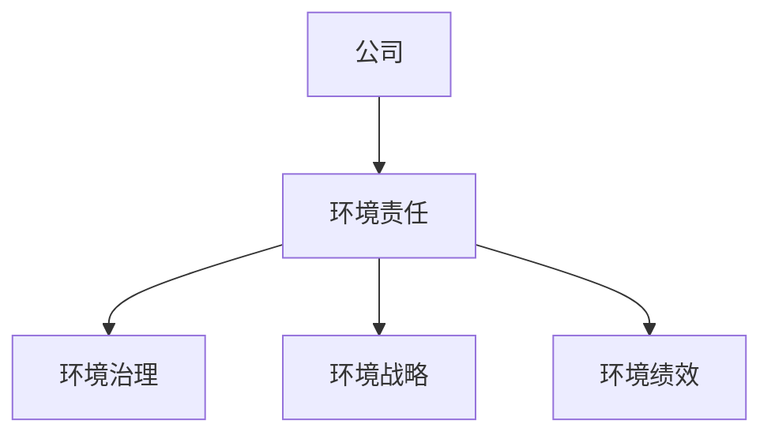
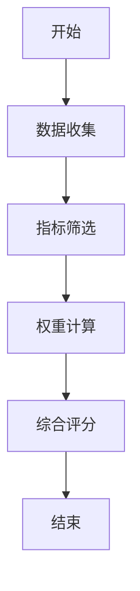
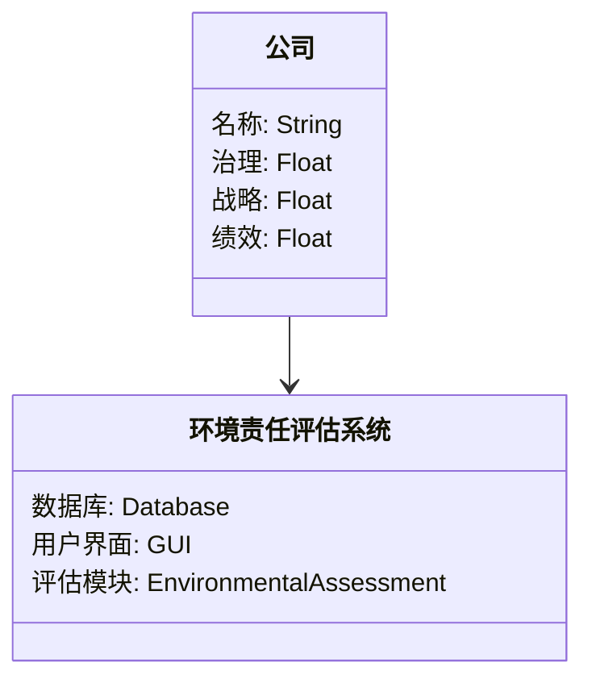
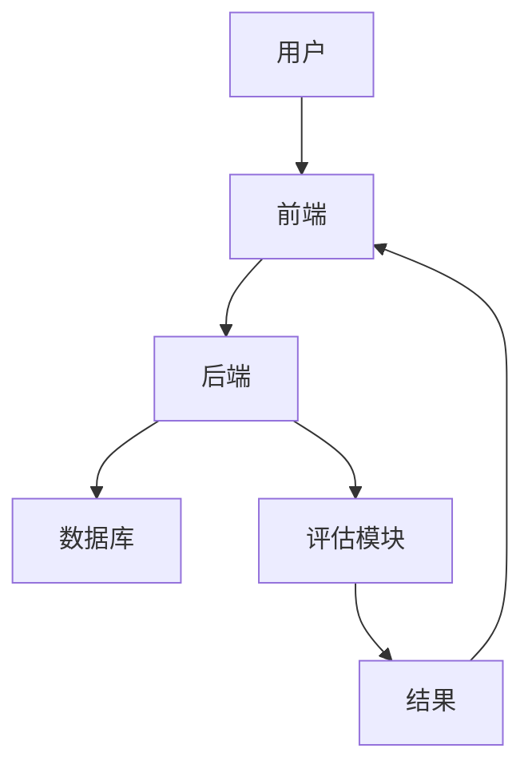
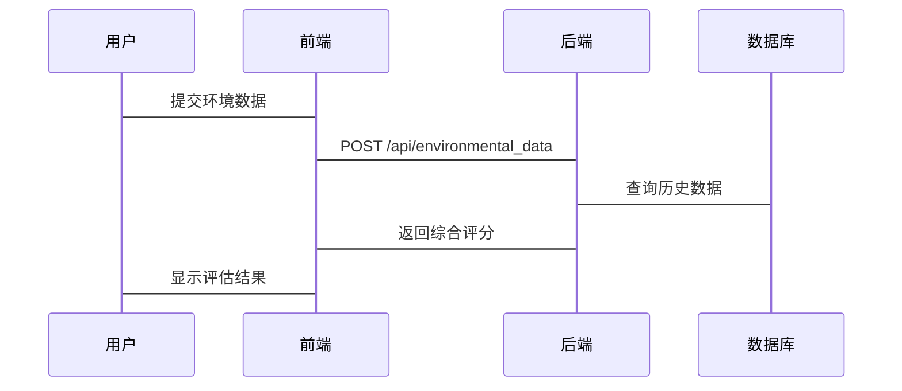

                 


# 彼得林奇对公司环境责任的评估

> 关键词：彼得·林奇，环境责任，投资评估，企业可持续性，ESG指标

> 摘要：本文深入探讨了彼得·林奇的投资理念中环境责任的核心作用，分析了环境责任评估的关键维度，并结合数学模型和实际案例，详细讲解了如何将环境责任纳入公司评估体系，为投资者和企业管理者提供了实用的指导和建议。

---

## 第1章: 公司环境责任的定义与重要性

### 1.1 环境责任的定义与内涵

环境责任是企业在经营过程中对环境保护和社会责任的承担，包括减少污染、节约资源、保护生态系统等方面。环境责任不仅是企业履行社会责任的重要体现，也是企业长期可持续发展的关键因素。

#### 1.1.1 环境责任的核心概念
- 环境责任关注企业在生产、运营和产品生命周期中的环境影响。
- 环境责任要求企业在追求经济效益的同时，兼顾环境保护和可持续发展。

#### 1.1.2 环境责任的外延与边界
- 环境责任的外延包括企业对员工、客户、社区和环境的影响。
- 环境责任的边界涉及企业的供应链、产品设计、生产和售后服务等环节。

#### 1.1.3 环境责任与企业可持续发展的关系
- 环境责任是企业可持续发展的核心支柱之一。
- 环境责任的履行能够降低企业的风险，提升企业的品牌形象和市场竞争力。

### 1.2 彼得·林奇投资理念中的环境责任

#### 1.2.1 彼得·林奇投资理念概述
- 彼得·林奇是全球知名的投资专家，主张长期投资和基本面分析。
- 林奇认为，企业的长期价值取决于其核心竞争力和可持续发展潜力。

#### 1.2.2 环境责任在投资决策中的地位
- 环境责任是林奇投资决策的重要考量因素。
- 企业对环境责任的履行能够降低经营风险，提升企业的长期盈利能力。

#### 1.2.3 环境责任与企业长期价值的关系
- 环境责任的履行能够提升企业的社会形象和品牌价值。
- 企业通过履行环境责任，能够更好地应对政策监管和市场变化。

### 1.3 本章小结
本章介绍了环境责任的定义、内涵及其与企业可持续发展的关系，重点分析了彼得·林奇投资理念中的环境责任，为后续的环境责任评估奠定了基础。

---

## 第2章: 公司环境责任评估的核心要素

### 2.1 环境责任评估的主要维度

#### 2.1.1 环境治理（Governance）
- 环境治理是企业环境责任的核心，包括董事会的监督、环境政策的制定和执行。
- 有效的环境治理能够确保企业环境责任的落实。

#### 2.1.2 环境战略与目标
- 环境战略是企业在可持续发展方面的长期规划。
- 明确的环境目标能够指导企业的环境行动和投资决策。

#### 2.1.3 环境绩效指标
- 环境绩效指标是衡量企业环境责任履行情况的关键指标。
- 常见的环境绩效指标包括能源消耗、碳排放、废弃物处理等。

### 2.2 核心概念与联系

#### 2.2.1 环境责任评估的ER实体关系图


#### 2.2.2 核心概念对比表格
| 维度   | 定义                                                                 | 关键指标                           |
|--------|----------------------------------------------------------------------|------------------------------------|
| 治理   | 公司内部的环境管理机制，包括董事会和管理层的监督职责。              | 环境管理委员会的存在、环境政策的制定 |
| 战略   | 企业为实现可持续发展目标而制定的长期计划。                      | 碳中和目标、可持续供应链计划        |
| 绩效   | 企业在环境责任方面的实际表现，包括能源消耗、碳排放等。          | 能耗数据、排放数据、资源利用效率    |

### 2.3 本章小结
本章分析了环境责任评估的主要维度，包括环境治理、战略和绩效，并通过ER实体关系图和对比表格，明确了各维度之间的关系和关键指标。

---

## 第3章: 环境责任评估的数学模型与算法原理

### 3.1 环境责任评估的数学模型

#### 3.1.1 指标权重分配模型
- 指标权重分配模型用于确定各环境责任评估维度的权重。
- 通常采用层次分析法（AHP）进行权重分配。

#### 3.1.2 综合评分模型
- 综合评分模型用于计算企业的环境责任综合评分。
- 计算公式为：
  $$ S = \sum_{i=1}^{n} w_i \times s_i $$
  其中，$S$ 是综合评分，$w_i$ 是第 $i$ 个指标的权重，$s_i$ 是第 $i$ 个指标的评分。

#### 3.1.3 线性回归模型
- 线性回归模型用于分析环境责任与企业绩效之间的关系。
- 计算公式为：
  $$ y = \beta_0 + \beta_1 x_1 + \beta_2 x_2 + \dots + \beta_k x_k + \epsilon $$
  其中，$y$ 是因变量（企业绩效），$x_i$ 是自变量（环境责任指标），$\beta$ 是回归系数，$\epsilon$ 是误差项。

### 3.2 算法原理讲解

#### 3.2.1 指标权重分配的算法流程


#### 3.2.2 综合评分算法实现
```python
import pandas as pd

def calculate_environmental_score(data, weights):
    scores = data.dot(weights)
    return scores

# 示例数据
data = pd.DataFrame({
    '治理': [0.8, 0.7, 0.9],
    '战略': [0.6, 0.8, 0.7],
    '绩效': [0.5, 0.6, 0.8]
})

weights = pd.Series([0.4, 0.3, 0.3], index=['治理', '战略', '绩效'])

scores = calculate_environmental_score(data, weights)
print(scores)
```

### 3.3 本章小结
本章介绍了环境责任评估的数学模型，包括指标权重分配模型和综合评分模型，并通过Python代码示例展示了算法的实现过程。

---

## 第4章: 系统分析与架构设计

### 4.1 问题场景介绍
- 环境责任评估系统需要满足企业对环境责任数据的收集、分析和报告需求。
- 系统需要支持多维度的环境责任评估，提供直观的可视化结果。

### 4.2 系统功能设计

#### 4.2.1 领域模型（mermaid类图）


#### 4.2.2 系统架构设计（mermaid架构图）


### 4.3 系统接口设计

#### 4.3.1 数据接口
- 数据接口负责与企业环境数据源对接，包括ERP系统、环境监测设备等。
- 接口采用RESTful API设计，支持JSON格式的数据传输。

#### 4.3.2 用户接口
- 用户接口提供友好的操作界面，支持数据输入、评估结果查询和可视化展示。
- 界面采用响应式设计，适配不同设备和屏幕尺寸。

### 4.4 系统交互流程（mermaid序列图）


### 4.5 本章小结
本章分析了环境责任评估系统的功能需求，设计了系统的架构和接口，并通过mermaid图展示了系统的交互流程。

---

## 第5章: 项目实战

### 5.1 环境安装

#### 5.1.1 安装Python环境
- 安装Python 3.8及以上版本。
- 安装必要的Python包：`pandas`, `numpy`, `scipy`.

#### 5.1.2 安装其他工具
- 安装Jupyter Notebook用于数据分析和可视化。
- 安装Git用于版本控制。

### 5.2 系统核心实现

#### 5.2.1 数据收集与预处理
```python
import pandas as pd

# 数据收集
data = pd.read_csv('environmental_data.csv')

# 数据预处理
data = data.dropna()
data = pd.get_dummies(data)
```

#### 5.2.2 模型实现
```python
from sklearn.linear_model import LinearRegression

# 训练线性回归模型
model = LinearRegression()
model.fit(X_train, y_train)

# 预测结果
y_pred = model.predict(X_test)
```

#### 5.2.3 可视化展示
```python
import matplotlib.pyplot as plt

plt.scatter(y_test, y_pred)
plt.xlabel('真实值')
plt.ylabel('预测值')
plt.title('环境责任评分预测结果')
plt.show()
```

### 5.3 案例分析与解读

#### 5.3.1 案例背景
- 某制造企业希望对其供应商进行环境责任评估，以降低供应链风险。

#### 5.3.2 数据分析
- 数据来源：供应商的环境数据、行业基准数据。
- 分析方法：基于AHP的指标权重分配和线性回归模型。

#### 5.3.3 结果解读
- 综合评分：供应商A的环境责任评分为85分，高于行业平均水平。
- 关键指标：供应商A在能源消耗和废弃物处理方面表现优异。

### 5.4 本章小结
本章通过具体案例展示了环境责任评估系统的实现过程，包括数据收集、模型训练和结果可视化。

---

## 第6章: 最佳实践与小结

### 6.1 最佳实践

#### 6.1.1 投资策略
- 投资者应优先选择在环境责任方面表现优异的企业。
- 环境责任评分可作为投资决策的重要参考指标。

#### 6.1.2 企业建议
- 企业应建立完善的环境责任管理体系，包括政策制定、数据收集和绩效评估。
- 企业应积极披露环境责任信息，提升社会形象和市场竞争力。

#### 6.1.3 注意事项
- 环境责任评估应结合企业的行业特点和经营环境。
- 数据的准确性和完整性是评估结果可靠性的关键。

### 6.2 小结
本文通过分析彼得·林奇的投资理念，探讨了环境责任评估的核心要素和数学模型，并结合实际案例展示了环境责任评估系统的实现过程。环境责任不仅是企业可持续发展的关键因素，也是投资者决策的重要依据。

### 6.3 拓展阅读
- 《投资中最简单同时也是最重要的事情》——彼得·林奇
- 《环境、社会和治理（ESG）投资指南》
- 《企业可持续发展报告编写指南》

---

## 附录

### 附录A: Python代码实现
完整的环境责任评估系统代码实现，包括数据收集、模型训练和结果可视化。

### 附录B: 环境责任评估指标体系
详细列举了环境责任评估的核心指标及其计算方法。

### 附录C: 相关工具与资源
推荐的环境责任评估工具和数据源，包括公开数据集和API接口。

---

通过以上结构和内容安排，本文系统地介绍了彼得·林奇对公司环境责任的评估方法，结合理论分析和实践案例，为投资者和企业管理者提供了实用的指导和建议。

