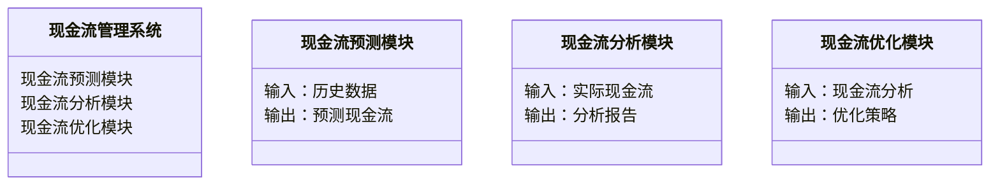
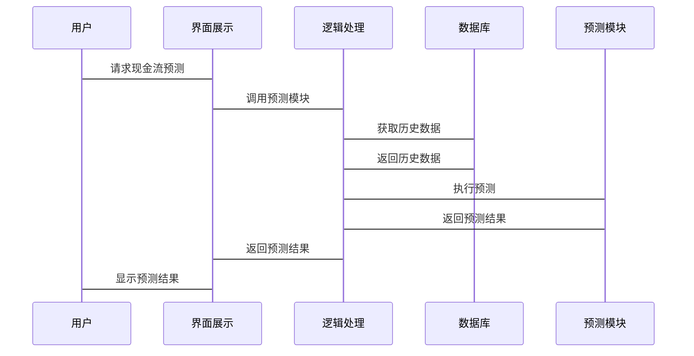

                 


# 彼得林奇对公司现金流管理的看法

> 关键词：现金流管理，彼得·林奇，投资策略，财务分析，企业价值

> 摘要：现金流是企业生存和发展的命脉，彼得·林奇作为投资界的传奇人物，将现金流管理视为投资决策的核心。本文从现金流管理的核心概念、算法原理、系统架构到项目实战，全面解析彼得·林奇的现金流管理理念，帮助读者理解其在投资中的重要性。

---

## 第1章: 彼得林奇与现金流管理的背景介绍

### 1.1 现金流管理的核心概念

#### 1.1.1 现金流的基本定义
现金流是指企业在一定会计期间内，通过经营、投资和筹资活动所产生现金流入和流出的总量。现金流是衡量企业财务健康状况的重要指标，主要包括经营活动、投资活动和筹资活动的现金流。

#### 1.1.2 现金流的类型与特点
现金流可以分为三类：
- **经营活动现金流**：企业日常运营中产生的现金流入和流出，如销售商品、支付工资等。
- **投资活动现金流**：企业投资于长期资产或出售资产所产生的现金流入和流出。
- **筹资活动现金流**：企业通过发行股票、债券或偿还债务等方式获得或支付的现金。

现金流的特点包括：
- 实时性：现金流的变化反映了企业的实时财务状况。
- 风险性：现金流波动可能带来财务风险，如流动性风险。
- 战略性：现金流管理是企业战略管理的重要组成部分。

#### 1.1.3 现金流管理的重要性
现金流管理是企业财务管理的核心，直接影响企业的生存和发展。良好的现金流管理可以确保企业按时支付账单、维持运营、抓住投资机会，避免财务危机。

---

### 1.2 彼得·林奇的生平与投资理念

#### 1.2.1 彼得·林奇的生平简介
彼得·林奇（Peter Lynch）是美国著名投资经理人，曾管理富达麦哲伦基金（Fidelity Magellan Fund），创造了年化29%的惊人回报率。他以深入的行业研究和对中小企业的关注而闻名。

#### 1.2.2 彼得·林奇的投资哲学
林奇强调深入研究企业基本面，关注企业的现金流状况，认为现金流是企业价值的决定因素之一。他提倡投资者关注企业的盈利能力和成长性，而不是盲目追随市场趋势。

#### 1.2.3 现金流在彼得·林奇投资策略中的地位
林奇认为，企业能否持续创造现金流是评估其投资价值的关键。他偏好那些现金流稳定、能够持续增长的企业，避免投资于现金流不佳或依赖外部融资的企业。

---

### 1.3 现金流管理的背景与问题背景

#### 1.3.1 现金流管理的背景分析
在全球化和信息化的今天，企业面临的财务风险日益复杂，现金流管理的重要性更加凸显。现金流不仅影响企业的短期偿债能力，还影响长期投资能力。

#### 1.3.2 现金流管理的核心问题
- 如何预测未来现金流？
- 如何优化现金流结构？
- 如何通过现金流分析评估企业价值？

#### 1.3.3 现金流管理的边界与外延
现金流管理的边界包括企业的财务活动、投资活动和筹资活动。其外延涉及风险管理、投资决策和战略规划。

#### 1.3.4 现金流管理的概念结构与核心要素
现金流管理的核心要素包括：
- 现金流预测
- 现金流分析
- 现金流优化

---

## 第2章: 现金流管理的核心概念与联系

### 2.1 现金流管理的核心原理

#### 2.1.1 现金流管理的基本原理
现金流管理涉及预测、监控和优化现金流，以确保企业在不同周期内具备足够的流动性。

#### 2.1.2 现金流管理的关键要素
- 现金流预测模型
- 现金流监控机制
- 现金流优化策略

#### 2.1.3 现金流管理的数学模型
现金流管理可以通过数学模型进行定量分析。例如，使用贴现现金流模型（DCF）评估企业价值：

$$ \text{企业价值} = \sum_{t=1}^{n} \frac{\text{自由现金流}}{(1+r)^t} $$

其中，\( r \) 是折现率，\( t \) 是时间周期。

---

### 2.2 现金流管理的核心概念对比

#### 2.2.1 现金流与利润的对比分析
现金流与利润是两个重要的财务指标，但现金流反映企业的实际资金情况，而利润是会计利润，可能包含大量应计项目。

| 比较维度 | 现金流 | 利润 |
|----------|--------|------|
| 性质     | 实际资金流动 | 会计利润 |
| 时间性   | 现实、即时 | 可能包含递延项目 |
| 可靠性   | 高 | 低 |

#### 2.2.2 现金流与资产负债表的关系
现金流影响资产负债表中的现金及现金等价物项目，同时影响其他资产和负债的变动。

#### 2.2.3 现金流与投资回报的关系
现金流是投资回报的重要组成部分，通过现金流分析可以评估投资项目的可行性和收益能力。

---

### 2.3 现金流管理的ER实体关系图

```mermaid
erDiagram
    actor 投资者 {
        <属性> 现金流预测
        <属性> 现金流分析
        <属性> 现金流优化
    }
    entity 企业 {
        <属性> 经营活动现金流
        <属性> 投资活动现金流
        <属性> 筹资活动现金流
    }
    entity 市场环境 {
        <属性> 经济状况
        <属性> 行业趋势
    }
    investor -> 企业 : 关注
    investor -> 市场环境 : 监测
    企业 -> 市场环境 : 受影响
```

---

### 2.4 本章小结

---

## 第3章: 现金流管理的算法原理

### 3.1 现金流管理的算法概述

#### 3.1.1 现金流预测算法
现金流预测是基于历史数据和市场趋势，预测未来现金流的算法。

#### 3.1.2 现金流分析算法
现金流分析涉及对企业过去和现在的现金流进行分析，评估企业的财务状况。

#### 3.1.3 现金流优化算法
现金流优化通过调整企业运营策略，提高现金流效率。

---

### 3.2 现金流管理的算法实现

#### 3.2.1 现金流预测的Python代码

```python
import pandas as pd

def predict_cash_flow(historical_data, periods=5):
    # 使用线性回归预测现金流
    import statsmodels.api as sm
    X = pd.RangeIndex(len(historical_data))
    Y = historical_data
    model = sm.OLS(Y, sm.add_constant(X)).fit()
    forecast = model.predict(sm.add_constant(pd.RangeIndex(len(historical_data)+periods)))
    return forecast[-periods:]

# 示例数据
data = pd.Series([100, 120, 110, 130, 140])
print(predict_cash_flow(data))
```

#### 3.2.2 现金流分析的Python代码

```python
def analyze_cash_flow(financials):
    # 计算自由现金流
    fcf = financials.operating_cash_flow - financials.capital_expenditure
    return fcf
```

---

### 3.3 现金流管理算法的数学模型

#### 现金流预测的数学模型
使用线性回归模型预测现金流：

$$ \hat{y} = a + bx $$

其中，\( x \) 是时间变量，\( a \) 和 \( b \) 是回归系数。

#### 现金流分析的数学模型
自由现金流公式：

$$ \text{FCF} = \text{经营现金流} - \text{资本支出} $$

---

### 3.4 本章小结

---

## 第4章: 现金流管理的系统分析与架构设计

### 4.1 问题场景介绍
现金流管理系统需要帮助企业预测、监控和优化现金流，支持投资决策。

### 4.2 系统功能设计

#### 4.2.1 领域模型mermaid类图



---

### 4.3 系统架构设计

#### 4.3.1 系统架构mermaid架构图


---

### 4.4 系统接口设计

#### 4.4.1 系统接口
- `get_cash_flow_data()`：获取历史现金流数据
- `predict_cash_flow()`：预测未来现金流
- `analyze_cash_flow()`：分析现金流状况

---

### 4.5 系统交互mermaid序列图



---

## 第5章: 现金流管理的项目实战

### 5.1 项目介绍
本项目旨在构建一个现金流管理系统，基于彼得·林奇的现金流管理理念，帮助投资者进行现金流分析和预测。

### 5.2 环境安装
安装必要的工具：
- Python 3.8+
- Pandas、NumPy、Scikit-learn、Statsmodels

### 5.3 核心实现

#### 5.3.1 现金流预测代码

```python
import pandas as pd
import numpy as np
from sklearn.linear_model import LinearRegression

def predict_cash_flow(data, n=5):
    # 数据准备
    X = np.arange(len(data)).reshape(-1, 1)
    Y = data.values
    model = LinearRegression()
    model.fit(X, Y)
    forecast = model.predict(np.array([len(data), len(data)+1, len(data)+2, len(data)+3, len(data)+4]).reshape(-1, 1))
    return forecast

# 示例数据
data = pd.Series([100, 120, 110, 130, 140])
print(predict_cash_flow(data))
```

#### 5.3.2 现金流分析代码

```python
def analyze_cash_flow(financials):
    # 计算自由现金流
    fcf = financials.operating_cash_flow - financials.capital_expenditure
    return fcf
```

---

### 5.4 代码应用解读与分析
- 预测现金流：使用线性回归模型预测未来5个周期的现金流。
- 现金流分析：计算自由现金流，评估企业的真实盈利能力。

---

### 5.5 实际案例分析
以某制造企业为例，分析其过去3年的现金流数据，预测未来现金流，并评估企业的财务健康状况。

---

### 5.6 项目小结

---

## 第6章: 现金流管理的最佳实践

### 6.1 小结
现金流管理是企业财务管理的核心，彼得·林奇的现金流管理理念为投资者提供了重要的指导。

### 6.2 注意事项
- 现金流预测应基于合理假设。
- 现金流管理需要结合企业实际经营情况。
- 定期监控和调整现金流管理策略。

### 6.3 拓展阅读
推荐书籍：
- 《彼得·林奇的成功投资》
- 《财务报表分析》

---

## 附录: 现金流管理的Python库

- Pandas：数据处理
- NumPy：数值计算
- Scikit-learn：机器学习模型
- Statsmodels：统计分析

---

## 结语

现金流管理是企业生存和发展的关键，彼得·林奇将其视为投资的核心。通过本文的分析，读者可以深入理解现金流管理的重要性，并掌握实际操作方法。

--- 

通过以上结构，文章全面解析了彼得·林奇的现金流管理理念，并结合实际案例和代码实现，帮助读者掌握现金流管理的核心要点。

