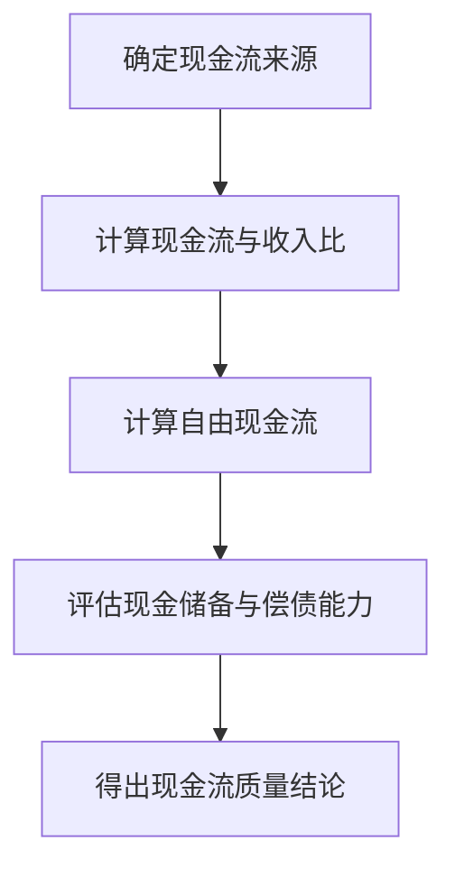
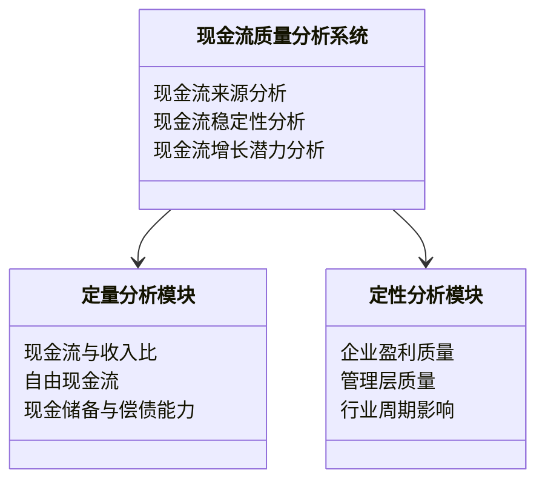

                 

# 彼得林奇对公司现金流质量的分析

## 关键词：
- 彼得·林奇
- 现金流质量
- 投资分析
- 财务健康
- 企业价值

## 摘要：
本文深入探讨了彼得·林奇对公司现金流质量的分析方法，从现金流的定义、结构化分析方法、定量分析模型到定性分析维度，逐步展开。文章结合数学模型和实际案例，详细解析了现金流质量对企业价值的影响，并总结了彼得·林奇的选股策略和投资组合构建方法。通过系统化的分析，本文为投资者提供了全面的现金流质量分析框架。

---

## 第1章: 现金流质量的定义与重要性

### 1.1 现金流质量的核心概念

#### 1.1.1 现金流的基本定义
现金流是指企业在一定会计期间内，通过经营活动、投资活动和筹资活动所产生现金流入和流出的总和。现金流质量是指这些现金流量的稳定性和可持续性，反映了企业的财务健康状况和盈利能力。

#### 1.1.2 现金流质量的内涵
现金流质量不仅仅是现金的数量，更关注其来源和用途。高质量的现金流意味着企业经营活动产生的现金流入能够覆盖其日常运营和资本支出的需求，同时具备持续增长的潜力。

#### 1.1.3 现金流质量与企业价值的关系
现金流是企业价值的核心驱动因素。高质量的现金流意味着企业具备更强的偿债能力、盈利能力和扩张能力，从而能够为股东创造更大的价值。

### 1.2 彼得·林奇的现金流分析框架

#### 1.2.1 彼得·林奇的投资理念
彼得·林奇是美国著名投资经理人，以其对基本面分析和选股能力著称。他认为，投资成功的关键在于选择那些具备持续增长潜力且估值合理的企业。

#### 1.2.2 现金流在投资分析中的地位
对于彼得·林奇而言，现金流是评估企业财务健康状况的重要指标。他认为，企业只有具备稳定的现金流，才能维持正常的运营并实现长期增长。

#### 1.2.3 现金流质量对企业财务健康的影响
现金流质量直接影响企业的偿债能力、盈利能力和发展潜力。高质量的现金流能够为企业提供更多的灵活性，应对市场波动和经济周期变化。

### 1.3 现金流质量的分析维度

#### 1.3.1 经营活动现金流
经营活动现金流是指企业通过销售商品或服务所获得的现金流入，以及支付的现金流出。高质量的经营活动现金流意味着企业具备较强的盈利能力和造血能力。

#### 1.3.2 投资活动现金流
投资活动现金流是指企业购买或出售长期资产所产生的现金流入和流出。高质量的投资活动现金流需要企业在投资决策上具备战略眼光，避免盲目扩张。

#### 1.3.3 筹资活动现金流
筹资活动现金流是指企业通过发行债券、股票或其他融资方式所获得的现金流入，以及偿还债务所产生的现金流出。高质量的筹资活动现金流需要企业在融资渠道和偿债能力之间保持平衡。

## 1.4 本章小结
本章介绍了现金流质量的核心概念、彼得·林奇的分析框架以及现金流质量的三个主要分析维度。通过这些分析，投资者可以更好地评估企业的财务健康状况和潜在价值。

---

## 第2章: 现金流质量的结构化分析方法

### 2.1 现金流结构化分析的步骤

#### 2.1.1 确定现金流来源
首先，需要明确企业现金流的主要来源，包括经营活动、投资活动和筹资活动。通过分析现金流来源的构成，可以了解企业收入和支出的主要渠道。

#### 2.1.2 分析现金流稳定性
其次，需要评估现金流的稳定性。这可以通过比较不同会计期间的现金流数据，观察其波动性来实现。稳定的现金流表明企业具备较强的运营能力。

#### 2.1.3 评估现金流增长潜力
最后，需要评估现金流的增长潜力。这可以通过分析企业的市场地位、行业发展趋势以及管理团队的战略能力来实现。

### 2.2 现金流质量的定量分析指标

#### 2.2.1 现金流与收入比
现金流与收入比是衡量企业经营活动现金流质量的重要指标。公式为：
$$ \text{现金流与收入比} = \frac{\text{经营活动现金流净额}}{\text{营业收入}} $$

#### 2.2.2 自由现金流
自由现金流是指企业在扣除所有资本支出后的剩余现金流，是评估企业财务健康状况的重要指标。公式为：
$$ \text{自由现金流} = \text{经营活动现金流净额} - \text{资本 expenditures} $$

#### 2.2.3 现金储备与偿债能力
现金储备是指企业持有的现金和现金等价物，用于应对突发事件和偿债需求。通过分析现金储备与短期债务的比例，可以评估企业的偿债能力。

### 2.3 现金流质量的定性分析维度

#### 2.3.1 企业盈利质量
企业盈利质量是指企业盈利的可持续性和稳定性。通过分析企业的利润率、毛利率等指标，可以评估其盈利质量。

#### 2.3.2 管理层质量
管理层的质量直接影响企业的经营决策和现金流管理。通过分析管理层的背景、经验和战略决策，可以评估其对现金流质量的影响。

#### 2.3.3 行业周期影响
行业周期波动会影响企业的现金流质量。通过分析行业发展趋势和周期性特点，可以更好地评估企业在不同经济周期中的表现。

### 2.4 本章小结
本章详细介绍了现金流质量的结构化分析方法，包括定量和定性分析指标。通过这些方法，投资者可以更全面地评估企业的现金流质量。

---

## 第3章: 现金流质量的定量分析模型

### 3.1 现金流质量分析的数学模型

#### 3.1.1 现金流与收入比的计算公式
$$ \text{现金流与收入比} = \frac{\text{经营活动现金流净额}}{\text{营业收入}} $$

#### 3.1.2 自由现金流的计算公式
$$ \text{自由现金流} = \text{经营活动现金流净额} - \text{资本 expenditures} $$

### 3.2 现金流质量分析的流程图

### 3.3 现金流质量分析的系统架构设计

### 3.4 本章小结
本章通过数学模型和流程图，详细介绍了现金流质量的定量分析方法。通过这些模型，投资者可以更系统地评估企业的现金流质量。

---

## 第4章: 彼得·林奇的现金流分析实践

### 4.1 现金流分析在选股中的应用

#### 4.1.1 现金流分析的选股标准
彼得·林奇在选股时注重现金流的质量和稳定性。他倾向于选择那些经营活动现金流净额持续增长且自由现金流为正的企业。

#### 4.1.2 现金流陷阱的识别
彼得·林奇强调识别现金流陷阱的重要性。他通过分析企业的盈利质量、管理层质量和行业周期影响，避免投资于那些表面现金流良好但实际财务状况不佳的企业。

### 4.2 现金流分析在投资组合中的应用

#### 4.2.1 投资组合的构建
彼得·林奇通过现金流分析构建投资组合时，注重分散投资和风险控制。他倾向于选择那些现金流质量良好且具备增长潜力的企业。

#### 4.2.2 投资组合的动态调整
彼得·林奇强调动态调整投资组合的重要性。他定期评估企业现金流的质量变化，及时调整投资策略。

### 4.3 本章小结
本章通过彼得·林奇的实践案例，展示了现金流分析在选股和投资组合构建中的重要性。通过这些案例，投资者可以更好地理解和应用现金流分析方法。

---

## 第5章: 现金流质量分析的误区与风险

### 5.1 现金流分析的常见误区

#### 5.1.1 仅关注表面现象
一些投资者只关注企业的现金储备数量，而忽视了现金流的来源和用途。这种做法可能导致误判企业财务状况。

#### 5.1.2 忽视管理层因素
现金流质量不仅取决于企业的财务数据，还受到管理层决策的影响。忽视管理层因素可能导致投资决策失误。

#### 5.1.3 忽视宏观经济环境
现金流质量还受到宏观经济环境的影响。忽视宏观经济环境的变化，可能导致企业现金流质量分析出现偏差。

### 5.2 现金流分析的风险管理

#### 5.2.1 宏观经济风险
宏观经济波动可能影响企业的现金流质量。投资者需要关注经济周期、利率变化和政策调整等因素。

#### 5.2.2 行业风险
不同行业对现金流的需求和影响不同。投资者需要根据行业特点，调整现金流分析方法。

#### 5.2.3 企业特有风险
企业自身的经营状况和管理能力也会影响现金流质量。投资者需要通过深入分析企业基本面，识别潜在风险。

### 5.3 本章小结
本章总结了现金流分析的常见误区和风险管理策略。通过识别和规避这些误区和风险，投资者可以更准确地评估现金流质量。

---

## 第6章: 总结与展望

### 6.1 本章总结
本文系统地介绍了彼得·林奇对公司现金流质量的分析方法，包括现金流的定义、分析维度、定量分析模型以及实际应用案例。通过这些分析，投资者可以更好地评估企业的财务健康状况和潜在价值。

### 6.2 未来研究方向
未来的研究可以进一步探讨现金流质量在不同行业中的表现差异，以及如何结合人工智能技术提高现金流分析的准确性和效率。

### 6.3 最佳实践 Tips
- 投资者在进行现金流分析时，应结合定量和定性分析方法，全面评估企业的财务状况。
- 定期跟踪企业的现金流变化，及时调整投资策略。
- 注重宏观经济环境和行业周期的影响，避免单一维度的分析。

### 6.4 小结
现金流质量是企业价值的重要驱动因素。通过深入理解和应用彼得·林奇的现金流分析方法，投资者可以更好地识别优质企业，实现长期稳健的投资收益。

---

## 参考文献
（此处可列出相关的书籍、论文或其他参考文献）

---

通过以上目录结构，本文详细介绍了彼得·林奇对公司现金流质量的分析方法，并结合实际案例和数学模型，为投资者提供了全面的现金流质量分析框架。

