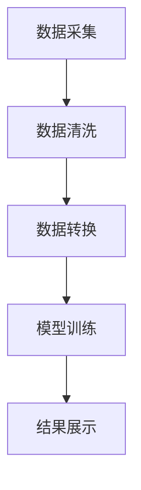
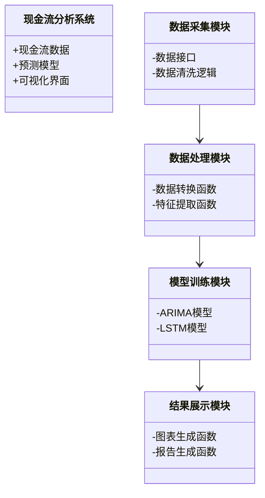
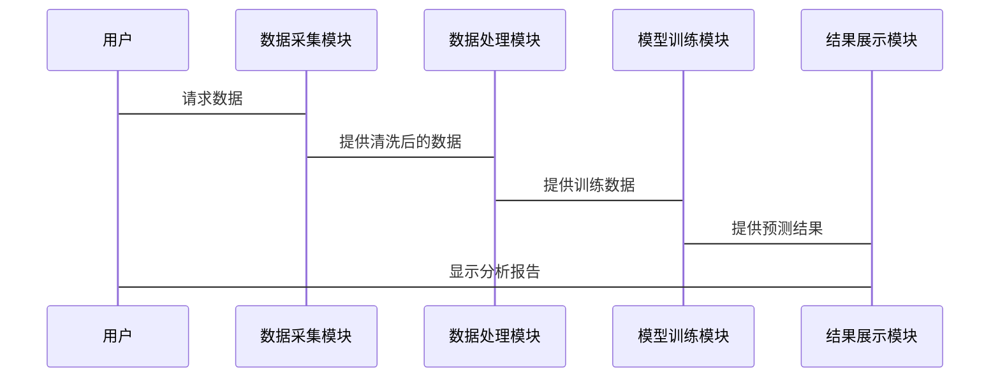

                 


---

# 彼得林奇对公司现金流质量的季节性分析

> 关键词：现金流质量、季节性分析、彼得林奇、投资分析、时间序列

> 摘要：本文系统性地探讨了彼得林奇对公司现金流质量的季节性分析方法，结合技术原理和实际案例，深入分析了现金流质量的核心概念、数学模型、系统设计与实现。文章从现金流质量的定义与分类入手，结合季节性波动的影响，详细讲解了现金流质量的评价指标与预测算法，最后通过Python代码实现与实际案例分析，展示了如何在实际投资中应用这些方法。

---

## 第一部分: 背景介绍与核心概念

### 第1章: 现金流质量的核心概念

#### 1.1 现金流的定义与分类

现金流是企业在一定时期内通过经营、投资和筹资活动所产生现金流入和流出的总量。根据来源和用途，现金流可以分为三类：
- **经营活动现金流**：与企业日常业务直接相关的现金流。
- **投资活动现金流**：与企业投资活动相关的现金流。
- **筹资活动现金流**：与企业筹资活动相关的现金流。

#### 1.2 现金流质量的定义与影响因素

现金流质量是指现金流的稳定性和可持续性。高质量的现金流意味着企业能够持续产生稳定的现金流入，以支持其运营和增长。影响现金流质量的因素包括：
- 企业盈利能力
- 资产周转效率
- 负债水平
- 季节性波动

#### 1.3 季节性波动的影响

季节性波动是指由于行业特性或市场需求变化，企业现金流在不同季度之间出现波动的现象。例如，零售业通常在节假日销售旺季现金流大幅增加，而淡季则相对减少。

---

### 第2章: 彼得林奇的分析方法

#### 2.1 彼得林奇的投资理念

彼得·林奇是美国著名的投资经理，他强调基本面分析和长期投资。他认为，投资的核心是理解企业的财务状况和竞争优势。

#### 2.2 现金流分析在投资决策中的作用

现金流分析是彼得林奇评估企业财务健康状况的重要工具。他认为，高质量的现金流是企业盈利能力和抗风险能力的体现。

#### 2.3 季节性波动对企业现金流的影响

彼得林奇指出，季节性波动可能会影响企业的短期现金流，但长期来看，高质量的企业能够通过合理的库存管理和销售策略，减弱季节性波动的影响。

---

## 第二部分: 现金流质量的算法与模型

### 第3章: 现金流质量的数学模型

#### 3.1 现金流质量的评价指标

- **自由现金流（FCF）**：
  \[
  FCF = \text{营业收入} - \text{资本支出}
  \]
- **现金流收益率（CFROI）**：
  \[
  CFROI = \frac{\text{净现金流}}{\text{投资成本}}
  \]
- **现金流质量评分**：
  \[
  \text{评分} = \sum (\text{权重} \times \text{指标值})
  \]

#### 3.2 现金流质量的预测算法

- **时间序列分析**：
  使用ARIMA模型预测现金流的未来值。
  \[
  \text{ARIMA}(p, d, q)
  \]
- **神经网络预测**：
  使用LSTM网络预测现金流的波动趋势。

### 第4章: 现金流质量预测的Python实现

#### 4.1 数据处理与可视化

```python
import pandas as pd
import matplotlib.pyplot as plt

# 加载数据
data = pd.read_csv('cash_flow.csv')

# 数据可视化
plt.plot(data['日期'], data['现金流'], label='现金流')
plt.title('现金流时间序列')
plt.xlabel('日期')
plt.ylabel('现金流')
plt.legend()
plt.show()
```

#### 4.2 时间序列模型的实现

```python
from statsmodels.tsa.arima_model import ARIMA

# 训练ARIMA模型
model = ARIMA(data['现金流'], order=(1, 1, 1))
model_fit = model.fit()

# 预测未来现金流
forecast = model_fit.forecast(steps=5)
print(forecast)
```

#### 4.3 神经网络模型的实现

```python
from keras.models import Sequential
from keras.layers import LSTM, Dense

# 构建LSTM模型
model = Sequential()
model.add(LSTM(50, input_shape=(1, 1)))
model.add(Dense(1))
model.compile(loss='mean_squared_error', optimizer='adam')

# 训练模型
model.fit(x_train, y_train, epochs=50, batch_size=32)
```

---

## 第三部分: 系统分析与架构设计

### 第5章: 现金流质量分析系统的功能设计

#### 5.1 系统功能模块划分

- **数据采集模块**：从财务报表中提取现金流数据。
- **数据处理模块**：清洗和转换数据，识别季节性波动。
- **模型训练模块**：训练现金流预测模型。
- **结果展示模块**：可视化预测结果和分析报告。

#### 5.2 系统功能流程图



### 第6章: 现金流质量分析系统的架构实现

#### 6.1 系统架构设计



#### 6.2 系统接口设计

- **数据接口**：与企业财务系统对接，获取现金流数据。
- **模型接口**：与第三方预测服务集成，获取预测结果。
- **可视化接口**：与前端展示平台对接，呈现分析结果。

#### 6.3 系统交互设计



---

## 第四部分: 项目实战与最佳实践

### 第7章: 项目实战

#### 7.1 环境安装与配置

```bash
pip install pandas matplotlib statsmodels keras
```

#### 7.2 核心代码实现

```python
# 数据处理
import pandas as pd
import matplotlib.pyplot as plt
from statsmodels.tsa.arima_model import ARIMA

# 加载数据
data = pd.read_csv('cash_flow.csv')

# 数据清洗
data.dropna(inplace=True)

# 训练ARIMA模型
model = ARIMA(data['现金流'], order=(1, 1, 1))
model_fit = model.fit()

# 预测未来现金流
forecast = model_fit.forecast(steps=5)
print(forecast)
```

#### 7.3 实际案例分析

以某零售企业为例，分析其现金流的季节性波动，并使用ARIMA模型预测未来现金流。

---

## 第五部分: 最佳实践与小结

### 8.1 最佳实践

- 定期更新模型，确保预测的准确性。
- 结合行业特性，优化模型参数。
- 使用多种模型进行对比，选择最优方案。

### 8.2 小结

本文通过理论分析和实际案例，详细讲解了彼得林奇对公司现金流质量的季节性分析方法。结合数学模型和系统设计，展示了如何通过技术手段提高现金流分析的准确性和效率。

---

通过本文的学习，读者可以掌握现金流质量的核心概念、预测算法和系统实现方法，为实际投资决策提供有力支持。

