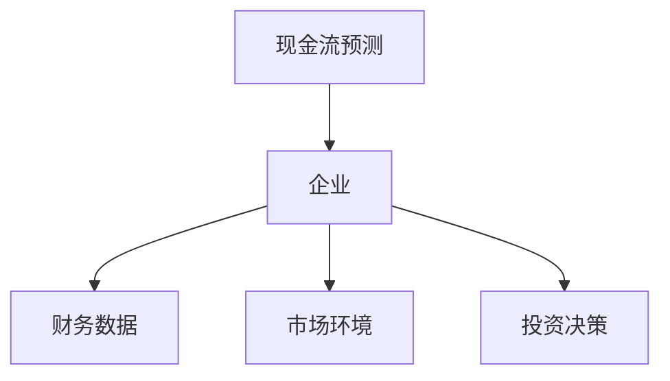

                 


# 彼得林奇对公司现金流预测准确性的长期跟踪分析

> 关键词：现金流预测，彼得·林奇，投资策略，财务分析，准确性评估

> 摘要：本文深入分析了彼得·林奇如何通过现金流预测进行投资决策，探讨了现金流预测的核心概念、算法原理、系统架构及项目实战，结合实际案例，评估其预测准确性，并总结最佳实践。

---

## 第1章：现金流预测的背景与核心概念

### 1.1 现金流预测的定义与重要性

现金流预测是指根据历史数据和市场情况，预测企业未来一定时期内的现金流入和流出的过程。它是企业财务管理的重要组成部分，帮助管理层做出投资、融资和运营决策。

现金流预测的重要性体现在以下几个方面：
1. **投资决策支持**：通过预测未来现金流，投资者可以评估项目的可行性和收益潜力。
2. **风险管理**：预测现金流有助于识别潜在的财务风险，如流动性风险。
3. **优化资源配置**：企业可以通过现金流预测合理分配资金，提高运营效率。

### 1.2 彼得·林奇与现金流预测

彼得·林奇是著名投资经理，其投资策略的核心在于对企业现金流的深入分析。他认为，企业价值最终体现在现金流上，准确的现金流预测是投资成功的关键。

彼得·林奇的方法独特之处在于：
1. **长期跟踪分析**：通过长期跟踪企业现金流，识别其增长趋势和潜在风险。
2. **结合市场环境**：将企业现金流与宏观经济环境相结合，评估其抗风险能力。

---

## 第2章：现金流预测的核心概念与联系

### 2.1 现金流预测的核心原理

现金流预测基于以下原理：
1. **历史数据驱动**：利用过去的数据建立模型，预测未来现金流。
2. **市场环境影响**：宏观经济因素如利率和通货膨胀会影响现金流。

### 2.2 现金流预测的核心概念对比

| 概念         | 描述                                                                 |
|--------------|----------------------------------------------------------------------|
| 财务报表分析 | 通过利润表、资产负债表分析企业财务状况                               |
| 企业估值     | 评估企业价值，通常基于现金流折现法                                   |
| 投资决策     | 基于现金流预测做出投资决策                                         |

### 2.3 现金流预测的ER实体关系图



---

## 第3章：现金流预测的算法原理

### 3.1 现金流预测的常用算法

1. **时间序列分析**：适用于有明显趋势或季节性的数据。
2. **回归分析**：通过变量关系预测现金流。
3. **机器学习算法**：如随机森林和神经网络，用于复杂模式识别。

### 3.2 现金流预测的数学模型

#### 线性回归模型
$$ y = \beta_0 + \beta_1x + \epsilon $$

#### 时间序列模型
$$ ARIMA(p, d, q) $$

### 3.3 现金流预测的Python实现

```python
import pandas as pd
from statsmodels.tsa.arima_model import ARIMA

data = pd.read_csv('cash_flow.csv')
model = ARIMA(data['cash_flow'], order=(5,1,0))
model_fit = model.fit()
```

---

## 第4章：现金流预测的系统分析与架构设计

### 4.1 系统功能设计

1. **数据采集模块**：收集财务数据和市场信息。
2. **数据处理模块**：清洗和转换数据，为预测做准备。

### 4.2 系统架构设计


---

## 第5章：现金流预测的项目实战

### 5.1 环境安装

安装必要的库：
```bash
pip install pandas statsmodels matplotlib
```

### 5.2 代码实现

```python
import pandas as pd
from statsmodels.tsa.arima_model import ARIMA
import matplotlib.pyplot as plt

data = pd.read_csv('cash_flow.csv')
train_data = data[:80]
test_data = data[80:]

model = ARIMA(train_data['cash_flow'], order=(5,1,0))
model_fit = model.fit()

 forecast = model_fit.forecast(steps=len(test_data))
 
 plt.plot(test_data.index, test_data['cash_flow'], label='实际值')
 plt.plot(test_data.index, forecast[0], label='预测值')
 plt.legend()
 plt.show()
```

### 5.3 案例分析

以某企业为例，分析预测结果，评估模型准确性，调整参数优化预测效果。

---

## 第6章：现金流预测的挑战与解决方案

### 6.1 数据质量挑战

解决方法包括数据清洗和特征工程。

### 6.2 模型优化

通过交叉验证和网格搜索优化模型参数。

### 6.3 市场变化应对

建立动态调整机制，及时更新模型。

---

## 第7章：总结与最佳实践

### 7.1 总结

现金流预测是投资决策的关键，彼得·林奇的方法提供了有效的框架，但实际应用中需结合多种因素。

### 7.2 最佳实践

1. **数据清洗**：确保数据准确性和完整性。
2. **模型调优**：通过实验选择最优模型和参数。
3. **动态调整**：定期更新模型，适应市场变化。

### 7.3 注意事项

避免过度依赖历史数据，关注市场突发事件。

### 7.4 拓展阅读

推荐相关书籍和论文，深入学习现金流预测方法。

---

以上是文章的完整大纲和内容，希望对您有所帮助！

