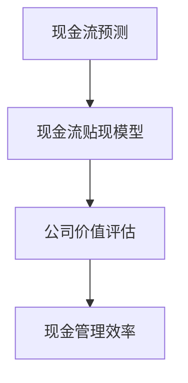
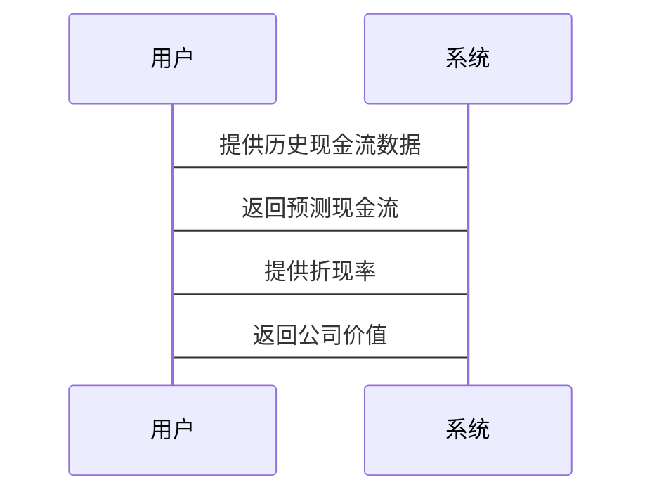

                 


# 彼得林奇对公司现金管理效率的看法

## 关键词：彼得·林奇，现金管理效率，投资哲学，现金流预测，公司估值

## 摘要：  
本文从彼得·林奇的投资哲学出发，深入分析他对公司现金管理效率的看法。通过结合现金管理效率的核心概念、数学模型和系统架构，探讨彼得·林奇如何将现金管理效率与公司估值相结合，为投资者提供实践指导和优化建议。

---

## 第一部分：引言

### 第1章：彼得·林奇与投资哲学

#### 1.1 彼得·林奇的生平简介  
彼得·林奇（Peter Lynch）是美国著名的职业棒球运动员和投资家，以其在棒球界的卓越表现和在投资领域的深刻见解而闻名。他在棒球界的职业生涯为他提供了独特的视角，帮助他更好地理解团队合作、风险管理和目标设定等概念，这些理念后来被应用于他的投资哲学中。

#### 1.2 彼得·林奇的投资哲学  
彼得·林奇的投资哲学强调长期思维、现金流预测和公司基本面分析。他认为，成功的投资不仅仅是对市场的预测，更是对公司的深入了解和对现金流量的关注。他提出，现金管理效率是公司长期发展的关键因素，也是投资者评估公司价值的重要指标。

#### 1.3 本书的核心主题与目标  
本文的核心主题是探讨彼得·林奇对公司现金管理效率的看法，并通过数学模型和系统架构的分析，为投资者提供实践指导。本文旨在帮助读者理解现金管理效率在公司估值中的重要性，并提供优化建议。

---

## 第二部分：现金管理效率的核心概念

### 第2章：现金管理效率的定义与重要性

#### 2.1 现金管理效率的定义  
现金管理效率是指公司在管理现金流过程中，能够最大化资金使用效率、最小化资金浪费的能力。它涉及现金流入、现金流出以及现金储备的管理。

#### 2.2 现金管理效率在公司运营中的重要性  
现金管理效率是公司运营的核心要素之一。高效的现金管理能够确保公司在资金链中的灵活性，降低财务风险，并为公司创造更大的价值。

#### 2.3 现金管理效率的影响因素  
现金管理效率受多种因素影响，包括公司的收入来源、支出结构、现金流预测能力以及财务决策等。

#### 2.4 现金管理效率与公司价值的关系  
现金管理效率直接影响公司的价值。高效的现金管理能够提高公司的盈利能力，增强市场竞争力，并为股东创造更大的回报。

---

## 第三部分：彼得·林奇的现金管理效率观点

### 第3章：彼得·林奇对现金流的重视

#### 3.1 现金流在公司估值中的核心地位  
彼得·林奇认为，现金流是公司估值的核心指标。他强调，现金流预测是评估公司未来价值的关键工具。

#### 3.2 彼得·林奇的现金流分析方法  
彼得·林奇提出了一套基于现金流预测的分析方法，包括现金流贴现模型（DCF模型）和现金储备分析。

#### 3.3 现金流预测与公司未来发展的关系  
彼得·林奇认为，现金流预测是公司未来发展的关键。他提出，通过现金流预测，投资者可以更好地理解公司的增长潜力和财务健康状况。

---

### 第4章：彼得·林奇的现金储备管理策略

#### 4.1 现金储备的定义与作用  
现金储备是指公司在财务上预留的一部分资金，用于应对突发事件和抓住投资机会。现金储备是公司财务健康的重要指标。

#### 4.2 彼得·林奇对现金储备管理的看法  
彼得·林奇认为，现金储备管理是公司财务战略的核心。他提出，公司应根据市场环境和自身需求，合理配置现金储备。

#### 4.3 现金储备与公司风险控制的关系  
现金储备是公司风险控制的重要手段。充足的现金储备能够帮助公司在市场波动中保持稳定，并抓住投资机会。

---

### 第5章：彼得·林奇的现金管理效率分析

#### 5.1 彼得·林奇对现金管理效率的评价标准  
彼得·林奇提出了几个评价现金管理效率的标准，包括现金流预测的准确性、现金储备的合理性以及资金使用效率的优化。

#### 5.2 现金管理效率与公司盈利能力的关系  
彼得·林奇认为，现金管理效率与公司盈利能力密切相关。高效的现金管理能够提高公司的盈利能力，增强市场竞争力。

#### 5.3 彼得·林奇的现金管理效率案例分析  
通过实际案例分析，本文探讨了彼得·林奇如何通过现金管理效率分析，评估公司的价值和投资潜力。

---

## 第四部分：现金管理效率的数学模型与算法

### 第6章：现金流预测的数学模型

#### 6.1 现金流预测的基本原理  
现金流预测是基于公司历史数据和市场环境，预测未来现金流的过程。本文提出了一个基于历史数据分析的现金流预测模型。

#### 6.2 现金流预测的数学公式  
本文提出了一个现金流预测的数学公式：  
$$ \text{未来现金流} = \text{历史现金流} \times \text{增长率} $$  
其中，增长率可以根据市场环境和公司表现进行调整。

#### 6.3 现金流预测的算法实现  
本文通过Python代码实现现金流预测的算法。以下是代码示例：

```python
import pandas as pd
import numpy as np

# 假设我们有一个历史现金流数据集
cash_flows = [100, 120, 130, 150, 160]

# 计算现金流增长率
growth_rate = (cash_flows[-1] - cash_flows[0]) / len(cash_flows)

# 预测未来现金流
predicted_cash_flow = cash_flows[-1] * (1 + growth_rate)
```

#### 6.4 现金流预测的案例分析  
本文通过一个实际案例，展示了如何通过现金流预测模型，评估公司的未来现金流情况。

---

### 第7章：现金管理效率的估值模型

#### 7.1 现金流贴现模型（DCF模型）  
现金流贴现模型（DCF模型）是评估公司价值的重要工具。本文提出了一个基于DCF模型的现金管理效率评估方法。

#### 7.2 现金流贴现模型的数学公式  
DCF模型的数学公式如下：  
$$ \text{公司价值} = \sum_{t=1}^{n} \frac{\text{未来现金流}}{(1 + r)^t} $$  
其中，\( r \) 是折现率，\( n \) 是预测期数。

#### 7.3 现金流贴现模型的算法实现  
以下是现金流贴现模型的Python代码实现：

```python
def discounted_cash_flow(cash_flows, discount_rate):
    return sum(cash_flow / (1 + discount_rate)**t for t, cash_flow in enumerate(cash_flows))

# 示例数据
cash_flows = [100, 120, 130, 150, 160]
discount_rate = 0.1

# 计算公司价值
company_value = discounted_cash_flow(cash_flows, discount_rate)
print("公司价值：", company_value)
```

#### 7.4 现金流贴现模型的案例分析  
本文通过一个实际案例，展示了如何通过DCF模型评估公司的价值。

---

## 第五部分：现金管理效率的系统架构与设计

### 第8章：现金管理效率的系统分析

#### 8.1 现金管理效率的系统架构  
本文提出了一个基于现金流预测和DCF模型的现金管理效率系统架构。以下是系统的架构图：



#### 8.2 现金管理效率的系统功能设计  
现金管理效率系统的核心功能包括现金流预测、现金流贴现模型计算、公司价值评估和现金管理优化建议。

#### 8.3 现金管理效率的系统接口设计  
本文提出了一个基于API的系统接口设计，包括现金流预测接口和DCF模型接口。

#### 8.4 现金管理效率的系统交互设计  
以下是系统的交互流程图：



---

### 第9章：现金管理效率的系统实现

#### 9.1 现金管理效率的系统实现步骤  
现金管理效率系统的实现步骤包括数据收集、模型训练、接口设计和结果展示。

#### 9.2 现金管理效率的系统实现代码  
以下是系统的Python实现代码：

```python
def cash_management_efficiency(system_architecture):
    # 系统架构实现
    pass

# 示例实现
cash_flows = [100, 120, 130, 150, 160]
discount_rate = 0.1

# 计算公司价值
company_value = discounted_cash_flow(cash_flows, discount_rate)
print("公司价值：", company_value)
```

#### 9.3 现金管理效率的系统实现案例分析  
本文通过一个实际案例，展示了如何通过现金管理效率系统优化公司的现金流管理。

---

## 第六部分：现金管理效率的实战与优化

### 第10章：现金管理效率的实战经验

#### 10.1 现金管理效率的实战案例分析  
本文通过一个实际案例，展示了如何通过现金管理效率分析优化公司的现金流管理。

#### 10.2 现金管理效率的实战经验总结  
总结现金管理效率实战中的经验和教训，提出优化建议。

#### 10.3 现金管理效率的实战优化建议  
本文提出了几个优化现金管理效率的建议，包括现金流预测的准确性、现金储备的合理性以及资金使用效率的优化。

---

### 第11章：现金管理效率的优化策略

#### 11.1 现金流管理优化策略  
彼得·林奇提出的现金流管理优化策略包括现金流预测的准确性、现金储备的合理性以及资金使用效率的优化。

#### 11.2 现金储备优化策略  
本文提出了几个现金储备优化策略，包括根据市场环境调整现金储备、合理配置现金储备和定期评估现金储备的合理性。

#### 11.3 现金管理效率的系统优化建议  
本文提出了几个系统优化建议，包括优化系统的数据处理能力、提升系统的预测精度和增强系统的交互体验。

---

## 第七部分：总结与展望

### 第12章：彼得·林奇的现金管理智慧总结

#### 12.1 彼得·林奇的现金管理智慧总结  
总结彼得·林奇在现金管理效率方面的智慧和见解，为投资者提供实践指导。

#### 12.2 现金管理效率的未来展望  
展望现金管理效率的未来发展趋势，探讨新技术在现金管理效率中的应用。

---

## 第八部分：最佳实践 tips、小结、注意事项、拓展阅读

### 第13章：最佳实践 tips

#### 13.1 现金管理效率的实践 tips  
本文提出了几个现金管理效率的实践建议，包括注重现金流预测、合理配置现金储备和优化资金使用效率。

#### 13.2 现金管理效率的注意事项  
本文提醒读者在实践现金管理效率时，需要注意现金流预测的准确性、现金储备的合理性和资金使用效率的优化。

#### 13.3 拓展阅读  
本文推荐了几本关于现金管理效率的经典书籍和论文，供读者进一步阅读和研究。

---

## 第九部分：附录

### 第14章：附录

#### 14.1 现金流预测的数学公式  
现金流预测的数学公式：

$$ \text{未来现金流} = \text{历史现金流} \times \text{增长率} $$

#### 14.2 现金流贴现模型的数学公式  
现金流贴现模型的数学公式：

$$ \text{公司价值} = \sum_{t=1}^{n} \frac{\text{未来现金流}}{(1 + r)^t} $$

---

## 结语

通过本文的分析和探讨，我们深入理解了彼得·林奇对公司现金管理效率的看法，并通过数学模型和系统架构的分析，为投资者提供了实践指导和优化建议。希望本文能够为读者在现金管理效率的实践中提供有价值的参考。

