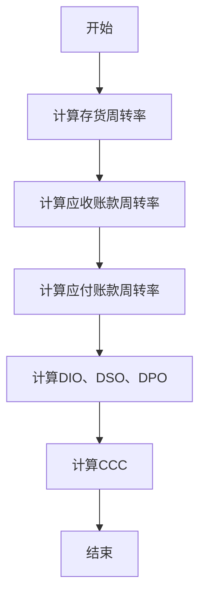
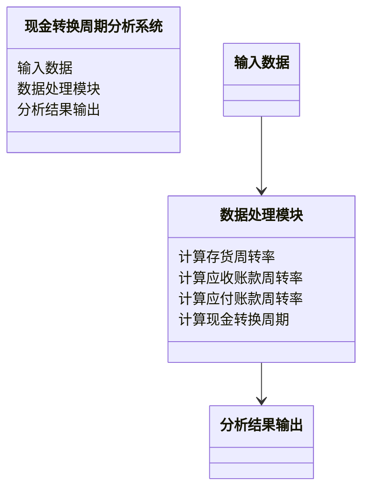
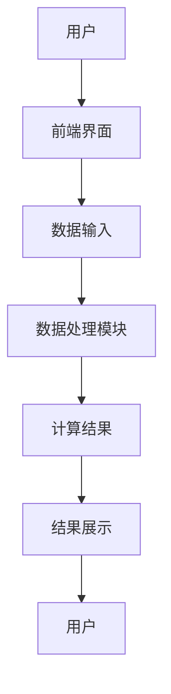

                 


# 彼得林奇对公司现金转换周期的分析

> 关键词：现金转换周期，彼得林奇，投资分析，财务指标，企业运营效率

> 摘要：现金转换周期是衡量企业将原材料转化为最终产品并收回现金的时间长度，是彼得林奇在投资分析中极为重视的指标。本文将详细分析现金转换周期的核心概念、算法原理、系统架构设计，并通过实际案例展示其在投资分析中的应用，最后总结最佳实践和投资建议。

---

# 第一部分: 现金转换周期与投资分析背景

## 第1章: 现金转换周期的基本概念

### 1.1 现金转换周期的定义

#### 1.1.1 现金转换周期的定义
现金转换周期（Cash Conversion Cycle, CCC）是指企业从采购原材料到最终收到销售款项的时间跨度。这个周期越短，企业的资金周转效率越高，财务健康状况越好。

#### 1.1.2 现金转换周期的公式
现金转换周期的公式如下：
$$
CCC = DIO + DSO - DPO
$$$
其中：
- DIO（Days Inventory Outstanding）：存货周转天数
- DSO（Days Sales Outstanding）：应收账款周转天数
- DPO（Days Payables Outstanding）：应付账款周转天数

#### 1.1.3 现金转换周期的计算方法
1. 计算存货周转率：$$ \text{存货周转率} = \frac{\text{成本 of goods sold (COGS)}}{\text{平均存货}} $$
2. 计算应收账款周转率：$$ \text{应收账款周转率} = \frac{\text{营业收入}}{\text{平均应收账款}} $$
3. 计算应付账款周转率：$$ \text{应付账款周转率} = \frac{\text{营业成本}}{\text{平均应付账款}} $$
4. 计算天数：
   - DIO = 365 / 存货周转率
   - DSO = 365 / 应收账款周转率
   - DPO = 365 / 应付账款周转率
5. 计算CCC：CCC = DIO + DSO - DPO

### 1.2 彼得·林奇的背景与投资理念

#### 1.2.1 彼得·林奇的生平简介
彼得·林奇（Peter Lynch）是美国著名的投资经理人，被誉为“最伟大的股票基金经理”之一。他管理的麦哲伦基金在任职期间取得了卓越的投资业绩。

#### 1.2.2 彼得·林奇的投资哲学
彼得·林奇强调基本面分析，注重企业财务状况和竞争优势。他认为，投资者应该选择那些易于理解且财务健康的企业进行投资。

#### 1.2.3 彼得·林奇对现金转换周期的重视
林奇在其投资分析中，特别关注企业的现金转换周期，认为这是衡量企业运营效率和财务健康的重要指标。

### 1.3 现金转换周期在投资分析中的重要性

#### 1.3.1 现金转换周期与企业财务健康的关系
- 现金转换周期越短，企业的资金周转效率越高，财务压力越小。
- 短周期意味着企业能够更快地将原材料转化为现金，降低流动性风险。

#### 1.3.2 现金转换周期与其他财务指标的对比
| 指标名称          | 定义与作用                     |
|-------------------|------------------------------|
| 存货周转率        | 衡量企业存货管理效率           |
| 应收账款周转率     | 衡量企业应收账款回收效率       |
| 应付账款周转率     | 衡量企业支付账款的效率         |
| 总资产周转率       | 衡量企业整体资产使用效率       |

---

# 第二部分: 现金转换周期的核心概念与联系

## 第2章: 现金转换周期的核心概念

### 2.1 现金转换周期的核心要素

#### 2.1.1 存货周转天数（DIO）
- 定义：企业从购买原材料到将产成品销售出去所需的天数。
- 影响因素：库存管理效率、生产周期、销售策略等。

#### 2.1.2 应收账款周转天数（DSO）
- 定义：企业从发货到收到款项的平均天数。
- 影响因素：信用政策、客户支付习惯、应收账款管理效率等。

#### 2.1.3 应付账款周转天数（DPO）
- 定义：企业从收到供应商发票到实际支付款项的平均天数。
- 影响因素：供应商信用政策、企业付款策略等。

### 2.2 现金转换周期的公式推导

#### 2.2.1 公式推导过程
$$
CCC = DIO + DSO - DPO
$$$
其中：
- DIO = 365 / 存货周转率
- DSO = 365 / 应收账款周转率
- DPO = 365 / 应付账款周转率

#### 2.2.2 公式的直观意义
现金转换周期反映了企业从采购原材料到最终收到现金的总时间。DIO和DSO代表了企业占用资金的时间，而DPO则代表了企业利用供应商信用节省的时间。

---

# 第三部分: 现金转换周期的算法原理讲解

## 第3章: 现金转换周期的算法原理

### 3.1 现金转换周期算法流程图



### 3.2 现金转换周期的Python实现代码

```python
def calculate_cash_conversion_cycle(COGS, avg_inventory, revenue, avg_AAR, cost_of_goods, avg_AP):
    # 计算存货周转率
    inventory_turnover = COGS / avg_inventory
    DIO = 365 / inventory_turnover

    # 计算应收账款周转率
    AR_turnover = revenue / avg_AAR
    DSO = 365 / AR_turnover

    # 计算应付账款周转率
    AP_turnover = cost_of_goods / avg_AP
    DPO = 365 / AP_turnover

    # 计算现金转换周期
    CCC = DIO + DSO - DPO
    return CCC

# 示例数据
COGS = 500000
avg_inventory = 100000
revenue = 1000000
avg_AAR = 200000
cost_of_goods = 400000
avg_AP = 80000

# 计算并输出结果
print("现金转换周期:", calculate_cash_conversion_cycle(COGS, avg_inventory, revenue, avg_AAR, cost_of_goods, avg_AP))
```

---

# 第四部分: 现金转换周期的系统分析与架构设计

## 第4章: 系统架构设计

### 4.1 系统功能设计



### 4.2 系统架构设计



---

# 第五部分: 现金转换周期的项目实战

## 第5章: 项目实战

### 5.1 项目环境安装

```bash
# 安装Python和必要的库
pip install numpy pandas matplotlib
```

### 5.2 核心代码实现

```python
import pandas as pd

# 示例数据
data = {
    'COGS': [500000],
    'avg_inventory': [100000],
    'revenue': [1000000],
    'avg_AAR': [200000],
    'cost_of_goods': [400000],
    'avg_AP': [80000]
}

df = pd.DataFrame(data)
result = calculate_cash_conversion_cycle(df['COGS'][0], df['avg_inventory'][0], df['revenue'][0], df['avg_AAR'][0], df['cost_of_goods'][0], df['avg_AP'][0])
print("现金转换周期:", result)
```

---

# 第六部分: 最佳实践与总结

## 第6章: 总结与建议

### 6.1 最佳实践

- 定期计算现金转换周期，监控企业运营效率。
- 结合其他财务指标，如净利润率、ROE等，进行综合分析。

### 6.2 投资建议

- 选择现金转换周期短且财务健康的企业进行投资。
- 关注行业特点，合理调整投资策略。

### 6.3 注意事项

- 现金转换周期受行业和企业规模的影响，需结合具体情况分析。
- 数据准确性至关重要，确保输入数据的可靠性。

### 6.4 拓展阅读

- 彼得·林奇的《彼得·林奇的选股方法》
- 《财务报表分析与股票投资》

---

# 结语

通过本文的分析，我们深入探讨了现金转换周期的核心概念、算法原理及其在投资分析中的应用。彼得·林奇的投资理念为我们提供了重要的启示，即关注企业的运营效率和财务健康状况。希望本文能为投资者和企业管理人员提供有价值的参考和指导。

