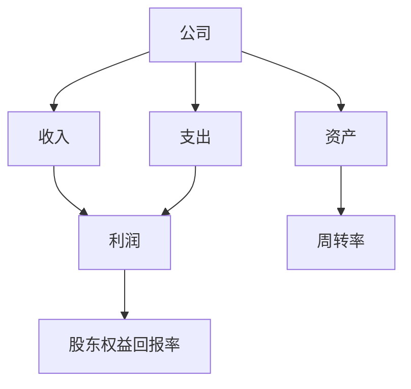
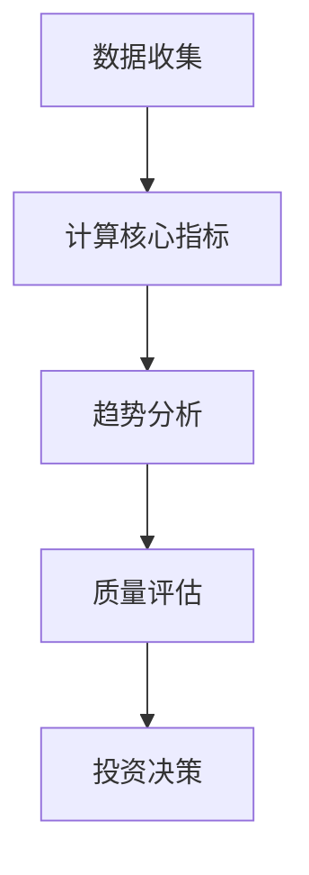

                 


# 彼得林奇对公司盈利质量的分析

## 关键词
- 彼得林奇
- 盈利质量
- 财务分析
- 投资策略
- 企业价值

## 摘要
彼得林奇是全球著名投资专家，他提出了一套基于公司盈利质量的分析方法，用于评估企业的投资价值。本文将详细探讨彼得林奇的盈利质量分析框架，包括核心指标、算法原理、系统架构及实战案例。通过分析这些关键要素，帮助投资者优化决策，提升投资收益。

---

## 第1章：盈利质量的基本概念

### 1.1 盈利质量的定义与重要性

#### 1.1.1 盈利质量的定义
盈利质量是指企业在一定时期内实现的利润与其收入和资产规模之间的关系。它不仅关注利润的绝对值，更关注利润的来源、质量和可持续性。彼得林奇认为，盈利质量是评估企业长期盈利能力的关键因素。

#### 1.1.2 盈利质量在投资分析中的重要性
盈利质量分析能够帮助投资者识别企业的核心竞争力、管理效率和财务健康状况。通过分析盈利质量，投资者可以更好地判断企业的投资价值，避免短期波动的干扰。

#### 1.1.3 彼得林奇对盈利质量的重视
彼得林奇在其投资生涯中，始终坚持将盈利质量作为选股的重要标准。他认为，一家公司只有具备高质量的盈利能力，才能在长期的市场竞争中持续为股东创造价值。

---

### 1.2 彼得林奇的分析框架

#### 1.2.1 价值投资的核心思想
彼得林奇主张以合理的价格投资于具有持续盈利能力和良好管理的公司。他认为，市场波动和短期因素不应影响对公司的长期价值判断。

#### 1.2.2 彼得林奇的选股策略
彼得林奇的选股策略包括以下几个方面：
1. **行业分析**：选择具有稳定增长潜力的行业。
2. **财务分析**：重点分析公司的盈利能力、资产负债情况和现金流。
3. **管理层评估**：关注管理层的诚信和决策能力。
4. **市场地位**：选择行业领先或具有竞争优势的公司。

#### 1.2.3 盈利质量在选股中的地位
在彼得林奇的选股策略中，盈利质量是决定性因素之一。他认为，只有那些能够持续提高盈利能力的公司，才能为股东创造长期价值。

---

### 1.3 盈利质量的核心指标

#### 1.3.1 净利润与每股收益
净利润是公司利润表的核心指标，反映了公司在一定时期内的整体盈利能力。每股收益（EPS）则是净利润与总股本的比值，是衡量公司盈利能力的重要指标。

#### 1.3.2 毛利率与净利率
毛利率 = (营业收入 - 营业成本) / 营业收入
净利率 = 净利润 / 营业收入
这两个指标分别反映了公司在生产和销售过程中的效率和成本控制能力。

#### 1.3.3 资产周转率与股东权益回报率
资产周转率 = 营业收入 / 平均总资产
股东权益回报率（ROE） = 净利润 / 平均股东权益
这两个指标分别反映了公司资产使用效率和股东资金的回报能力。

---

## 第2章：盈利质量的核心概念原理

### 2.1 盈利质量的核心要素

#### 2.1.1 收入质量
收入质量是指公司收入的稳定性和可持续性。高质量的收入来源通常是来自核心业务和长期客户关系。

#### 2.1.2 成本控制
成本控制是提高盈利能力的关键。公司通过优化供应链、提高生产效率和降低管理成本，可以显著提升盈利质量。

#### 2.1.3 资产效率
资产效率是指公司利用资产创造收入的能力。高效的资产管理和运营流程可以显著提高资产周转率，进而提升盈利质量。

---

### 2.2 盈利质量与企业生命周期的关系

#### 2.2.1 初创期企业的盈利质量特征
初创期企业通常面临高风险和低利润。公司可能需要大量投入，盈利质量较低，但增长潜力大。

#### 2.2.2 成长期企业的盈利质量特征
成长期企业收入增长快，但利润可能尚未达到峰值。此时，公司需要优化成本结构，提高资产周转率。

#### 2.2.3 成熟期企业的盈利质量特征
成熟期企业收入和利润稳定增长，盈利质量较高。此时，公司需要关注成本控制和市场扩展。

---

### 2.3 盈利质量的核心指标对比

#### 表2.1：净利润、毛利率、净利率对比
| 指标 | 定义 | 作用 | 关注点 |
|------|------|------|--------|
| 净利润 | 净利润 = 营业收入 - 营业成本 - 费用 | 反映公司整体盈利能力 | 利润来源和质量 |
| 毛利率 | 毛利率 = (营业收入 - 营业成本) / 营业收入 | 反映公司产品盈利能力 | 成本控制和定价策略 |
| 净利率 | 净利率 = 净利润 / 营业收入 | 反映公司整体盈利能力 | 收入转化为利润的能力 |

---

### 2.4 盈利质量的ER实体关系图



---

## 第3章：盈利质量的算法原理

### 3.1 盈利质量分析的流程图



---

### 3.2 Python代码实现

```python
import pandas as pd
import matplotlib.pyplot as plt

# 示例数据
data = {
    '公司': ['A', 'B', 'C'],
    '营业收入': [100, 150, 200],
    '营业成本': [60, 80, 120],
    '净利润': [20, 30, 40]
}

df = pd.DataFrame(data)

# 计算毛利率和净利率
df['毛利率'] = (df['营业收入'] - df['营业成本']) / df['营业收入']
df['净利率'] = df['净利润'] / df['营业收入']

print(df)

# 可视化
plt.figure(figsize=(10, 6))
plt.plot(df['公司'], df['毛利率'], label='毛利率')
plt.plot(df['公司'], df['净利率'], label='净利率')
plt.title('毛利率与净利率对比')
plt.legend()
plt.show()
```

---

### 3.3 数学模型与公式

#### 毛利率公式
$$ \text{毛利率} = \frac{\text{营业收入} - \text{营业成本}}{\text{营业收入}} $$

#### 净利率公式
$$ \text{净利率} = \frac{\text{净利润}}{\text{营业收入}} $$

---

## 第4章：系统分析与架构设计方案

### 4.1 问题场景介绍

通过构建一个盈利质量分析系统，帮助投资者快速评估公司的财务健康状况，优化投资决策。

### 4.2 系统功能设计


---

## 第5章：项目实战

### 5.1 环境安装与数据收集

安装Python和相关库：
```bash
pip install pandas matplotlib
```

数据收集：
从财务报表中提取营业收入、营业成本和净利润等数据。

---

### 5.2 核心实现代码

```python
import pandas as pd
import matplotlib.pyplot as plt

# 数据加载
data = pd.read_csv('financial_data.csv')

# 计算指标
data['毛利率'] = (data['营业收入'] - data['营业成本']) / data['营业收入']
data['净利率'] = data['净利润'] / data['营业收入']

# 可视化
plt.figure(figsize=(12, 6))
plt.plot(data['公司'], data['毛利率'], label='毛利率')
plt.plot(data['公司'], data['净利率'], label='净利率')
plt.title('毛利率与净利率对比')
plt.legend()
plt.show()
```

---

### 5.3 案例分析与解读

以苹果公司为例，分析其盈利质量：
- **毛利率**：高毛利率表明苹果在产品定价和成本控制方面具有显著优势。
- **净利率**：高净利率反映了苹果高效的销售和管理能力。

---

## 第6章：最佳实践

### 6.1 小结

盈利质量是评估企业投资价值的重要指标。通过彼得林奇的分析框架和系统的实战案例，投资者可以更好地理解盈利质量的核心要素，并优化投资决策。

### 6.2 注意事项

- 数据的准确性和完整性直接影响分析结果。
- 财务指标的计算需要考虑行业差异和公司规模。
- 投资决策应结合市场环境和管理层能力。

### 6.3 拓展阅读

推荐书籍：
- 《彼得林奇的投资之道》
- 《财务报表分析》

---

通过以上分析，我们深入探讨了彼得林奇对公司盈利质量的分析方法，从理论到实践，帮助投资者提升分析能力，优化投资策略。

