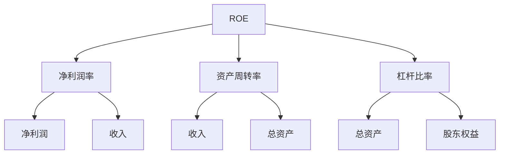
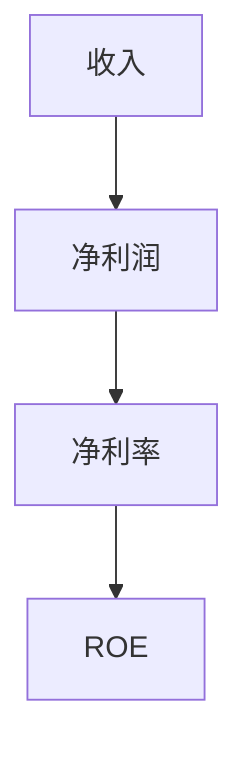
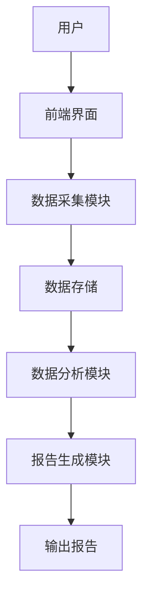

                 


# 《彼得·林奇对公司盈利质量的分析方法》

## 关键词：彼得·林奇，盈利质量，财务分析，投资策略，选股方法，杜邦分析法

## 摘要：  
本文深入分析了彼得·林奇的盈利质量分析方法，从理论基础到实战案例，全面解读如何通过定量和定性分析评估公司盈利质量。文章结合数学模型、系统架构和实际案例，帮助投资者提升分析能力，做出更明智的投资决策。

---

# 第一部分：引言

## 第1章：本书的目的与结构

### 1.1 本书的目的  
本文旨在揭示彼得·林奇的盈利质量分析方法，通过理论与实践结合，帮助投资者掌握盈利质量的评估技巧。  

### 1.2 本书的结构  
1. **背景介绍**：解释盈利质量的基本概念。  
2. **核心概念**：解析林奇的选股标准和分析框架。  
3. **定量分析**：使用杜邦分析法等工具进行深入分析。  
4. **定性分析**：评估管理层和企业治理结构。  
5. **系统设计**：构建盈利质量分析系统。  
6. **项目实战**：通过案例分析提升实战能力。  
7. **总结与展望**：回顾内容并展望未来。  

---

# 第二部分：盈利质量分析的背景与基础

## 第2章：盈利质量的基本概念

### 2.1 盈利质量的定义  
盈利质量是指企业在实现盈利的同时，能否保持持续增长和稳健的财务状况。  

### 2.2 盈利质量的重要性  
- **投资者角度**：盈利质量高的企业更值得投资。  
- **企业角度**：盈利质量反映企业的经营效率和抗风险能力。  

### 2.3 盈利质量的影响因素  
- **行业特点**：不同行业盈利模式不同。  
- **管理层能力**：管理层决策影响企业盈利。  
- **财务健康状况**：现金流和资产负债表反映企业健康。  

### 2.4 盈利质量与财务报表的关系  
- **收入、成本、利润的关系**：收入减去成本等于毛利，毛利减去费用等于净利润。  
- **资产负债表与现金流量表的影响**：现金流反映企业的实际盈利情况。  

---

## 第3章：彼得·林奇的选股标准

### 3.1 林奇的选股逻辑  
- **盈利能力**：关注净利润率和资产周转率。  
- **市场地位**：选择行业龙头股。  
- **管理层质量**：管理层能力决定企业未来。  

### 3.2 林奇的分析指标  
- **净利润率**：$$\text{净利润率} = \frac{\text{净利润}}{\text{收入}}$$  
- **资产周转率**：$$\text{资产周转率} = \frac{\text{收入}}{\text{总资产}}$$  
- **股东权益回报率（ROE）**：$$\text{ROE} = \frac{\text{净利润}}{\text{股东权益}}$$  

### 3.3 林奇的行业选择  
- **喜欢的行业**：消费、金融、科技等行业。  
- **避免的行业**：周期性过强、竞争激烈的行业。  

---

## 第4章：林奇的盈利质量分析方法

### 4.1 定量分析方法  
- **财务比率分析**：通过杜邦分析法分解ROE。  
- **现金流分析**：关注经营活动现金流。  
- **盈利能力分析**：比较同行业公司。  

### 4.2 定性分析方法  
- **管理层分析**：评估管理层的诚信和能力。  
- **企业竞争优势**：分析企业的核心竞争力。  
- **企业治理结构**：良好的治理结构保障企业长期发展。  

### 4.3 林奇的“三重过滤法”  
- **第一重：行业分析**：选择有竞争优势的行业。  
- **第二重：财务分析**：筛选出财务健康的企业。  
- **第三重：管理层分析**：评估管理层的能力和诚信。  

---

## 第5章：杜邦分析法

### 5.1 杜邦分析法的原理  
杜邦分析法通过分解ROE，分析企业的盈利能力、资产效率和财务杠杆。  

### 5.2 杜邦分析法的公式  
$$ROE = \text{净利润率} \times \text{资产周转率} \times \text{杠杆比率}$$  

### 5.3 杜邦分析法的流程图  



---

## 第6章：财务比率分析

### 6.1 财务比率分类  
- **流动性比率**：如速动比率。  
- **杠杆比率**：如负债率。  
- **盈利比率**：如净利率。  
- **运营效率比率**：如存货周转率。  

### 6.2 财务比率分析示例  



---

## 第7章：定性分析方法

### 7.1 管理层分析  
- **管理层诚信**：管理层是否诚实可靠。  
- **管理层能力**：管理层是否具备战略眼光。  

### 7.2 企业竞争优势  
- **核心竞争力**：企业是否有独特的竞争优势。  
- **市场地位**：企业是否是行业龙头。  

### 7.3 企业治理结构  
- **董事会结构**：董事会是否独立、专业。  
- **股权结构**：股权是否分散或集中。  

---

## 第8章：系统分析与架构设计

### 8.1 系统功能设计  
- **数据采集**：收集公司财务数据。  
- **数据分析**：计算各项财务指标。  
- **报告生成**：生成盈利质量分析报告。  

### 8.2 系统架构设计  



---

## 第9章：项目实战

### 9.1 项目背景  
选择苹果公司作为案例，分析其盈利质量。  

### 9.2 项目实现  

```python
import pandas as pd

# 数据采集
data = {
    '收入': [1000, 2000, 3000],
    '成本': [600, 800, 1000],
    '净利润': [400, 1200, 2000]
}
df = pd.DataFrame(data)

# 计算净利率
df['净利率'] = df['净利润'] / df['收入']

# 计算资产周转率
df['资产周转率'] = df['收入'] / df['总资产']
```

### 9.3 案例分析  
通过计算苹果公司的净利率和资产周转率，评估其盈利质量。  

---

## 第10章：总结与展望

### 10.1 总结  
彼得·林奇的盈利质量分析方法结合定量和定性分析，帮助投资者做出更明智的投资决策。  

### 10.2 展望  
未来，随着人工智能的发展，盈利质量分析将更加智能化和自动化。  

---

# 结语  
通过本文的学习，读者可以掌握彼得·林奇的盈利质量分析方法，并在实际投资中灵活运用。

