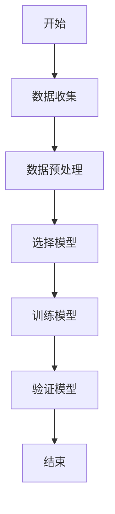
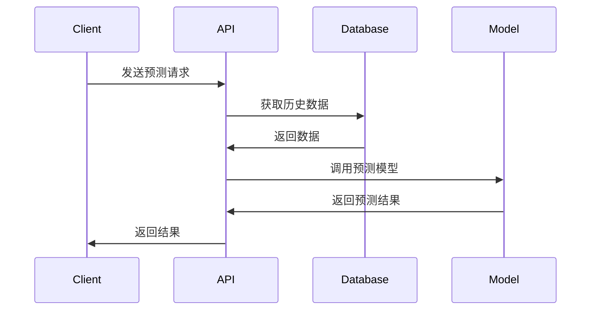

                 


```markdown
# 彼得林奇对公司盈利预测准确性的分析

## 关键词
- 盈利预测
- 彼得·林奇
- 盈利预测准确性
- 企业盈利预测
- 投资分析

## 摘要
本文深入分析了彼得·林奇对公司盈利预测准确性的研究，探讨了影响预测准确性的内外部因素，并通过实际案例展示了如何利用这些方法提升预测的准确性。内容涵盖分析方法、算法原理、系统设计和项目实战，帮助读者全面理解盈利预测的原理和应用。

---

# 第一部分: 盈利预测的背景与重要性

## 第1章: 盈利预测的定义与核心概念

### 1.1 盈利预测的定义与核心概念

#### 1.1.1 盈利预测的定义
盈利预测是对公司在未来一定时期内预期实现的净利润的估算。它基于公司财务数据、市场环境和经营状况，是投资决策的重要依据。

#### 1.1.2 盈利预测的核心要素
- **收入预测**：公司未来销售收入的预估。
- **成本预测**：公司未来运营成本的预估。
- **利润预测**：基于收入和成本预测得出的净利润预估。

#### 1.1.3 盈利预测的边界与外延
盈利预测通常基于可量化的财务数据，但其准确性受限于不可预见的市场变化和公司内部因素。

### 1.2 彼得·林奇的分析方法

#### 1.2.1 林奇分析法的核心理念
林奇专注于基本面分析，认为公司的财务状况和管理层质量是盈利预测的关键因素。

#### 1.2.2 林奇分析法的应用场景
适用于中长期投资决策，尤其关注公司的财务健康状况和管理层能力。

---

## 第2章: 影响盈利预测准确性的因素

### 2.1 公司内部因素

#### 2.1.1 财务状况
- 资产负债表和利润表数据。
- 运营效率和成本控制能力。

#### 2.1.2 管理团队
- 领导层的经验和决策能力。
- 团队稳定性对预测的影响。

#### 2.1.3 业务模式
- 收入来源的多样性。
- 市场定位和竞争优势。

### 2.2 外部环境因素

#### 2.2.1 市场需求
- 行业增长潜力。
- 宏观经济环境。

#### 2.2.2 行业竞争
- 市场结构和竞争程度。
- 替代品的影响。

#### 2.2.3 宏观经济
- 利率、税率变化。
- 经济周期波动。

---

## 第3章: 盈利预测的核心概念与联系

### 3.1 盈利预测的核心要素

#### 3.1.1 收入预测
基于历史销售数据和市场趋势，使用线性回归模型预测未来收入。

#### 3.1.2 成本预测
通过分析历史成本结构，结合市场波动预测未来成本。

#### 3.1.3 利润预测
结合收入和成本预测，考虑税费和利息支出，计算净利润。

### 3.2 盈利预测方法对比表格

| 预测方法 | 描述 | 优点 | 缺点 |
|----------|------|------|------|
| 定性分析 | 基于市场趋势和管理层判断 | 考虑非财务因素 | 主观性强 |
| 定量分析 | 基于财务数据和统计模型 | 客观性高 | 忽略非财务因素 |

### 3.3 ER实体关系图

```mermaid
er
    Company {
        id
        name
        industry
    }
    Profit_Prediction {
        id
        company_id
        predicted_profit
        actual_profit
        prediction_accuracy
    }
    Company --> Profit_Prediction
```

---

## 第4章: 盈利预测的算法原理

### 4.1 算法原理概述

#### 4.1.1 线性回归模型
$$
y = \beta_0 + \beta_1 x + \epsilon
$$
其中，$y$为因变量，$x$为自变量，$\beta$为回归系数，$\epsilon$为误差项。

#### 4.1.2 时间序列分析
使用ARIMA模型预测未来值。

### 4.2 算法流程图



### 4.3 Python实现

```python
import pandas as pd
from sklearn.linear_model import LinearRegression

data = pd.DataFrame({
    'revenue': [100, 200, 300, 400],
    'cost': [50, 100, 150, 200],
    'profit': [50, 100, 150, 200]
})

model = LinearRegression()
model.fit(data[['revenue', 'cost']], data['profit'])
predictions = model.predict(data[['revenue', 'cost']])
print(predictions)
```

---

## 第5章: 系统分析与架构设计

### 5.1 系统功能设计

#### 5.1.1 数据采集模块
负责收集公司财务数据和市场信息。

#### 5.1.2 预测模型模块
实现盈利预测算法，输出预测结果。

### 5.2 系统架构设计


### 5.3 系统交互序列图



---

## 第6章: 项目实战

### 6.1 案例分析

#### 6.1.1 数据分析
以某公司为例，分析其历史财务数据和市场表现。

#### 6.1.2 模型实现
使用线性回归模型进行预测，比较预测值与实际值。

### 6.2 代码实现与结果解读

```python
import pandas as pd
from sklearn.metrics import mean_squared_error

# 数据预处理
data = pd.DataFrame({
    'revenue': [100, 200, 300, 400],
    'cost': [50, 100, 150, 200],
    'profit': [50, 100, 150, 200]
})

# 模型训练
model = LinearRegression()
model.fit(data[['revenue', 'cost']], data['profit'])

# 预测与评估
predicted_profit = model.predict(data[['revenue', 'cost']])
mse = mean_squared_error(data['profit'], predicted_profit)
print(f'Mean Squared Error: {mse}')
```

### 6.3 项目小结
案例展示了如何通过定量分析提升预测准确性，强调数据质量和模型选择的重要性。

---

## 第7章: 最佳实践

### 7.1 小结
盈利预测准确性受内外部因素影响，投资者需全面考虑。

### 7.2 注意事项
- 数据质量的重要性。
- 模型选择的多样性。
- 结果的验证与调整。

### 7.3 拓展阅读
推荐彼得·林奇的其他著作，深入学习投资分析。

---

# 结语
通过本文的分析，读者可以全面理解彼得·林奇的盈利预测方法及其应用，为投资决策提供有力支持。
```

