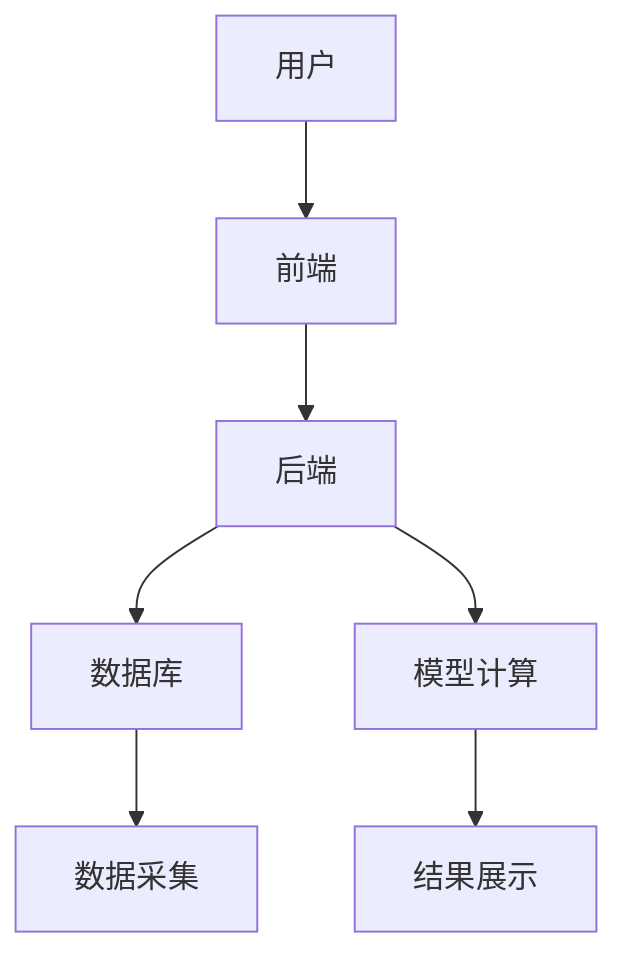

                 


# 彼得林奇对公司研发投入与专利产出效率的评估

> 关键词：公司研发、专利产出、效率评估、彼得林奇、技术分析、创新管理

> 摘要：本文详细探讨了彼得林奇对公司研发投入与专利产出效率的评估方法。通过分析核心概念、构建评估模型、系统设计和实际案例，本文揭示了如何有效衡量研发资源的利用效率，从而为企业制定更优的创新战略提供科学依据。

---

## 第1章: 研发投入与专利产出效率的背景与概念

### 1.1 研发投入的基本概念

#### 1.1.1 研发投入的定义
研发投入（R&D expenditure）是指企业在研究与开发活动中投入的资金、时间和资源。这些投入主要用于探索新技术、开发新产品、改进生产流程等。

#### 1.1.2 研发投入的类型
研发投入可以分为以下几类：
- **人员投入**：研发团队的工资、奖金等。
- **资本投入**：购买研发设备、实验室等固定资产。
- **外包投入**：将部分研发任务外包给第三方公司。

#### 1.1.3 研发投入与企业创新的关系
研发投入是企业创新能力的核心驱动力。通过增加研发投入，企业能够更快地推出新产品、改进技术，从而在市场竞争中占据优势。

### 1.2 专利产出的基本概念

#### 1.2.1 专利的定义
专利是企业对其创新成果的法律保护。它包括发明专利、实用新型专利、外观设计专利等。

#### 1.2.2 专利的类型
- **发明专利**：保护技术方案的核心创新点，保护期限较长。
- **实用新型专利**：保护技术方案的改进或新结构。
- **外观设计专利**：保护产品的外观设计。

#### 1.2.3 专利与企业竞争力的关系
专利是企业核心竞争力的体现。拥有更多的专利可以增强企业的市场地位，防止竞争对手模仿。

### 1.3 研发投入与专利产出效率的关联

#### 1.3.1 研发投入对专利产出的影响
- 研发投入的增加通常会提高专利产出的数量和质量。
- 高效的研发团队能够更快地将研究成果转化为专利。

#### 1.3.2 专利产出效率的定义
专利产出效率是指单位研发投入所产生的专利数量或质量。它是衡量研发资源利用效率的重要指标。

#### 1.3.3 研发投入与专利产出效率的关系
- 研发投入是专利产出的基础，但并非所有研发投入都能转化为高质量的专利。
- 专利产出效率取决于研发团队的能力、技术创新的能力以及专利申请的策略。

---

## 第2章: 研发投入与专利产出效率的核心概念与联系

### 2.1 研发投入的核心要素

#### 2.1.1 研发投入的构成
- 人员：研发团队的规模和能力。
- 资金：研发预算的大小。
- 资源：技术资料、设备等。

#### 2.1.2 研发投入的衡量指标
- 研发投入占总收入的比例（R&D intensity）。
- 研发投入增长率。

#### 2.1.3 研发投入的行业差异
不同行业的研发投入强度差异较大。例如，科技行业研发投入占比较高，而传统制造业较低。

### 2.2 专利产出的核心要素

#### 2.2.1 专利申请的数量与质量
- 数量：专利申请的总数。
- 质量：专利的技术创新性和保护范围。

#### 2.2.2 专利授权的周期与成本
- 授权周期：从申请到授权的时间。
- 授权成本：专利申请过程中的费用。

#### 2.2.3 专利的保护范围与价值
- 保护范围：专利涵盖的技术领域。
- 专利价值：专利对市场竞争的影响。

### 2.3 研发投入与专利产出效率的关系

#### 2.3.1 研发投入对专利产出效率的影响路径
- 投入更多资源可以加快技术研发速度。
- 高效的研发管理可以提高专利产出效率。

#### 2.3.2 专利产出效率对研发投入的反馈机制
- 高效率的专利产出可以提升企业的市场地位。
- 专利的经济价值可以反哺研发投入。

#### 2.3.3 研发投入与专利产出效率的平衡点
- 过高的研发投入可能导致资源浪费。
- 适度的投入可以在保证质量的同时降低成本。

---

## 第3章: 研发投入与专利产出效率的评估模型

### 3.1 评估模型的构建思路

#### 3.1.1 数据收集与处理
- 数据来源：企业财务报表、专利数据库。
- 数据清洗：去除无效数据，填补缺失值。

#### 3.1.2 模型选择
- 线性回归模型：用于预测专利产出与研发投入的关系。

#### 3.1.3 模型验证
- 使用交叉验证评估模型的准确性。

### 3.2 线性回归模型的构建

#### 3.2.1 模型公式
$$ y = \beta_0 + \beta_1x + \epsilon $$
其中，$y$是专利产出，$x$是研发投入，$\epsilon$是误差项。

#### 3.2.2 模型实现
```python
import pandas as pd
import numpy as np
from sklearn.linear_model import LinearRegression
from sklearn.metrics import mean_squared_error

# 数据加载与处理
data = pd.read_csv('patent_data.csv')
X = data[['R&D_expenditure']]
y = data['Patent_count']

# 模型训练
model = LinearRegression()
model.fit(X, y)

# 模型评估
y_pred = model.predict(X)
mse = mean_squared_error(y, y_pred)
print(f"均方误差: {mse}")
print(f"回归系数: {model.coef_[0]}")
```

### 3.3 模型的优化与改进

#### 3.3.1 引入变量
- 研发团队的规模。
- 专利的类型分布。

#### 3.3.2 模型优化
- 使用多元线性回归模型。

---

## 第4章: 系统分析与架构设计方案

### 4.1 系统功能设计

#### 4.1.1 系统模块
- 数据采集模块：收集企业研发投入和专利数据。
- 数据处理模块：清洗和整理数据。
- 模型构建模块：建立评估模型。
- 结果展示模块：可视化分析结果。

#### 4.1.2 系统架构
- 前端：用户界面，展示分析结果。
- 后端：处理数据和模型计算。
- 数据库：存储企业数据和分析结果。

### 4.2 系统架构设计

#### 4.2.1 系统架构图


#### 4.2.2 接口设计
- 数据接口：与专利数据库对接。
- 计算接口：调用模型计算结果。

---

## 第5章: 项目实战

### 5.1 项目背景与目标

#### 5.1.1 项目背景
- 某科技公司希望优化其研发投入与专利产出效率。

#### 5.1.2 项目目标
- 分析现有研发投入与专利产出的关系。
- 提出优化建议。

### 5.2 项目实施步骤

#### 5.2.1 数据清洗
- 去除重复数据，处理缺失值。

#### 5.2.2 模型训练
- 使用线性回归模型预测专利产出。

#### 5.2.3 结果分析
- 分析模型的准确性，提出改进建议。

### 5.3 实际案例分析

#### 5.3.1 案例介绍
- 某科技公司过去5年的研发投入与专利产出数据。

#### 5.3.2 数据分析
- 专利产出与研发投入呈正相关关系，但效率有待提高。

#### 5.3.3 优化建议
- 优化研发流程，提高专利申请效率。

---

## 第6章: 最佳实践与总结

### 6.1 评估的关键点

#### 6.1.1 研发投入的合理分配
- 根据技术领域分配资源。

#### 6.1.2 专利布局的优化
- 优先申请核心专利。

### 6.2 小结
- 研发投入与专利产出效率密切相关。
- 企业应根据自身情况优化研发投入结构。

### 6.3 注意事项
- 数据质量影响评估结果。
- 模型选择应结合实际需求。

### 6.4 拓展阅读
- 《专利战略管理》
- 《技术创新评估方法》

---

## 附录

### 附录1: 专利申请流程

#### 1. 提交申请
- 准备专利申请文件。
- 提交至专利局。

#### 2. 审查阶段
- 初步审查：形式审查。
- 实质审查：技术审查。

#### 3. 授权阶段
- 授权公告。
- 专利证书颁发。

### 附录2: 数据分析代码

```python
import pandas as pd
import numpy as np
from sklearn.linear_model import LinearRegression
from sklearn.metrics import mean_squared_error

# 数据加载与处理
data = pd.read_csv('patent_data.csv')
X = data[['R&D_expenditure']]
y = data['Patent_count']

# 模型训练
model = LinearRegression()
model.fit(X, y)

# 模型评估
y_pred = model.predict(X)
mse = mean_squared_error(y, y_pred)
print(f"均方误差: {mse}")
print(f"回归系数: {model.coef_[0]}")
```

---

通过以上分析和实践，我们可以看出，彼得林奇的评估方法为企业提供了有效的工具，帮助企业优化研发投入，提升专利产出效率。希望本文对读者有所帮助。

