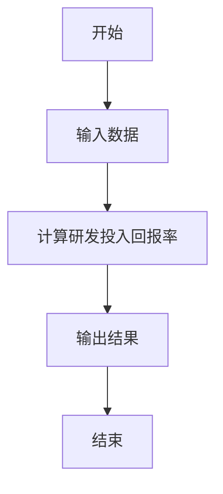

                 


# 彼得林奇对公司研发投入回报率的分析

## 关键词：彼得·林奇，研发投入回报率，投资分析，公司价值，财务模型

## 摘要：本文深入分析了彼得·林奇对公司研发投入回报率的分析方法，探讨了研发投入回报率的定义、计算公式、影响因素及其对企业价值的影响。通过实际案例分析和数学模型的构建，本文揭示了如何利用研发投入回报率评估公司的投资价值，并提出了优化公司研发投入管理的策略建议。

---

## 第一部分: 背景介绍

### 第1章: 研发投入回报率的核心概念

#### 1.1 研发投入的重要性

##### 1.1.1 研发投入对企业长期发展的意义
研发投入是企业创新的核心驱动力，决定了企业的长期竞争力。通过持续的研发投入，企业可以开发新产品、优化生产流程、提升技术水平，从而在市场中占据优势地位。

##### 1.1.2 彼得·林奇对研发投入的重视
彼得·林奇在其投资分析中，将研发投入视为评估企业增长潜力的重要指标。他认为，合理的研发投入能够为企业带来超额收益，从而提升公司价值。

##### 1.1.3 研发投入回报率的定义与外延
研发投入回报率（ROI）是指企业在一定时间内将研发投入转化为收益的能力。它不仅包括直接的研发成果，还包括研发投入对企业整体价值的提升。

---

#### 1.2 彼得·林奇的分析方法

##### 1.2.1 彼得·林奇的投资理念
彼得·林奇主张通过基本面分析来评估企业的内在价值，他认为研发投入回报率是衡量企业投资价值的重要指标之一。

##### 1.2.2 彼得·林奇对公司研发投入回报率的分析框架
彼得·林奇通过分析研发投入的规模、结构、周期性和行业特性，结合企业的财务表现和市场环境，评估研发投入的回报潜力。

##### 1.2.3 彼得·林奇的分析方法与实际案例
通过实际案例分析，彼得·林奇展示了如何将研发投入回报率与企业价值评估相结合，帮助投资者识别高成长潜力的企业。

---

## 第二部分: 核心概念与联系

### 第4章: 研发投入回报率的核心原理

#### 4.1 研发投入回报率的原理

##### 4.1.1 研发投入回报率的计算公式
研发投入回报率（ROI）的计算公式为：
$$ ROI = \frac{\text{研发成果的收益}}{\text{研发投入}} $$

其中，研发成果的收益包括新产品销售收入、成本节约等。

##### 4.1.2 彼得·林奇的分析模型
彼得·林奇提出了一个综合模型，结合研发投入的规模、周期、行业特性以及企业的财务表现，评估研发投入的回报潜力。

##### 4.1.3 研发投入回报率的影响因素
影响研发投入回报率的因素包括市场需求、技术可行性、管理效率、行业竞争等。

---

## 第三部分: 算法与数学模型

### 第5章: 研发投入回报率的对比分析

#### 5.1 研发投入回报率的对比维度

##### 5.1.1 不同行业的研发投入回报率对比
通过对比不同行业的研发投入回报率，可以识别哪些行业更具投资潜力。

##### 5.1.2 不同规模企业的研发投入回报率对比
规模较大的企业通常能够通过 economies of scale 提高研发投入回报率，但这也需要具体分析。

##### 5.1.3 不同阶段企业的研发投入回报率对比
处于成长期的企业通常需要更高的研发投入，而成熟期的企业则更注重成本控制。

---

## 第四部分: 系统分析与架构设计

### 第6章: 研发投入回报率的ER实体关系图

#### 6.1 实体关系图的构建

##### 6.1.1 实体定义
- 研发项目：包括项目编号、项目名称、开始日期、结束日期。
- 研发投入：包括研发投入金额、时间、用途。
- 研发成果：包括产品销售收入、成本节约。

##### 6.1.2 实体关系图
```mermaid
erd
    研发项目 (projectId, projectName, startDate, endDate)
    研发投入 (researchCost, projectId)
    研发成果 (researchOutcome, projectId)
    线条：研发项目 --> 研发投入
    线条：研发项目 --> 研发成果
```

---

## 第五部分: 项目实战

### 第7章: 研发投入回报率的项目实战

#### 7.1 环境安装与数据准备

##### 7.1.1 环境配置
安装Python、Pandas、Matplotlib等工具，用于数据处理和可视化。

##### 7.1.2 数据收集
收集目标公司的研发投入、销售收入、成本节约等数据。

#### 7.2 核心实现

##### 7.2.1 Python代码实现
```python
import pandas as pd

# 数据准备
data = {
    '研发投入': [100, 200, 150],
    '研发成果收益': [150, 300, 200]
}

df = pd.DataFrame(data)

# 计算研发投入回报率
df['研发投入回报率'] = df['研发成果收益'] / df['研发投入']

print(df)
```

##### 7.2.2 算法流程图


#### 7.3 案例分析

##### 7.3.1 案例选择
以某科技公司为例，分析其研发投入回报率的变化趋势。

##### 7.3.2 结果解读
通过计算得出，该公司的研发投入回报率呈现逐年增长趋势，说明其研发投入策略有效。

---

## 第六部分: 最佳实践与总结

### 第8章: 最佳实践与小结

#### 8.1 小结
本文通过分析彼得·林奇的研究方法，揭示了研发投入回报率对企业价值的影响，并提供了实际操作的步骤和案例。

#### 8.2 注意事项
- 数据的准确性和完整性是关键。
- 需要考虑行业特性和市场环境。
- 长期跟踪和分析是必要的。

#### 8.3 拓展阅读
推荐阅读彼得·林奇的《投资学入门：stocks for the long run》和《彼得·林奇的投资艺术》。

---

通过以上步骤，您可以系统地分析和评估公司的研发投入回报率，从而做出更明智的投资决策。

