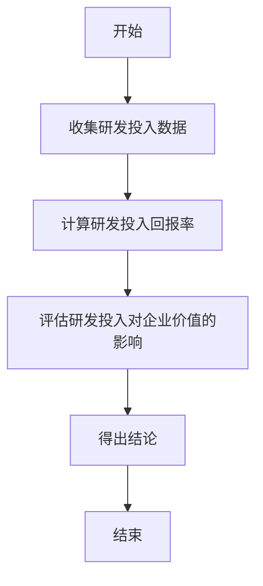
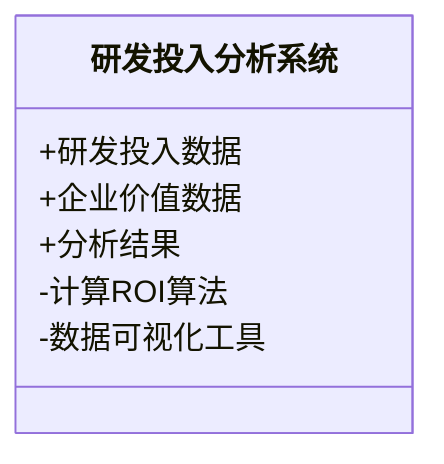
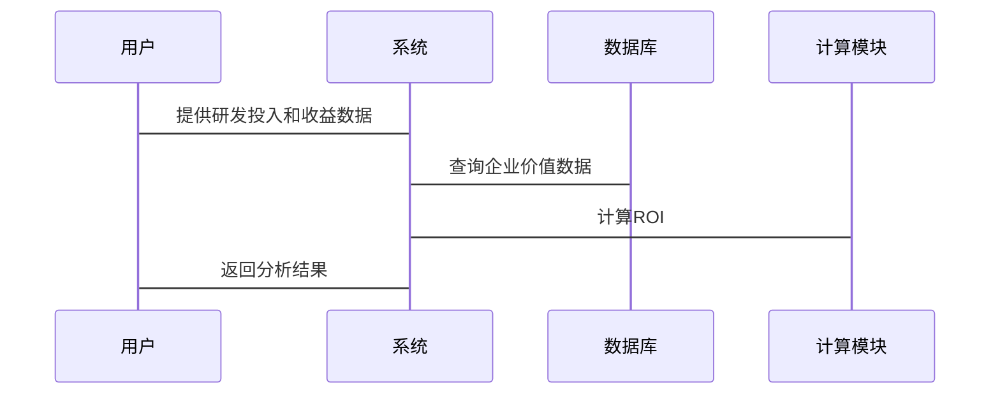

                 


# 彼得林奇对公司研发投入的分析标准

## 关键词：公司研发投入，彼得·林奇，投资分析，研发投入标准，企业价值

## 摘要：本文深入探讨了彼得·林奇对公司研发投入的分析标准，从背景、核心概念、算法原理、系统架构到项目实战，全面解析如何通过研发投入评估企业价值。文章结合理论与实践，提供详尽的分析方法和工具，帮助投资者做出明智决策。

---

### 第1章 公司研发投入的背景与重要性

#### 1.1 研发投入的重要性

##### 1.1.1 研发投入对企业发展的核心作用
研发投入是企业创新的核心驱动力。它不仅决定了企业的技术领先性，还影响着市场竞争力和长期盈利能力。在科技迅速发展的今天，研发投入是企业保持竞争优势的关键因素。

##### 1.1.2 研发投入与企业长期价值的关系
高研发投入通常与企业长期价值增长相关。通过持续的研发投入，企业能够开发新产品、优化现有产品，从而在市场中占据优势，提升品牌价值和股东回报。

##### 1.1.3 研发投入在行业竞争中的关键地位
在竞争激烈的市场中，研发投入是区分企业优劣的重要指标。高研发投入的企业往往能更快适应市场变化，推出创新产品，从而获得更高的市场份额和利润率。

#### 1.2 彼得·林奇的投资哲学

##### 1.2.1 彼得·林奇的投资者背景
彼得·林奇是美国著名投资家，曾任富达麦哲伦基金的经理，以其卓越的投资业绩闻名。他强调深入研究公司基本面，寻找具有持续增长潜力的企业。

##### 1.2.2 林奇的投资理念与风格
林奇的投资策略以价值投资为主，注重企业的基本面分析。他认为，投资者应选择那些具有稳定增长、良好管理和强大竞争优势的公司。

##### 1.2.3 林奇对研发投入的关注点
林奇认识到，高研发投入反映了企业的创新能力和未来增长潜力。他关注企业研发投入的规模、效率及其与企业价值的关系，认为这是评估公司长期价值的重要指标。

#### 1.3 研发投入分析的必要性

##### 1.3.1 研发投入对企业价值的影响
研发投入直接影响企业的技术储备和创新能力，进而影响其市场地位和盈利能力。高研发投入企业通常能带来更高的股东回报。

##### 1.3.2 研发投入与企业创新能力的关系
研发投入是创新的基石。只有持续投入，企业才能保持技术领先，不断推出新产品，满足市场需求。

##### 1.3.3 研发投入对投资者决策的重要性
对于投资者而言，研发投入是评估企业未来增长潜力的关键指标。高研发投入企业通常具有更高的成长性和投资价值。

---

### 第2章 研发投入分析的核心概念与联系

#### 2.1 研发投入分析的核心概念

##### 2.1.1 研发投入的定义与分类
研发投入通常包括企业的研发支出，如 salaries、equipment、materials 等。根据时间范围，可分为短期和长期投入。

##### 2.1.2 研发投入的周期性与波动性
研发投入具有周期性，可能受经济波动影响。企业需在不同经济周期中调整研发投入策略。

##### 2.1.3 研发投入与企业成长的关系
高研发投入通常与企业成长正相关。持续的研发投入能够支持企业技术更新和产品升级，推动其成长。

#### 2.2 研发投入分析的定性与定量维度

##### 2.2.1 定性分析维度
定性分析包括评估研发团队的能力、管理效率、技术领先性等。这些因素影响研发的效率和效果。

##### 2.2.2 定量分析维度
定量分析涉及研发投入的金额、占总收入比例、回报率等指标。这些数据帮助量化评估研发的投入产出。

##### 2.2.3 定性与定量分析的结合
结合定性和定量分析可以全面评估研发投入的价值。例如，虽然某企业研发投入高，但如果团队管理不善，其实际价值可能不如投入较低但管理高效的另一家企业。

#### 2.3 研发投入与企业价值的ER实体关系图

```mermaid
er
  entity 研发投入(RD_Investment) {
    key: 投资金额
    attribute: 投资时间
    attribute: 项目类型
  }
  entity 企业价值(Enterprise_Value) {
    key: 企业市值
    attribute: 股东权益
    attribute: 净利润
  }
  研发投入 --> 企业价值: 影响
```

---

### 第3章 研发投入分析的算法原理

#### 3.1 研发投入分析的数学模型

##### 3.1.1 研发投入与企业价值的关系模型
数学模型展示研发投入与企业价值之间的关系：

$$ 企业价值 = f(研发投入, 其他因素) $$

##### 3.1.2 研发投入的回报率计算公式
$$ ROI = \frac{研发收益}{研发投入} $$

#### 3.2 研发投入分析的算法流程

##### 3.2.1 算法流程


##### 3.2.2 Python代码实现
```python
import pandas as pd

def calculate_roi(revenue, cost):
    return (revenue - cost) / cost

# 示例数据
revenue = 1000000
cost = 200000
roi = calculate_roi(revenue, cost)
print(f"ROI: {roi}%")
```

#### 3.3 算法原理的详细讲解

##### 3.3.1 ROI计算的步骤
1. 收集研发投入和收益数据。
2. 计算研发投入回报率。
3. 评估回报率是否合理。

##### 3.3.2 示例计算
假设某企业研发投入100万元，带来收益150万元，计算ROI：

$$ ROI = \frac{150万 - 100万}{100万} = 0.5 = 50\% $$

高ROI意味着高效的投资。

---

### 第4章 系统分析与架构设计方案

#### 4.1 系统分析

##### 4.1.1 项目介绍
构建一个分析系统，评估企业研发投入对价值的影响，帮助投资者做出决策。

##### 4.1.2 系统功能设计


##### 4.1.3 系统架构设计


##### 4.1.4 系统接口设计
API接口用于数据输入和输出，支持RESTful API，如：

- GET /roi?revenue=1000000&cost=200000
- 返回：{ "roi": 0.5 }

##### 4.1.5 系统交互流程


---

### 第5章 项目实战

#### 5.1 环境安装

##### 5.1.1 安装Python和相关库
```bash
pip install pandas matplotlib
```

#### 5.2 系统核心实现源代码

##### 5.2.1 Python代码实现
```python
import pandas as pd
import matplotlib.pyplot as plt

def analyze_rd_investment():
    # 数据收集
    data = {
        '公司': ['A', 'B', 'C'],
        '研发投入': [100, 200, 150],
        '收益': [150, 300, 200]
    }
    df = pd.DataFrame(data)
    
    # 计算ROI
    df['ROI'] = (df['收益'] - df['研发投入']) / df['研发投入']
    
    # 可视化
    plt.figure(figsize=(10,6))
    plt.bar(df['公司'], df['ROI'], label='ROI')
    plt.title('研发投入回报分析')
    plt.xlabel('公司')
    plt.ylabel('ROI')
    plt.legend()
    plt.show()

analyze_rd_investment()
```

##### 5.2.2 代码应用解读
上述代码收集数据，计算ROI，并生成柱状图，直观展示各公司的研发投入回报情况。

#### 5.3 实际案例分析

##### 5.3.1 案例介绍
分析科技公司A，研发投入100万元，收益150万元，计算ROI为50%。

##### 5.3.2 结果解读
高ROI表明公司A的研发投入效率高，具有投资价值。

---

### 第6章 最佳实践

#### 6.1 小结

##### 6.1.1 关键点总结
- 研发投入是企业创新的核心。
- ROI是评估投入效率的关键指标。
- 结合定性与定量分析，全面评估投入价值。

#### 6.2 注意事项

##### 6.2.1 数据质量
确保数据准确，避免分析偏差。

##### 6.2.2 经济周期影响
考虑经济波动对研发投入的影响，调整分析策略。

##### 6.2.3 长期视角
关注长期投入效果，避免短期波动影响判断。

#### 6.3 拓展阅读

##### 6.3.1 推荐书籍
- 《彼得·林奇的股票投资策略》
- 《投资学原理》

##### 6.3.2 推荐文章
- 研发投入与企业成长的定量分析
- 从投资者视角看科技企业的研发投入

---

### 附录

#### 附录A: ROI计算公式
$$ ROI = \frac{收益 - 投入}{投入} $$

#### 附录B: 数据可视化代码
```python
plt.bar(df['公司'], df['ROI'], label='ROI')
plt.title('研发投入回报分析')
plt.xlabel('公司')
plt.ylabel('ROI')
plt.legend()
plt.show()
```

---

### 结语

通过本文的分析，读者可以深入了解彼得·林奇的分析标准，并掌握如何通过研发投入评估企业价值。希望这些方法能帮助投资者做出更明智的决策。

