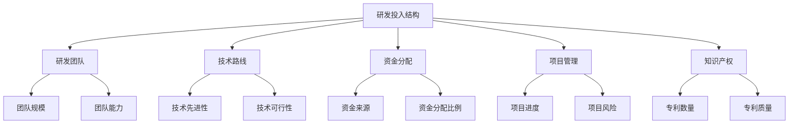
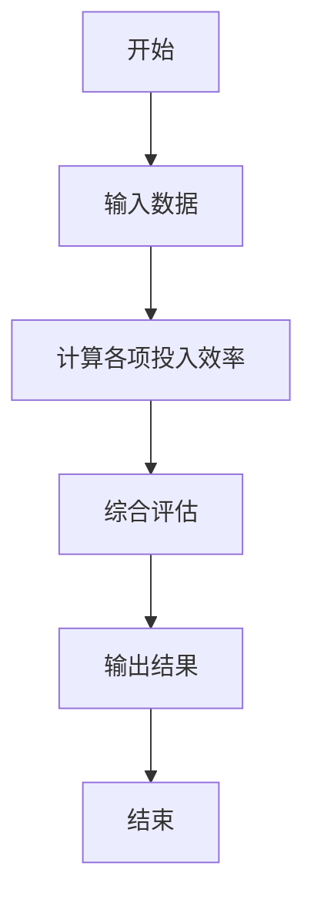

                 


# 彼得林奇对公司研发投入结构的评估

## 关键词：研发投入结构、彼得林奇、投资评估、技术路线、项目管理

## 摘要：本文详细探讨了彼得林奇对公司研发投入结构的评估方法，分析了研发投入结构的核心要素及其对企业发展的影响，通过具体案例和系统分析，揭示了如何通过科学的评估体系优化企业研发投入结构，以实现更高的投资回报。

---

# 第一部分: 背景介绍

## 第1章: 公司研发投入结构评估的背景与重要性

### 1.1 问题背景

#### 1.1.1 研发投入在企业中的地位
研发投入是企业创新的核心驱动力，直接关系到企业的长期竞争力和市场地位。彼得林奇在其投资生涯中，始终将研发投入结构作为评估企业价值的重要指标。

#### 1.1.2 研发投入结构对企业价值的影响
研发投入结构的合理性直接影响企业的技术创新能力和市场适应能力。优化的研发投入结构能够提升企业的核心竞争力，降低投资风险。

#### 1.1.3 彼得林奇投资理念的核心要素
彼得林奇注重企业的基本面分析，尤其是研发投入的效率和结构。他认为，研发投入的合理分配和管理是企业长期增长的关键。

### 1.2 问题描述

#### 1.2.1 研发投入结构的定义与分类
研发投入结构指的是企业在研发活动中各项投入的分配比例和管理方式。常见的分类包括人员投入、资金投入、时间投入等。

#### 1.2.2 彼得林奇对研发投入结构的评估标准
彼得林奇提出的评估标准包括研发投入的效率、技术路线的可行性、项目管理的规范性等。

#### 1.2.3 研发投入结构评估的难点与挑战
评估难点包括数据的获取难度、评估指标的多样性、外部环境的不确定性等。

### 1.3 问题解决

#### 1.3.1 彼得林奇的评估方法
彼得林奇提出了一套基于研发投入结构的评估方法，包括对研发团队、技术路线、资金分配、项目管理和知识产权的全面分析。

#### 1.3.2 评估方法的核心逻辑
通过量化各项投入的效率和效果，结合企业的战略目标，优化研发投入结构，提升整体研发效率。

#### 1.3.3 评估方法的实际应用案例
以某高科技公司为例，分析其研发投入结构的优化过程及其对企业发展的影响。

### 1.4 边界与外延

#### 1.4.1 研发投入结构评估的适用范围
适用于高科技企业和创新型企业，尤其适合那些依赖技术创新获取竞争优势的企业。

#### 1.4.2 评估方法的局限性
评估方法依赖于高质量的数据支持，且在不同行业和企业规模下可能需要调整。

#### 1.4.3 与其他投资评估方法的对比
与其他评估方法相比，彼得林奇的方法更加注重研发过程的细节和效率。

### 1.5 核心概念与联系

#### 1.5.1 核心概念原理
研发投入结构评估的核心在于分析各项投入的效率和效果，确保资源的最优分配。

#### 1.5.2 概念属性特征对比表格
| 核心要素 | 属性特征 | 重要性 |
|----------|-----------|--------|
| 研发团队 | 团队规模与能力 | 高     |
| 技术路线 | 技术先进性与可行性 | 中高    |
| 资金分配 | 资金来源与分配比例 | 中高    |
| 项目管理 | 项目进度与风险 | 中     |
| 知识产权 | 专利数量与质量 | 高     |

#### 1.5.3 ER实体关系图架构的 Mermaid 流程图


---

# 第二部分: 核心概念与联系

## 第2章: 核心概念与联系

### 2.1 核心概念原理

#### 2.1.1 研发投入结构的构成要素
研发投入结构由研发团队、技术路线、资金分配、项目管理和知识产权五部分组成。

#### 2.1.2 各要素之间的关系
各要素相互关联，共同影响企业的研发效率和创新能力。

#### 2.1.3 彼得林奇评估模型的数学表达
$$ \text{研发效率} = \frac{\text{研发投入产出}}{\text{研发投入总量}} $$

### 2.2 概念属性特征对比表格
| 核心要素 | 属性特征 | 重要性 |
|----------|-----------|--------|
| 研发团队 | 团队规模与能力 | 高     |
| 技术路线 | 技术先进性与可行性 | 中高    |
| 资金分配 | 资金来源与分配比例 | 中高    |
| 项目管理 | 项目进度与风险 | 中     |
| 知识产权 | 专利数量与质量 | 高     |

### 2.3 ER实体关系图架构的 Mermaid 流程图


---

# 第三部分: 算法原理讲解

## 第3章: 算法原理讲解

### 3.1 算法原理

#### 3.1.1 彼得林奇评估模型的流程
1. 确定研发投入结构的各要素。
2. 收集相关数据，包括团队规模、技术路线、资金分配等。
3. 计算各项投入的效率和效果。
4. 综合评估，得出最终结论。

#### 3.1.2 模型的输入与输出
- 输入：研发投入数据、企业战略目标。
- 输出：研发效率指数、优化建议。

#### 3.1.3 算法的数学模型与公式
$$ \text{研发效率指数} = \sum_{i=1}^{n} (\text{权重}_i \times \text{指标}_i) $$

### 3.2 算法 mermaid 流程图


### 3.3 Python 实现代码

```python
def calculate_research_efficiency(weights, indicators):
    efficiency = sum(w * i for w, i in zip(weights, indicators))
    return efficiency

weights = [0.4, 0.3, 0.2, 0.1]
indicators = [0.8, 0.7, 0.6, 0.5]
efficiency = calculate_research_efficiency(weights, indicators)
print(f"研发效率指数: {efficiency}")
```

---

## 总结

通过以上分析，我们可以看到彼得林奇对公司研发投入结构的评估方法是一种系统化、多维度的分析方法。通过科学的评估体系，企业可以优化其研发投入结构，提升整体研发效率，从而实现更高的投资回报。

